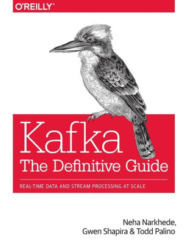

 <!-- {"left" : 3.33, "top" : 6.2, "height" : 2.33, "width" : 2.33} -->

# Advanced Apache Kafka

<!-- {"left" : 2.6, "top" : 5.84, "height" : 2.59, "width" : 2.38} -->

---

## Instructor Introduction

* Instructor, please introduce yourself

* Talk about your background and your experience in the subject

---

## Class Overview - 2 Days

<!-- {"left" : 7.39, "top" : 1.2, "height" : 2.76, "width" : 2.53} -->

* Setup Kakfa

* Dockerizing Kafka stack

* Kafka Streams

* Spark introduction

* Spark + kafka streaming

* Kafka Monitoring

* Instrumenting Kafka code

* Kafka Connectors

* Confluent stack

Notes:

---

## Prerequisites & Expectations

* Familiarity with Java language

* Working knowledge of Apache Kafka (or have attended 'Kafka Intro' class)

* Comfortable in Linux development environment

Notes:

---

## Our Teaching Philosophy

<!-- {"left" : 1.78, "top" : 3.22, "height" : 5.4, "width" : 6.7} -->

 * Emphasis on concepts & fundamentals

 * Learn the API

 * Highly interactive (questions, discussions, etc. are welcome)

 * Hands-on (learn by doing)

Notes:

---

## After The Class...

<!-- {"left" : 1.3, "top" : 1.69, "height" : 6.26, "width" : 7.66} -->

Notes:

By the end of the class... .

---

## Class Introductions

* About you
    - Your Name
    - Your background (developer, admin, manager, etc.)
    - Technologies you are familiar with
    - Familiarity with Kafka  
    (scale of 1 - 4 ;  1 - new, 2 - know some concepts,  3 - took a course, 4 -  using it at work)
    - Something non-technical about you!  
    (favorite ice cream flavor / hobby  etc.)

 &nbsp; <!-- {"left" : 0.85, "top" : 5.47, "height" : 2.1, "width" : 2.38} --> &nbsp; <!-- {"left" : 3.25, "top" : 5.49, "height" : 2.03, "width" : 3.74} --> &nbsp; <!-- {"left" : 7.02, "top" : 5.47, "height" : 2.1, "width" : 2.38} -->

Notes:

---

## Recommended Books

 * Kafka - The Definitive Guide

<!-- {"left" : 3.78, "top" : 2.78, "height" : 3.52, "width" : 2.68} -->

Notes:

Image credit : http://shop.oreilly.com/

---

## Class Logistics

* Instructor's contact

* Slides

* Labs

* Lab environment

---

## Let's Get Started!

  &nbsp;  &nbsp;
