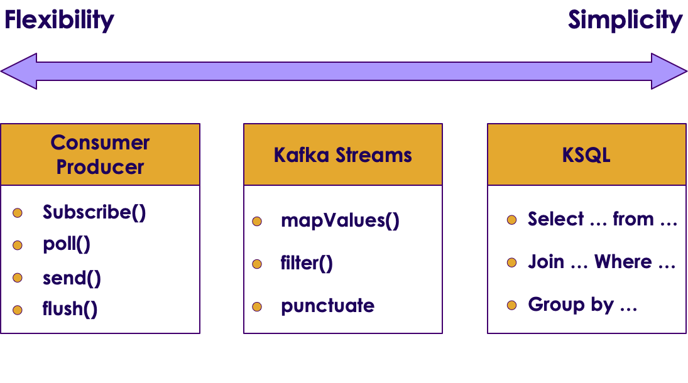
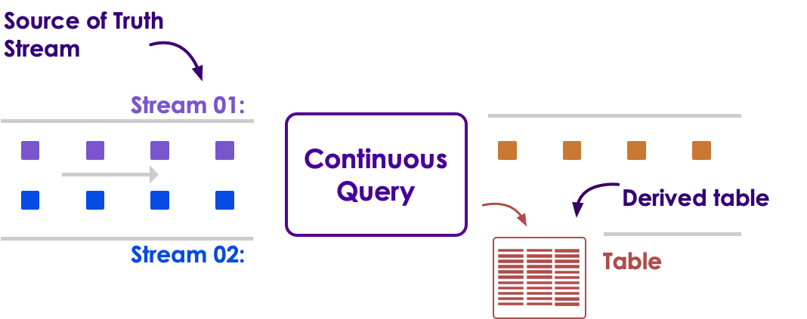
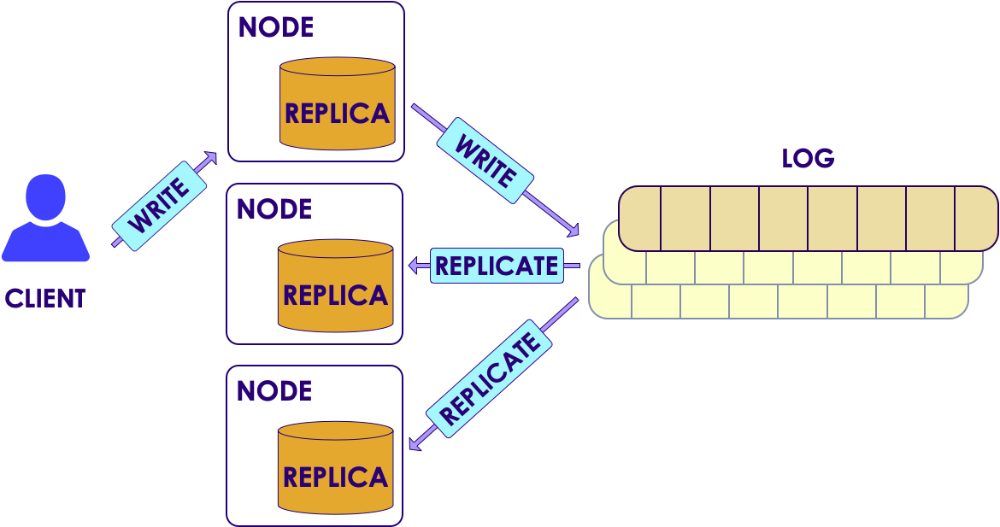
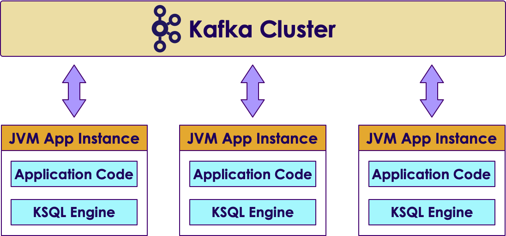

# KSQL 

---

## KSQL - an SQL Streaming Engine for Apache Kafka

* Part of Confluent open source platform
* KSQL lowers the entry bar to the world of stream processing
* Providing a simple and completely interactive SQL interface for processing data in Kafka
* No longer need to write code in a programming language such as Java or Python!
* KSQL is distributed, scalable, reliable, and real time.
* It supports a wide range of powerful stream processing operations including aggregations, joins, windowing, sessionization, and much more


---
## KSQL Operations

* Supports all stream processing operations similar to Kafka Streams
    - Filter, map, join, aggregation, windowing
---
## KSQL Architecture 

<!-- {"left" : 0.68, "top" : 2.15, "height" : 4.77, "width" : 8.89} -->

---

## KSQL Components


 * KSQL Server

     - Runs the Engine that executes KSQL queries

     - Runs in separate JVM from Kafka broker 

     - Can also run on separate servers

 * KSQL CLI

     - Run SQL queries interactively using CLI

     - Or through REST API (language neutral)

 * KSQL UI

     - Available via Confluent Control Center

Notes: 


---

## KSQL and Kafka Streams


<!-- {"left" : 0.44, "top" : 2.68, "height" : 4.28, "width" : 9.36} -->


Notes: 

---

## KSQL vs Kafka Streams


 * Q: What does the developer write when using KSQL vs Kafka Streams? 

     - SQL queries

     - Java application for Kafka Streams

 * Q: How does the streaming app run with KSQL vs Kafka Streams?

     - On the KSQL Server

     - As a standalone JVM

Notes: 


---
## KSQL - the Streaming SQL Engine


<!-- {"left" : 0.58, "top" : 2.2, "height" : 4.66, "width" : 9.1} -->


---


## KStreams vs. KSQL

<!-- {"left" : 0.5, "top" : 2.98, "height" : 2.51, "width" : 4.5} -->
 &nbsp; &nbsp; <!-- {"left" : 5.45, "top" : 3.25, "height" : 1.98, "width" : 4.3} -->


---

## Using KSQL


 * Create a KSQL Stream from a topic

```text
       CREATE STREAM clickstream 
       (viewtime BIGINT, sessionid VARCHAR, domain VARCHAR) 
       WITH  (KAFKA_TOPIC= clickstream', 
       VALUE_FORMAT='DELIMITED', KEY='domain');
```
<!-- {"left" : 0, "top" : 1.94, "height" : 1.37, "width" : 10.25} -->

 * Create a KSQL Table from a topic

```text
       CREATE TABLE clicks 
       (viewtime BIGINT, sessionid VARCHAR, domain VARCHAR) 
       WITH  (KAFKA_TOPIC= clickstream', 
       VALUE_FORMAT= 'DELIMITED', KEY='domain');
```
<!-- {"left" : 0, "top" : 3.85, "height" : 1.37, "width" : 10.25} -->

Notes: 


---

## KSQL Aggregation


 * Aggregations in KSQL always result in a KSQL Table

```text
      CREATE TABLE click_counts AS
          SELECT domain, count(*) FROM clickstream 
              GROUP BY domain;
```

<!-- {"left" : 0, "top" : 2.12, "height" : 1.22, "width" : 8.94} -->


 * Aggregate over a tumbling window

```text
     CREATE TABLE clicks_per_min AS
         SELECT domain, count(*) FROM clickstream
           WINDOW TUMBLING (SIZE 60 SECONDS)
             GROUP BY domain;
```
<!-- {"left" : 0, "top" : 3.71, "height" : 2.32, "width" : 8.94} -->

Notes: 

Compare this code to what was done in the Kafka Streams lab to group by and count. KSQL is so much simpler


---

## Lab 8: KSQL Lab


 *  **Overview:** Use KSQL to build streams and tables

 *  **Builds on previous labs:**

 *  **Approximate Time:** 30 - 40 mins

 *  **Instructions:**

     - Do Lab 8.3


Notes: 


---

## Do not use KSQL for ...

* Powerful ad-hoc query
  - Limited span of time, usually retained in Kafka
  - No indexes
* BI Reports
  - No indexes
  - No JDBC (BI tools are not good with continuous results)


---

## KSQL Use Cases

* Real-time monitoring meets real-time analytics
* Security and anomaly detection
* Online data integration
* Application Development


---

## KSQL works with Topics on same node

<!-- {"left" : 5.66, "top" : 1.16, "height" : 1.76, "width" : 4.44} -->


* KSQL uses Kafka’s Streams API
* Kafka + KSQL turn the database inside out
* Joining streams declaratively
* Any Kafka consumer can access the new stream


<!-- {"left" : 0.58, "top" : 5.54, "height" : 1.24, "width" : 9.09} -->


---

## ksqlDB Architecture (push, meet pull)

* It stores replicated, fault-tolerant tables of data
* It allows queries and processing in SQL
* You can work interactively against a cluster via a (RESTful) network API
* With EMIT CHANGES, this will be transformed into a push query that produces a continuously updating stream of current driver position coordinates, not just the current state

<!-- {"left" : 1.82, "top" : 4.81, "height" : 3.48, "width" : 6.6} -->


---
## KSQL for Quality Assurance - Use Case

* Checking for Malicious users

<!-- {"left" : 0.39, "top" : 2.12, "height" : 1.28, "width" : 9.48} -->


* Use Grafana to visualize


<!-- {"left" : 0.39, "top" : 5.82, "height" : 1.7, "width" : 9.48} -->


---
## Malicious User Sessions in Grafana


<!-- {"left" : 0.62, "top" : 2.11, "height" : 3.77, "width" : 9.02} -->


---

## Configure Kafka connect to get new KSQL Streams into Grafana

<!-- {"left" : 0.37, "top" : 1.76, "height" : 3.77, "width" : 9.5} -->


---

## KSQL Stream -> User Friendly Grafana Dashboard

* Malicious User Sessions Monitoring

<!-- {"left" : 1.02, "top" : 2.25, "height" : 4.57, "width" : 8.21} -->


---

## KSQL Select, CREATE STREAM Syntax

<!-- {"left" : 0.15, "top" : 3.04, "height" : 2.45, "width" : 5.01} --> &nbsp; &nbsp; <!-- {"left" : 5.88, "top" : 2.99, "height" : 2.54, "width" : 4.05} -->

---

## Automatic Inference of Topic Schema (leveraging Confluent Schema Registry)

<!-- {"left" : 0.77, "top" : 1.65, "height" : 5.76, "width" : 8.71} -->


---

## WINDOWing

<!-- {"left" : 0.57, "top" : 1.79, "height" : 4.56, "width" : 9.11} -->


---

## KSQL Components

<!-- {"left" : 0.47, "top" : 1.65, "height" : 3.04, "width" : 9.31} -->


---

## KSQL - Client-Server (Interactive Mode)

<!-- {"left" : 1.02, "top" : 1.87, "height" : 5.34, "width" : 8.21} -->


---

## KSQL - Standalone App (Headless Mode)

<!-- {"left" : 1.02, "top" : 1.87, "height" : 5.34, "width" : 8.21} -->


---
## KSQL - Embedded in Application (JVM Mode)


<!-- {"left" : 0.43, "top" : 2.35, "height" : 4.38, "width" : 9.39} -->


---
## KSQL - Dedicating Resources


<!-- {"left" : 0.63, "top" : 2.31, "height" : 4.45, "width" : 8.98} -->


