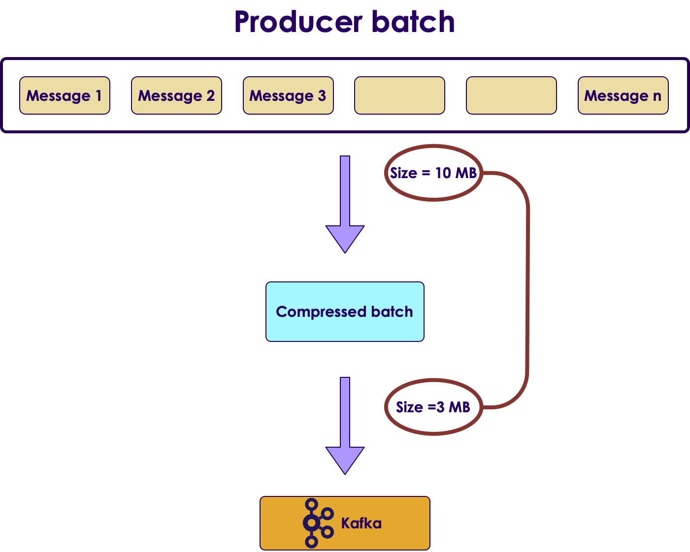
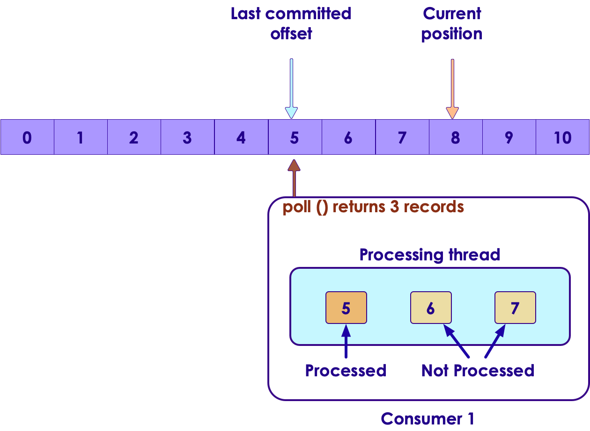
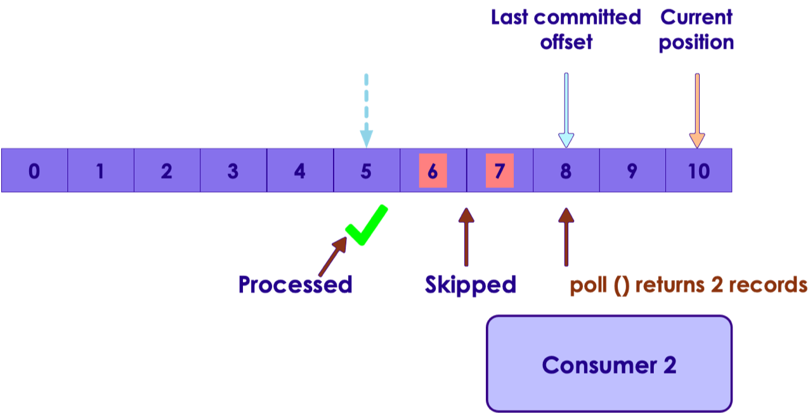
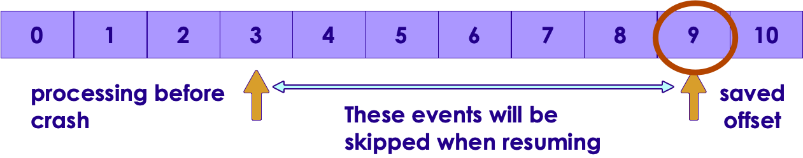

# Kafka API


---


## Lesson Objectives

* Learn to use Kafka Java API

Notes:


---

# Kafka API

---


## Kafka Clients


 * Java is the 'first class' citizen in Kafka
     - Officially maintained
 * Python on par with Java
     - Maintained by Confluent.io
 * Other language libraries are independently developed
     - may not have 100% coverage
     - May not be compatible with latest versions of Kafka
     - Do your home work!
 * REST proxy provides a language neutral way to access Kafka
 * Full list: https://cwiki.apache.org/confluence/display/KAFKA/Clients

<!-- {"left" : 1.85, "top" : 6.14, "height" : 2.34, "width" : 2.34} --> &nbsp; &nbsp; <!-- {"left" : 4.71, "top" : 7.13, "height" : 0.88, "width" : 3.69} -->


Notes:


---

## Kafka Java API

 <!-- {"left" : 7.58, "top" : 1.02, "height" : 2.63, "width" : 2.63} -->


 * Rich library that provides high level abstractions
     - No need to worry about networking / data format ..etc

 * Write message / Read message

 * Supports native data types
     - String
     - Bytes
     - Primitives (int, long ...etc.)

Notes:


---

## Java Producer Code (Abbreviated)


```java
// ** 1 **
import java.util.Properties;
import org.apache.kafka.clients.producer.KafkaProducer;
import org.apache.kafka.clients.producer.ProducerRecord;
...

// ** 2 **
Properties props = new Properties();
props.put("bootstrap.servers", "localhost:9092");
props.put("client.id", "SimpleProducer");
props.put("key.serializer",  "org.apache.kafka.common.serialization.IntegerSerializer");
props.put("value.serializer", "org.apache.kafka.common.serialization.StringSerializer");

KafkaProducer< Integer, String > producer = new KafkaProducer<>(props);

// ** 3 **
String topic = "test";
Integer key = new Integer(1);
String value = "Hello world";
ProducerRecord < Integer, String > record = new ProducerRecord<> (topic, key, value);
producer.send(record);
producer.close();

```
<!-- {"left" : 0, "top" : 1.15, "height" : 4.04, "width" : 10.25} -->


Notes:


---

## Producer Code Walkthrough

```java
// ** 2 **
Properties props = new Properties();
props.put("bootstrap.servers", "localhost:9092");
props.put("client.id", "SimpleProducer");
props.put("key.serializer",  "org.apache.kafka.common.serialization.IntegerSerializer");
props.put("value.serializer", "org.apache.kafka.common.serialization.StringSerializer");


KafkaProducer < Integer, String > producer = new KafkaProducer<>(props);

```
<!-- {"left" : 0, "top" : 1.29, "height" : 1.76, "width" : 10.25} -->

<br/>
<br/>

 * We are using 'KafkaProducer' (org.apache.kafka.clients.producer.KafkaProducer)

 *  **bootstrap.servers:** "broker1:9092, broker2:9092"

     - Specify multiple servers, so no single point of failure

 * Using built in serializers for Integer / String


Notes:


---

## Producer Code Walkthrough

```java
// ** 3 **
String topic = "test";
Integer key = new Integer(1);
String value = "Hello world";
ProducerRecord< Integer, String > record = new ProducerRecord<> (topic, key, value);
producer.send(record);
producer.close();
```
<!-- {"left" : 0, "top" : 1.45, "height" : 1.51, "width" : 10.25} -->

<br/>

 * Each  **record**  represents a message
 * Here we have a <key,value> message
 * send() doesn't wait for confirmation
 * We send in batches

     - for increased throughput
     - Minimize network round trips


Notes:


---

## Producer Properties


```java
Properties props = new Properties();
props.put("bootstrap.servers", "localhost:9092");
props.put("client.id", "SimpleProducer");
props.put("acks", "all");
props.put("retries", 0);
props.put("batch.size", 16384);  // 16k
props.put("linger.ms", 1);
props.put("buffer.memory", 33554432); // 32 M
props.put("key.serializer",
                   "org.apache.kafka.common.serialization.IntegerSerializer");
props.put("value.serializer",
                   "org.apache.kafka.common.serialization.StringSerializer");
KafkaProducer < Integer, String > producer = new KafkaProducer<>(props);

for(int i = 0; i < 100; i++) {
  producer.send(new ProducerRecord < String, String >(
      "my-topic", Integer.toString(i), Integer.toString(i)));
}
producer.close();

```
<!-- {"left" : 0, "top" : 1.29, "height" : 3.94, "width" : 10.25} -->


Notes:


---

## Producer Acknowledgements


<!-- {"left" : 1.67, "top" : 1.16, "height" : 1.6, "width" : 6.91} -->


| ACK                       | Description                                                                                                                      | Speed  | Data safety                                                  |
|---------------------------|----------------------------------------------------------------------------------------------------------------------------------|--------|--------------------------------------------------------------|
| acks=0                    | - Producer doesn't wait for any acks from broker,<br/>- Producer won't know of any errors                                        | High   | Low <br/><br/>No guarantee that broker received the message  |
| acks=1,<br/>**(default)** | - Broker will write the message to local log,<br/>- Does not wait for replicas to complete                                       | Medium | Medium<br/><br/>Message is at least persisted on lead broker |
| acks=all                  | - Message is persisted on lead broker and in replicas,<br/>- Lead broker will wait for in-sync replicas to acknowledge the write | Low    | High<br/><br/>Message is persisted in multiple brokers       |

<!-- {"left" : 0.25, "top" : 3.38, "height" : 4.61, "width" : 9.75, "columnwidth" : [1.61, 3.58, 1.45, 3.11]} -->


Notes:


---

## Producer Acknowledgements


<!-- {"left" : 0.58, "top" : 1.59, "height" : 6.47, "width" : 9.1} -->


Notes:


---

## Consumer Code (Abbreviated)


```java
import org.apache.kafka.clients.consumer.ConsumerRecord;
import org.apache.kafka.clients.consumer.ConsumerRecords;
import org.apache.kafka.clients.consumer.KafkaConsumer;
...

Properties props = new Properties(); // ** 1 **
props.put("bootstrap.servers", "localhost:9092");
props.put("group.id", "group1");
props.put("key.deserializer",
"org.apache.kafka.common.serialization.IntegerDeserializer");
props.put("value.deserializer",
"org.apache.kafka.common.serialization.StringDeserializer");

KafkaConsumer < Integer, String > consumer = new KafkaConsumer<>(props);

consumer.subscribe(Arrays.asList("topic1")); // ** 2 **

try {
    while (true) {
       ConsumerRecords < Integer, String > records = consumer.poll(Duration.ofMillis(1000)); // ** 3 **
       System.out.println("Got " + records.count() + " messages");
       for (ConsumerRecord < Integer, String > record : records) {
          System.out.println("Received message : " + record);
     }
   }
}
finally {
    consumer.close(Duration.OfSeconds(60));
}
```
<!-- {"left" : 0, "top" : 1.29, "height" : 4.7, "width" : 10.25} -->

Notes:


---

## Consumer Code Walkthrough

```java
Properties props = new Properties(); // ** 1 **
props.put("bootstrap.servers", "localhost:9092");
props.put("group.id", "group1");
props.put("key.deserializer",
               "org.apache.kafka.common.serialization.IntegerDeserializer");
props.put("value.deserializer",
               "org.apache.kafka.common.serialization.StringDeserializer");

KafkaConsumer < Integer, String > consumer = new KafkaConsumer<>(props);

consumer.subscribe(Arrays.asList("topic1")); // ** 2 **  

```
<!-- {"left" : 0, "top" : 1.07, "height" : 2.46, "width" : 10.25} -->

<br/>

 *  **bootstrap,servers:** "broker1:9092,broker2:9092"

     - Connect to multiple brokers to avoid single point of failure
 *  **group.id:** consumers belong in a Consumer Group
 * We are using standard serializers
 * Consumers can subscribe to one or more subjects  *// ** 2 ***   


Notes:


---

## Consumer Code Walkthrough

```java
try {
   while (true) {
      ConsumerRecords < Integer, String > records = consumer.poll(Duration.ofMillis(1000)); // ** 3 **
      System.out.println("Got " + records.count() + " messages");
      for (ConsumerRecord < Integer, String > record : records) {
        System.out.println("Received message : " + record);
    }
  }
}
finally {
consumer.close();
}
```
<!-- {"left" : 0, "top" : 1.29, "height" : 2.1, "width" : 10.25} -->

<br/>

 * Consumers must subscribe to topics before starting polling
     - Consumer.subscribe ("test.*") // wildcard subscribe

 * Poll: This call will return in 1000 ms, with or without records

 * Must keep polling, otherwise consumer is deemed dead and the partition is handed off to another consumer


Notes:


---

## Consumer Poll Loop


 * Polling is usually done in an infinite loop.
 ```
    while (keepRunning) {  
        do poll
    }
```
<!-- {"left" : 0, "top" : 1.73, "height" : 1.07, "width" : 4.61} -->

<!-- {"left" : 7.58, "top" : 2.94, "height" : 3.18, "width" : 2.51} -->


 * First time poll is called
     - Finds the GroupCoordinator
     - Joining Consumer Group
     - Receiving partition assignment
 * Work done in poll loop
     - Usually involves some processing
     - Saving data to a store
     - Don't do high latency work between polls; otherwise the consumer could be deemed dead.
     - Do heavy lifting in a seperate thread

Notes:


---

## ConsumerRecord


 *  **org.apache.kafka.clients.consumer.ConsumerRecord <K,V>**

 *  **K  key():** key for record (type K), can be null

 *  **V  value():** record value (type V - String / Integer ..etc)

 *  **String topic():** Topic where this record came from

 *  **int partition():** partition number

 *  **long offset():** long offset in

```java
ConsumerRecords < Integer, String > records = consumer.poll(Duration.ofMillis(1000));
  for (ConsumerRecord < String, String > record : records) {
     System.out.printf("topic = %s, partition = %d, offset = %d,
            key= %s, value = %s\n",
            record.topic(), record.partition(), record.offset(),
            record.key(), record.value());
}

```
<!-- {"left" : 0, "top" : 4.78, "height" : 1.49, "width" : 10.25} -->

Notes:


---

## Configuring Consumers

```java
Properties props = new Properties(); // ** 1 **

...
props.put("session.timeout.ms", 30000); // 30 secs
props.put("max.partition.fetch.bytes", 5 * 1024 * 1024); // 5 M

KafkaConsumer < Integer, String > consumer = new KafkaConsumer<>(props);
```
<!-- {"left" : 0, "top" : 1.18, "height" : 1.77, "width" : 10.25} -->

<br/>

 *  **max.partition.fetch.bytes**   (default : 1048576  (1M))

     - Max message size to fetch.  Also see  **message.max.bytes**  broker config

 *  **session.timeout.ms**  (default : 30000  (30 secs))

     - If no heartbeats are not received by this window, consumer will be deemed dead and a partition rebalance will be triggered


Notes:


---

## Clean Shutdown Of Consumers


 * Consumers poll in a tight, infinite loop

 * Call  **'**  **consumer.wakeup**  **()** ' from another thread

 * This will cause the poll loop to exit with  **'**  **WakeupException** '

```java
try {
  while (true) {
   ConsumerRecords < Integer, String > records = consumer.poll(100);
    // handle events
 }
}
catch (WakeupException ex) {
   // no special handling needed, just exit the poll loop
}
finally {
   // close will commit the offsets
   consumer.close();
}

```
<!-- {"left" : 0, "top" : 2.9, "height" : 3.27, "width" : 10.25} -->


Notes:


---

## Signaling Consumer To Shutdown


 * Can be done from another thread or shutdown hook
 *  **'**  **consumer.wakeup**  **()** '  is safe to call from another thread

```java
Runtime.getRuntime().addShutdownHook(new Thread() {
   public void run() {
      System.out.println("Starting exit...");
      consumer.wakeup(); // signal poll loop to exit
      try {
           mainThread.join(); // wait for threads to shutdown
      } catch (InterruptedException e) {
           e.printStackTrace();
  }
 }
}
```
<!-- {"left" : 0, "top" : 2.48, "height" : 2.98, "width" : 10.25} -->


Notes:


---

## Lab : Kafka Producer / Consumer

<!-- {"left" : 7.13, "top" : 1.16, "height" : 3.74, "width" : 2.81} -->


 *  **Overview:**  
 Use Kafka Java API to write Producer and Consumer

 *  **Builds on previous labs:**   
    - 1-install Kafka
 *  **Approximate Time:**
    - 30 - 40 mins
 *  **Instructions:**
    - Please follow: 3.1, 3.2, 3.3
 *  **To Instructor:**


Notes:


---

# Producer Send Modes

---


## Producer Send Modes


 * **1: Fire and Forget**
     - Send message, doesn't wait for confirmation from Kafka
     - Writes messages to broker in batches (minimize network round-trips)
     - Risk of some messages being lost
     - Default and fastest

 * **2: Sync**
     - Send message and wait for confirmation from Kafka
     - Each message is sent out individually
     - Usually lowest throughput

 * **3: Async**
     - Registers a callback function while sending
     - Does not wait for confirmation
     - Kafka will call this function with confirmation or exception
     - Higher throughput

Notes:


---

## Producer Send Mode:  Fire and Forget

```java
String topic = "test";
Integer key = new Integer(1);
String value = "Hello world";
ProducerRecord < Integer, String > record =
		new ProducerRecord<> (topic, key, value);
producer.send(record); // <-- fire away
```
<!-- {"left" : 0, "top" : 1.19, "height" : 1.8, "width" : 8.68} -->

<br/>

 * The 'record' is placed in the send buffer
 * It will be sent to Kafka in a separate thread
 * Send() returns a Java Future object (that we are not checking)
 * Some messages can be dropped
 * Use cases:

     - Metrics data
     - Low important data


Notes:


---

## Producer Send Mode: Sync

```java
ProducerRecord < Integer, String > record =
	new ProducerRecord<> (topic, key, value);

Future < RecordMetadata > future = producer.send(record); // <-
RecordMetadata recordMetaData = future.get(); // <-


```
<!-- {"left" : 0, "top" : 1.45, "height" : 1.5, "width" : 10.25} -->

<br/>

 * Send() returns a Java Future object

 * FutureObject.get() returns  a RecordMetaData

 * Inspect RecordMetaData for success / error


Notes:


---

## Producer Send Mode: Async


```java
class KafkaCallback implements Callback {
  @Override
  public void onCompletion(RecordMetadata meta, Exception ex) {
    if (ex != null) // error
      ex.printStackTrace();

    if (meta != null) // success
      System.out.println("send success");
  }
}
...
producer.send(record, new KafkaCallback());  // <-
```

<!-- {"left" : 0, "top" : 1.09, "height" : 2.84, "width" : 9.21} -->

<br/>
<br/>

* Kafka will callback with meta or exception  (only one of them will be non-Null)

 * Note : This code is for demonstration purposes only.  Do not create new callback objects in production.

     - You could be creating millions of objects
     - Can induce intense garbage collection

Notes:


---

## Lab 4.1: Kafka Producer Benchmark


 *  **Overview:** Try different send methods in Producer

 *  **Builds on previous labs:** lab 3

 *  **Approximate Time:** 20 - 30 mins

 *  **Instructions:**

     - Please follow: lab 4.1

 *  **To Instructor:**


Notes:


---

# Message Compression

---


## Compression

<!-- {"left" : 6.43, "top" : 1, "height" : 2.88, "width" : 3.61} -->

* Benefits of compression
  - Reduces the data size goes on network --> faster throughput
  - Reduces data footprint on disk --> less data to write to disk -> faster
    
* Compression is performed on a batch
  - Larger batch size -> better compression

* Kafka API will automatically
  - Compress messages on producer side
  - De-compress messages on consumer side
  - Messages remain in compressed state in partitions

---

## Compression

<!-- {"left" : 1.08, "top" : 1.61, "height" : 6.42, "width" : 8.09} -->

* Supported compression codecs
  - Gzip, Snappy, LZ4, Zstd

* **Snappy** (from Google) is a pretty good light weight compressor;  Easy on GPU and produces medium level compresison

* Current favorite is **Zstd** (Facebook) - Good speed and produces compact size

* Configured via Producer property **`compression.type`** (see next slide for code sample)

* [Reference](https://cwiki.apache.org/confluence/display/KAFKA/KIP-110%3A+Add+Codec+for+ZStandard+Compression)

Notes:

---

## Enabling Compression

```java
import java.util.Properties
import org.apache.kafka.clients.producer.KafkaProducer;

props = new Properties();
props.put("bootstrap.servers", "localhost:9092");
props.put("client.id", "CompressedProducer");
props.put("key.serializer", "org.apache.kafka.common.serialization.StringSerializer");
props.put("value.serializer", "org.apache.kafka.common.serialization.StringSerializer");

// viable codecs : "none"  or "uncompressed" (default), "snappy", "gzip", "lz4", "zstd"
// https://kafka.apache.org/documentation/#configuration
// https://kafka.apache.org/documentation/#brokerconfigs_compression.type

props.put("compression.type", "snappy"); // <-- **enable compression**

KafkaProducer<String, String> producer = new KafkaProducer<>(props);

```
---

## Lab 4: Compression Benchmark


 *  **Overview:** Try different compression codecs in Producer

 *  **Builds on previous labs:** lab 4.1

 *  **Approximate Time:** 20 - 30 mins

 *  **Instructions:**

     - Please follow: lab 4.2

 *  **To Instructor:**


Notes:


---

# Advanced Consumers

---


## Advanced Consumer Properties

| Property                      | Description                                                           | Default Value |
|-------------------------------|-----------------------------------------------------------------------|---------------|
| fetch.min.bytes               | Min. data to fetch.                                                   |               |
| fetch.max.wait.ms             | Max. wait time                                                        | 500 ms        |
| Session.timeout.ms            | Time after which consumer is deemed dead if it doesn't contact broker | 3 seconds     |
| Heartbeat.interval.ms         | Intervals in which heartbeats are sent                                | 1 second      |
| Auto.offset.reset             | Offset value to use when no committed offset exists                   | "latest"      |
| Partition.assignment.strategy | Assign partitions by range or round-robin (next slide)                | RangeAssignor |
| Max.poll.records              | Max. number of records poll can return                                |              &nbsp;|

<!-- {"left" : 0.25, "top" : 1.24, "height" : 5.24, "width" : 9.75} -->

Notes:

Broker will wait until fetch.min.bytes data accumulates before sending to consumer
Auto.offset.reset other valid value is "earliest" - meaning read entire partition from start


---

## Consumer Partition Assignment


 * Kafka can have multiple topics

 * Each topic can have multiple partitions

 * Consumers belong to "Consumer Groups"

 * A consumer can read from multiple topics

 * How are partitions assigned to consumers?

     - Based on "partition.assignment.strategy"

     - Default value is RangeAssignor

Notes:


---

## Range Partition Assignment - 1 Topic


 * Default assignment

 * Each consumer is assigned a range - on a per-topic basis

<!-- {"left" : 0.5, "top" : 3.43, "height" : 3.82, "width" : 9.26} -->


Notes:

https://medium.com/@anyili0928/what-i-have-learned-from-kafka-partition-assignment-strategy-799fdf15d3ab


---

## Range Partitions - 2 Topics


<!-- {"left" : 1.02, "top" : 1.32, "height" : 7.01, "width" : 8.21} -->


Notes:

https://medium.com/@anyili0928/what-i-have-learned-from-kafka-partition-assignment-strategy-799fdf15d3ab


---

## Range Partitions Problems


 * Drawbacks

     - Partitions assigned to consumers on a per-topic basis

     - Consumers can read from multiple topics

     - Imbalance of load

Notes:


---

## Round-robin Assignment


 *  Set partition.assignment.strategy to RoundRobinAssignor

<!-- {"left" : 0.79, "top" : 3.31, "height" : 3.57, "width" : 8.66} -->


Notes:


---

## Round-robin Assignment - 2 Topics


<!-- {"left" : 1.02, "top" : 1.39, "height" : 6.86, "width" : 8.21} -->


Notes:


---

# Commits And Offsets

---


## Understanding Offsets

<!-- {"left" : 1.02, "top" : 6.19, "height" : 1.95, "width" : 8.21} -->


 *  **Last committed offset:** from client commit (auto or manual)

 *  **Current position:** where client is reading from

 *  **High watermark:** latest replicated offset.

 *  **Log End:** offset of last message

 * Consumers can only read up to  **high watermark**

     - Otherwise consumers will read un-replicated data, might result in data loss


Notes:


---

## Commits And Offsets


 * Kafka does not track 'read acknowledgements' of messages like other JMS systems
 * It tracks the consumer progress using an  **offset**
 * When a Consumer calls `Poll()` it gets  **new records** from the offset
 * Offsets are stored in Kafka (in a special topic :  **__**  **consumer_offsets**  **)**
     - Used to be stored in ZK, but now stored in Kafka for performance reasons
 * When a consumer crashes..
     - Partitions of that consumer are assigned to another consumer
     - New 'partition owner' consumer  resumes from current offset

<!-- {"left" : 0.54, "top" : 6.95, "height" : 1.51, "width" : 9.16} -->


Notes:


---

## Offset Management


 * Offsets can be 'moved' automatically by consumer API

     - Convenient

     - But doesn not give full control to developer

 * Manual offset management

     - Clients handle offset

     - Complete control

Notes:


---

## Updating Offset: Auto Commit


 * If `'enable.auto.commit=true'` the client will save the offset when poll()

 * Frequency controlled by `'auto.commit.interval.ms'` (default 5 secs)

 * auto.commit is enabled by default

 * When poll() is called it will commit the  **latest offset** returned by the  **last poll()**

 * During each poll, consumer checks if the  **auto.commit.interval.ms**  interval has expired; if yes it commits the offset

 * Commit produces a special message to a special Kafka topic called  **_consumer_offsets**

     - Offsets are saved in this topic

Notes:


---

## Auto Commit


<!-- {"left" : 0.65, "top" : 2.97, "height" : 3.7, "width" : 8.96} -->


Notes:


---

## Auto Commit


<!-- {"left" : 0.46, "top" : 1.24, "height" : 2.29, "width" : 5.55} -->

<br clear="all"/>


<!-- {"left" : 0.56, "top" : 4.87, "height" : 3.22, "width" : 9.13} -->


Notes:


---

## Auto Commit


<!-- {"left" : 0.29, "top" : 1.31, "height" : 2.04, "width" : 5.79} -->

<br clear="all"/>

<!-- {"left" : 0.71, "top" : 4.03, "height" : 4.45, "width" : 8.84} -->


Notes:


---

## Auto Commit


<!-- {"left" : 0.13, "top" : 1.15, "height" : 2.97, "width" : 5.89} -->

<br clear="all"/>

<!-- {"left" : 1.02, "top" : 4.35, "height" : 4.36, "width" : 8.21} -->


Notes:


---

## Auto Commit & Duplicate Processing


 * Consumer 1 reads records, but crashes in the middle of processing (after processing messages 5, 6  and 7)

<!-- {"left" : 1.02, "top" : 2.78, "height" : 5.4, "width" : 8.21} -->


Notes:


---

## Auto Commit & Duplicate Processing


 * Replacement consumer2 starts reading from `'saved offset'` (committed offset).

 * And processes messages 5, 6 and 7 again. This is duplicate processing

<!-- {"left" : 1.02, "top" : 3.12, "height" : 5.4, "width" : 8.21} -->


Notes:


---

## Auto Commit & Skipped Events


 * Consumer1 polls the events and hands them off to another thread for processing

<!-- {"left" : 1.02, "top" : 2.75, "height" : 6.01, "width" : 8.21} -->


Notes:


---

## Auto Commit & Skipped Events


 * Before 'processing thread' has a chance to finish processing all messages, main polling thread initiates another poll

 * This commits the offset to 8

<!-- {"left" : 1.02, "top" : 2.75, "height" : 5.97, "width" : 8.21} -->


Notes:


---

## Auto Commit & Skipped Events


 * Consumer1 crashes

<!-- {"left" : 0.73, "top" : 1.63, "height" : 6.38, "width" : 8.79} -->


Notes:


---

## Auto Commit & Skipped Events


 * A new consumer2 starts processing

 * But when it polls, it is retrieving messages from last-committed-offset (8 onwards)

 * Messages 6 & 7 are skipped

<!-- {"left" : 0.66, "top" : 3.31, "height" : 4.56, "width" : 8.92} -->


Notes:


---

## Auto Commit Best Practices


 * Auto commit can lead to duplicate processing or skipped events

 * Duplicate Events

     - This is ok if processing is  **'idempotent'** (duplicate processing does not have any side effects)

        * e.g. saving an event to a database that over-writes the previous record (does not create duplicate records)

     - Not ok if we are 'counting events' (duplicate counts will result)

 * Skipped Events

     - Before calling poll() make sure all events returned from previous poll are processed

Notes:


---

## Duplicate Processing vs. Skipped Events

 *  **Processed but Offset not updated -> Duplicate processing**

 *  **Offset updated but not processed -> Skipped events**

<!-- {"left" : 0.44, "top" : 2.96, "height" : 1.41, "width" : 6.05} -->


  <!-- {"left" : 0.88, "top" : 5.97, "height" : 1.68, "width" : 8.48} -->


Notes:


---

## Manual Commit


```java
Properties props = new Properties();
...
props.put("enable.auto.commit", "false"); // must disable
KafkaConsumer < Integer, String > consumer = new KafkaConsumer<>(props);

while (true) {
  ConsumerRecords < Integer, String > records = consumer.poll(100);
  for (ConsumerRecord < Integer, String > record : records)
  {
     System.out.println(String.format(
	"topic = %s, partition = %s, offset = %d",
	record.topic(), record.partition(), record.offset()));
  }
  try {
    consumer.commitSync(); // <--- 1
    consumer.commitASync(); // <--- or  ** 2 **

  } catch (CommitFailedException e) {
    e.printStackTrace();
  }
}

```
<!-- {"left" : 0, "top" : 1.38, "height" : 4.86, "width" : 10.25} -->


Notes:


---

## Commit


 * commitSync() will wait for confirmation

     - Might slow down processing

 * commitAsync() is 'fire and forget'

     - Commits can be lost

     - But the next calls can catchup

 * Both will commit the  **latest offset** returned by  **last poll** ()

 * To explicitly set an offset, supply offset to commitSync() or commitAsync() calls

     - (see documentation)

Notes:


---

## At-most Once Consumer


 * Processes each message 0 or 1 time

 * Achieved by setting:

     - enable.auto.commit = true

     - auto.commit.interval.ms = <small_value>

     - Poll frequently

Notes:


---

## At-least Once Consumer


 * Processes each message one or more times

 * Achieved by setting:

     - enable.auto.commit = false

     - Manually commit offset using consumer.commitSync();

Notes:


---

## Exactly Once Processing in Kafka


 * Producer  send can be  **idempotent**

     - Set in producer via   **"enable.idempotence= true"**

 * Producer can write a batch  **_atomically_**

```java
      producer.initTransactions();

      try {

         producer.beginTransaction(); producer.send(record1);
         producer.send(record2); producer.commitTransaction();

     } catch(ProducerFencedException e) {

         producer.close();

     } catch(KafkaException e) {

         producer.abortTransaction();

     }
```
<!-- {"left" : 0, "top" : 3.03, "height" : 4.09, "width" : 10.25} -->

Notes:

An idempotent operation is one which can be performed many times without causing a different effect than only being performed once.


---

## Exactly Once Processing in Kafka


 * Kafka Streams API implements Exactly Once Processing

     -  **"processing.guarantee= exactly_once"**

 * Processing happens once

 * No messages are missed

 * No duplicate processing

 * Details: https://www.confluent.io/blog/exactly-once-semantics-are-possible-heres-how-apache-kafka-does-it/

Notes:

With idempotency and transactions support on producer, Streams API can support exactly once


---

## Lab 3: Consumer Commits


 *  **Overview:** Try different commit methods in Consumers

     - At-most once, At-least once

 *  **Builds on previous labs:** lab 3

 *  **Approximate Time:** 20 - 30 mins

 *  **Instructions:**

     - Please follow: lab 3.4, 3.5

 *  **To Instructor:**


Notes:


---

## Committing Specific Offsets


 * Both commitSync and commitAsync can take a Map of partitions & offsets

```java
org.apache.kafka.clients.consumer.KafkaConsumer
   commitAsync(Map < TopicPartition, OffsetAndMetadata > offsets)
   commitSync(Map < TopicPartition, OffsetAndMetadata > offsets)

org.apache.kafka.common.TopicPartition (String topic, int partition)

org.apache.kafka.clients.consumer.OffsetAndMetadata(long offset)
org.apache.kafka.clients.consumer.OffsetAndMetadata(long offset, String meta)
```
<!-- {"left" : 0, "top" : 2.07, "height" : 1.79, "width" : 10.25} -->

Notes:


---

## Committing Specific Offsets


```java
import org.apache.kafka.common.TopicPartition;
import org.apache.kafka.clients.consumer.OffsetAndMetadata;

Map < TopicPartition, OffsetAndMetadata > currentOffsets = new HashMap<>();
int count = 0;

while (true) {
   ConsumerRecords < Integer, String > records = consumer.poll(100);
   for (ConsumerRecord < Integer, String > record : records)
   {
      count++;
      System.out.println("Received message : " + record);

      // process message
      // and update offset map
      currentOffsets.put(
          new TopicPartition(record.topic(), record.partition()),
          new OffsetAndMetadata(record.offset()+1, "no metadata"));

      // commit every 1000 records
      if (count % 1000 == 0) {
          consumer.commitAsync(currentOffsets, null);
    }
  }
}

```
<!-- {"left" : 0, "top" : 1.5, "height" : 5.51, "width" : 10.25} -->

Notes:


---

## Seeking To An Offset


 * Use cases:

     - Catching up to latest events first  (and then processing the backlog).See demo at : https://sematext.com/blog/2015/11/04/kafka-real-time-stream-multi-topic-catch-up-trick/

 * To go to end of partition

     - Consumer.seekToEnd()

 * To go to beginning

     - Consumer.seekToBeginning()

 * Seek to any offset

     - Consumer.seek (partition, offset)

Notes:

https://sematext.com/blog/2015/11/04/kafka-real-time-stream-multi-topic-catch-up-trick/


---

## Lab 5: Jumping Offsets


 *  **Overview:** Seek and read various offsets in  a partition

 *  **Builds on previous labs:**

 *  **Approximate Time:** 20 - 30 mins

 *  **Instructions:**

     - Please follow: lab 5

 *  **To Instructor:**


Notes:

---


# Kafka & Spark

---


## Lambda Streaming Architecture


 * Spark Streaming process the data and saves it two places

     - Master data store for batch queries

     - Real-time data store for interactive queries

<!-- {"left" : 0.82, "top" : 2.82, "height" : 1.97, "width" : 8.61} -->


 *  *Source:*  *http://lambda-architecture.net/*

Notes:


---

## Kafka Structured Streaming Example


```java
val s1 = spark.
          readStream.
          format("kafka").
          option("kafka.bootstrap.servers",
                 "localhost:8082,host2:port2").
          option("subscribe", "topic1,topic2").
          load()

...


```
<!-- {"left" : 0, "top" : 1.78, "height" : 3.13, "width" : 10.25} -->


Notes:

Taken with thanks from: https://github.com/apache/spark/blob/master/examples/src/main/scala/org/apache/spark/examples/streaming/DirectKafkaWordCount.scala


---

# Streaming Workshop

---


## Analyzing Clickstream Data


 * We are going to be analyzing Clickstream data

```java
{ "timestamp" :1451635200055,
"session":"session_57" ,
"domain":"twitter.com" ,
"cost":24,
"user":"user_31",
"campaign": "campaign_1",
"ip":"ip_64","action":
"blocked" }
```
<!-- {"left" : 0, "top" : 1.9, "height" : 1.98, "width" : 4.79} -->

<br/>

 * Process the data and keep a running total of `'domain-count'`

     - Twitter.com: 10

     - Facebook.com: 12

Notes:


---

## Lab 6: Clickstream Lab


 *  **Overview:** Process clickstream data

 *  **Builds on previous labs:**

 *  **Approximate Time:** 30 - 40 mins

 *  **Instructions:**

     - Please follow lab 6

 *  **To Instructor:**


Notes:


---

## Review Questions


* How would you ensure that a message has been written durably in your Producer?

* True or False: Each Consumer reads from a single topic

* How does a Consumer retrieve messages?

* How does the Consumer do a `'clean shutdown'`?

  - Why is this important?

* How is compression enabled for messages?

Notes:


---

## Lesson Summary


Notes:
