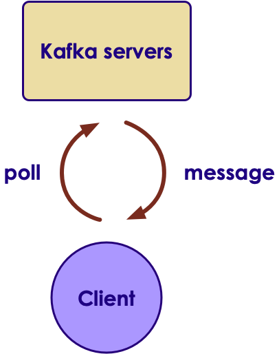
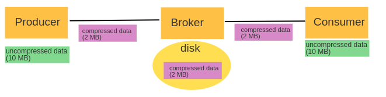
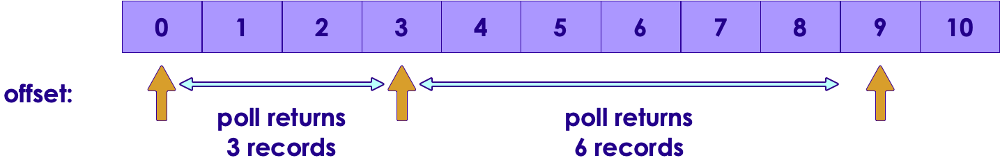
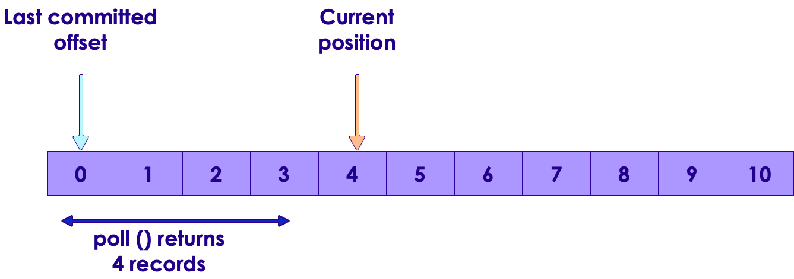
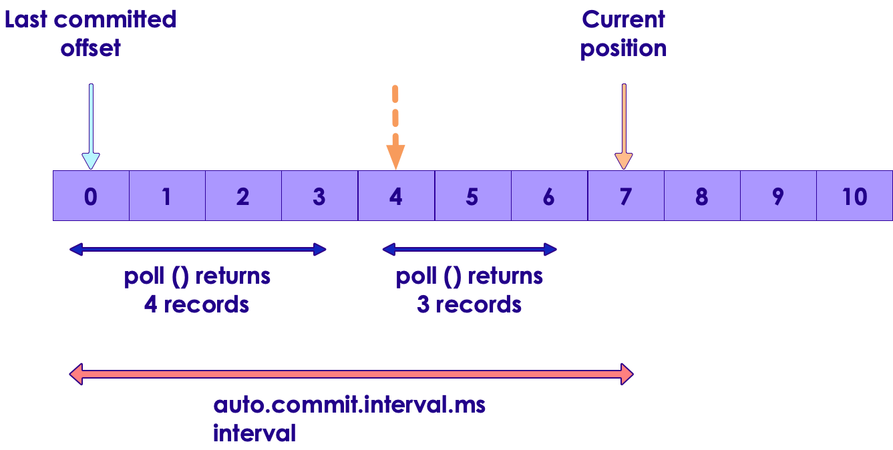
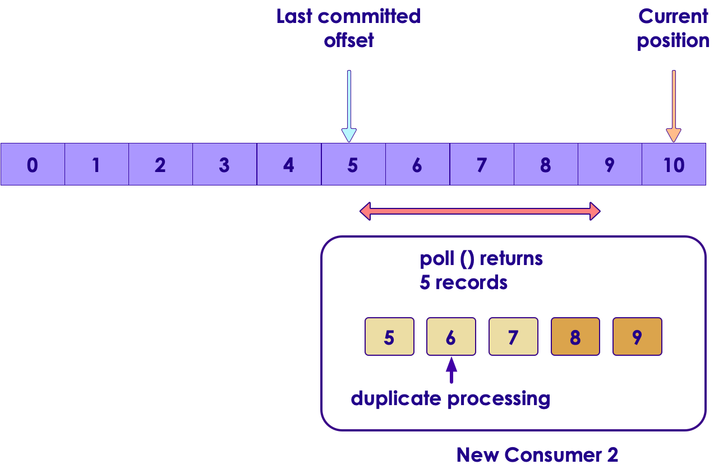
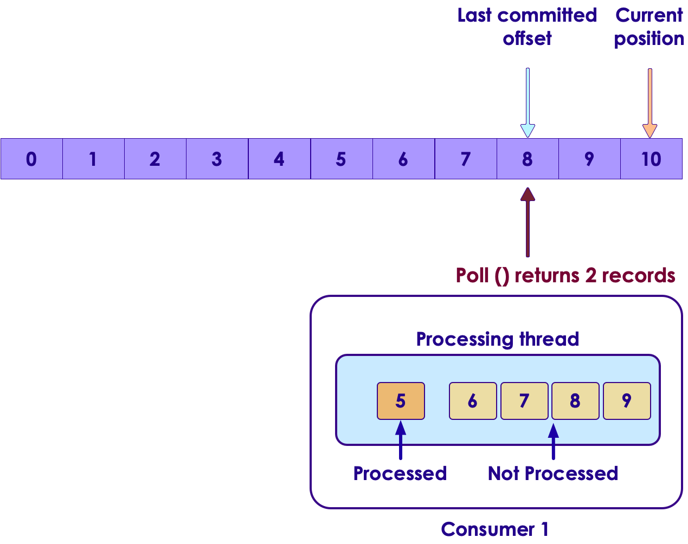
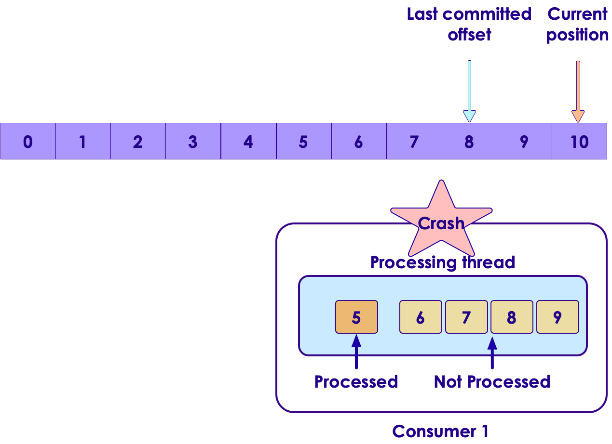
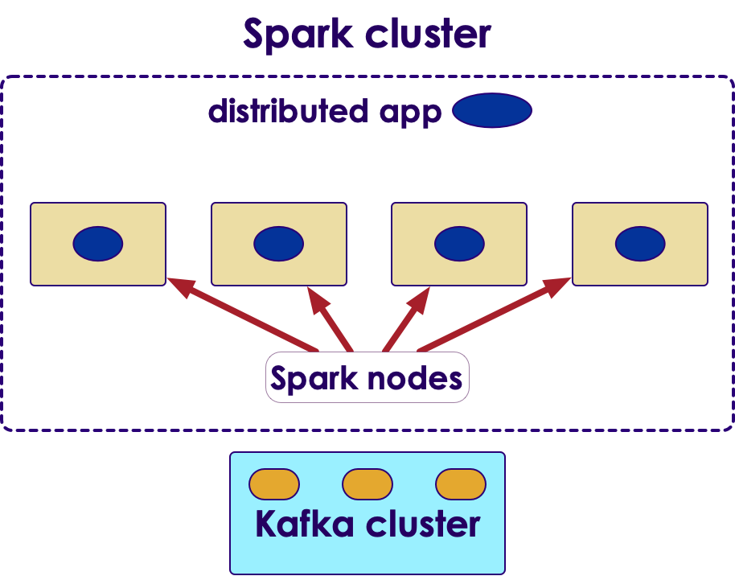

# Kafka API


---


## Lesson Objectives

* Learn to use Kafka Java API

Notes:


---

# Kafka API

---


## Kafka Clients


 * Java is the 'first class' citizen in Kafka
     - Officially maintained
 * Python on par with Java
     - Maintained by Confluent.io
 * Other language libraries are independently developed
     - may not have 100% coverage
     - May not be compatible with latest versions of Kafka
     - Do your home work!
 * REST proxy provides a language neutral way to access Kafka
 * Full list: https://cwiki.apache.org/confluence/display/KAFKA/Clients

<!-- {"left" : 1.85, "top" : 6.14, "height" : 2.34, "width" : 2.34} --> &nbsp; &nbsp; <!-- {"left" : 4.71, "top" : 7.13, "height" : 0.88, "width" : 3.69} -->


Notes:


---

## Kafka Java API

 <!-- {"left" : 7.58, "top" : 1.02, "height" : 2.63, "width" : 2.63} -->


 * Rich library that provides high level abstractions
     - No need to worry about networking / data format ..etc

 * Write message / Read message

 * Supports native data types
     - String
     - Bytes
     - Primitives (int, long ...etc.)

Notes:


---

## Java Producer Code (Abbreviated)


```java
// ** 1 **
import java.util.Properties;
import org.apache.kafka.clients.producer.KafkaProducer;
import org.apache.kafka.clients.producer.ProducerRecord;
import org.apache.kafka.clients.producer.ProducerConfig;
import org.apache.kafka.common.serialization.StringSerializer;
import org.apache.kafka.common.serialization.IntegerSerializer;
...

// ** 2 **
Properties props = new Properties();
props.put(ProducerConfig.BOOTSTRAP_SERVERS_CONFIG, "localhost:9092");
props.put(ProducerConfig.CLIENT_ID_CONFIG, "SimpleProducer");
props.put(ProducerConfig.KEY_SERIALIZER_CLASS_CONFIG, IntegerSerializer.class.getName());
props.put(ProducerConfig.VALUE_SERIALIZER_CLASS_CONFIG, StringSerializer.class.getName());

KafkaProducer< Integer, String > producer = new KafkaProducer<>(props);

// ** 3 **
String topic = "test";
Integer key = new Integer(1);
String value = "Hello world";
ProducerRecord < Integer, String > record = new ProducerRecord<> (topic, key, value);
producer.send(record);
producer.close();

```
<!-- {"left" : 0, "top" : 1.15, "height" : 4.04, "width" : 10.25} -->


Notes:


---

## Producer Code Walkthrough

```java
// ** 2 **  Recommended approach: use constants

import org.apache.kafka.clients.producer.ProducerConfig;
import org.apache.kafka.common.serialization.StringSerializer;
import org.apache.kafka.common.serialization.IntegerSerializer

Properties props = new Properties();
props.put(ProducerConfig.BOOTSTRAP_SERVERS_CONFIG, "localhost:9092");
props.put(ProducerConfig.CLIENT_ID_CONFIG, "SimpleProducer");
props.put(ProducerConfig.KEY_SERIALIZER_CLASS_CONFIG, IntegerSerializer.class.getName());
props.put(ProducerConfig.VALUE_SERIALIZER_CLASS_CONFIG, StringSerializer.class.getName());

KafkaProducer < Integer, String > producer = new KafkaProducer<>(props);
```

```java
// ** 2 ** another approach
Properties props = new Properties();
props.put("bootstrap.servers", "localhost:9092");
props.put("client.id", "SimpleProducer");
props.put("key.serializer",  "org.apache.kafka.common.serialization.IntegerSerializer");
props.put("value.serializer", "org.apache.kafka.common.serialization.StringSerializer");

KafkaProducer < Integer, String > producer = new KafkaProducer<>(props);
```
<!-- {"left" : 0, "top" : 1.29, "height" : 1.76, "width" : 10.25} -->

* **bootstrap.servers:** Specify the kafka brokers to connect to.
    - Best practice, specify more than one broker to connect to, so there is no single point of failure

```java
props.put(ProducerConfig.BOOTSTRAP_SERVERS_CONFIG, "broker1:9092,broker2:9092");
```


Notes:


---

## Producer Code Walkthrough

```java
// ** 3 **
String topic = "test";
Integer key = new Integer(1);
String value = "Hello world";
ProducerRecord< Integer, String > record = new ProducerRecord<> (topic, key, value);
producer.send(record);
producer.close();
```
<!-- {"left" : 0, "top" : 1.45, "height" : 1.51, "width" : 10.25} -->

<br/>

 * Each  **record**  represents a message
 * Here we have a <key,value> message
 * send() doesn't wait for confirmation
 * We send in batches

     - for increased throughput
     - Minimize network round trips


Notes:


---

## Producer Properties


```java
Properties props = new Properties();
props.put("boostrap.servers", "localhost:9092");
props.put("client.id", "SimpleProducer");
props.put("acks", "all");
props.put("retries", 0);
props.put("batch.size", 1000);
props.put("linger.ms", 100);  // batch timeout 100ms
props.put("buffer.memory", 33554432); // 32 M
props.put(ProducerConfig.KEY_SERIALIZER_CLASS_CONFIG, IntegerSerializer.class.getName());
props.put(ProducerConfig.VALUE_SERIALIZER_CLASS_CONFIG, StringSerializer.class.getName());

KafkaProducer < Integer, String > producer = new KafkaProducer<>(props);

for(int i = 0; i < 100; i++) {
  producer.send(new ProducerRecord < String, String >(
      "my-topic", Integer.toString(i), Integer.toString(i)));
}
producer.close();

```
<!-- {"left" : 0, "top" : 1.29, "height" : 3.94, "width" : 10.25} -->


Notes:


---

## Producer Acknowledgements


<!-- {"left" : 1.67, "top" : 1.16, "height" : 1.6, "width" : 6.91} -->

| ACK                               | Description                                                                                                                  | Speed  | Data safety                                          |
|-----------------------------------|------------------------------------------------------------------------------------------------------------------------------|--------|------------------------------------------------------|
| acks = 0                            | - Producer doesn't wait for any acks from broker <br/> - Producer won't know of any errors                                        | High   | Low   No guarantee that broker received the message  |
| acks = 1  <br/> (default in Kafka 2)  | - Broker will write the message to local log <br/> - Does not wait for replicas to complete                                       | Medium | Medium  Message is at least persisted on lead broker |
| acks = all <br/> (default in kafka 3) | - Message is persisted on lead broker and in replicas <br/> - Lead broker will wait for in-sync replicas to acknowledge the write | Low    | High  Message is persisted in multiple brokers       |

<!-- {"left" : 0.25, "top" : 3.38, "height" : 4.61, "width" : 9.75, "columnwidth" : [1.61, 3.58, 1.45, 3.11]} -->


Notes:


---

## Producer Acknowledgements


<!-- {"left" : 0.58, "top" : 1.59, "height" : 6.47, "width" : 9.1} -->


Notes:


---

## Consumer Code (Abbreviated)


```java
import org.apache.kafka.clients.consumer.ConsumerRecord;
import org.apache.kafka.clients.consumer.KafkaConsumer;
import org.apache.kafka.clients.consumer.ConsumerConfig;
import org.apache.kafka.common.serialization.StringDeserializer;
import org.apache.kafka.common.serialization.IntegerDeSerializer

...

Properties props = new Properties(); // ** 1 **
props.put(ConsumerConfig.BOOTSTRAP_SERVERS_CONFIG, "localhost:9092");
props.put(ConsumerConfig.GROUP_ID_CONFIG, "group1");
props.put(ConsumerConfig.CLIENT_ID_CONFIG, "Simple Consumer");
props.put(ConsumerConfig.KEY_DESERIALIZER_CLASS_CONFIG, IntegerDeSerializer.class.getName());
props.put(ConsumerConfig.VALUE_DESERIALIZER_CLASS_CONFIG, StringDeserializer.class.getName());

KafkaConsumer < Integer, String > consumer = new KafkaConsumer<>(props);

consumer.subscribe(Arrays.asList("topic1")); // ** 2 **

try {
    while (true) {
       ConsumerRecords < Integer, String > records = consumer.poll(Duration.ofMillis(1000)); // ** 3 **
       System.out.println("Got " + records.count() + " messages");
       for (ConsumerRecord < Integer, String > record : records) {
          System.out.println("Received message : " + record);
       }
   }
}
finally {
    consumer.close(Duration.OfSeconds(60));
}
```
<!-- {"left" : 0, "top" : 1.29, "height" : 4.7, "width" : 10.25} -->

Notes:


---

## Consumer Code Walkthrough

```java
Properties props = new Properties(); // ** 1 **
props.put(ConsumerConfig.BOOTSTRAP_SERVERS_CONFIG, "localhost:9092");
props.put(ConsumerConfig.GROUP_ID_CONFIG, "group1");
props.put(ConsumerConfig.CLIENT_ID_CONFIG, "Simple Consumer");
props.put(ConsumerConfig.KEY_DESERIALIZER_CLASS_CONFIG, IntegerDeSerializer.class.getName());
props.put(ConsumerConfig.VALUE_DESERIALIZER_CLASS_CONFIG, StringDeSerializer.class.getName());


KafkaConsumer < Integer, String > consumer = new KafkaConsumer<>(props);

consumer.subscribe(Arrays.asList("topic1")); // ** 2 **  

```
<!-- {"left" : 0, "top" : 1.07, "height" : 2.46, "width" : 10.25} -->

<br/>

 *  **bootstrap,servers:** "broker1:9092,broker2:9092"

     - Connect to multiple brokers to avoid single point of failure
 *  **group.id:** consumers belong in a Consumer Group
 * We are using standard serializers
 * Consumers can subscribe to one or more subjects  *// ** 2 ***   


Notes:


---

## Consumer Code Walkthrough

```java
try {
   while (true) {
      ConsumerRecords < Integer, String > records = consumer.poll(Duration.ofMillis(1000)); // ** 3 **
      System.out.println("Got " + records.count() + " messages");
      for (ConsumerRecord < Integer, String > record : records) {
        System.out.println("Received message : " + record);
      }
   }
}
finally {
   consumer.close();
}
```
<!-- {"left" : 0, "top" : 1.29, "height" : 2.1, "width" : 10.25} -->

<br/>

 * Consumers must subscribe to topics before starting polling
     - Consumer.subscribe ("test.*") // wildcard subscribe

 * Poll: This call will return in 1000 ms, with or without records

 * Must keep polling, otherwise consumer is deemed dead and the partition is handed off to another consumer


Notes:


---

## Consumer Poll Loop


 * Polling is usually done in an infinite loop.
 ```
    while (keepRunning) {  
        do poll
    }
```
<!-- {"left" : 0, "top" : 1.73, "height" : 1.07, "width" : 4.61} -->

<!-- {"left" : 7.58, "top" : 2.94, "height" : 3.18, "width" : 2.51} -->


 * First time poll is called
     - Finds the GroupCoordinator
     - Joining Consumer Group
     - Receiving partition assignment
 * Work done in poll loop
     - Usually involves some processing
     - Saving data to a store
     - Don't do high latency work between polls; otherwise the consumer could be deemed dead.
     - Do heavy lifting in a seperate thread

Notes:


---

## ConsumerRecord


 *  **org.apache.kafka.clients.consumer.ConsumerRecord <K,V>**

 *  **K  key():** key for record (type K), can be null

 *  **V  value():** record value (type V - String / Integer ..etc)

 *  **String topic():** Topic where this record came from

 *  **int partition():** partition number

 *  **long offset():** long offset in

```java
ConsumerRecords < Integer, String > records = consumer.poll(Duration.ofMillis(1000));
  for (ConsumerRecord < Integer, String > record : records) {
     System.out.printf("topic = %s, partition = %d, offset = %d,
            key= %s, value = %s\n",
            record.topic(), record.partition(), record.offset(),
            record.key(), record.value());
  }

```
<!-- {"left" : 0, "top" : 4.78, "height" : 1.49, "width" : 10.25} -->

Notes:


---

## Configuring Consumers

```java
Properties props = new Properties(); // ** 1 **

...
props.put("session.timeout.ms", 30000); // 30 secs
props.put("max.partition.fetch.bytes", 5 * 1024 * 1024); // 5 M

KafkaConsumer < Integer, String > consumer = new KafkaConsumer<>(props);
```
<!-- {"left" : 0, "top" : 1.18, "height" : 1.77, "width" : 10.25} -->

<br/>

* **max.partition.fetch.bytes**
    - default: 1048576  (1M)
    - Max message size to fetch.  Also see  **message.max.bytes**  broker config

* **session.timeout.ms**  
    - default: 30000  (30 secs) in Kafka 2,  45000 (45 secs) in Kafka 3
    - If no heartbeats are not received by this window, consumer will be deemed dead and a partition rebalance will be triggered


Notes:


---

## Clean Shutdown Of Consumers


 * Consumers poll in a tight, infinite loop

 * Call  **'**  **consumer.wakeup**  **()** ' from another thread

 * This will cause the poll loop to exit with  **'**  **WakeupException** '

```java
try {
  while (true) {
   ConsumerRecords < Integer, String > records = consumer.poll(100);
    // handle events
 }
}
catch (WakeupException ex) {
   // no special handling needed, just exit the poll loop
}
finally {
   // close will commit the offsets
   consumer.close();
}

```
<!-- {"left" : 0, "top" : 2.9, "height" : 3.27, "width" : 10.25} -->


Notes:


---

## Signaling Consumer To Shutdown


 * Can be done from another thread or shutdown hook
 *  **'**  **consumer.wakeup**  **()** '  is safe to call from another thread

```java
Runtime.getRuntime().addShutdownHook(new Thread() {
   public void run() {
      System.out.println("Starting exit...");
      consumer.wakeup(); // signal poll loop to exit
      try {
           mainThread.join(); // wait for threads to shutdown
      } catch (InterruptedException e) {
           e.printStackTrace();
  }
 }
}
```
<!-- {"left" : 0, "top" : 2.48, "height" : 2.98, "width" : 10.25} -->


Notes:


---

## Lab : Kafka Producer / Consumer

<!-- {"left" : 7.13, "top" : 1.16, "height" : 3.74, "width" : 2.81} -->


 *  **Overview:**  
 Use Kafka Java API to write Producer and Consumer

 *  **Builds on previous labs:**   
    - 1-install Kafka
 *  **Approximate Time:**
    - 30 - 40 mins
 *  **Instructions:**
    - Please follow: 3.1, 3.2, 3.3
 *  **To Instructor:**


Notes:


---

# Producer Send Modes

---


## Producer Send Modes


 * **1: Fire and Forget**
     - Send message, doesn't wait for confirmation from Kafka
     - Writes messages to broker in batches (minimize network round-trips)
     - Risk of some messages being lost
     - Default and fastest

 * **2: Sync**
     - Send message and wait for confirmation from Kafka
     - Each message is sent out individually
     - Usually lowest throughput

 * **3: Async**
     - Registers a callback function while sending
     - Does not wait for confirmation
     - Kafka will call this function with confirmation or exception
     - Higher throughput

Notes:


---

## Producer Send Mode:  Fire and Forget

```java
String topic = "test";
Integer key = new Integer(1);
String value = "Hello world";
ProducerRecord < Integer, String > record =
		new ProducerRecord<> (topic, key, value);
producer.send(record); // <-- fire away, not waiting for results
```
<!-- {"left" : 0, "top" : 1.19, "height" : 1.8, "width" : 8.68} -->

<br/>

 * The 'record' is placed in the send buffer
 * It will be sent to Kafka in a separate thread
 * Send() returns a Java Future object (that we are not checking)
 * Some messages can be dropped
 * Use cases:
     - Metrics data
     - Low important data


Notes:


---

## Producer Send Mode: Sync

```java
ProducerRecord < Integer, String > record =
	new ProducerRecord<> (topic, key, value);

RecordMetadata recordMetaData = producer.send(record).get(); // <-- wait for result

```
<!-- {"left" : 0, "top" : 1.45, "height" : 1.5, "width" : 10.25} -->

<br/>

* `get` method is a waiting call

* Inspect `RecordMetaData` for success / error

Notes:

---

## Producer Send Mode: Async

```java
import org.apache.kafka.clients.producer.Callback;

public class Producer implements Callback { // <-- implement callback

  // .. normal producer code

  // here is the call back function
  @Override
  public void onCompletion(RecordMetadata meta, Exception ex) {
    if (ex != null) // error
      ex.printStackTrace();

    if (meta != null) // success
      System.out.println("send success");
  }
}
...
producer.send(record, this);  // <-- supply callback
```

<!-- {"left" : 0, "top" : 1.09, "height" : 2.84, "width" : 9.21} -->

<br/>
<br/>

* Kafka will callback with meta or exception

Notes:

---

## Producer Send Modes

```java

// fire and forget
producer.send(record);

// sync
producer.send(record).get();

// async
producer.send(record, this); // producer has callback implemented
```


---

## Lab 4.1: Kafka Producer Benchmark

<!-- {"left" : 6.76, "top" : 0.88, "height" : 4.37, "width" : 3.28} -->

 *  **Overview:** Try different send methods in Producer

 *  **Builds on previous labs:** lab 3

 *  **Approximate Time:** 20 - 30 mins

 *  **Instructions:**

     - Please follow: lab 4.1

 *  **To Instructor:**


Notes:


---

# Message Compression

---

## Compression

* Benefits of compression
  - Reduces the data size goes on network --> faster throughput
  - Reduces data footprint on disk --> less data to write to disk -> faster

* Compression is performed on a batch
  - Larger batch size -> better compression

* Kafka API will automatically
  - On Producer: Compress messages before sending on wire
  - On Broker: Messages remain in compressed state in partitions
  - On Consumer: De-compress messages on the fly

<!-- {"left" : 6.43, "top" : 1, "height" : 2.88, "width" : 3.61} -->
---

## Compression

<!-- {"left" : 1.08, "top" : 1.61, "height" : 6.42, "width" : 8.09} -->

* Supported compression codecs
  - Gzip, Snappy, LZ4, Zstd

* **Snappy** (from Google) is a pretty good light weight compressor;  Easy on GPU and produces medium level compresison

* Current favorite is **Zstd** (Facebook) - Good speed and produces compact size

* Configured via Producer property **`compression.type`** (see next slide for code sample)

* [Reference](https://cwiki.apache.org/confluence/display/KAFKA/KIP-110%3A+Add+Codec+for+ZStandard+Compression)

Notes:

---

## Compression

* **Compression will slightly increase CPU usage**
    - How ever, this is well worth the trade-off, as CPUs are very fast and we usually have plenty of CPU power to spare.
    - Plus modern CPUs have compression algorithms built-in silicone

* Here are some benchmark stats from [Message compression in Apache Kafka](https://developer.ibm.com/articles/benefits-compression-kafka-messaging/)

* We can see Snappy (from Google) and zstd (from Facebook) giving a good balance of CPU usage, compression ratio, speed and network utilization

<br />

| Metrics                     | Uncompressed | Gzip  | Snappy | lz4  | Zstd |
|-----------------------------|--------------|-------|--------|------|------|
| Avg latency (ms)            | 65           | 10.4  | 10.1   | 9.2  | 10.7 |
| Disk space (mb)             | 10           | 0.92  | 2.2    | 2.8  | 1.5  |
| Effective compression ratio | 1            | 0.09  | 0.21   | 0.28 | 0.15 |
| Process CPU usage %         | 2.35         | 11.46 | 7.25   | 5.89 | 8.93 |

---

## Enabling Compression

```java
import java.util.Properties
import org.apache.kafka.clients.producer.KafkaProducer;

props = new Properties();
props.put("bootstrap.servers", "localhost:9092");
props.put("client.id", "CompressedProducer");
props.put("key.serializer", "org.apache.kafka.common.serialization.StringSerializer");
props.put("value.serializer", "org.apache.kafka.common.serialization.StringSerializer");

// viable codecs : "none"  or "uncompressed" (default), "snappy", "gzip", "lz4", "zstd"
// https://kafka.apache.org/documentation/#configuration
// https://kafka.apache.org/documentation/#brokerconfigs_compression.type

props.put("compression.type", "snappy"); // <-- **enable compression**

KafkaProducer<String, String> producer = new KafkaProducer<>(props);
```

---

## Compression Data Formats

* **XML and JSON data formats are very good candidates for compression**.  Since they have lot of repeating elements, they compress well.
* JSON data

```json
{"id" : 1, "first_name" : "John", "last_name" : "Smith", "age" : 34, "email" : "john@me.com"}
```

* XML data

```xml
<CATALOG>
    <CD>
        <TITLE>Empire Burlesque</TITLE>
        <ARTIST>Bob Dylan</ARTIST>
        <YEAR>1985</YEAR>
    </CD>
</CATALOG>
```

* Also **server logs** are good candidates, as they have well defined structure

```text
1.1.1.1 - [2020-09-01::19:12:06 +0000] "GET /index.html HTTP/1.1" 200  532"
2.2.2.2 - [2020-09-01::19:12:46 +0000] "GET /contact.html HTTP/1.1" 200  702"
```

* **Binary data formats won't compress well**. E.g. images, base64 encoded strings.  Don't enable compression.
* Reference: [Message compression in Apache Kafka](https://developer.ibm.com/articles/benefits-compression-kafka-messaging/)

---

## Lab: Compression Benchmark

<!-- {"left" : 6.76, "top" : 0.88, "height" : 4.37, "width" : 3.28} -->

 *  **Overview:** Try different compression codecs in Producer

 *  **Builds on previous labs:** lab 4.1

 *  **Approximate Time:** 20 - 30 mins

 *  **Instructions:**

     - Please follow: lab 4.2

 *  **To Instructor:**

Notes:

---

## Advanced Consumer Properties

| Property                      | Description                                                           | Default Value |
|-------------------------------|-----------------------------------------------------------------------|---------------|
| fetch.min.bytes               | Min. data to fetch.                                                   |               |
| fetch.max.wait.ms             | Max. wait time                                                        | 500 ms        |
| Session.timeout.ms            | Time after which consumer is deemed dead if it doesn't contact broker | 30 seconds     |
| Heartbeat.interval.ms         | Intervals in which heartbeats are sent                                | 1 second      |
| Auto.offset.reset             | Offset value to use when no committed offset exists                   | "latest"      |
| Partition.assignment.strategy | Assign partitions by range or round-robin (next slide)                | RangeAssignor |
| Max.poll.records              | Max. number of records poll can return                                |              &nbsp;|

<!-- {"left" : 0.25, "top" : 1.24, "height" : 5.24, "width" : 9.75} -->

Notes:

Broker will wait until fetch.min.bytes data accumulates before sending to consumer
Auto.offset.reset other valid value is "earliest" - meaning read entire partition from start


---

## Partition Assignment Schemes

* Range assignment (default)
    - `partition.assignment.strategy = RangeAssignor`

<!-- {"left" : 0.5, "top" : 3.43, "height" : 3.82, "width" : 9.26} -->

* Random assignment
    - `partition.assignment.strategy = RoundRobinAssignor`

<!-- {"left" : 0.79, "top" : 3.31, "height" : 3.57, "width" : 8.66} -->

---

# Commits And Offsets

---


## Understanding Offsets

<!-- {"left" : 1.02, "top" : 6.19, "height" : 1.95, "width" : 8.21} -->


 *  **Last committed offset:** from client commit (auto or manual)

 *  **Current position:** where client is reading from

 *  **High watermark:** latest replicated offset.

 *  **Log End:** offset of last message

 * Consumers can only read up to  **high watermark**

     - Otherwise consumers will read un-replicated data, might result in data loss


Notes:


---

## Commits And Offsets


 * Kafka does not track 'read acknowledgements' of messages like other JMS systems
 * It tracks the consumer progress using an  **offset**
 * When a Consumer calls `Poll()` it gets  **new records** from the offset
 * Offsets are stored in Kafka (in a special topic :  **__**  **consumer_offsets**  **)**
     - Used to be stored in ZK, but now stored in Kafka for performance reasons
 * When a consumer crashes..
     - Partitions of that consumer are assigned to another consumer
     - New 'partition owner' consumer  resumes from current offset

<!-- {"left" : 0.54, "top" : 6.95, "height" : 1.51, "width" : 9.16} -->


Notes:


---

## Offset Management


 * **auto commit**: Offsets can be 'moved' automatically by consumer API

     - Convenient

     - But does not give full control to developer

 * **Manual  commit**

     - Clients handle offset

     - Complete control

Notes:


---

## Auto Commit

 * We need to set two properties
    - **`enable.auto.commit=true`** so the client will save the offset when poll()
    - Frequency controlled by **`auto.commit.interval.ms`** (default 5 secs)
 * auto.commit is enabled by default
 * During each poll, consumer checks if the  **auto.commit.interval.ms**  interval has expired; if yes,  commit the  **latest offset** returned by the  **last poll()**
 * Commits are saved to a special Kafka topic called  **_consumer_offsets**

```java
props.setProperty ("enable.auto.commit", "true");
props.setProperty ("auto.commit.interval.ms", "5000");
props.setProperty ("session.timeout.ms", "30000"); // set higher for high latency applications

while (true) {
    ConsumerRecords<String, String> records = consumer.poll(Duration.ofMillis(100));
    for (ConsumerRecord<String, String> record : records)
        // process records
    }
    // make sure all records are processed before next poll
}
```

Notes:

---

## Auto Commit

* Remember this as we walk through these scenarios:
    - **current position** : Pointer for **current consumer**
    - **committed position**: Pointer for **replacement consumer**

* Both pointers are at 0 at the beginning

<!-- {"left" : 0.65, "top" : 2.97, "height" : 3.7, "width" : 8.96} -->

Notes:

---

## Auto Commit

<!-- {"left" : 0.46, "top" : 1.24, "height" : 2.29, "width" : 5.55} -->
<!-- {"left" : 0.56, "top" : 4.87, "height" : 3.22, "width" : 9.13} -->

* First poll gets 4 records.  **Current position = 0 + 4 = 4**

* **Committed offset still at 0**

* Top diagram (previous state), bottom diagram (current state)


Notes:

---

## Auto Commit

<!-- {"left" : 0.29, "top" : 1.31, "height" : 2.04, "width" : 5.79} -->

<!-- {"left" : 0.71, "top" : 4.03, "height" : 4.45, "width" : 8.84} -->

* Second poll gets 3 records

* **Current position = 4 + 3 = 7**

* **Committed offset still at 0**.  Because elapsed time still under 'auto.commit.internval.ms' window

* Top diagram (previous state), bottom diagram (current state)

Notes:

---

## Auto Commit

<!-- {"left" : 0.13, "top" : 1.15, "height" : 2.97, "width" : 5.89} -->
<!-- {"left" : 1.02, "top" : 4.35, "height" : 4.36, "width" : 8.21} -->

* Third poll gets 3 records

* **Current position = 7 + 3 = 10**

* **Committed offset is updated to 7 (offset from last poll)**.  Because elapsed time has surpassed 'auto.commit.internval.ms' window

* Top diagram (previous state), bottom diagram (current state)

Notes:


---

## Auto Commit & Duplicate Events


 * Consumer 1 reads records, but crashes in the middle of processing (after processing messages 5, 6  and 7)

<!-- {"left" : 1.02, "top" : 2.78, "height" : 5.4, "width" : 8.21} -->


Notes:


---

## Auto Commit & Duplicate Events

<!-- {"left" : 1.02, "top" : 2.78, "height" : 5.4, "width" : 8.21} -->
<!-- {"left" : 1.02, "top" : 3.12, "height" : 5.4, "width" : 8.21} -->

* Replacement consumer2 starts reading from **`committed offset`**

* And processes messages 5, 6 and 7 again. This is **duplicate processing**

* **At-least-once** semantics


Notes:


---

## Auto Commit & Skipped Events


 * Consumer1 polls the events and hands them off to another thread for processing

<!-- {"left" : 1.02, "top" : 2.75, "height" : 6.01, "width" : 8.21} -->


Notes:


---

## Auto Commit & Skipped Events


 * Before 'processing thread' has a chance to finish processing all messages, main polling thread initiates another poll

 * This commits the offset to 8

<!-- {"left" : 1.02, "top" : 2.75, "height" : 5.97, "width" : 8.21} -->


Notes:


---

## Auto Commit & Skipped Events


 * Consumer1 crashes

<!-- {"left" : 0.73, "top" : 1.63, "height" : 6.38, "width" : 8.79} -->


Notes:


---

## Auto Commit & Skipped Events


 * A new consumer2 starts processing

 * But when it polls, it is retrieving messages from last-committed-offset (8 onwards)

 * Messages 6 & 7 are skipped

<!-- {"left" : 0.66, "top" : 3.31, "height" : 4.56, "width" : 8.92} -->


Notes:

---

## Duplicate Events vs. Skipped Events

 *  **Processed but Offset not updated -> Duplicate processing**

 *  **Offset updated but not processed -> Skipped events**

<!-- {"left" : 0.44, "top" : 2.96, "height" : 1.41, "width" : 6.05} -->

<!-- {"left" : 0.88, "top" : 5.97, "height" : 1.68, "width" : 8.48} -->


Notes:

---

## Auto Commit Best Practices

* Auto commit can lead to duplicate processing or skipped events

* Dealing with **duplicate events**

     - Make sure processing is  **'idempotent'** (duplicate processing does not have any side effects)

     - Example, **insert** vs **upsert**

* Dealing with **skipped events**

     - Before calling poll() make sure all events returned from previous poll are processed

Notes:


---

## Manual Commit - Example 1

* To do manual-commit, do the following
    - Set **`enable.auto.commit = false`**
    - call **`consumer.commitSync()`** or **`consumer.commitASync()`**

* Here we are marking **all received records as committed**

```java
Properties props = new Properties();
...
props.put("enable.auto.commit", "false"); // must disable
KafkaConsumer < Integer, String > consumer = new KafkaConsumer<>(props);

while (true) {
  ConsumerRecords < Integer, String > records = consumer.poll(100);
  for (ConsumerRecord < Integer, String > record : records)
  {
     System.out.println(String.format(
	"topic = %s, partition = %s, offset = %d",
	record.topic(), record.partition(), record.offset()));
  }
  try {
    consumer.commitSync(); // <--- 1 - wait for commit to be done
    consumer.commitASync(); // <--- or  ** 2 ** - send a commit message and move on

  } catch (CommitFailedException e) {
    e.printStackTrace();
  }
}

```
<!-- {"left" : 0, "top" : 1.38, "height" : 4.86, "width" : 10.25} -->

Notes:

---

## Manual Commit

 * **`commitSync()`** will wait for confirmation
     - Might slow down processing

 * **`commitAsync()`** is 'fire and forget'
     - Commits can be lost
     - But the next calls can catchup

 * Both will commit the  **latest offset** returned by  **last poll** ()

 * To explicitly set an offset, supply offset to commitSync() or commitAsync() calls
     - (see documentation)

Notes:

---

## Manual Commit -  Example 2

* Here we are going to commit **specific records** that were processed
* Both commitSync and commitAsync can take a Map of partitions & offsets
* We are committing every 100 records to minimize the overhead

```java
import org.apache.kafka.common.TopicPartition;
import org.apache.kafka.clients.consumer.OffsetAndMetadata;
Map < TopicPartition, OffsetAndMetadata > currentOffsets = new HashMap<>();
int count = 0;
while (true) {
   ConsumerRecords < Integer, String > records = consumer.poll(100);
   for (ConsumerRecord < Integer, String > record : records)
   {
      count++;
      // process message and update offset map
      currentOffsets.put(
          new TopicPartition(record.topic(), record.partition()),
          new OffsetAndMetadata(record.offset()+1, "no metadata"));

      if (count % 100 == 0) { // commit every 100 records
          consumer.commitSync(currentOffsets, null);
          currentOffsets.clear();
    }
  }
}
```

* References
    - [org.apache.kafka.clients.consumer.KafkaConsumer](https://kafka.apache.org/30/javadoc/org/apache/kafka/clients/consumer/KafkaConsumer.html)
    - [org.apache.kafka.common.TopicPartition](https://kafka.apache.org/30/javadoc/org/apache/kafka/common/TopicPartition.html)

Notes:

---

## Manual Commit - Example 3

* Here we have finer control on which records to mark as committed

* We commit offset after we finish handling the records in each partition.

```java
try {
    while(running) {
        ConsumerRecords<String, String> records = consumer.poll(Duration.ofMillis(500));

        // loop over partitions returned
        for (TopicPartition partition : records.partitions()) {
            // grab records for this partition
            List<ConsumerRecord<String, String>> partitionRecords = records.records(partition);

            // go over these records
            for (ConsumerRecord<String, String> record : partitionRecords) {
                System.out.println(record.offset() + ": " + record.value());
            }
            long lastOffset = partitionRecords.get(partitionRecords.size() - 1).offset();

            // Mark records from this partition as done
            // The committed offset should always be the offset of the next message 
            // that your application will read. Thus, when calling commitSync(offsets) 
            // you should add one to the offset of the last message processed.
            consumer.commitSync(Collections.singletonMap(partition,
                    new OffsetAndMetadata(lastOffset + 1)));
        }
    }
} finally {
consumer.close();
}
```

---

## Consumer Configurations

* We are going to see a few code samples of different consumers

* **At-most-once** consumer
    - OK to loose messages, but no duplicate processing

* **At-least-once** consumer
    - Do not loose messages, duplicate processing is OK

* **Exactly-once** consumer
    - Process only once
    - No duplicate events
    - No dropped events

* References:
    - [Meaning of at-least once, at-most once and exactly-once delivery](https://medium.com/@madhur25/meaning-of-at-least-once-at-most-once-and-exactly-once-delivery-10e477fafe16)
    - [Kafka Clients (At-Most-Once, At-Least-Once, Exactly-Once, and Avro Client)](https://dzone.com/articles/kafka-clients-at-most-once-at-least-once-exactly-o)

---

## At-least-once Consumer With Auto Commit

* Simplest implementation, we let Kafka keep track of offsets
* We finish processing all records before next poll
* Analyze what would happen if the consumer crashes
    - Replacement consumer starts up
    - It resumes from 'committed offset' (this is lagging from consumer offset)
    - It will receive duplicate messages

```java
props.setProperty ("enable.auto.commit", "true");
props.setProperty ("auto.commit.interval.ms", "5000");
props.setProperty ("session.timeout.ms", "30000"); // set higher for high latency applications

while (true) {
    ConsumerRecords<String, String> records = consumer.poll(Duration.ofMillis(100));
    for (ConsumerRecord<String, String> record : records)
        // process records
    }
    // all records are processed before next poll
}
```

---

## At-least-once Consumer with Manual Commit

* Here auto commit is disabled, we are committing manually at the end of processing all records

* What would happen if consumer crashed at **point A** (just before committing)
    - Replacement consumer starts up
    - It resumes from 'committed offset' (this is lagging from consumer offset)
    - It will receive duplicate messages

```java
props.setProperty ("enable.auto.commit", "false");

while (true) {
    ConsumerRecords<String, String> records = consumer.poll(Duration.ofMillis(100));
    for (ConsumerRecord<String, String> record : records)
        // process records
    }
    // ** A **
    // commit all records are processed
    consumer.commitSync()
}
```

---

## At-most-once Consumer

* Here we keep polling Kafka and  building a 'batch' in consumer
* And saving the batch once it exceeds 1000 records
* Every time we poll, Kafka will commit the offsets
    - The small value of `auto.commit.interval.ms` will ensure the commit happens
* Now think about what happens when the consumer crashes before saving database (next slide)

```java
props.put("enable.auto.commit", "true");  // auto commit on
props.put("auto.commit.interval.ms", "100"); //  keep it small 

// internal buffer
final int minBatchSize = 1000;
List<ConsumerRecord<String, String>> buffer = new ArrayList<>();
while (true) {
    ConsumerRecords<String, String> records = consumer.poll(100);
    // add records to buffer
    for (ConsumerRecord<String, String> record : records) {
        buffer.add(record);
    }
    if (buffer.size() >= minBatchSize) {
        insertIntoDb(buffer);
        buffer.clear();
    }
}
```

---

## At-most-once Consumer

* Here is the **at-most-once scenario**

* As we keep polling, Kafka will auto commit the offsets

* Let's say consumer crashed before saving to database

* Replacement consumer comes up, it resumes from 'last-commited-offset' - which is moved to current-pointer

* So a few messages are skipped

---

## Exactly Once Processing in Kafka

* Exactly-once is the coveted scenario

* In Kafka, it is **possible to do exactly-once given a few restrictions**

* We need to implement changes **in Broker, Producer and Consumer**

* Kafka Streams API implements Exactly Once Processing

* References
    - [Exactly-Once Semantics Are Possible: Here's How Kafka Does It](https://www.confluent.io/blog/exactly-once-semantics-are-possible-heres-how-apache-kafka-does-it/)
    - [Exactly Once Processing in Kafka with Java](https://www.baeldung.com/kafka-exactly-once)
    - [KafkaProducer API](https://kafka.apache.org/23/javadoc/org/apache/kafka/clients/producer/KafkaProducer.html)

---

## Exactly Once - Broker Setup

* **`replication.factor = 3`**
    - 3 Replicas has been proven at scale to provide very durable data safety
    - This is why Hadoop/HDFS uses 3 replicas for durable data

* **`min.insync.replicas = 2`**
    - This specifies the minimum number of replicas that must acknowledge a write for the write to be considered successful, When a producer sets acks to "all" (or "-1")

---

## Exactly Once - Producer Setup

* Enable  **idempotent**
* Enable **atomic transactions**
* Enable **acks=all** for durable writes

```java
Properties producerProps = new Properties();
producerProps.put("bootstrap.servers", "localhost:9092");
producerProps.put("enable.idempotence", "true"); // <-- **1*
producerProps.put("acks", "all"); // <--  *2*
producerProps.put("transactional.id", "my-transactional-id"); // <-- *3**
Producer<String, String> producer = new KafkaProducer<> ...

producer.initTransactions(); // <-- *4*
try
{
    producer.beginTransaction(); // <-- *5* begin atomic batch

    // send a bunch of messages
    producer.send(record1);   // <-- *6*
    producer.send(record2);
    producer.send(record3);

    producer.commitTransaction(); // <-- *7* commit batch
}
catch (ProducerFencedException | OutOfOrderSequenceException | AuthorizationException e) {
     // We can't recover from these exceptions, so our only option is to close the producer and exit.
     producer.close();
} catch (KafkaException e) {
     // For all other exceptions, just abort the transaction and try again.
     producer.abortTransaction(); // <-- *8*
}
producer.close();
```

---

## Exactly Once - Consumer

* Finally, in order for transactional guarantees to be realized from end-to-end, the consumers must be configured to read only committed messages as well

* **`isolation.level="read_committed"`**

* This Controls how to read messages written transactionally. If set to **read_committed**, consumer.poll() will only return transactional messages which have been committed. 

* If set to **read_uncommitted** (the default), consumer.poll() will return all messages, even transactional messages which have been aborted. Non-transactional messages will be returned unconditionally in either mode.

```java
Properties consumerProps = new Properties();
consumerProps.put("bootstrap.servers", "localhost:9092");
consumerProps.put("group.id", "my-group-id");
consumerProps.put("enable.auto.commit", "false");
consumerProps.put("isolation.level", "read_committed"); // <-- *1*

KafkaConsumer<String, String> consumer = new KafkaConsumer<>(consumerProps);
consumer.subscribe(singleton("topic1"));

```

---

## Lab : Consumer Commits

<!-- {"left" : 6.76, "top" : 0.88, "height" : 4.37, "width" : 3.28} -->

* **Overview:** Try different commit methods in Consumers
    - At-most once, At-least once

* **Builds on previous labs:** lab 3

* **Approximate Time:** 20 - 30 mins

* **Instructions:**
    - Please follow lab 5.1

* **To Instructor:**

Notes:

---

## Seeking To An Offset


 * Use cases:

     - Catching up to latest events first  (and then processing the backlog).See demo at : https://sematext.com/blog/2015/11/04/kafka-real-time-stream-multi-topic-catch-up-trick/

 * To go to end of partition

     - Consumer.seekToEnd()

 * To go to beginning

     - Consumer.seekToBeginning()

 * Seek to any offset

     - Consumer.seek (partition, offset)

Notes:

https://sematext.com/blog/2015/11/04/kafka-real-time-stream-multi-topic-catch-up-trick/


---

## Lab: Seeking to Offsets

<!-- {"left" : 6.76, "top" : 0.88, "height" : 4.37, "width" : 3.28} -->

*  **Overview:** Seek and read various offsets in  a partition

*  **Builds on previous labs:**

*  **Approximate Time:** 20 - 30 mins

*  **Instructions:**
     - Please follow: lab 5.2

*  **To Instructor:**


Notes:

---

# Kafka & Spark

---

## Lambda Streaming Architecture

* Spark and Kafka are a popular pair in Lambda architecture

<!-- {"left" : 0.82, "top" : 2.82, "height" : 1.97, "width" : 8.61} -->


*  *Source:*  *http://lambda-architecture.net/*

Notes:


---

## Spark and Kafka

<!-- {"left" : 6.76, "top" : 0.88, "height" : 4.37, "width" : 3.28} -->

* Spark is a distributed platform
    - It will run applications as multiple parallel tasks
    - Spark will also handle any failures (task failure, or node failure)

* Here we see two clusters - Spark cluster and Kafka cluster

* As far as Kafka is concerned, Spark application will behave like a regular client (either Producer or Consumer)

---

## Kafka Structured Streaming Example

```java
// Subscribe to 1 topic
Dataset<Row> df = spark
  .readStream()
  .format("kafka")
  .option("kafka.bootstrap.servers", "host1:port1,host2:port2")
  .option("subscribe", "topic1")
  .load();
df.selectExpr("CAST(key AS STRING)", "CAST(value AS STRING)");

// once a dataframe is established, we can query it
df.count();

filtered = df.filter (df['value'].contains("some-string-pattern"));
```
<!-- {"left" : 0, "top" : 1.78, "height" : 3.13, "width" : 10.25} -->

* References
    - [Spark examples](https://github.com/apache/spark/tree/master/examples)

Notes:

---

## Lab: Analyzing Clickstream Data

* We are going to be analyzing Clickstream data

```json
{ "timestamp" :1451635200055,
"session":"session_57" ,
"domain":"twitter.com" ,
"cost":24,
"user":"user_31",
"campaign": "campaign_1",
"ip":"ip_64",
"action": "blocked" }
```
<!-- {"left" : 0, "top" : 1.9, "height" : 1.98, "width" : 4.79} -->

<br/>

 * Process the data and keep a running total of `'domain-count'`

     - Twitter.com: 10

     - Facebook.com: 12

Notes:


---

## Lab: Clickstream Lab

<!-- {"left" : 6.76, "top" : 0.88, "height" : 4.37, "width" : 3.28} -->

 *  **Overview:** Process clickstream data

 *  **Builds on previous labs:**

 *  **Approximate Time:** 30 - 40 mins

 *  **Instructions:**

     - Please follow lab 6

 *  **To Instructor:**


Notes:


---

## Review Questions

<!-- {"left" : 8.56, "top" : 1.21, "height" : 1.15, "width" : 1.55} -->
<!-- {"left" : 6.53, "top" : 2.66, "height" : 2.52, "width" : 3.79} -->

* How would you ensure that a message has been written durably in your Producer?

* True or False: Each Consumer reads from a single topic

* How does a Consumer retrieve messages?

* How does the Consumer do a `'clean shutdown'`?

  - Why is this important?

* How is compression enabled for messages?

Notes:


