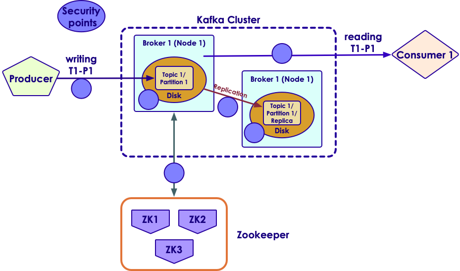

# Kafka Admin


---


## Lesson Objectives

 * Learn to use Kafka Java API


Notes: 


---

# Installing Kafka

---


## Install Process


 * Prepare hardware

 * Prepare basic software stack (OS / JDK ..etc)

 * Install Kafka on all machines

 * Configure each node / broker

 * Setup Kafka for auto-start on bootup

 * Setup monitoring

Notes: 


---

## Kafka Hardware Requirements


 * Bare metal machines for high performance

     - Virtual Machines (VM) are not recommended in production setup

 * Specs

     - CPU: 8 core + (Intel Xeon)

     - Memory: 64G – 128G  

     - Disk: multiple drives (8 or more x 2TB each), SATA 7200 RPM.

     - Network: 10G preferred, or two 1G Ethernets (bonded)

 * Memory Usage

     - Kafka uses very modest memory ( ~4G per broker)

     - The rest of the memory is for page cache

     - Page cache buffers disk writes / reads

     - Page cache is what helps with IO throughput  (data seldom hits the disk between write and read)

     - Page cache size  = throughput / sec  x  30 seconds

Notes: 


---

## Disks Setup


 * More disks increase IO throughput

 * Disks can be combined by RAID or used as individual volumes

 * RAID 

     - Better data spread across disks

     - battery backup a must!

     - Might slow down writes

 * Individual volumes

     - Kafka will stripe data across disks

     - One partition MUST fit on ONE volume


Notes: 


---

## Zookeeper Hardware


 * Run ZK on separate hardware

     - Just run ZK, nothing else

 * Similar hardware as brokers is fine

 * Run ZK in odd numbers 3,5,7... .

     - 3 is  minimum

     - 5 can work with 2 ZK nodes down

 * Starting with v0.8 Kafka puts less load on ZK

     - So ZK isn’t the bottle neck

 * One ZK ensemble per Kafka cluster per data center

     - To reduce latency

Notes: 


---

## Software Requirements


 * Linux OS 

     - Most used for deployment

 * Java 8

     - Dev kit required for for programming

 * Zookeeper

     - Starting with Kafka 0.8 ZK is required

     - ZK 3.4.x is stable and well tested with Kafka

Notes: 


---

## Broker Configuration


```text
# config file : kafka/config/server.properties

# The id of the broker. This must be set to a unique integer for each broker.
broker.id=0

# A comma separated list of directories under which to store log files.  Kafka will balance data across multiple volumes
log.dirs=/data1/kafka,/data2/kafka

# port to listen, default 9042
port=9042

# Zookeeper connection string 
# This is a comma separated host:port pairs, zookeeper.connect=zk_server1:2181,zk_server2:2181

# Create topics automatically when producer / consumer uses it?  (default true)
auto.create.topics.enable=true

```

Notes: 


---

## Topic Configuration


 * Specified when topic is created by ‘kafka-topics.sh’.Can be altered later.

 * Num_partitions: (default 1)

     - Partitions will spread across brokers 

     - More partitions -> more scalability

     - Partition count can be increased later, but  can NOT be decreased!

 * Log.retention.ms: (default one week)

     - How long to keep a message

 * Log.retention.bytes

     - Set max size of messages per partition

     - If topic has 10 partitions and log retention size is set 1G, overall topic can have 10G total

Notes: 


---

## Topic Configuration


 * Message.max.bytes: (default 1MB)

     - How big an individual message can be

     - Compressed size

     - So a producer can send a larger message ( > 1 MB) provided it compresses below the 1MB limit

     - Kafka is not designed as large ‘blob store’.. Hence the limit on messages

     - Increasing message size has implications

        * More network and disk activity

        * Consumers may fail to fetch messages (out of memory .etc)

Notes: 


---

# Securing Kafka

---


## Securing Kafka – Trusted Network


 * Usually Kafka clusters are hosted in private / trusted networks

     - Not exposed to the Internet

 * Both the cluster & clients are in trusted network

 * Openly accessible to all clients


Notes: 


---

## Quiz For The Class: Identify Points to Secure


Notes: 


---

## Securing Kafka: Secure Points



Notes: 


---

## Securing Kafka


Notes: 


---

## Securing Kafka


 * Clients connect to Kafka brokers via  **Kerberos / TLS** 

 * Kafka broker nodes talk to each other using  **SSL** 

 * Kafka brokers talk to Zookeeper using  **TLS** 

 * Data on disk (data at rest) is not encrypted by Kafka ( **transparent encryption** )

     - Use file system / OS based encryption schemes

Notes: 


---

## Secure Broker Configuration


 * File: config/server.properties

```text
# enable secure ports
listeners=SSL://:9093,SASL_SSL://:9094

# to enable plain text communications
# listeners=PLAINTEXT://:9092,SSL://:9093,SASL_SSL://:9094

security.inter.broker.protocol=SSL

# further config required based on secure protcol (SSL/TLS)
# ... Skipped ...


```

Notes: 


---

## Access Control & Authorization


 * Kafka supports user based authentication

```text
# broker configuration
# these users can access every thing
super.users=User:bob;User:alice

```

```text
# adding user as producer

kafka-acls –authorizer-properties
            zookeeper.connect=localhost:2181
            –add –allow-principal User:Bob
            –producer –topic test-topic

```

```text
# adding user as consumer

kafka-acls –authorizer-properties
            zookeeper.connect=localhost:2181
            –add –allow-principal User:Bob
            –consumer –topic test-topic  –group Group1

```

Notes: 


---

## Client Configuration


```text
Properties props = new Properties();

props.setProperty(ConsumerConfig.BOOTSTRAP_SERVERS_CONFIG,
                  “localhost:9093”);
props.setProperty(ConsumerConfig.GROUP_ID_CONFIG, 
                  “securing-kafka-group”);

// define protocol and specific properties
props.setProperty(CommonClientConfigs.SECURITY_PROTOCOL_CONFIG,
                “SSL”);
props.setProperty(SslConfigs.SSL_TRUSTSTORE_LOCATION_CONFIG,
            “/etc/security/tls/kafka.client.truststore.jks”);
props.setProperty(SslConfigs.SSL_TRUSTSTORE_PASSWORD_CONFIG,
            “test1234”);
props.setProperty(SslConfigs.SSL_KEYSTORE_PASSWORD_CONFIG,
            “/etc/security/tls/kafka.client.keystore.jks”);
props.setProperty(SslConfigs.SSL_KEYSTORE_LOCATION_CONFIG,“test1234”);
props.setProperty(SslConfigs.SSL_KEY_PASSWORD_CONFIG, “test1234”);

new KafkaConsumer(props);

```

Notes: 


---

# Capacity Planning

---


## Kafka Capacity Planning


 * Prefer more medium size machines to  fewer larger machines.Kafka scales well horizontally

 * How much disk space do we need?Avg message size* throughput / sec *  retention period * replication

 * For example

     - Avg msg size = 5KB

     - Throughput = 1000 msgs / sec

     - Retention period = 7 days

     - Replication = 2

 * Storage needed = 5KB x 1000 x (7 * 3600 * 24) x 2= 6 TB

Notes: 


---

## Kafka Capacity Planning: Cluster Size


 * Producer benchmark:How fast you can send messages from Producer into Kafka cluster

     - Depends on compression / batch sizing / ack

 * Consumer benchmarkHow fast a message can be processed

     - Depends on application logic

     - Really need to measure it

 * How to calculate optimal number of partitions?

     - Let's say Producer throughput to a single partition as P

     - Say Consumer throughput from a single partition as C

     - Target throughput T

     - Required partitions = Max (T/P,  T/C)

Notes: 


---

## Kafka Capacity Planning: Partitions / Brokers


 * More partitions -> more time to recover in case of failure

     - Let's say we have 1000 partitions in a broker

     - When that broker fails, we need to find another 'leader / primary' broker for each partition

     - If it takes 10ms to elect a new primary broker for each partition

     - Total time to recovery = 10ms x 1000 = 10 secs

     - For this 10 seconds, these partitions are NOT available

 * Some recommendations:

     - 2000 – 4000 partitions / broker

     - 10k – 50k partitions / cluster

Notes: 

https://www.confluent.io/blog/how-to-choose-the-number-of-topicspartitions-in-a-kafka-cluster/


---

## Review Questions


Notes: 


---

## Lesson Summary


Notes: 


