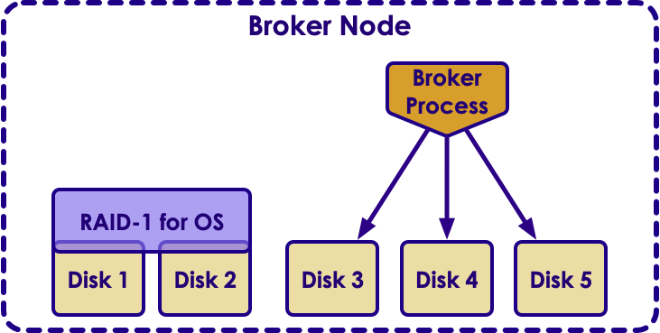
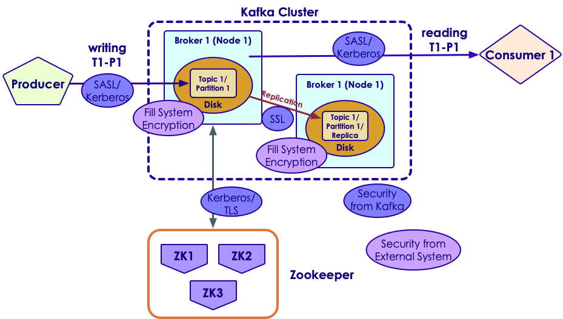

# Kafka Admin


---


## Lesson Objectives

 * Kafka Admin


Notes: 


---

# Installing Kafka

---


## Install Process


 * Prepare hardware

 * Prepare basic software stack (OS / JDK ..etc)
 
 * Install and configure zookeeper

 * Install Kafka on all machines

 * Configure each node / broker

 * Setup Kafka for auto-start on bootup

 * Setup monitoring

Notes: 


---

## Kafka Hardware Requirements


* Bare metal machines for high performance

* Virtual Machines (VM) are not recommended in production setup


 |        | CPU      | Memory       | Disk              | Network            |
 |--------|----------|--------------|-------------------|--------------------|
 | Modest | 8 cores  | 32 G         | 4 x SATA 7200 RPM | 2 x 1 Gig (bonded) |
 | High   | 24 cores | 64 G - 128 G | 8 x SATA 7200 RPM | 10 Gig             |
 
<!-- {"left" : 0.25, "top" : 2.81, "height" : 1.88, "width" : 9.75} -->


---

## Kafka Hardware - Memory

<!-- {"left" : 7.12, "top" : 1.08, "height" : 2.41, "width" : 2.97} -->

- Kafka uses very modest memory by careful heap management (~ 4-8 G per broker)

- The rest of the memory is for page cache
    - Linux would allocate free memory to page cache

- Page cache buffers disk writes / reads
    - This helps with IO throughput  (data seldom hits the disk between write and read)

- Good to have sufficient memory to buffer active reader/writers.  
    - 30 second buffer is a good place to start 
    - Quick calculation = Page cache size  = write_throughput x  30 seconds
    - if write throughput is 10MB sec, page cache is   
    = 10 MB/s x 30 secs   
    = 300 MB

Notes: 


---

## Kafka Hardware - CPUs

- Kafka has modest CPU requirements

- If using encryption, need significantly more CPU power

- More cores --> better 
    - Typical setup is 12 cores + 

- Cores matter more than raw clock speed (2GHz, 3GHz ..etc )
    - More cores will give much better scalability/performance than slightly faster CPU


|        | CPU      | Memory       | Disk              | Network            |
|--------|----------|--------------|-------------------|--------------------|
| Modest | 8 cores  | 32 G         | 4 x SATA 7200 RPM | 2 x 1 Gig (bonded) |
| High   | 24 cores | 64 G - 128 G | 8 x SATA 7200 RPM | 10 Gig      
---

## Kafka Hardware - Disks

<!-- {"left" : 5.41, "top" : 7.16, "height" : 1.61, "width" : 3.19} -->

 * More disks increase IO throughput
 * Don't share Kafka disks with OS disk (minimize contention)
 * Disks can be combined by RAID or used as individual volumes
 * RAID 
     - Better data spread across disks
     - battery backup a must!
     - Might slow down writes
 * Individual volumes (better for most scenarios)
     - Kafka will stripe data across disks
     - One partition MUST fit on ONE drive
 * **Avoid network attached storage (NAS)**  
   They are usually slower, exhibit high latencies, and single point of failure


Notes: 


---

## Zookeeper Hardware

<!-- {"left" : 7, "top" : 1.15, "height" : 1.03, "width" : 3.09} -->

 * ZK have very modest hardware requirements
 * Run ZK on separate machines
     - Just run ZK, nothing else
     - **Do not co-locate ZK and Kafka on same machines**  
       They have different IO access patterns
 * Run ZK in odd numbers 3,5,7... .
     - 3 is  minimum 
     - 5 can work with 2 ZK nodes down
 * One ZK ensemble per Kafka cluster per data center
     - To reduce latency

| ZK Hardware | CPU     | Memory | Disk        | Network            |
|-------------|---------|--------|-------------|--------------------|
|             | 4 cores | 32 G   | 1 -2 drives | 2 x 1 Gig (bonded) |

<!-- {"left" : 0.25, "top" : 7.44, "height" : 1.19, "width" : 9.75} -->

Notes: 


---

## Software Requirements


 * Linux OS 
     - Most used for deployment

 * Java 8
     - Dev kit required for for programming

 * Zookeeper
     - ZK 3.4.x is stable and well tested with Kafka

<!-- {"left" : 0.99, "top" : 4.91, "height" : 1.46, "width" : 2.94} --> &nbsp; &nbsp; <!-- {"left" : 4.08, "top" : 4.6, "height" : 2.08, "width" : 2.08} --> &nbsp; &nbsp; <!-- {"left" : 6.31, "top" : 5.04, "height" : 1.19, "width" : 3.57} -->


Notes: 


---

## Broker Configuration


```text
# config file : kafka/config/server.properties

# The id of the broker. This must be set to a unique integer for each broker.
broker.id=0

# A comma separated list of directories under which to store log files.  
# Kafka will balance data across multiple volumes
log.dirs=/data1/kafka,/data2/kafka

# port to listen, default 9042
port=9042

# Zookeeper connection string 
# This is a comma separated host:port pairs,
zookeeper.connect=zk_server1:2181,zk_server2:2181

# Create topics automatically when producer / consumer uses it?  (default true)
auto.create.topics.enable=true

```
<!-- {"left" : 0, "top" : 1.47, "height" : 3.68, "width" : 10.25} -->


Notes: 


---

## Topic Configuration


 * Specified when topic is created by 'kafka-topics.sh'.Can be altered later.

 * Num_partitions: (default 1)
     - Partitions will spread across brokers 
     - More partitions -> more scalability
     - Partition count can be increased later, but  can NOT be decreased!

 * Log.retention.ms: (default one week)
     - How long to keep a message

 * Log.retention.bytes
     - Set max size of messages per partition
     - If topic has 10 partitions and log retention size is set 1G, overall topic can have 10G total

Notes: 


---

## Topic Configuration


 * Message.max.bytes: (default 1MB)

     - How big an individual message can be

     - Compressed size

     - So a producer can send a larger message ( > 1 MB) provided it compresses below the 1MB limit

     - Kafka is not designed as large 'blob store'.. Hence the limit on messages

     - Increasing message size has implications

        * More network and disk activity

        * Consumers may fail to fetch messages (out of memory .etc)

Notes: 


---

# Securing Kafka

---


## Securing Kafka - Trusted Network


 * Usually Kafka clusters are hosted in private / trusted networks

     - Not exposed to the Internet

 * Both the cluster & clients are in trusted network

 * Openly accessible to all clients

<!-- {"left" : 1.68, "top" : 3.55, "height" : 3.96, "width" : 6.89} -->


Notes: 


---

## Quiz For The Class: Identify Points to Secure

<!-- {"left" : 0.52, "top" : 2.21, "height" : 5.23, "width" : 9.22} -->


Notes: 


---


## Securing Kafka

<!-- {"left" : 0.51, "top" : 2.2, "height" : 5.23, "width" : 9.23} -->


Notes: 


---

## Securing Kafka

<!-- {"left" : 5.22, "top" : 1.07, "height" : 2.79, "width" : 4.92} -->


 * Clients connect to Kafka brokers via  **Kerberos / TLS** 

 * Kafka broker nodes talk to each other using  **SSL** 

 * Kafka brokers talk to Zookeeper using  **TLS** 

 * Data on disk (data at rest) is not encrypted by Kafka ( **transparent encryption** )

     - Use file system / OS based encryption schemes


Notes: 


---

## Secure Broker Configuration


 * File: config/server.properties

```text
# enable secure ports
listeners=SSL://:9093,SASL_SSL://:9094

# to enable plain text communications
# listeners=PLAINTEXT://:9092,SSL://:9093,SASL_SSL://:9094

security.inter.broker.protocol=SSL

# further config required based on secure protocol (SSL/TLS)
# ... Skipped ...


```
<!-- {"left" : 0, "top" : 1.77, "height" : 2.77, "width" : 10.25} -->


Notes: 


---

## Access Control & Authorization


 * Kafka supports user based authentication

```text
# broker configuration
# these users can access every thing
super.users=User:bob;User:alice

```
<!-- {"left" : 0, "top" : 1.88, "height" : 1.07, "width" : 6.78} -->


```bash
# adding user as producer

kafka-acls -authorizer-properties
            zookeeper.connect=localhost:2181
            -add -allow-principal User:Bob
            -producer -topic test-topic

```
<!-- {"left" : 0, "top" : 3.3, "height" : 1.86, "width" : 8.11} -->


```bash
# adding user as consumer

kafka-acls -authorizer-properties
            zookeeper.connect=localhost:2181
            -add -allow-principal User:Bob
            -consumer -topic test-topic  -group Group1

```
<!-- {"left" : 0, "top" : 5.52, "height" : 1.86, "width" : 9.78} -->


Notes: 


---

## Client Configuration


```java
Properties props = new Properties();

props.setProperty(ConsumerConfig.BOOTSTRAP_SERVERS_CONFIG,
                  "localhost:9093");
props.setProperty(ConsumerConfig.GROUP_ID_CONFIG, 
                  "securing-kafka-group");

// define protocol and specific properties
props.setProperty(CommonClientConfigs.SECURITY_PROTOCOL_CONFIG,
                "SSL");
props.setProperty(SslConfigs.SSL_TRUSTSTORE_LOCATION_CONFIG,
            "/etc/security/tls/kafka.client.truststore.jks");
props.setProperty(SslConfigs.SSL_TRUSTSTORE_PASSWORD_CONFIG,
            "test1234");
props.setProperty(SslConfigs.SSL_KEYSTORE_PASSWORD_CONFIG,
            "/etc/security/tls/kafka.client.keystore.jks");
props.setProperty(SslConfigs.SSL_KEYSTORE_LOCATION_CONFIG,"test1234");
props.setProperty(SslConfigs.SSL_KEY_PASSWORD_CONFIG, "test1234");

new KafkaConsumer(props);

```
<!-- {"left" : 0, "top" : 1.39, "height" : 4.58, "width" : 10.25} -->

Notes: 


---

# Capacity Planning

---


## Kafka Capacity Planning


 * Prefer more medium size machines to  fewer larger machines.Kafka scales well horizontally

 * How much disk space do we need?Avg message size* throughput / sec *  retention period * replication

 * For example

     - Avg msg size = 5KB

     - Throughput = 1000 msgs / sec

     - Retention period = 7 days

     - Replication = 2

 * Storage needed = 5KB x 1000 x (7 * 3600 * 24) x 2= 6 TB

Notes: 


---

## Cluster Size


 * Producer benchmark:How fast you can send messages from Producer into Kafka cluster
     - Depends on compression / batch sizing / ack

 * Consumer benchmarkHow fast a message can be processed
     - Depends on application logic
     - Really need to measure it

 * How to calculate optimal number of partitions?
     - Let's say Producer throughput to a single partition as P
     - Say Consumer throughput from a single partition as C
     - Target throughput T
     - Required partitions = Max (T/P,  T/C)

Notes: 


---

## Partitions / Brokers


 * More partitions -> more time to recover in case of failure
     - Let's say we have 1000 partitions in a broker
     - When that broker fails, we need to find another 'leader / primary' broker for each partition
     - If it takes 10ms to elect a new primary broker for each partition
     - Total time to recovery = 10ms x 1000 = 10 secs
     - For this 10 seconds, these partitions are NOT available

 * Some recommendations:
     - 2000 - 4000 partitions / broker
     - 10k - 50k partitions / cluster

Notes: 

https://www.confluent.io/blog/how-to-choose-the-number-of-topicspartitions-in-a-kafka-cluster/


---

## Review and Q&A

<!-- {"left" : 8.56, "top" : 1.21, "height" : 1.15, "width" : 1.55} -->
<!-- {"left" : 6.53, "top" : 2.66, "height" : 2.52, "width" : 3.79} -->

* Let's go over what we have covered so far

* Any questions?
