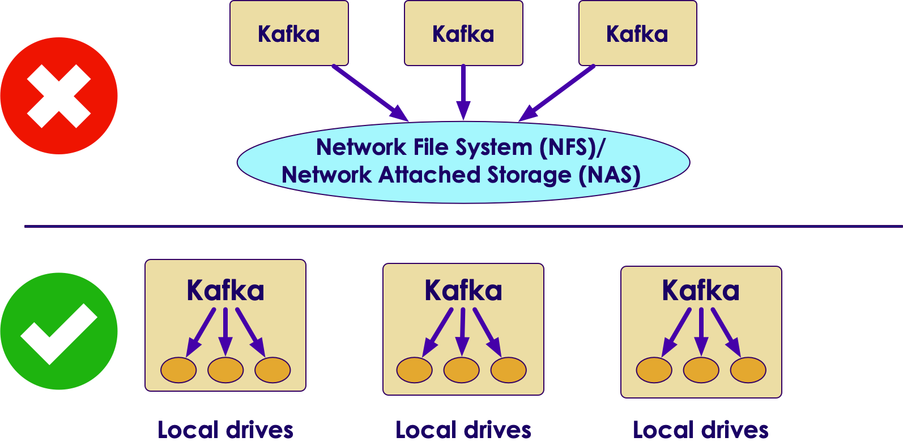
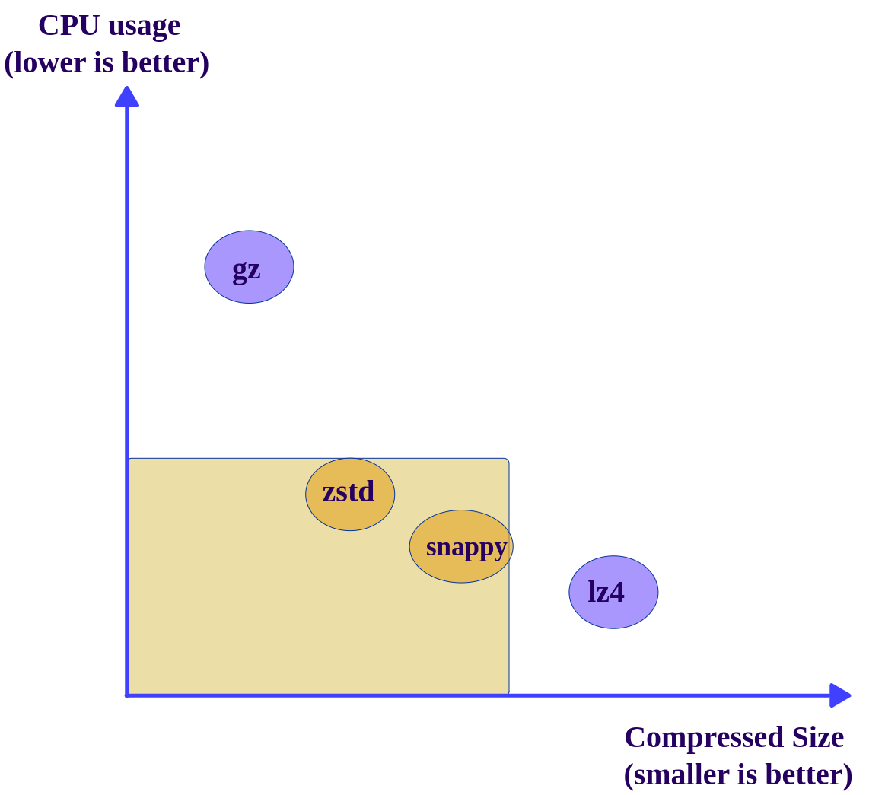
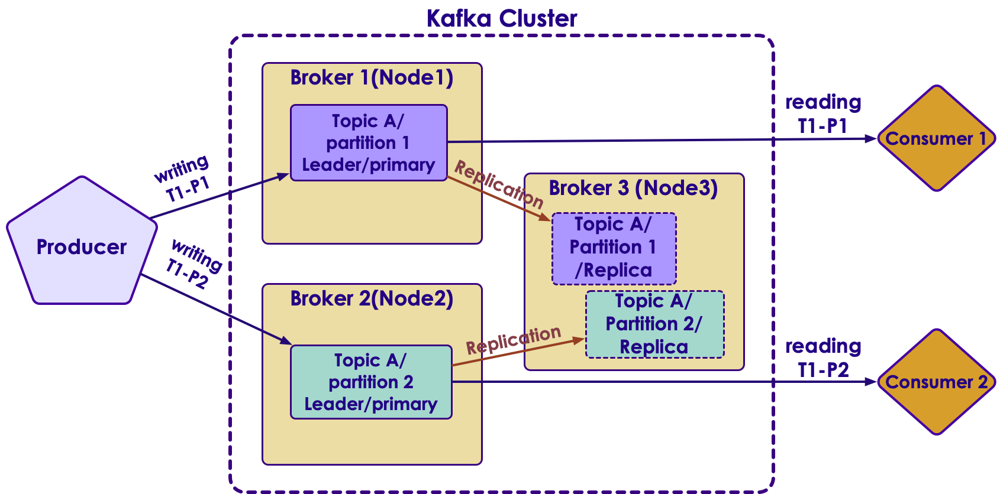

# Kafka Best Practices

---

## Lesson Objectives

* Learn to use Kafka effectively

Notes:

---

## Use Latest Java & Modern GC

* Use recommended Java / JDK version
    - Do not deviate from this, as you might encounter mysterious crashes ..etc
    - Kafka is a high performance system, it pushes JVM to its limits;  It might expose JVM bugs that a 'normal' program might not

* Use G1 garbage collector

* Jvm heap: 8G - 32 G

* [Reference](https://community.hortonworks.com/articles/80813/kafka-best-practices-1.html)

```bash
Conf/kafka-env.sh

export KAFKA_HEAP_OPTS="-Xmx16g -Xms16g"

export KAFKA_JVM_PERFORMANCE_OPTS=
"-XX:MetaspaceSize=96m -XX:+UseG1GC -XX:MaxGCPauseMillis=20 -XX:InitiatingHeapOccupancyPercent=35
-XX:G1HeapRegionSize=16M
-XX:MinMetaspaceFreeRatio=50
-XX:MaxMetaspaceFreeRatio=80"

```
<!-- {"left" : 0, "top" : 5.04, "height" : 2.04, "width" : 10.25} -->

Notes:

---

## OS Setting

<!-- {"left" : 5.61, "top" : 1.42, "height" : 3.72, "width" : 4.59} -->

* Give rest of the memory (minus JVM heap) to Page Cache (Linux will do this automatically)

    - So throughput is fastest

* Kafka keeps many files open

    - Set open file descriptors to 128k

    - Use `'ulimits -a'` to verify

Notes:

---

## Disk Setup

<!-- {"left" : 6.47, "top" : 1.21, "height" : 1.82, "width" : 3.61} -->

* Disks tend to be first bottleneck to be hit

* Never, never, never use shared drives (NFS / SAN)

* More disks -> better throughput

* RAIDs are usually more trouble than they are worth
    - Just use individual disks (JBOD - Just a Bunch of Disks)

* Kafka will stripe data across disks using a round-robin fashion

* Highly recommended to monitor disk usage
    - And create alerts if disks are getting full

Notes:

---

## Should We Use SSD Drives?

<!-- {"left" : 7.07, "top" : 1.13, "height" : 1.73, "width" : 3.06} -->

* SSDs don't offer remarkable boost in performance
* Kafka writes/reads data sequentially to/from commit logs
    - No random seeks
    - Modern spinning disks can provide very good scan performance
    - Also Linux and Linux file systems are optimized for good sequential IO
* In Kafka write to disks are asynchronous
    - No waiting for disk ops to complete
* Zookeeper can benefit from SSD drives
* Case study from Uber [link1](https://www.youtube.com/watch?v=q3e5QjTH59o),  [link2](http://bigdatausecases.info/entry/ssd-benchmarks-for-apache-kafka)

Notes:

https://blog.cloudera.com/blog/2015/07/deploying-apache-kafka-a-practical-faq/

---

## File System Settings

<!-- {"left" : 6.01, "top" : 1.16, "height" : 2.04, "width" : 4.07} -->

* Never, never, never use shared file systems (SAN / NFS)

* Always use MULTIPLE, LOCAL spindles

* Recommended file systems: EXT4  or XFS

* XFS probably better

* Formatting TB disk drives with XFS is significantly faster  

Notes:

---

## Zookeeper Best Practices

<!-- {"left" : 6.56, "top" : 1.06, "height" : 1.72, "width" : 3.57} -->

* **Do not co-locate**  Zookeeper and Kafka brokers on same nodes
* ZK and Kafka has very different IO patterns
    - Kafka is very disk IO heavy
    - ZK doesn't need a lot of horsepower, it needs to stay alive
* Dedicate one ZK ensemble to Kafka,  do not share this ZK with other applications (e.g. Hadoop)
    - Kafka uses ZK pretty heavily
    - Can benefit from a dedicated ZK cluster
* Make sure ZK has sufficient memory (4G+)
* Monitor memory usage of ZK using JMX or other monitoring programs

Notes:

---

## Topics & Partitions Settings

<!-- {"left" : 5.95, "top" : 1.16, "height" : 3.06, "width" : 4.16} -->

* Number of partitions correspond parallelism

* Higher the partitions -> more consumers can be added

* How to calculate optimal number of partitions?
    - Let's say Producer throughput to a single partition as P
    - Say Consumer throughput from a single partition as C
    - Target throughput T
    - Required partitions = Max (T/P,  T/C)

Notes:

---

## Topics / Partitions

<!-- {"left" : 5.95, "top" : 1.16, "height" : 3.06, "width" : 4.16} -->

* Ensure **`number of partitions >= number of brokers`**

* Partitions **can always be increased later but not decreased**

* Altering number of partitions in a KEY-VALUE topic is a little tricky?
    - Keys have to be re-hashed to partitions
    - **Class Discussion: Please discuss key mappings and partitions**

Notes:

---

## Partitions & Memory

* More partitions also need more memory on brokers & clients

* Producer side

    - New Kafka client buffers messages on producer side before sending to brokers (to reduce network round-trips)
    - The message buffer is maintained for partition
    - More partitions -> more buffer memory needed

* Consumer side

    - Consumers fetch messages in batches per partitions
    - More partitions -> more batches -> more memory needed

Notes:

---

## Compression

* Benefits of compression
  - Reduces network bandwidth usage
  - Reduces disk usage on Brokers

* Compression is performed on a batch
  - Larger batch size -> better compression

* Kafka API will automatically
  - Compress messages on producer side
  - De-compress messages on consumer side
  - Messages remain in compressed state in partitions

<!-- {"left" : 6.43, "top" : 1, "height" : 2.88, "width" : 3.61} -->

---

## Compression

<!-- {"left" : 1.08, "top" : 1.61, "height" : 6.42, "width" : 8.09} -->

* Supported compression codecs
  - Gzip, Snappy, LZ4, Zstd

* **Snappy** (from Google) is a pretty good light weight compressor;  Easy on GPU and produces medium level compresison

* Current favorite is **Zstd** (Facebook) - Good speed and produces compact size

* Configured via Producer properties:
  - `compression.type`

* [Reference](https://cwiki.apache.org/confluence/display/KAFKA/KIP-110%3A+Add+Codec+for+ZStandard+Compression)

---

## Compression Data Formats

* **XML and JSON data formats are very good candidates for compression**.  Since they have lot of repeating elements, they compress well.
* JSON data

```json
{"id" : 1, "first_name" : "John", "last_name" : "Smith", "age" : 34, "email" : "john@me.com"}
```

* XML data

```xml
<CATALOG>
    <CD>
        <TITLE>Empire Burlesque</TITLE>
        <ARTIST>Bob Dylan</ARTIST>
        <YEAR>1985</YEAR>
    </CD>
</CATALOG>
```

* Also **server logs** are good candidates, as they have well defined structure

```text
1.1.1.1 - [2020-09-01::19:12:06 +0000] "GET /index.html HTTP/1.1" 200  532"
2.2.2.2 - [2020-09-01::19:12:46 +0000] "GET /contact.html HTTP/1.1" 200  702"
```

* **Binary data formats won't compress well**. E.g. images, base64 encoded strings.  Don't enable compression.
* Reference: [Message compression in Apache Kafka](https://developer.ibm.com/articles/benefits-compression-kafka-messaging/)

---

## Compression

* **Compression will slightly increase CPU usage**
    - How ever, this is well worth the trade-off, as CPUs are very fast and we usually have plenty of CPU power to spare.
    - Plus modern CPUs have compression algorithms built-in silicone

* Here are some benchmark stats from [Message compression in Apache Kafka](https://developer.ibm.com/articles/benefits-compression-kafka-messaging/)

* We can see Snappy (from Google) and zstd (from Facebook) giving a good balance of CPU usage, compression ratio, speed and network utilization

<br />

| Metrics                     | Uncompressed | Gzip  | Snappy | lz4  | Zstd |
|-----------------------------|--------------|-------|--------|------|------|
| Avg latency (ms)            | 65           | 10.4  | 10.1   | 9.2  | 10.7 |
| Disk space (mb)             | 10           | 0.92  | 2.2    | 2.8  | 1.5  |
| Effective compression ratio | 1            | 0.09  | 0.21   | 0.28 | 0.15 |
| Process CPU usage %         | 2.35         | 11.46 | 7.25   | 5.89 | 8.93 |

---

## Use Batching

<!-- {"left" : 6.43, "top" : 1, "height" : 2.88, "width" : 3.61} -->

* Batching will dramatically increase throughput, specially in producers

* Batching will increase latency

    - Producer will accumulate messages until desired batch size is attained, before sending it to broker

* Too small a batch size may not be effective

* Choose the batch size that gives best **latency vs. throughput** for your application

* Larger batch sizes will use more memory for buffering

Notes:

---

## Message Sizing Guidelines

<!-- {"left" : 5.4, "top" : 1.19, "height" : 1.78, "width" : 4.78} -->

* Kafka is engineered for moving small messages

    - Few KB / message

* Max message size by default is 1 MB

* If sending large messages set the following properties:

    - **messages.max.bytes**  (on broker)

    - **fetch.message.max.bytes**  (on consumer)

* [Reference](https://blog.cloudera.com/blog/2015/07/deploying-apache-kafka-a-practical-faq/)

Notes:

---

## Monitor, Monitor, Monitor

<!-- {"left" : 5.73, "top" : 1.03, "height" : 2.71, "width" : 4.3} -->

* Kafka exposes lot of metrics
    - Collect them via JMX plugin
    - Or use any of the open source collectors

* Send metrics to a collector (graphite, open TSDB ..etc.)

* Use a nice graphic tool to slice & dice metrics (Grafana)

* References:
    - [Datadog](https://www.datadoghq.com/dashboards/kafka-dashboard/)
    - [Monitoring Kafka @ SingalFX](https://www.signalfx.com/blog/how-we-monitor-and-run-kafka-at-scale/)

---

## Monitoring Kafka

* Jump off point: Please review **Kafka-Monitoring** module

---

## Recommendations from Netflix

<!-- {"left" : 7.53, "top" : 1.29, "height" : 1.12, "width" : 2.42} -->

* Prefer multiple modest sized Kafka clusters rather than one giant Kafka cluster.   This will simplify operations

* Number of partitions per cluster around 10,000.This improves availability and latency

* Use dedicated Zookeeper cluster for each Kafka cluster

* [Reference](https://medium.com/netflix-techblog/kafka-inside-keystone-pipeline-dd5aeabaf6bb)

Notes:

---

# Troubleshooting Kafka

---

## Kafka Troubleshooting

* We are going to do these as a class / group exercise!

* Show a problem

* Class to suggest solution

Notes:

---

## Issue

* Consumer errors with Out of Memory error

* (answer next slide)

Notes:

---

## Possible Solutions

* Too many partitions

    - More partitions consume more memory

* Messages are large

    - Increase Java Heap size

Notes:

---

## Issue

* Consumer seems to stuck on one offset, can not go beyond that message.

* Gets InvalidMessageSizeException

* (answer next slide)

Notes:

---

## Possible Solutions

* Message size is too large

* Double check **messages.max.bytes** (on broker)

* And match **fetch.message.max.bytes** (on consumer)

Notes:

---

## Issue

* Some consumers are not receiving any messages

* (answer next slide)

Notes:

---

## Possible Solutions

<!-- {"left" : 6.04, "top" : 1.12, "height" : 3.6, "width" : 4.08} -->

* Probably have more consumers than number of partitions

* Solutions:

    - Match  # consumers = # partitions  in a consumer group

    - Increase number of partitions

    - Decrease number of consumers

Notes:

---

## Issue

* Producer is getting QueueFullException

* (answer next slide)

Notes:

---

## Possible Solutions

* **Reason**

   - Producer is sending events faster than Kafka brokers can handle

* Fixes:

    - Slow down producer sending

       - Switch `ack` setting to 1 or `all` to Producer will wait for acknowledgement from Broker

* Expand Kafka capacity

     - Add more partitions if possible

     - Add more broker nodes to handle the load

Notes:

---

## Issue

* Number of Under Replicated partitions are going up

* (answer next slide)

Notes:

---

## Possible Solutions

<!-- {"left" : 6.28, "top" : 1.07, "height" : 1.91, "width" : 3.85} -->

* **Reason**
    - Creating replicas is lagging behind
    - IO throughput between brokers is not keeping up with incoming data

* This is  **serious issue** , as it will
    - backup write pipeline
    - Increase probability of loosing data
    - And slow down consumers! (why ?)

* **Fixes:**
    - Inspect disk bottleneck on replica machines
    - Are the disks slow / full?
    - Is the NIC saturated?

Notes:

---

## Review and Q&A

<!-- {"left" : 8.24, "top" : 1.21, "height" : 1.28, "width" : 1.73} -->

- Let's go over what we have covered so far

- Any questions?

<!-- {"left" : 2.69, "top" : 3.91, "height" : 3.24, "width" : 4.86} -->
