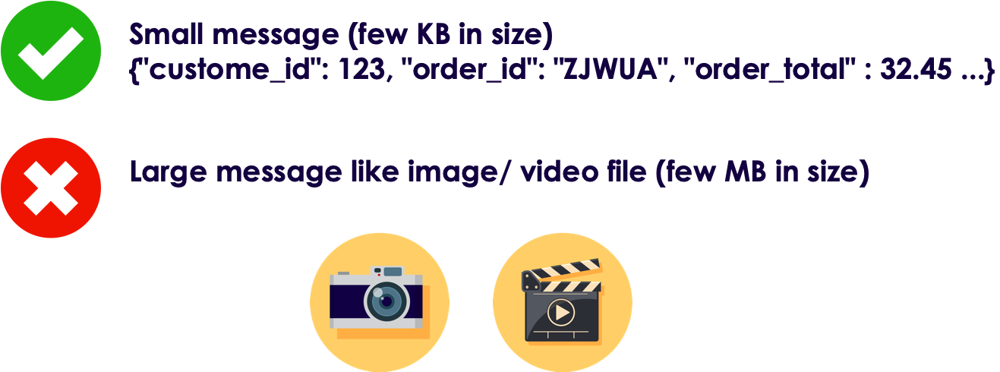
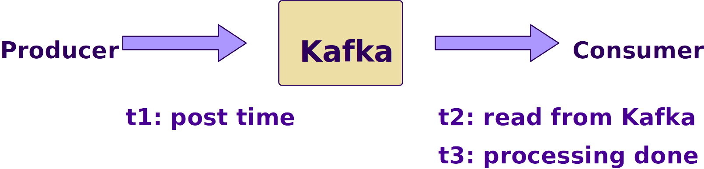

# Kafka Best Practices


---


## Lesson Objectives


 * Learn to use Kafka effectively


Notes:

---


## Best Practices: Use latest Java & Modern GC
 * Use recommended Java / JDK version
    - Do not deviate from this, as you might encounter mysterious crashes ..etc
    - Kafka is a high performance system, it pushes JVM to its limits;  It might expose JVM bugs that a 'normal' program might not
 * Use G1 garbage collector
 * Jvm heap: 8G - 32 G
 * [Reference](https://community.hortonworks.com/articles/80813/kafka-best-practices-1.html)

```bash
Conf/kafka-env.sh

export KAFKA_HEAP_OPTS="-Xmx16g -Xms16g"

export KAFKA_JVM_PERFORMANCE_OPTS=
"-XX:MetaspaceSize=96m -XX:+UseG1GC -XX:MaxGCPauseMillis=20 -XX:InitiatingHeapOccupancyPercent=35
-XX:G1HeapRegionSize=16M
-XX:MinMetaspaceFreeRatio=50
-XX:MaxMetaspaceFreeRatio=80"

```
<!-- {"left" : 0, "top" : 3.4, "height" : 2.04, "width" : 10.25} -->


Notes:

---

## Best Practices: OS Setting

<!-- {"left" : 5.26, "top" : 3.61, "height" : 3.98, "width" : 4.91} -->


 * Give rest of the memory (minus JVM heap) to Page Cache (Linux will do this automatically)

     - So throughput is fastest

 * Kafka keeps many files open

     - Set open file descriptors to 128k

     - Use `'ulimits -a'` to verify


Notes:

---

## Best Practices: Disks

<!-- {"left" : 6.07, "top" : 2.3, "height" : 2.01, "width" : 3.98} -->

 * Disks tend to be first bottleneck to be hit

 * Never, never, never use shared drives (NFS / SAN)

 * More disks -> better throughput

 * RAIDs are usually more trouble than they are worth

     - Just use individual disks (JBOD - Just a Bunch of Disks)

 * Kafka will stripe data across disks using a round-robin fashion

 * Highly recommended to monitor disk usage

     - And create alerts if disks are getting full


Notes:

---

## Best Practices: SSD Drives?
<!-- TODO shiva -->


 * SSDs don't offer remarkable boost in performance
 * Kafka writes/reads data sequentially to/from commit logs
     - No random seeks
     - Modern spinning disks can provide very good scan performance
     - Also Linux and Linux file systems are optimized for good sequential IO
 * In Kafka write to disks are asynchronous
     - No waiting for disk ops to complete
 * Zookeeper can benefit from SSD drives
 * Case study from Uber [link1](https://www.youtube.com/watch?v=q3e5QjTH59o),  [link2](http://bigdatausecases.info/entry/ssd-benchmarks-for-apache-kafka)

Notes:

https://blog.cloudera.com/blog/2015/07/deploying-apache-kafka-a-practical-faq/


---

## Best Practices: File System


 * Never, never, never use shared file systems (SAN / NFS)

 * Always use MULTIPLE, LOCAL spindles

 * Recommended file systems: EXT4  or XFS

 * XFS probably better

 * Formatting TB disk drives with XFS is significantly faster  

Notes:


---

## Best Practices: Zookeeper

<!-- TODO shiva -->


 *  **Do not co-locate**  Zookeeper and Kafka brokers on same nodes
 * ZK and Kafka has very different IO patterns
     - Kafka is very disk IO heavy
     - ZK doesn't need a lot of horsepower, it needs to stay alive
 * Dedicate one ZK ensemble to Kafka,  do not share this ZK with other applications (e.g. Hadoop)
     - Kafka uses ZK pretty heavily
     - Can benefit from a dedicated ZK cluster
 * Make sure ZK has sufficient memory (4G+)
 * Monitor memory usage of ZK using JMX or other monitoring programs

Notes:

---

## Best Practices: Topics / Partitions

<!-- TODO shiva -->


 * Number of partitions correspond parallelism
 * Higher the partitions -> more consumers can be added
 * How to calculate optimal number of partitions?
     - Let's say Producer throughput to a single partition as P
     - Say Consumer throughput from a single partition as C
     - Target throughput T
     - Required partitions = Max (T/P,  T/C)
 * Ensure number of partitions >= number of brokers
     -  **Quiz**: Why?
 * Partitions can always be increased later but not decreased
 * Altering number of partitions in a KEY-VALUE topic is a little tricky?
     - Keys have to be re-hashed to partitions

Notes:


---

## Best Practices: Partitions & Memory


 * More partitions also need more memory on brokers & clients

 * Producer side

    - New Kafka client buffers messages on producer side before sending to brokers (to reduce network round-trips)
    - The message buffer is maintained for partition
    - More partitions -> more buffer memory needed

 * Consumer side

    - Consumers fetch messages in batches per partitions
    - More partitions -> more batches -> more memory needed

Notes:


---

## Best Practices: Compression

<!-- TODO shiva -->


 * Enabling compression

     - Reduces the data size goes on network --> faster throughput
     - Reduces data footprint on disk --> less data to write to disk -> faster

 * Compression is performed on a batch

     - Larger batch size -> better compression

 * Compression uses CPU

     - More threads can speed up throughput with compression

 * Compression types: none, gzip, snappy, or lz4

     - See comparisons in next slides

Notes:


---

## Compression Comparisons


<!-- {"left" : 1.08, "top" : 1.61, "height" : 6.42, "width" : 8.09} -->


Notes:


---

## Best Practices: Use Batching

<!-- TODO shiva -->


 * Batching will dramatically increase throughput, specially in producers

 * Batching will increase latency

     - Producer will accumulate messages until desired batch size is attained, before sending it to broker

 * Too small a batch size may not be effective

 * Choose the batch size that gives best   **latency vs. throughput** for your application

 * Larger batch sizes will use more memory for buffering

Notes:


---

## Best Practices: Message Sizing

<!-- TODO shiva -->


 * Kafka is engineered for moving small messages

     - Few KB / message

 * Max message size by default is 1 MB

 * If sending large messages set the following properties:

     -  **messages.max.bytes**  (on broker)

     -  **fetch.message.max.bytes**  (on consumer)
     
 * [Reference](https://blog.cloudera.com/blog/2015/07/deploying-apache-kafka-a-practical-faq/)


Notes:


---

## Best Practices: Monitor, Monitor, Monitor

<!-- TODO shiva -->


 * Kafka exposes lot of metrics
     - Collect them via JMX plugin
     - Or use any of the open source collectors
 * Send metrics to a collector (graphite, open TSDB ..etc.)
 * Use a nice graphic tool to slice & dice metrics (Grafana)
 * References 
   - [Datadog](https://www.datadoghq.com/dashboards/kafka-dashboard/)
   - [Monitoring Kafka @ SingalFX](https://www.signalfx.com/blog/how-we-monitor-and-run-kafka-at-scale/)
   
---

## Kafka Monitoring Vital Stats 

- Log flush latency (95th percentile)
- Under Replicated Partitions
- Messages in / sec per broker and per topic
- Bytes in / sec per broker
- Bytes in / sec per topicBytes / message
- End-to-End time for a message

Notes:


---

## Best Practices: Monitor, Monitor, Monitor


 *  **Log flush latency**

     - How long does it take to flush to disk

     - Longer it takes, longer the write pipeline backs up!

 *  **Under Replicated Partitions**

     - Replication is lagging behind

     - Messages are being written at very high speed

     - Consumers won't get data that isn't replicated

        * Consumers lag behind as well

     - Chance of data loss is high, when the lead broker fails

---

## Kafka Monitoring : End to End Lag

 *  **End-to-End time**
    - How long does it take for a message to arrive from Producer to Consumer
    - Indicates overall speed / latency of kafka pipeline
 * Below, is an example (see next slide for graph)
   - (t2 - t1) :  how long message was waiting in Kafka queue
   - (t3 - t2) : consumer side processing time
   - (t3 - t1) : overall processing

<!-- TODO shiva -->


Notes:

https://www.confluent.io/blog/how-we-monitor-and-run-kafka-at-scale-signalfx/


---

## Best Practices: End to End Latency

<!-- TODO shiva -->


---

## Kafka Monitoring Consumer Lag

<!-- TODO shiva -->


 * Consumer Lag = Size of Partition (last offset) - Consumer offset (last committed)
 * Large offsets means consumers can't  keep up with data
 * **Question for class** : What can cause consumer lag?
 * Tools to monitor consumer lag:
    - JMX stats 
    - [Burrow](https://github.com/linkedin/Burrow)
    - Confluent dashboard
    - Datadog 

Notes:


---

## Best Practices: Recommendations from Netflix


 * Prefer multiple modest sized Kafka clusters rather than one giant Kafka cluster.   This will simplify operations

 * Number of partitions per cluster around 10,000.This improves availability and latency

 * Use dedicated Zookeeper cluster for each Kafka cluster
 
 * [Reference](https://medium.com/netflix-techblog/kafka-inside-keystone-pipeline-dd5aeabaf6bb)

Notes:


---

## Review and Q&A

<!-- {"left" : 8.24, "top" : 1.21, "height" : 1.28, "width" : 1.73} -->


- Let's go over what we have covered so far

- Any questions?

<!-- {"left" : 2.69, "top" : 4.43, "height" : 3.24, "width" : 4.86} -->


