# Kafka Case Studies

---

## Kafka Case Studies

 * We will be discussing some published use cases

 * Do check the links provided

Notes:

---

# Kafka @ Zendesk

<!-- TODO shiva -->

---

## Zendesk : Event Notifications

<!-- TODO shiva -->

 * [Reference](http://bigdatausecases.info/entry/kafka-used-at-scale-to-deliver-real-time-notifications),  [slides](https://www.slideshare.net/SrgioNunes/kafka-used-at-scale-to-deliver-realtime-notifications)
 
 * Listen to database events that can turn into notifications

 * Highlights / Discuss (See next slides for screenshots)

     - Click on ' **slides** '

     - Slide #6 - architecture diagram

     - Slide #7: Partition keys

     - Slide #10: stats
     

Notes:

---

## Zendesk : Architecture

<!-- TODO shiva -->
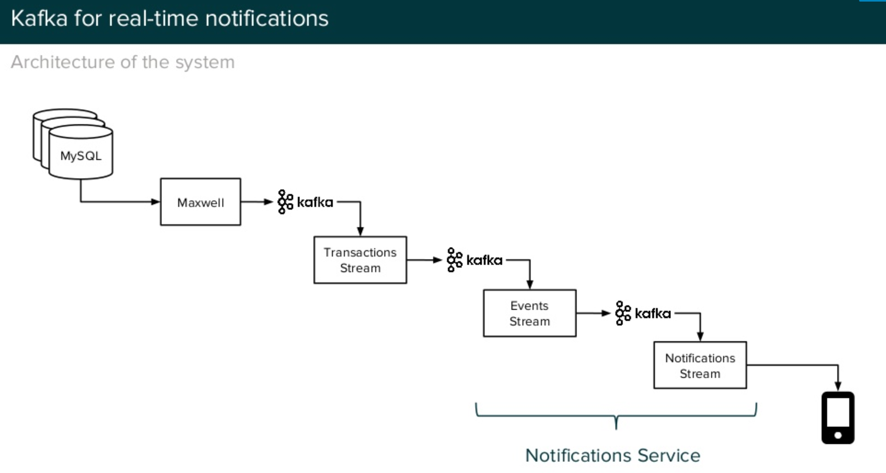

---

## Zendesk : Partition Keys

<!-- TODO shiva -->
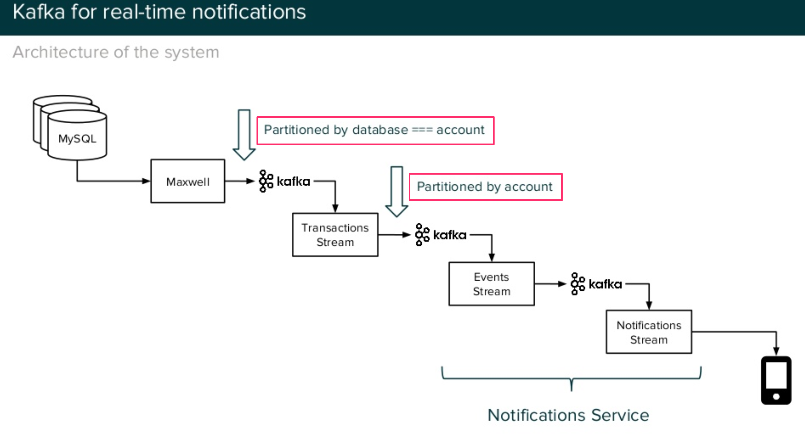

---

## Zendesk : Stats

<!-- TODO shiva -->
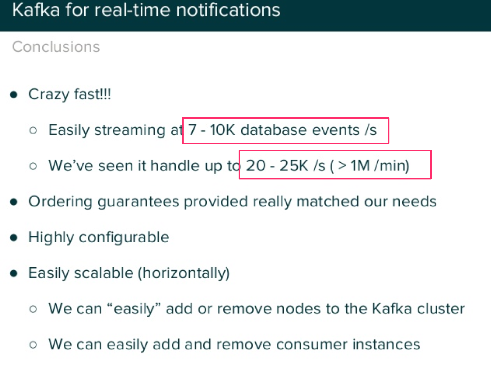

---

# Kafka @ WalmartLabs

<!-- TODO shiva -->

---

## Kafka @ WalmartLabs

<!-- TODO shiva -->

 * [Reference](http://bigdatausecases.info/entry/apache-kafka-use-cases-within-search-system-atwalmartlabs),  [slides](https://www.slideshare.net/snehal_nagmote/apache-kafka-women-who-code-meetup)

 * Highlights / Discuss (See next slides for screenshots)

     - Slide #44:

     - Slide #46: use cases

     - Slide #47: stats

     - Slide #48: architecture

     - Slide #50: architecture

Notes:

---

## Kafka @ WalmartLabs : Technologies 

<!-- TODO shiva -->
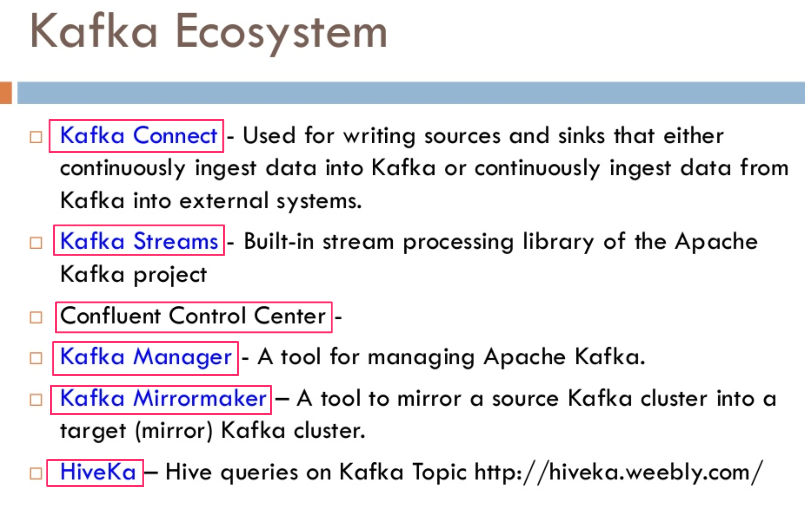

---

## Kafka @ WalmartLabs : Usecases

<!-- TODO shiva -->
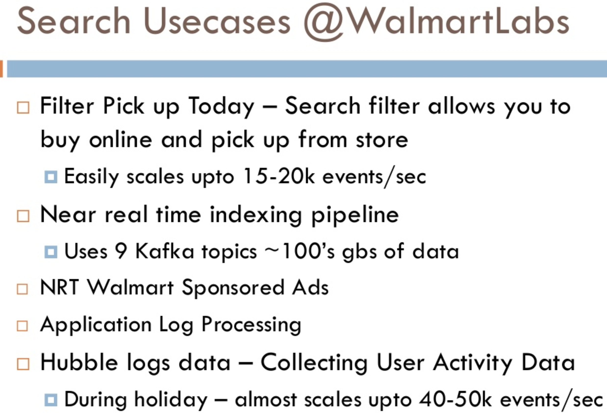

---

## Kafka @ WalmartLabs : Volume

<!-- TODO shiva -->
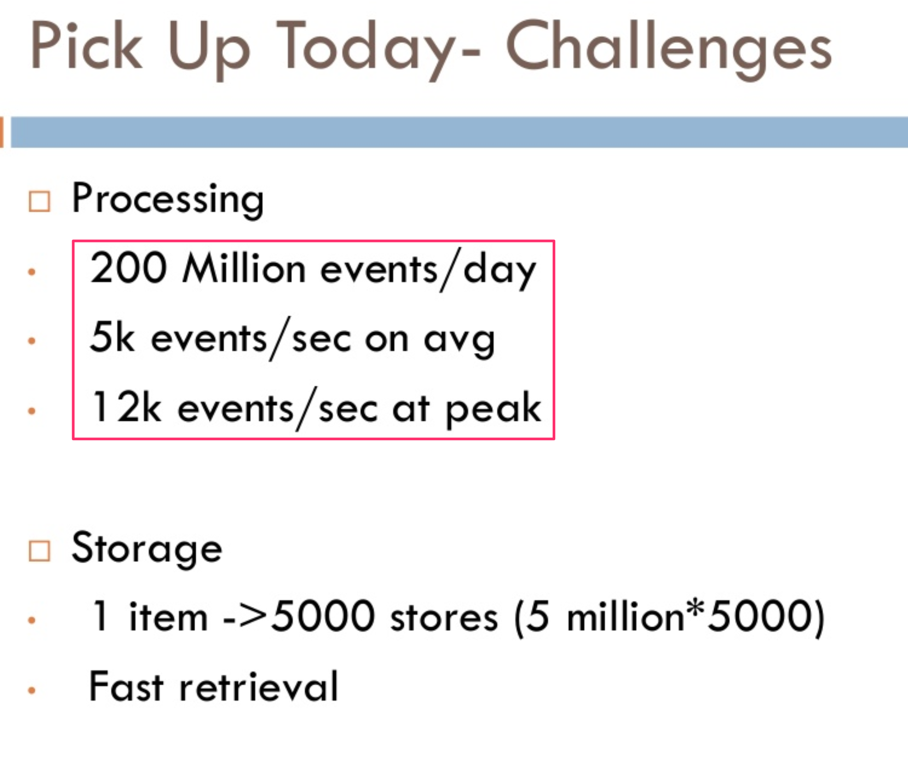

---

## Kafka @ WalmartLabs : Architecture

<!-- TODO shiva -->
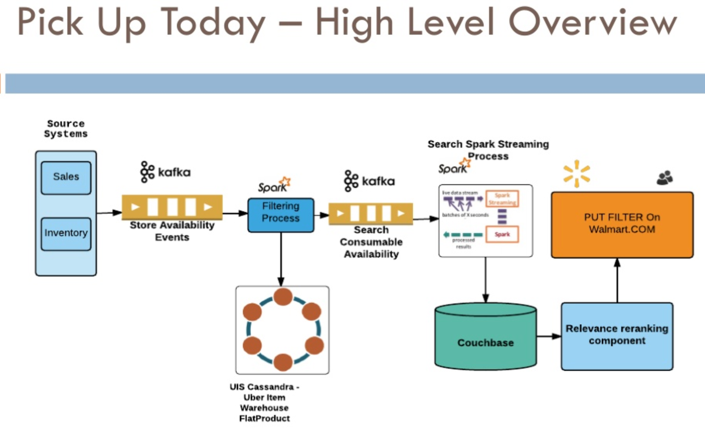

---

# Kafka @ Netflix

<!-- TODO shiva -->

---

## Netflix

<!-- TODO shiva -->

 * [Reference](http://bigdatausecases.info/entry/from-three-nines-to-five-nines-a-kafka-journey),   [slides](https://www.slideshare.net/Naveen1914/net-flix-kafka-seattle-meetup)

 * Highlight / Discuss (see next slides for screenshots)

     - Slide # 1 - #3: data sizes

     - Slide #5: architecture

     - Slide #9: configuration

     - Slide #10: data loss

     - Slide #20: production tips

Notes:

---

## Kafka @ Netflix : Data Volume 

<!-- TODO shiva -->
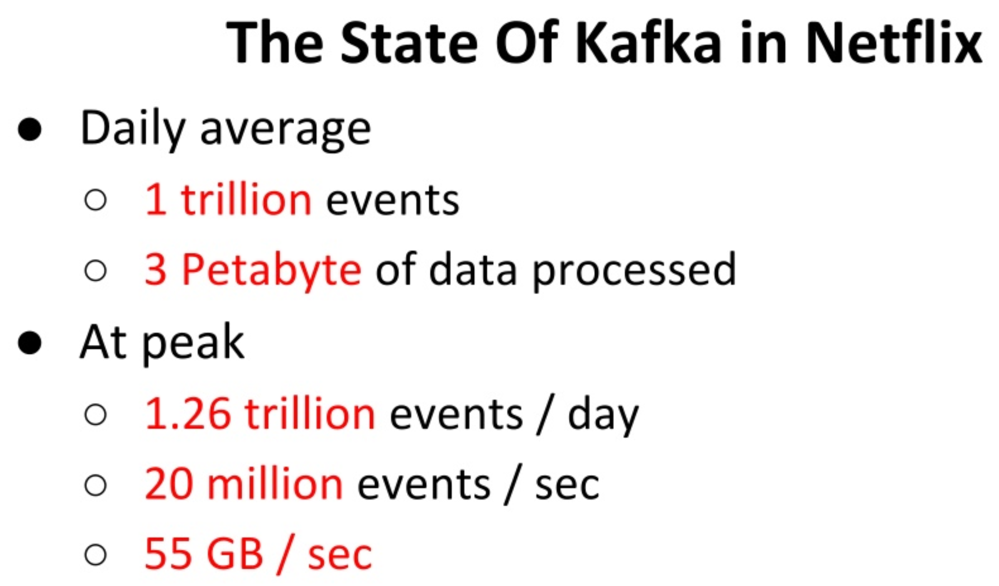

---
## Kafka @ Netflix : Architecture

<!-- TODO shiva -->
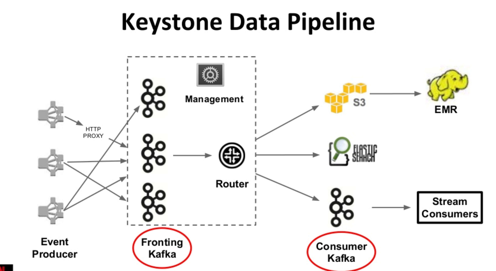

---
## Kafka @ Netflix : Configurations

<!-- TODO shiva -->
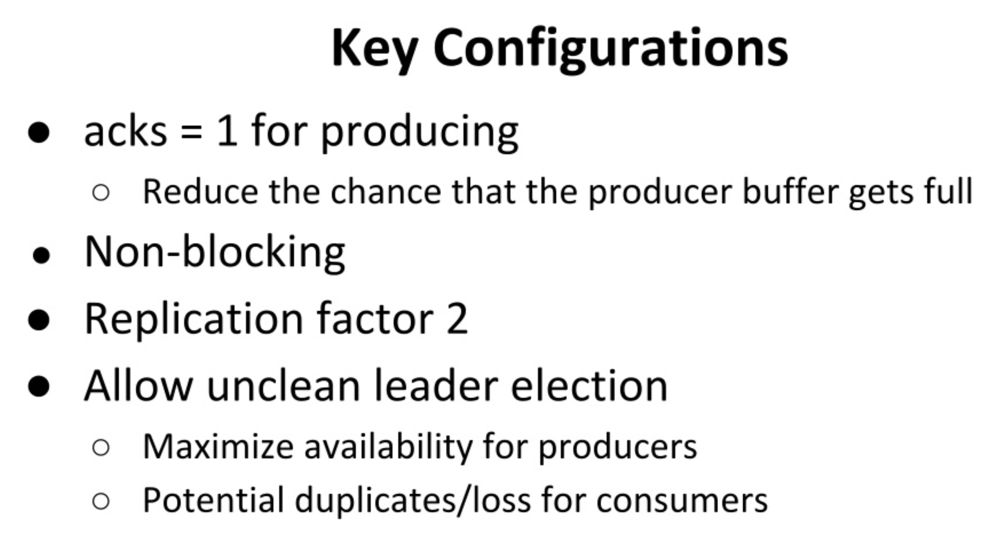

---
## Kafka @ Netflix : Best Practices

<!-- TODO shiva -->
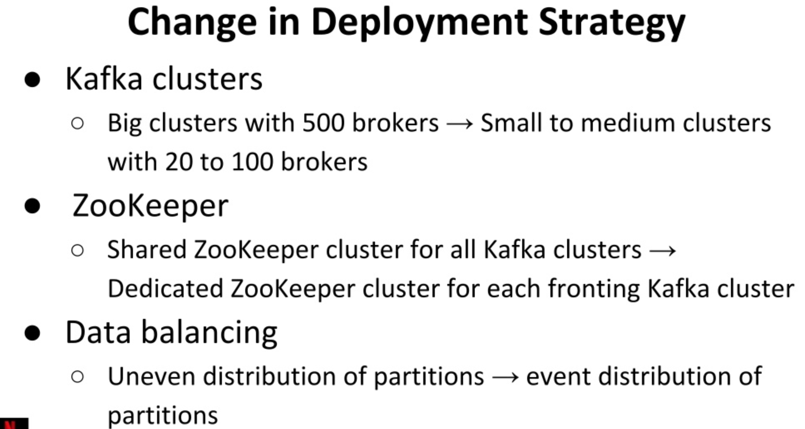

---

# Kafka @ Grid Dynamics

<!-- TODO shiva -->

---

## Kafka @ Grid Dynamics

<!-- TODO shiva -->

 * [Reference](https://blog.griddynamics.com/in-stream-processing-service-blueprint)

 * Components

     - Kafka

     - Spark

     - Cassandra

     - ZooKeeper

     - Redis

     - HDFS

 * Highlight (next slides have screenshots)

     - Architecture 

Notes:

---

## Kafka @ Grid Dynamics : Architecture

<!-- TODO shiva -->
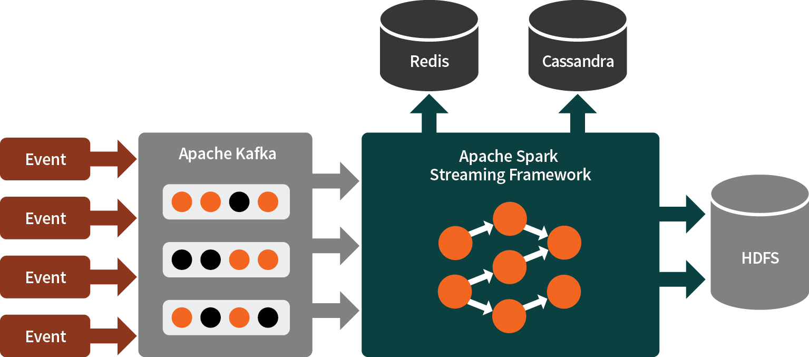

---
## Kafka @ Grid Dynamics : Architecture

<!-- TODO shiva -->
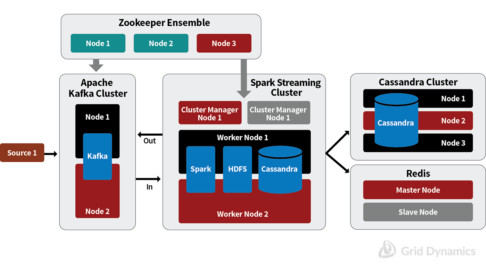

---

# Streaming Data from SQL Databases

---

## Data Sources

* Data sources are SQL databases, such as Oracle and SQLServer
* JDBC connector for Kafka Connect
* Pick up data generated by every update and insert into the DB
* Create an application

---

## Use of KSQL with Data from Databases
* Use of KSQL for Quality Assurance
  - Verify that the has the right data and right attributes
  - KStreams vs KSQL vs ksqlDB
  
---

## Use of Kafka Connect
* Kafka Connect components
* Confluent connectors
* Best practices and performance

---

## Other References 

- [Kafka Design Patterns with Gwen Shapira](https://softwareengineeringdaily.com/2018/02/20/kafka-design-patterns-with-gwen-shapira/)

---

## Review and Q&A

<!-- {"left" : 8.24, "top" : 1.21, "height" : 1.28, "width" : 1.73} -->

- Let's go over what we have covered so far

- Any questions?

<!-- {"left" : 2.69, "top" : 4.43, "height" : 3.24, "width" : 4.86} -->

