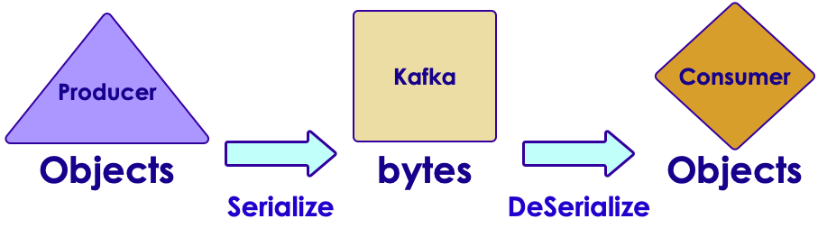

# Confluent Platform


---


## Confluent Platform


 * Single Download includes

     - Apache Kafka

     - Community features – free 

        * KSQL

        * Connectors (many types of databases)

        * Schema Registry

     - Commercial features – 30 day trial (Beware!)

        * Control Center

        * Replicator

Notes: 


---

## Lab 8.1: Setup Confluent


 *  **Overview**: Download, install and start Confluent

 *  **Builds on previous labs**: None

 *  **Approximate Time**: 30 – 40 mins

 *  **Instructions**: 

     - Please follow: lab 8.1

 *  **To Instructor**: 


Notes: 


---

# Schemas in Kafka

---


## Deserializers


 * Producers serialize Objects into bytes

     - serializers

 * Consumers read bytes from Kafka and convert them back to Objects



Notes: 


---

## Standard Kafka SerDe


 * Kafka comes with Serializers /<br/> Deserializers for standard Java types

 * Can be found in package<br/>**org.apache.kafka.common.serialization** 

 * We need to provide SerDe<br/>classes for custom types

 * Can use Avro  


Notes: 


---

## Schema Evolution


 * Initial Message Format

| Id    	| Type  	| Success 	|
|-------	|-------	|---------	|
| 12345 	| Click 	| YES     	|


 * Version 2

| Id    	| Type  	| Success 	| Message        	|
|-------	|-------	|---------	|----------------	|
| 12345 	| Click 	| YES     	| Page not found 	|

 * Q: How will the consumer process this?

Notes: 


---

## Apache Avro


 * Data serialization format

 * Created for Hadoop project

 * Language neutral

 * Schema is described in JSON format

 * Data is stored in binary format

 *  **_Supports schema evolutions_** 

 * Use KafkaAvroSerializer

Notes: 


---

## Avro Schema


```text
// version 1
{"namespace": "com.example.videos",
  "type": "record",
  "name": "Event",
  "fields": [
     {"name": "id", "type": "int"},
     {"name": "type",  "type": "string"},
     {"name": "success",  "type": "string"}
]
}
```

```text
// version 2
{"namespace": "com.example.videos",
  "type": "record",
  "name": "Event",
  "fields": [
     {"name": "id", "type": "int"},
     {"name": "type",  "type": "string"},
     {"name": "success", "type": "string"},
     {"name": "message", "type": "string"}  // <- new attribute
  ]}
```


Notes: 


---

## Schema Registry


Notes: 


---

## Confluent Schema Registry


 * Manages schemas and versions

 * Provides REST API for interactions

 * Works with Kafka seamlessly

 * Open-source, downloadable as part of Confluent distribution

 * (https://docs.confluent.io/current/schema-registry/docs/index.html)

Notes: 


---

## Schema Registry Basics


 * Schema

     - Structure of an Avro data format

 * Subject

     - Scope of the schema. Subject name is derived from topic name by default

     - Schemas can be registered under multiple subjects

        * Automated transparently from Producer as well

 * Register a new schema:

     - `curl -X POST -H "Content-Type: application/vnd.schemaregistry.v1+json" / --data '{"schema": "{/"type/": /"string/"}"}' / http://localhost:8081/subjects/Kafka-value/versions {"id":1} `

Notes: 

Schemas can be registered for the Key as well.   .... /subjects/Kafka-key/versions


---

## Schema Registry Examples


 * List all schemas under a subject

     -  `curl -X GET http://localhost:8081/subjects/Kafka-value/versions 
        [1] `


 * Fetch version 1 of the schema

     -  `curl -X GET http://localhost:8081/subjects/Kafka-value/versions/1 
{"subject":"Kafka-value", "version":1,"id":1,"schema":"\"string\""}`


 * Register the same schema under a different subject

     -  `curl -X POST -H "Content-Type: application/vnd.schemaregistry.v1+json" \ --data '{\"schema\": "{\"type\": \"string\"}"}' http://localhost:8081/subjects/Kafka2-value/versions 
{"id":1} `


Notes: 


---

## Lab 8.2: AVRO Schema Lab


 *  **Overview**: Create a schema for clickstream data

 *  **Builds on previous labs**: Lab 4

 *  **Approximate Time**: 30 – 40 mins

 *  **Instructions**: 

     - Please follow: lab 8.2

 *  **To Instructor**: 


Notes: 


---

# KSQL

---


## Intro to KSQL


 * Streaming SQL Engine 

     - Part of Confluent Community Components

 * Supports all stream processing operations similar to Kafka Streams

     - Filter, map, join, aggregation, windowing

 * Fault-tolerant, scalable, real-time

 * CLI to enable interactive development

Notes: 


---

## KSQL Architecture


Notes: 


---

## KSQL Components


 * KSQL Server

     - Runs the Engine that executes KSQL queries

     - Runs in separate JVM from Kafka broker 

        * Can also run on separate servers

 * KSQL CLI

     - Run SQL queries interactively using CLI

     - Or through REST API (language neutral)

 * KSQL UI

     - Available via Confluent Control Center

Notes: 


---

## KSQL and Kafka Streams


Notes: 


---

## KSQL vs Kafka Streams


 * Q: What does the developer write when using KSQL vs Kafka Streams? 

     - SQL queries

     - Java application for Kafka Streams

 * Q: How does the streaming app run with KSQL vs Kafka Streams?

     - On the KSQL Server

     - As a standalone JVM

Notes: 


---

# KSQL

---


## Using KSQL


 * Create a KSQL Stream from a topic

```text
       CREATE STREAM clickstream 
       (viewtime BIGINT, sessionid VARCHAR, domain VARCHAR) 
       WITH  (KAFKA_TOPIC= clickstream', 
       VALUE_FORMAT='DELIMITED', KEY='domain');
```

 * Create a KSQL Table from a topic

```text
       CREATE TABLE clicks 
       (viewtime BIGINT, sessionid VARCHAR, domain VARCHAR) 
       WITH  (KAFKA_TOPIC= clickstream', 
       VALUE_FORMAT= 'DELIMITED', KEY='domain');
```

Notes: 


---

## KSQL Aggregation


 * Aggregations in KSQL always result in a KSQL Table

     ```text
      CREATE TABLE click_counts AS
          SELECT domain, count(*) FROM clickstream 
              GROUP BY domain;
```

 * Aggregate over a tumbling window

     ```text
     CREATE TABLE clicks_per_min AS
         SELECT domain, count(*) FROM clickstream
           WINDOW TUMBLING (SIZE 60 SECONDS)
             GROUP BY domain;
```

Notes: 

Compare this code to what was done in the Kafka Streams lab to group by and count. KSQL is so much simpler


---

## Lab 8: KSQL Lab


 *  **Overview**: Use KSQL to build streams and tables

 *  **Builds on previous labs**: 

 *  **Approximate Time**: 30 – 40 mins

 *  **Instructions**: 

     - Do Lab 8.3


Notes: 


---

## Review Questions


 * Is Confluent open source?

 * What is Avro? Why use it?

 * What is KSQL?

Notes: 


---

## Lesson Summary


Notes: 


