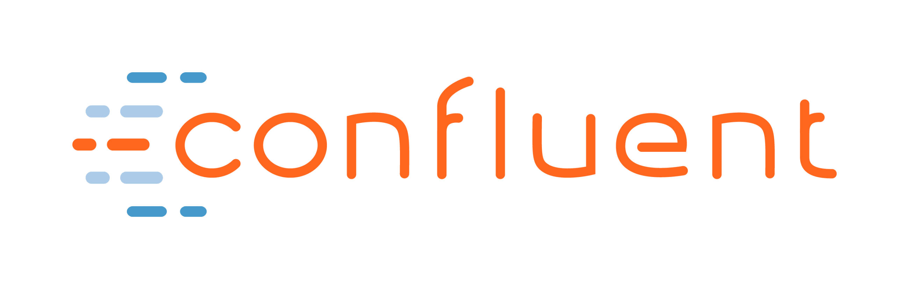
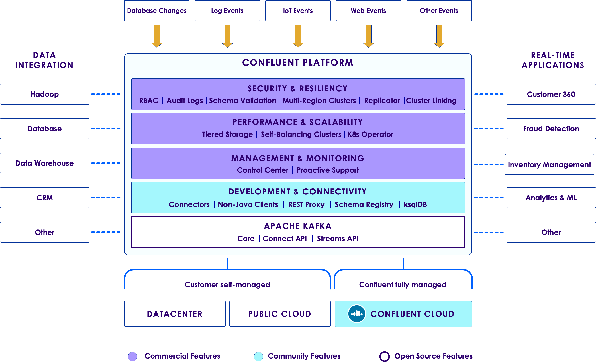
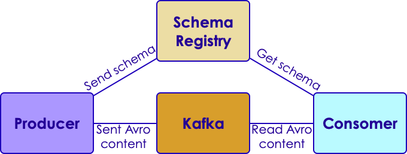

# Confluent Platform

<!-- {"left" : 2.6, "top" : 5.84, "height" : 2.59, "width" : 2.38} -->
<!-- {"left" : 2.6, "top" : 5.84, "height" : 2.59, "width" : 2.38} -->

---

## Module Objective

* Learn about Confluent platform

---

## Confluent Platform

<!-- {"left" : 2.6, "top" : 5.84, "height" : 2.59, "width" : 2.38} -->

* Confluent platform has the following:

* Free features:
    - Apache Kafka
    - KSQL
    - Connectors (many types of databases)
    - Schema Registry

* Commercial features
    - Control Center
    - Replicator

Notes:

---

## Lab: Setup Confluent Platform

<!-- {"left" : 6.76, "top" : 0.88, "height" : 4.37, "width" : 3.28} -->

* **Overview:**
    - Download, install and start Confluent

* **Approximate Time:**
    - 30 - 40 mins

* **Instructions:**
     - CONFLUENT-1

Notes:

---

# Schemas in Kafka

---

## Deserializers

* Producers serialize Objects into bytes and send into Kafka

* Consumers read bytes from Kafka and convert them back to Objects

<!-- {"left" : 0.62, "top" : 3.61, "height" : 2.51, "width" : 9} -->

Notes:

---

## Standard Kafka SerDe

<!-- {"left" : 6.94, "top" : 1.05, "height" : 5.69, "width" : 3.19} -->

* Kafka comes with Serializers Deserializers for standard Java types

* Can be found in package **org.apache.kafka.common.serialization** 

* We need to provide SerDe classes for custom types

* Can use Avro  

Notes:

---

## Schemas Evolve in Real Life

* Let's say we have messages in the following format

* Version 1

| Id    | Type  | Success |
|-------|-------|---------|
| 12345 | Click | YES     |

<!-- {"left" : 0.25, "top" : 1.79, "height" : 1, "width" : 9.75} -->

* Version 2

| Id    | Type  | Success | Message        |
|-------|-------|---------|----------------|
| 12345 | Click | YES     | Page not found |

<!-- {"left" : 0.25, "top" : 3.67, "height" : 1, "width" : 9.75} -->

* Q: How will the consumer process this?

Notes:

---

## Apache Avro

* Data serialization format

* Created for Hadoop project

* Language neutral; can be used from C, Java, Python ..etc

* Schema is described in JSON format

* Data is stored in binary format

* **Supports schema evolutions**

* Use KafkaAvroSerializer

* [Apache Avro](https://avro.apache.org/)

Notes:

---

## Avro Schema

* Version 1

```json
{"namespace": "com.example.videos",
  "type": "record",
  "name": "Event",
  "fields": [
     {"name": "id", "type": "int"},
     {"name": "type",  "type": "string"},
     {"name": "success",  "type": "string"}
]
}
```
<!-- {"left" : 0, "top" : 1.35, "height" : 3.19, "width" : 7.94} -->

* Version 2

```json
{"namespace": "com.example.videos",
  "type": "record",
  "name": "Event",
  "fields": [
     {"name": "id", "type": "int"},
     {"name": "type",  "type": "string"},
     {"name": "success", "type": "string"},
     {"name": "message", "type": "string"}  // <- new attribute
  ]}
```
<!-- {"left" : 0, "top" : 4.99, "height" : 2.93, "width" : 10.25} -->

Notes:

---

## Confluent Schema Registry

* Manages schemas and versions

* Provides REST API for interactions

* Works with Kafka seamlessly

* Open-source, downloadable as part of Confluent distribution

* [Documentation](https://docs.confluent.io/current/schema-registry/docs/index.html)

<!-- {"left" : 0.4, "top" : 2.75, "height" : 3.57, "width" : 9.44} -->

Notes:

---

## Schema Registry Basics

* Schema
    - Structure of an Avro data format

* Subject
    - Scope of the schema. Subject name is derived from topic name by default

    - Schemas can be registered under multiple subjects

        * Automated transparently from Producer as well

* Register a new schema:

```bash
curl -X POST -H "Content-Type: application/vnd.schemaregistry.v1+json" / \
 --data '{"schema": "{/"type/": /"string/"}"}' / \
 http://localhost:8081/subjects/Kafka-value/versions {"id":1} 
```

Notes:

---

## Schema Registry Examples

 * List all schemas under a subject

```bash
curl -X GET http://localhost:8081/subjects/Kafka-value/versions
```

* Fetch version 1 of the schema

```bash
curl -X GET http://localhost:8081/subjects/Kafka-value/versions/1 

# {"subject":"Kafka-value", "version":1,"id":1,"schema":"\"string\""}`
```

* Register the same schema under a different subject

```bash
curl -X POST -H "Content-Type: application/vnd.schemaregistry.v1+json" \ 
  --data '{\"schema\": "{\"type\": \"string\"}"}' http://localhost:8081/subjects/Kafka2-value/versions 

# {"id":1}
```

Notes:

---

## Lab: AVRO Schema Lab

 <!-- {"left" : 6.76, "top" : 0.88, "height" : 4.37, "width" : 3.28} -->

* **Overview:**
    - Create a schema for clickstream data

* **Approximate Time:**
    - 30 - 40 mins

* **Instructions:**
    - CONFLUENT-2: Avro

Notes:

---

## Review and Q&A

<!-- {"left" : 8.56, "top" : 1.21, "height" : 1.15, "width" : 1.55} -->
<!-- {"left" : 6.53, "top" : 2.66, "height" : 2.52, "width" : 3.79} -->

* Let's go over what we have covered so far

* Any questions?
