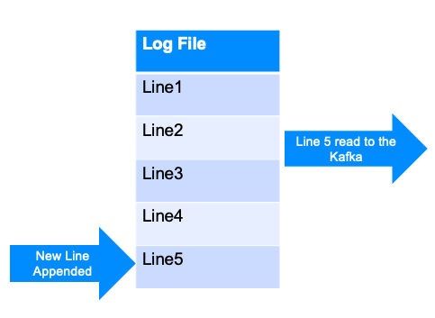

# Kafka Connect

---

## Kafka Eco System

| Product          | Description                                                                  |
|------------------|------------------------------------------------------------------------------|
| Kafka Streams    | Build streaming applications easily                                          |
| Kafka Connect    | Move data between Kafka and other systems (DB / file system)                 |
| Kafka Registry   | Metadata /schema store for data                                              |
| Kafka REST Proxy | REST interface into Kafka cluster.,Produce / <br‫/‬>Consume using RESTFUL APIs |
| Camus            | Kafka / HDFS integration                                                     |

<!-- {"left" : 0.25, "top" : 1.45, "height" : 3.38, "width" : 9.75} -->

Notes:

---


## Kafka Connect


 * Kafka Connect is a framework included in Apache Kafka that integrates Kafka with other systems. 

 * It's goal is to make it easy to add new systems to your scalable and secure stream data pipelines.

<!-- {"left" : 0.35, "top" : 3.92, "height" : 1.89, "width" : 9.56} -->


Notes: 


---

## Kafka Connectors (Supported by Confluent)

| Connector      | Description         | Supported by |
|----------------|---------------------|--------------|
| ActiveMQ       | Source only         | Confluent    |
| Amazon S3      | Sink                | Confluent    |
| Elastic Search | Sink                | Confluent    |
| HDFS           | Sink (Hadoop, Hive) | Confluent    |
| IBM MQ         | Source              | Confluent    |
| JDBC           | Source and Sink     | Confluent    |
| JMS            | Source              | Confluent    |
<!-- {"left" : 0.25, "top" : 1.11, "height" : 7, "width" : 9.75} -->


Notes: 

More information at : https://www.confluent.io/product/connectors/


---

## Kafka Connectors (Supported by Vendors)


| Connector | Description     | Supported by |
|-----------|-----------------|--------------|
| Azure IoT | Source, IoT     | Microsoft    |
| Couchbase | Source and Sink | Couchbase    |
| SAP Hana  | Source and Sink | SAP          |
| Vertica   | Source and Sink | HP           |
| VoltDB    | Sink            | VoltDB       |

<!-- {"left" : 0.25, "top" : 1.11, "height" : 5, "width" : 9.75} -->


Notes: 

More information at : https://www.confluent.io/product/connectors/


---

## Kafka Connectors (Supported by Community)

| Connector      | Description                          | Supported by |
|----------------|--------------------------------------|--------------|
| Amazon Kinesis | Sink (Amazon's managed queue service | Community    |
| Apache Ignite  | Source and Sink (File System)        | Community    |
| Blockchain     | Source <br/>Bitcoin,Blockchain       | Community    |
| Cassandra      | Sink <br/>NoSQL                      | Community    |
| Github         | Source                               | Community    |
| Many more      |                                      |              |
<!-- {"left" : 0.25, "top" : 1.11, "height" : 6.38, "width" : 9.75} -->

Notes: 

More information at : https://www.confluent.io/product/connectors/


---


## Kafka Connect Concepts

* **Connectors** - A logical process responsible for managing the copying of data between Kafka and
another system.


* There are two types of connectors

  - **Source Connectors** import data from another system
  - **Sink Connectors** export data from Kafka


* **Tasks** - Unit of process that handles assigned set of work load by connectors.
Connector configuration allows set to maximum number of tasks can be run by a connector.

* **Workers** - Unit of work that schedules connectors and tasks in a  process.

* There are two main type of workers: **standalone** and **distributed**

---

## Standalone vs Distributed Workers


 * Standalone Worker

     - Single process that executes all connectors and tasks

     -  Simple to configure

     -  Use for simple use cases or initial testing

 * Distributed Worker

     - Provides more scalability and fault tolerance

     - Connectors and tasks are distributed between the workers automatically. 

Notes: 


---

## Kafka Connect - Configuration

* **Common Connector Configuration**

  - name - Unique name for the connector. Attempting to register again with the same name will  fail.
  - connector.class - The Java class for the connector
  - tasks.max - The maximum number of tasks that should be created for this connector. The  connector may create fewer tasks if it cannot achieve this level of parallelism.

* **Please note** that connector configuration might vary, see specific connector documentation for  more information.

---
## Kafka Connect - Configuration

* **Distributed Mode - Worker Configuration**

  - bootstrap.servers - A list of host/port pairs to use for establishing the initial connection to the Kafka cluster.  
  - group.id - A unique string that identifies the Connect cluster group this worker belongs to.
  - config.storage.topic - The topic to store connector and task configuration data in. This must be the same for all  workers with the same group.id.
  - offset.storage.topic - The topic to store offset data for connectors in. This must be the same for all workers with the  same group.id
  - status.storage.topic - The name of the topic where connector and task configuration status updates are stored.
  - For more distributed mode worker configuration: http://docs.confluent.io/current/connect/userguide.html#configuring-workers

---

## Kafka Connect - Running an Instance

* It is recommended to run Kafka Connect on containerized environments such as Kubernetes, Mesos, Docker Swarm, or  YARN.
* Kafka Connect distributed mode exposes port 8083 by default to serve management REST interface.

```bash
$ docker run -d \
    --name=kafka-connect \
    --net=host \
    -e CONNECT_BOOTSTRAP_SERVERS="kafka-broker:9092" \
    -e CONNECT_GROUP_ID="group_1" \
    -e CONNECT_CONFIG_STORAGE_TOPIC="kafka-connect-config" \
    -e CONNECT_OFFSET_STORAGE_TOPIC="kafka-connect-offset" \
    -e CONNECT_STATUS_STORAGE_TOPIC="kafka-connect-status" \
    -e CONNECT_KEY_CONVERTER="org.apache.kafka.connect.json.JsonConverter" \
    -e CONNECT_VALUE_CONVERTER="org.apache.kafka.connect.json.JsonConverter" \
    -e CONNECT_INTERNAL_KEY_CONVERTER="org.apache.kafka.connect.json.JsonConverter" \
    -e CONNECT_INTERNAL_VALUE_CONVERTER="org.apache.kafka.connect.json.JsonConverter" \
    -e CONNECT_LOG4J_LOGGERS="io.debezium.connector.mysql=INFO" \
    -v /opt/kafka-connect/jars:/etc/kafka-connect/jars \
    --restart always \
    confluentinc/cp-kafka-connect:3.3.0
```


---

## Connect File Streaming Example


 * Kafka Connect example - stream a file through Kafka

 <!-- {"left" : 0.53, "top" : 4.02, "height" : 2.57, "width" : 3.52} --> &nbsp; &nbsp; <!-- {"left" : 4.73, "top" : 3.84, "height" : 1.88, "width" : 4.96} -->


Notes: 


---

## Standalone configuration


 * key.converter=org.apache.kafka.connect.storage.StringConverter

 * value.converter=org.apache.kafka.connect.storage.StringConverter

 * #Converter-specific settings can be passed in by prefixing the Converter's setting with the converter we want to apply

 * key.converter.schemas.enable=false

 * value.converter.schemas.enable=false

 * #The internal converter used for offsets and config data is configurable and must be specified. Can use the built-in default


---

## Standalone configuration

 * #Offset and config data is never visible outside of Kafka Connect in this format.

 * internal.key.converter=org.apache.kafka.connect.storage.StringConverter

 * internal.value.converter=org.apache.kafka.connect.storage.StringConverter

 * internal.key.converter.schemas.enable=false

 * internal.value.converter.schemas.enable=false

Notes: 

Can be found at

config/connect-standalone.properties


---

## Source file Configuration and Execution

```java
    name=local-file-source
    connector.class=File Stream Source
    tasks.max=1
    file=test.log
    topic=test_log
```
<!-- {"left" : 0, "top" : 1.19, "height" : 1.72, "width" : 8.07} -->

<br/>
<br/>

 * The file stream can be run by executing  *connect-standalone.sh* with standalone configuration and source file configuration as given below

```java
bin/connect-standalone.sh /
    config/connect-standalone.properties /
    config/connect-file-source.properties
```
<!-- {"left" : 0, "top" : 5.48, "height" : 1.34, "width" : 10.25} -->


Notes: 

bin/connect-standalone.sh config/connect-standalone.properties config/connect-file-source.properties


---

## HFDS Connector


 * The HDFS connector  exports data from Kafka into HDFS.

 * Can also integrate with Hive, so data is readily available for querying using HiveQL

     - Hive tables are partitioned by Kafka topic

 * Features

     - Exactly one delivery: Each Kafka message is only exported to HDFS once

     - Supports Avro and Parquet format

     - Secure data transport using Kerberos

Notes: 


---

## HDFS Connector - Sample Usage


```java
# hdfs-connector.properties

name=hdfs-sink
connector.class=io.confluent.connect.hdfs.HdfsSinkConnector
tasks.max=1
topics=test_hdfs
hdfs.url=hdfs://localhost:9000
flush.size=3

```
<!-- {"left" : 0, "top" : 1.54, "height" : 2.39, "width" : 10.25} -->


```java
$  confluent load hdfs-sink -d hdfs-connector.properties

```
<!-- {"left" : 0, "top" : 4.42, "height" : 0.55, "width" : 10.25} -->


```java
$ hadoop fs -ls /topics/test_hdfs/partition=0

/topics/test_hdfs/partition=0/test_hdfs+0+0000000000+0000000002.avro

```
<!-- {"left" : 0, "top" : 5.47, "height" : 1.07, "width" : 10.25} -->

Notes: 


---

## Kafka Connect Best Practices - Advice from the Field

* best practices for configuring, managing, and tuning the connectors tools to monitor data flow through the pipeline using Kafka Streams applications to transform or enhance the data in flight

---
## How Blizzard Used Kafka to Save Data Pipeline

* "When Blizzard started sending gameplay data to Hadoop in 2013, we went through several iterations before settling on Flumes in many data centers around the world reading from RabbitMQ and writing to central flumes in our Los Angeles datacenter. While this worked at first, by 2015 we were hitting problems scaling to the number of events required. This is how we used Kafka to save our pipeline."


---

## Yelp’s Real-time Data Pipeline

* "Yelp moved quickly into building out a comprehensive service oriented architecture, and before long had over 100 data-owning production services. Distributing data across an organization creates a number of issues, particularly around the cost of joining disparate data sources, dramatically increasing the complexity of bulk data applications. Straightforward solutions like bulk data APIs and sharing data snapshots have significant drawbacks. Yelp’s Data Pipeline makes it easier for these services to communicate with each other, provides a framework for real-time data processing, and facilitates high-performance bulk data applications - making large SOAs easier to work with. The Data Pipeline provides a series of guarantees that makes it easy to create universal data producers and consumers that can be mashed up into interesting real-time data flows. We’ll show how a few simple services at Yelp lay the foundation that powers everything from search to our experimentation framework."


---

## Body Armor for Distributed System

* "We show a way to make Kafka end-to-end encrypted. It means that data is ever decrypted only at the side of producers and consumers of the data. The data is never decrypted broker-side. Importantly, all Kafka clients have their own encryption keys. There is no pre-shared encryption key. Our approach can be compared to TLS implemented for more than two parties connected together."


---

## Review Questions

* What is the difference between KStreams and KTables?
* What are the good use cases for each?

Notes: 

---

## Lab: Kafka Connect


 *  **Overview:** Use Kafka Connect to read data from a file

 *  **Builds on previous labs:**

 *  **Approximate Time:** 20 - 30 mins

 *  **Instructions:** 

     - Please follow: lab 10

 *  **To Instructor:**


Notes: 

