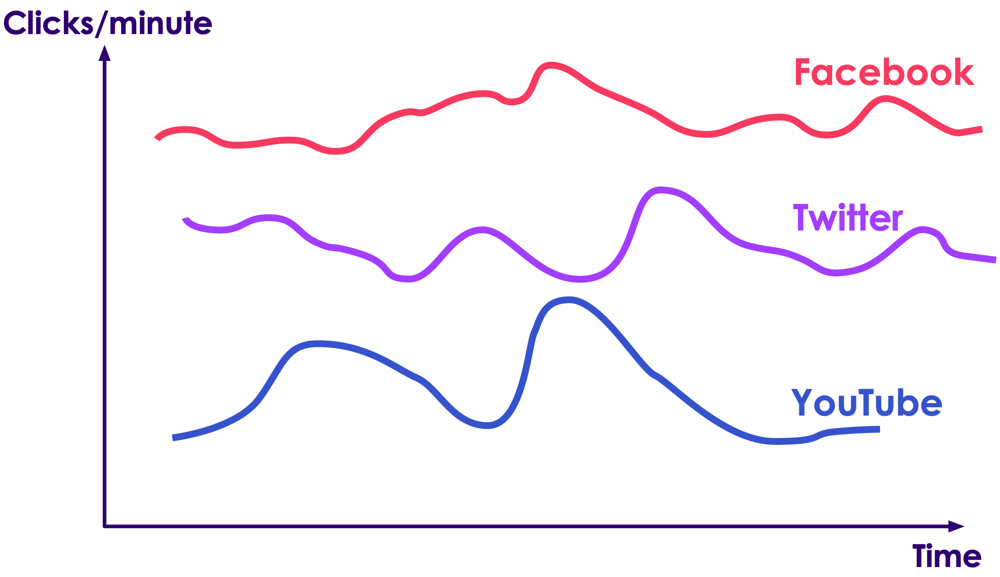
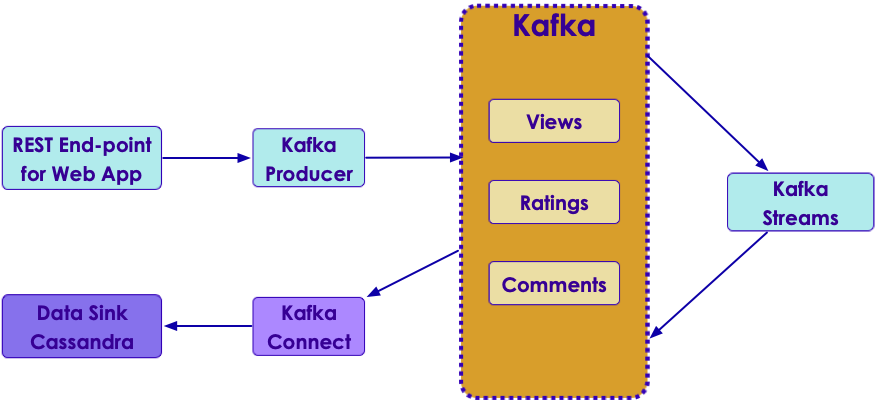

# Kafka Design Exercises

---

## Lesson Objectives

* Use Kafka to solve real world scenarios

Notes:

---

## Approach

<!-- {"left" : 6.76, "top" : 0.88, "height" : 4.37, "width" : 3.28} -->

* We present a particular use case/problem

* Work as groups to:

    - Come up with your solution

    - Present it to the class

* Discuss

    - Compromises & comparisons

    - Performance implications

    - Lessons learned

---

# Next: Log Collection

<!-- {"left" : 0.75, "top" : 1.58, "height" : 6.47, "width" : 8.75} -->

---

## Log Collection and Processing


 * Collect and analyze logs on massive scale
 * Use cases:
     - Large data center
        * Keep track of logins
        * Detect attacks
     - Web properties (e-commerce sites or LinkedIn)
        * Log user activities
        * Analyze user activities (which button users click most...etc.)
 * Distributed log collection
     - Need to collect from multiple sources (100s or even 1000s)
 * Tools
     - Flume (part of Hadoop ecosystem)
     - Kafka (distributed message queue)
     - Log Stash

Notes:


---

## Distributed Log Collection Tools: Flume

<!-- {"left" : 5.34, "top" : 2.15, "height" : 4.59, "width" : 4.6} -->


 * Part of Hadoop ecosystem

 * Works on `agent -> hub` model

 * Agents run on `log source` and keep sending data upstream

 * Can handle failures


Notes:


---

## Log Processing: Log format

<!-- {"left" : 8.29, "top" : 1.18, "height" : 2.9, "width" : 1.59} -->


 * Logs contain:

     - Timestamp

     - Source (hostname or application_name)

     - Severity (info, error)

     - message

```text
2020-01-10 13:21:43 - web1.example.com - ERROR - page not found /login.html
```

 * Design a system to ingest the log files on a continuously basis

 * Goal: To analyze the logs

     - Find log events for a certain host (latest event first)

     - Find log events of a particular severity

 * **Answer next slide**

Notes:


---

## Solution: Gather logs into Kafka

* **Kafka Connect**: Use syslog plugin to ingest data into Kafka
    - https://docs.confluent.io/current/connect/kafka-connect-syslog/index.html

* [LogStash](https://www.elastic.co/products/logstash)

    - Can parse pretty much any log files

    - And send them to any 'stash'

    - Has input / output plugins for Kafka (can read from / write to  Kafka)

* [Log4J](https://logging.apache.org/log4j/)

    - Log4j has appenders to Kafka

* Roll your Own

    - Apache Commons has a [Tailor](https://commons.apache.org/proper/commons-io/javadocs/api-2.4/org/apache/commons/io/input/Tailer.html) class

Notes:

https://www.elastic.co/products/logsta
https://logging.apache.org/log4j/2.0/manual/appenders.htmlsh
https://commons.apache.org/proper/commons-io/javadocs/api-2.4/org/apache/commons/io/input/Tailer.html

---

# Next: Clickstream Processing

---

## Quiz: Processing Clickstream Data

* Here is a sample clickstream data

```json
{ 
    "timestamp" :1451635200055,
    "session":"session_57" ,
    "domain":"twitter.com" ,
    "cost":24,
    "user":"user_31",
    "campaign": "campaign_1",
    "ip":"ip_64",
    "action": "blocked" 
}
```

<!-- {"left" : 0.75, "top" : 3.7, "height" : 2.25, "width" : 8.76} -->

* Query: We want to keep a running total of impressions per domain

* Design the producer and consumer

* Hints:
    - Think about how to aggregate stats for each domain

---

## Solution: Processing Clickstream Data

* Discuss various solutions

---

# Next: Slack

---

## Quiz: Design a Messaging System Like Slack

* Here is a sample payload

```json
{
    "timestamp" : "...",
    "from" : "user1",
    "to" : "user2",
    "message": "Hi, wanna grab lunch today?"
}
```

* Design Producer and Consumer

* Discuss data formats (keys, values)

---

## Solution: Design a Messaging System Like Slack

* Discuss various solutions

---

# Next: Netflix

---

## Quiz: Design a Netflix Resume Feature

* You can watch Netflix on one-device (say TV),  pause, and pick it up on another device (say iPad), exactly where you left off

* Implement this feature using Kafka

* Discuss what data you will send to Netflix to achieve this
    - How about keys?
    - How often to send data?

---

## Solution: Discuss Netflix Resume Solution

---

# Next: Fitbit

---

## Quiz: Design a FitBit Badge Feature

* Fitbit device tracks a person's movement (i.e. steps)

* People set target goals (10,000 steps / day)

* When the target goal is achieved (say 10,000 steps per day) we want to send a 'Well done !' email

* Also we want to announce 'daily competition winners' - a group of people competing together
    - We will send push notification to every one's phone at the end of day (say 11pm) to announce the winner for the day

---

## Solution: Discuss Fitbit Design

---

# Next: Large Video Files

---

## Quiz: Sending Large Video Files Through Kafka

* We have video files that are of size from 100s of MB in size to few Gigs.

* We want to send these files using Kafka

* And assemble the files on the other end

<!-- {"left" : 0.75, "top" : 3.7, "height" : 2.25, "width" : 8.76} -->

Notes:


---

## Solution: Sending Large Video Files Through Kafka

* Chop the file into smaller chunks and send them with SAME key (so all chunks of one file will be written to ONE partition,  and a consumer can re-construct the file on the other end)

* **Questions for class**

    - What can we use for key?

    - How do we make sure the files aren't corrupted?

* **Instructor:**

    - Draw out the payload send order

Notes:

---

# Next: Too Many Partitions

---

## Quiz: Too Many Partitions Making Kafka Cluster Unstable

* We have a  **created**  topic with 1000 partitions

* And we have been sending data to the topic.  All partitions have data

* But this is proving to be too many partitions for our little kafka cluster.

* We want to cut down the number of partitions to 100

* How can we accomplish this?Remember, number of partitions can not be reduced!

* **Answer next slide**

Notes:

---

## Solution: Reducing Number of Partitions

Notes:

---

# Next: IOT to Kafka

---

## Quiz: How to Capture Events From an IOT device and push it to Kafka?

* Imagine we have IOT devices sending data 'home'

* These devices are outside our firewall!

* Capture the data in Kafka

* Design a system do this

* We want to award badges to users who accomplish certain milestonese.g.  Fitbit send "well done" when a user completes 10,000 steps a day

    - These awards are sent via email & mobile app push notifications

* **Answer next slide**

Notes:

---

## Solution: IOT Data Capture

* Kafka REST

Notes:

---

# Next: YouTube

---

## MyVideos / YouTube  

<!-- {"left" : 8.29, "top" : 1.18, "height" : 2.9, "width" : 1.59} -->

 * Allows users to upload videos

 * Users can view, rate and comment on videos

 * Rating is an integer 1 to 5

 * Comment is text up to 1K bytes

 * Need to handle millions of concurrent users

 * Need to store all  **views** ,  **ratings** ,  **comments** in some kind of database

 * Assume some "processing" on ratings/comments will be required

 * Lab:

     - Design a system to handle these requirements


Notes:

Only design queueing portion and producer/consumers. Not DB or web app
Have students draw a design on white board or project


---

## MyVideos Design: Our Solution

<!-- {"left" : 0.76, "top" : 2.82, "height" : 4, "width" : 8.73} -->


Notes:

Discussion: one topic vs multiple


---

## Lab: MyVideos Cluster setup


 *  **Overview*:*

     - Setup a Kafka cluster for MyVideos

        * Use instances of your group to form the cluster

     - Create the MyVideos topics

        * Think about replicas, partitions

 *  **Builds on previous labs:** None

 *  **Approximate time:** 30 minutes


Notes:


---

## MyVideos: Topics and Messages


<!-- {"left" : 8.29, "top" : 1.18, "height" : 2.9, "width" : 1.59} -->


 * Producer

     - Receives all events - views, ratings, comments as they occur

     - It will send messages to Kafka topic(s)

     - For lab, assume we will generate the messages

 * Design Kafka topics and message formats


Notes:


---

## MyVideos: Topics and Messages: Our Solution


 * Topics

     - View

     - Rating

     - Comment

 * Messages - AVRO data format

     - View: user_id, video_id, time_of_view, time_spent

     - Rating: user_id, video_id, time_of_rating, rating

     - Comment: user_id, video_id, time_of_comment, comment

Notes:


---

## MyVideos: Messages Schema

<!-- {"left" : 8.29, "top" : 1.18, "height" : 2.9, "width" : 1.59} -->


 * Create Avro schemas

 * Reference: http://avro.apache.org/docs/current/spec.html


Notes:


---

## MyVideos: View Schema: Our Solution

```text
{"namespace": "com.example.videos",
  "type": "record",
  "name": "View",
  "fields": [
     {"name": "user_id", "type": "int"},
     {"name": "video_id", "type": "string"},
     {"name": "time_of_view", "type": { "type": "string", "logicalType": "timestamp
millis" }},
     {"name": "time_spent", "type": "int"}

  ]
}
```
<!-- {"left" : 0, "top" : 1.4, "height" : 2.42, "width" : 10.25} -->


Notes:


---

## MyVideos: View JSON: Our Solution


```text
Example JSON data for Views:
{
  "user_id": 123,
  "video_id": "VID45128-1",
  "time_of_view": "2019-01-02T12:30:01",
  "time_spent_in_secs": 3.5
}
```
<!-- {"left" : 0, "top" : 1.29, "height" : 2.13, "width" : 7.44} -->

<br/>

 * Create schema at https://www.jsonschema.net/

Notes:


---

## MyVideos: Rating Schema: Our Solution


```text
{"namespace": "com.example.videos",
 "type": "record",
 "name": "Rating",
 "fields": [
     {"name": "user_id", "type": "int"},
     {"name": "video_id", "type": "string"},
     {"name": "time_of_rating", "type":
     { "type": "string", "logicalType": "timestamp-millis" }},
     {"name": "rating", "type": "int"}
  ]
}
```
<!-- {"left" : 0, "top" : 1.35, "height" : 2.93, "width" : 10.25} -->


Notes:


---

## MyVideos: Rating JSON: Our Solution


```text
Example JSON data for Views:
{
  "user_id": 123,
  "video_id": "VID45128-1",
  "time_of_rating": "2019-01-02T12:30:01",
  "rating": 4
}
```
<!-- {"left" : 0, "top" : 1.21, "height" : 2.13, "width" : 7.78} -->


 * Create schema at https://www.jsonschema.net/

Notes:


---

## MyVideos: Comment Schema: Our Solution


```text
{"namespace": "com.example.videos",
 "type": "record",
 "name": "Comment",
 "fields": [
     {"name": "user_id", "type": "int"},
     {"name": "video_id", "type": "string"},
     {"name": "time_of_rating", "type":
     { "type": "string", "logicalType": "timestamp-millis" }},
     {"name": "comment", "type": "string"
  ]
}
```
<!-- {"left" : 0, "top" : 1.31, "height" : 2.93, "width" : 10.25} -->


Notes:


---

## Lab: MyVideos Producers


 *  **Overview:**

     - Create Producers for the Rating topics

        - Think about the various settings, optimizations

 * Bonus: Create producers for the other topics as well!

 *  **Approximate time:** 60-90 minutes


Notes:


---

## Lab: MyVideos Producers


 *  **Overview:**

     - Create Producers for the Rating topics

        - Think about the various settings, optimizations

 * Bonus: Create producers for the other topics as well!

 *  **Approximate time:** 60-90 minutes


Notes:


---

## MyVideos: Stream Processing

<!-- {"left" : 8.29, "top" : 1.18, "height" : 2.9, "width" : 1.59} -->


 * Check ratings and comments for fraud and unacceptable content

     - Assume we have a separate Java class/library that can do this

 * We want real-time summary statistics such as number of views, ratings, comments per hour

     - Number of views per minute for the last hour

     - Count of ratings = 5 received per minute

     - Number of comments per minute

 * Modify your design to handle these requirements


Notes:

HINT: Use sliding window in KStreams


---

## MyVideos Design: Our Solution

<!-- {"left" : 0.8, "top" : 2.4, "height" : 4.85, "width" : 8.65} -->


Notes:


---

## MyVideos: Stream Processing

<!-- {"left" : 8.29, "top" : 1.18, "height" : 2.9, "width" : 1.59} -->


 * We want real-time summary statistics such as:

     - Number of views per minute

     - Count of highest rating (i.e. 5) received per minute

 * How would you implement this?


Notes:

HINT: Use sliding window in KStreams


---

## MyVideos: Statistics: Our Solution


 * Add a new Consumer app "statistics"

     - Process 'view' and 'rating' topics using Kstreams:

        * Create hopping windows of one minute

 * Reference: https://kafka.apache.org/20/documentation/streams/developer-guide/dsl-api.html#streams-developer-guide-dsl-windowing

Notes:


---

## Lab: MyVideos Consumers

 *  **Overview:**

     - Implement Statistics app

        * Consume Rating events

        * Create Statistics topic

 *  **Approximate time:** 1 hour


Notes:


---

## MyVideos: Bonus: User Devices

<!-- {"left" : 8.29, "top" : 1.18, "height" : 2.9, "width" : 1.59} -->


 * A user has multiple devices (TV, tablet, phone, computer)

 * We want to track devices used to view videos

     - How many videos are viewed using which devices

 * Device attributes:

     - device_id (something unique)

     - Device Type (phone/tv/tablet/set-top)

     - Device belongs to ONE user

 * Modify your design to handle devices


Notes:


---

## MyVideos: User Devices: Our Solution


 * Add following fields to "View" schema:

     - device_id, device_type

 * Add a new Consumer app

     - Process 'view' topic using Kstreams:

        * Group messages by device_type and count them

Notes:


---

## Review and Q&A

<!-- {"left" : 8.24, "top" : 1.21, "height" : 1.28, "width" : 1.73} -->

- Let's go over what we have covered so far

- Any questions?

<!-- {"left" : 2.69, "top" : 3.91, "height" : 3.24, "width" : 4.86} -->
