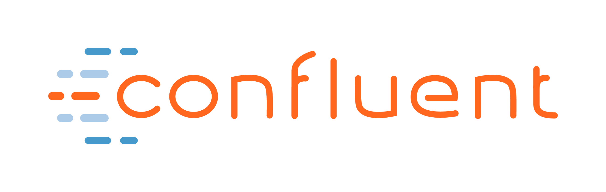
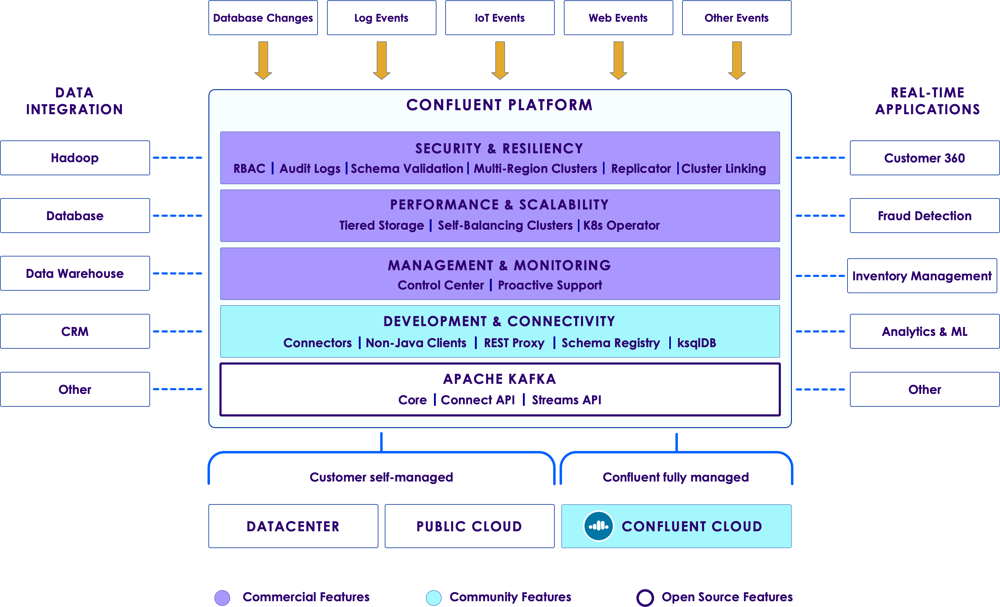
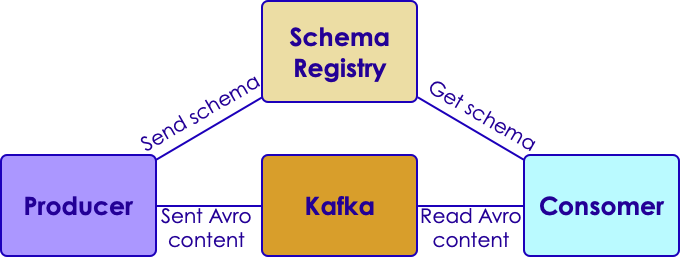

# Kafka Ecosystem

---

## Lesson Objectives

* Learn various tools and components around Kafka
* Confluent stack

---

## Kafka Eco System

| Product          | Description                                                                  |
|------------------|------------------------------------------------------------------------------|
| Kafka Streams    | Build streaming applications easily                                          |
| Kafka Connect    | Move data between Kafka and other systems (DB / file system)                 |
| Kafka Registry   | Metadata /schema store for data                                              |
| Kafka REST Proxy | REST interface into Kafka cluster.,Produce / <br>Consume using RESTFUL APIs |
| Camus            | Kafka / HDFS integration                                                     |

<!-- {"left" : 0.25, "top" : 1.45, "height" : 3.38, "width" : 9.75} -->

Notes:

---

# Kafka Connect

---

## Kafka Connect


* Kafka Connect is a framework included in Apache Kafka that integrates Kafka with other systems. 

* It's goal is to make it easy to add new systems to your scalable and secure stream data pipelines.

<!-- {"left" : 0.35, "top" : 3.92, "height" : 1.89, "width" : 9.56} -->


Notes: 


---

## Kafka Connectors (Supported by Confluent)

| Connector      | Description         | Supported by |
|----------------|---------------------|--------------|
| ActiveMQ       | Source only         | Confluent    |
| Amazon S3      | Sink                | Confluent    |
| Elastic Search | Sink                | Confluent    |
| HDFS           | Sink (Hadoop, Hive) | Confluent    |
| IBM MQ         | Source              | Confluent    |
| JDBC           | Source and Sink     | Confluent    |
| JMS            | Source              | Confluent    |
<!-- {"left" : 0.25, "top" : 1.11, "height" : 7, "width" : 9.75} -->


Notes: 

More information at : https://www.confluent.io/product/connectors/


---

## Kafka Connectors (Supported by Vendors)


| Connector | Description     | Supported by |
|-----------|-----------------|--------------|
| Azure IoT | Source, IoT     | Microsoft    |
| Couchbase | Source and Sink | Couchbase    |
| SAP Hana  | Source and Sink | SAP          |
| Vertica   | Source and Sink | HP           |
| VoltDB    | Sink            | VoltDB       |

<!-- {"left" : 0.25, "top" : 1.11, "height" : 5, "width" : 9.75} -->


Notes: 

More information at : https://www.confluent.io/product/connectors/


---

## Kafka Connectors (Supported by Community)

| Connector      | Description                          | Supported by |
|----------------|--------------------------------------|--------------|
| Amazon Kinesis | Sink (Amazon's managed queue service | Community    |
| Apache Ignite  | Source and Sink (File System)        | Community    |
| Blockchain     | Source <br/>Bitcoin,Blockchain       | Community    |
| Cassandra      | Sink <br/>NoSQL                      | Community    |
| Github         | Source                               | Community    |
| Many more      |                                      |              |
<!-- {"left" : 0.25, "top" : 1.11, "height" : 6.38, "width" : 9.75} -->

Notes: 

More information at : https://www.confluent.io/product/connectors/


---


## Kafka Connect Concepts

* **Connectors** - A logical process responsible for managing the copying of data between Kafka and
another system.

* There are two types of connectors

  - **Source Connectors** import data from another system
  - **Sink Connectors** export data from Kafka

* **Tasks** - Unit of process that handles assigned set of work load by connectors.
Connector configuration allows set to maximum number of tasks can be run by a connector.

* **Workers** - Unit of work that schedules connectors and tasks in a  process.

* There are two main type of workers: **standalone** and **distributed**

---

## Standalone vs Distributed Workers

* Standalone Worker
    - Single process that executes all connectors and tasks
    - Simple to configure
    - Use for simple use cases or initial testing

* Distributed Worker
    - Provides more scalability and fault tolerance
    - Connectors and tasks are distributed between the workers automatically. 

Notes: 

---

## File Connector

* Applications save logs into files on disk

* Streaming  logfiles into kafka is a very common use case


 <!-- {"left" : 0.53, "top" : 4.02, "height" : 2.57, "width" : 3.52} --> &nbsp; &nbsp; <!-- {"left" : 4.73, "top" : 3.84, "height" : 1.88, "width" : 4.96} -->

Notes:

---

## File Connector Configuration

* File source connector (File --> Kafka)

```text
name=local-file-source
connector.class=FileStreamSource
tasks.max=1
file=/tmp/test.txt
topic=test-topic
```
<!-- {"left" : 0, "top" : 1.19, "height" : 1.72, "width" : 8.07} -->

* File sink connector (Kafka --> File)

```text
name=local-file-sink
connector.class=FileStreamSink
tasks.max=1
file=/tmp/test.sink.txt
topics=test-topic
```

* Here is how to run it (in standalone mode)

```bash
bin/connect-standalone.sh \
    config/connect-standalone.properties \
    config/connect-file-source.properties
```
<!-- {"left" : 0, "top" : 5.48, "height" : 1.34, "width" : 10.25} -->

Notes:

bin/connect-standalone.sh config/connect-standalone.properties config/connect-file-source.properties

---

## HDFS Connector

* The HDFS connector  exports data from Kafka into HDFS.

* Can also integrate with Hive, so data is readily available for querying using HiveQL
    - Hive tables are partitioned by Kafka topic

* Features
    - Exactly one delivery: Each Kafka message is only exported to HDFS once
    - Supports Avro and Parquet format
    - Secure data transport using Kerberos

Notes:

---

## HDFS Connector

```text
# hdfs-connector.properties

name=hdfs-sink
connector.class=io.confluent.connect.hdfs.HdfsSinkConnector
tasks.max=1
topics=test_hdfs_topic
hdfs.url=hdfs://localhost:9000
flush.size=3
```
<!-- {"left" : 0, "top" : 1.54, "height" : 2.39, "width" : 10.25} -->

* `flush.size` is how many records the connector need to write before invoking file commit

* Running it

```bash
$  confluent load hdfs-sink -d hdfs-connector.properties
```
<!-- {"left" : 0, "top" : 4.42, "height" : 0.55, "width" : 10.25} -->

* Checking data in HDFS

```bash
$ hadoop fs -ls /topics/test_hdfs/partition=0
```

```console
/topics/test_hdfs/partition=0/test_hdfs+0+0000000000+0000000002.avro
```
<!-- {"left" : 0, "top" : 5.47, "height" : 1.07, "width" : 10.25} -->

Notes: 

---

## Running Connectors in Docker

* It is recommended to run Kafka Connect on containerized environments such as Kubernetes, Mesos, Docker Swarm, or  YARN.
* Kafka Connect distributed mode exposes port 8083 by default to serve management REST interface.

```bash
$ docker run -d \
    --name=kafka-connect \
    --net=host \
    -e CONNECT_BOOTSTRAP_SERVERS="kafka-broker:9092" \
    -e CONNECT_GROUP_ID="group_1" \
    -e CONNECT_CONFIG_STORAGE_TOPIC="kafka-connect-config" \
    -e CONNECT_OFFSET_STORAGE_TOPIC="kafka-connect-offset" \
    -e CONNECT_STATUS_STORAGE_TOPIC="kafka-connect-status" \
    -e CONNECT_KEY_CONVERTER="org.apache.kafka.connect.json.JsonConverter" \
    -e CONNECT_VALUE_CONVERTER="org.apache.kafka.connect.json.JsonConverter" \
    -e CONNECT_INTERNAL_KEY_CONVERTER="org.apache.kafka.connect.json.JsonConverter" \
    -e CONNECT_INTERNAL_VALUE_CONVERTER="org.apache.kafka.connect.json.JsonConverter" \
    -e CONNECT_LOG4J_LOGGERS="io.debezium.connector.mysql=INFO" \
    -v /opt/kafka-connect/jars:/etc/kafka-connect/jars \
    --restart always \
    confluentinc/cp-kafka-connect:3.3.0
```

---

## (Optional) Lab: Kafka Connect

<!-- {"left" : 6.76, "top" : 0.88, "height" : 4.37, "width" : 3.28} -->

* **Overview:**
    - Use Kafka Connect to read data from a file

* **Approximate Time:**
    - 20 - 30 mins

* **Instructions:**
     - Please follow **kafka-connect** lab

Notes:

---

# Confluent Platform

<!-- {"left" : 2.6, "top" : 5.84, "height" : 2.59, "width" : 2.38} -->
<!-- {"left" : 2.6, "top" : 5.84, "height" : 2.59, "width" : 2.38} -->

---

## Confluent Platform

<!-- {"left" : 2.6, "top" : 5.84, "height" : 2.59, "width" : 2.38} -->

* Confluent platform has the following:

* Free features:
    - Apache Kafka
    - KSQL
    - Connectors (many types of databases)
    - Schema Registry

* Commercial features
    - Control Center
    - Replicator

Notes:

---

## Lab: Setup Confluent Platform

<!-- {"left" : 6.76, "top" : 0.88, "height" : 4.37, "width" : 3.28} -->

* **Overview:**
    - Download, install and start Confluent

* **Approximate Time:**
    - 30 - 40 mins

* **Instructions:**
     - CONFLUENT-1-SETUP

Notes:

---

# Schema Registry

---

## Schemas Evolve in Real Life

* Let's say we have messages in the following format

* Version 1

| Id    | Type  | Success |
|-------|-------|---------|
| 12345 | Click | YES     |

<!-- {"left" : 0.25, "top" : 1.79, "height" : 1, "width" : 9.75} -->

* Version 2

| Id    | Type  | Success | Message        |
|-------|-------|---------|----------------|
| 12345 | Click | YES     | Page not found |

<!-- {"left" : 0.25, "top" : 3.67, "height" : 1, "width" : 9.75} -->

* Q: How will the consumer process this?

Notes:

---

## Apache Avro

* Data serialization format

* Created for Hadoop project

* Language neutral; can be used from C, Java, Python ..etc

* Schema is described in JSON format

* Data is stored in binary format

* **Supports schema evolutions**

* Use KafkaAvroSerializer

* [Apache Avro](https://avro.apache.org/)

Notes:

---

## Avro Schema

* Version 1

```json
{"namespace": "com.example.videos",
  "type": "record",
  "name": "Event",
  "fields": [
     {"name": "id", "type": "int"},
     {"name": "type",  "type": "string"},
     {"name": "success",  "type": "string"}
]
}
```
<!-- {"left" : 0, "top" : 1.35, "height" : 3.19, "width" : 7.94} -->

* Version 2

```json
{"namespace": "com.example.videos",
  "type": "record",
  "name": "Event",
  "fields": [
     {"name": "id", "type": "int"},
     {"name": "type",  "type": "string"},
     {"name": "success", "type": "string"},
     {"name": "message", "type": "string"}  // <- new attribute
  ]}
```
<!-- {"left" : 0, "top" : 4.99, "height" : 2.93, "width" : 10.25} -->

Notes:

---

## Confluent Schema Registry

* Manages schemas and versions

* Provides REST API for interactions

* Works with Kafka seamlessly

* Open-source, downloadable as part of Confluent distribution

* [Documentation](https://docs.confluent.io/current/schema-registry/docs/index.html)

<!-- {"left" : 0.4, "top" : 2.75, "height" : 3.57, "width" : 9.44} -->

Notes:

---

## Schema Registry Basics

* Schema
    - Structure of an Avro data format

* Subject
    - Scope of the schema. Subject name is derived from topic name by default

    - Schemas can be registered under multiple subjects

        * Automated transparently from Producer as well

* Register a new schema:

```bash
curl -X POST -H "Content-Type: application/vnd.schemaregistry.v1+json" / \
 --data '{"schema": "{/"type/": /"string/"}"}' / \
 http://localhost:8081/subjects/Kafka-value/versions {"id":1} 
```

Notes:

---

## Schema Registry Examples

 * List all schemas under a subject

```bash
curl -X GET http://localhost:8081/subjects/Kafka-value/versions
```

* Fetch version 1 of the schema

```bash
curl -X GET http://localhost:8081/subjects/Kafka-value/versions/1 

# {"subject":"Kafka-value", "version":1,"id":1,"schema":"\"string\""}`
```

* Register the same schema under a different subject

```bash
curl -X POST -H "Content-Type: application/vnd.schemaregistry.v1+json" \ 
  --data '{\"schema\": "{\"type\": \"string\"}"}' http://localhost:8081/subjects/Kafka2-value/versions 

# {"id":1}
```

Notes:

---

## Lab: Setup Schema Registry

<!-- {"left" : 6.76, "top" : 0.88, "height" : 4.37, "width" : 3.28} -->

* **Overview:**
    - Setup and use Schema Registry

* **Approximate Time:**
    - 30 - 40 mins

* **Instructions:**
     - Avro

Notes:

---

## Review and Q&A

<!-- {"left" : 8.56, "top" : 1.21, "height" : 1.15, "width" : 1.55} -->
<!-- {"left" : 6.53, "top" : 2.66, "height" : 2.52, "width" : 3.79} -->

* Let's go over what we have covered so far

* Any questions?
