# Apache Kafka Intro


---


## Lesson Objectives


 * Understand Kafka design and architecture

 * Gain knowledge of Kafka and Zookeeper

 * Get to know how Kafka operates

Notes:

---

# Evolution of Data Platform

---


## A Reference Architecture For Hadoop

<!-- {"left" : 1.02, "top" : 2.15, "height" : 5.34, "width" : 8.21} -->


Notes:

Image credit: Hortonworks.com


---

## Hadoop


 * Hadoop is designed as a **single destination silo**

 * Data comes into Hadoop from various sources

 * Analytics is performed within Hadoop cluster

 * Results may be exported to other systems

Notes:


---

## Outgrowing Hadoop

<!-- {"left" : 5.61, "top" : 3.25, "height" : 2.57, "width" : 4.17} -->

 * Hadoop cannot do real time processing.  
 Reacting to events in 'real time' (milliseconds to seconds)
     - We need another system for that

 * Hadoop is not meant as a 'data router'
     - Hadoop gets data in 'batches'
     - Not designed for 'fast data movement' (millions events / sec).


Notes:


---

## Requirements For Data Buffer / Router

<!-- {"left" : 8.31, "top" : 1.11, "height" : 0.99, "width" : 1.3} -->

 * Efficiently deal with large volume of data
     - Data usually comes in as events
     - Each event can be small size X  Billions of them
 * Transport data in and out of system
     - Million events came in
     - Million events went out
 * Support multiple publishers and consumers
     - Same data can be read by multiple consumers
 * Completely 'de couple' publishers and consumers
     - Easy to add more pubs / subs
 * Scale seamlessly as a cluster
 * Safeguard data -- can not loose data


Notes:


---

## Messaging / Queuing Systems


 * **MQ (RabbitMQ / ActiveMQ)**
     - JMS (Java Messaging System) based
     - Used as enterprise message bus
     - Guarantee message delivery with acknowledgements
     - Usually not 'high' throughput
 * **Amazon Kinesis**
     - Fully managed queue system within Amazon Cloud (AWS)
 * **Kafka**
     - Designed for massive throughput
     - (more in the next section)

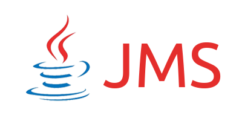<!-- {"left" : 0, "top" : 6.34, "height" : 1.22, "width" : 2.44} --> &nbsp; <!-- {"left" : 2.56, "top" : 6.34, "height" : 1.22, "width" : 1.41} --> &nbsp; <!-- {"left" : 4.31, "top" : 6.34, "height" : 1.22, "width" : 2.49} --> &nbsp; <!-- {"left" : 7.13, "top" : 6.34, "height" : 1.22, "width" : 3} -->


Notes:


---

# Kafka Intro

---


## Apache Kafka


 * Kafka is a Publisher / Subscriber (Pub-Sub) messaging system

 * Distributed
     - Scales seamlessly

 * High throughput
     - Capable of handling billions of messages per day

 * Replicated
     - Safeguards data in case of machine failures

 * Created @ LinkedIn in 2010
    - Now Apache Project (Open Source)

Notes:


---
## Why LinkedIn Built Kafka?

* Lots of databases
  - Built to store data
  - Piles of data: relational / key-value / caches / search indexes

* What is missing?
  - Something to handle the continuous flow of data

<!-- {"left" : 8.4, "top" : 1.08, "height" : 2.16, "width" : 1.7} -->

* Hence, LinkedIn built Kafka from scratch

* **Trivia: Why name it Kafka?**   
  Kafka's co-creator Jay Kreps says "Kafka is optimized for writing"  and named after popular author [Franz Kafka](https://en.wikipedia.org/wiki/Franz_Kafka)


---

## What Happened Then

* Kafka started as
  - powering real-time applications
  - data flow
  - in social network

* Kafka continued as
  - next-generation architectures
  - retailers redo their business process as continuous business stream
  - car companies are collecting and processing real-time data streams
  - banks are rethinking their fundamental processes

---
## What Kafka is Like and Not Like
* Compare to
  - enterprise messaging systems
  - big data systems like Hadoop
  - data integration or ETL tools
* But not like them
  - NOT ActiveMQ, RabbitMQ, IBM's MQSeries
    - runs on a cluster and can scale to 1000s of nodes
    - replaces hand-wires message brokers
  - NOT a regular storage system
    - replicated
    - persistent
    - but can be kept around as long as you like
  - NOT ETL
    - instead of scraping data here and putting it there
    - re-organize data as continuous stream
* So... **a streaming platform**


---

## Kafka Timeline

| year       | version | description                                                                                                          |
|------------|---------|----------------------------------------------------------------------------------------------------------------------|
| 2011 |         | Open sourced                                                                                                         |
| 2012 Oct    |         | Apache incubator                                                                                                     |
| 2015  | 0.9     | - Security (Kerberos, encryption),</br>- Kafka connect: connect other systems to Kafka,</br>- Quotas (multi tenancy) |
| 2016       | 0.10    | - Producers for Unit testing                                                                                         |
| 2017       | 0.11    | - Exactly once delivery                                                                                              |
| 2017 Oct   | 1.0     |                                                                                                                      |
| 2018 Jul   | 2.0     |&nbsp;|                                                                                                                      |

<!-- {"left" : 0.25, "top" : 1.13, "height" : 5.06, "width" : 9.75} -->


Notes:


---

## Kafka Use Cases / Powered By


 * LinkedIn
     - 200 billion messages / day
     - 400 nodes, Multiple data centers (mirroring)
     - Used for: website interactions / sending emails / metrics
 * Netflix
     - 80 billion events / day
     - 1.5 million events / sec @ peak hours
 * Spotify
     - Event delivery system
     - User interactions (add to play list ..etc)
 * Find more use cases at: [BigDataUseCases.info](https://bigdatausecases.info)

<!-- {"left" : 1.4, "top" : 7.12, "height" : 0.76, "width" : 2.29} --> &nbsp; &nbsp; <!-- {"left" : 4.31, "top" : 7.12, "height" : 0.76, "width" : 1.63} --> &nbsp; &nbsp; <!-- {"left" : 6.56, "top" : 7.12, "height" : 0.76, "width" : 2.51} -->


Notes:

- https://cwiki.apache.org/confluence/display/KAFKA/Powered+By
- http://techblog.netflix.com/2013/12/announcing-suro-backbone-of-netflixs.html
- https://labs.spotify.com/2016/02/25/spotifys-event-delivery-the-road-to-the-cloud-part-i/
- https://labs.spotify.com/2016/03/03/spotifys-event-delivery-the-road-to-the-cloud-part-ii/


---
## Kafka's Growth

* Used by tens of thousands of organizations

* Including over a third of the Fortune 500

* Among the fastest growing open source projects

* Immense ecosystem around it

* At the heart of a movement towards managing and processing streams of data


---

## Kafka Benchmarks

| Benchmark          | Hardware                                                                                                  | Performance                                                                                                           |
|--------------------|-----------------------------------------------------------------------------------------------------------|-----------------------------------------------------------------------------------------------------------------------|
| By Linkedin @ 2014 | 3 machines,</br>- Xeon 2.5 G , 6 cores,</br>- Six 7200 RPM SATA drives,</br>- 32 G RAM,</br>- 1G ethernet | Multiple test setups.,</br>One throughput,</br>- 80 MB / sec,</br>- 2 million messages / sec (each message 100 bytes) |

<!-- {"left" : 0.25, "top" : 4.32, "height" : 1.77, "width" : 9.75} -->

<br/>


 * The machines are medium scale

 * Notice more than one disk per machine

Notes:

https://engineering.linkedin.com/kafka/benchmarking-apache-kafka-2-million-writes-second-three-cheap-machines


---

## Why Is Kafka Very Fast?


 * Write: Disk writes are buffered in page cache

 * Read: The data from page cache can be transferred to network interface very efficiently
     - 99% of the time data is read from page cache, no disk access at all.(source: Loggly)

<!-- {"left" : 2.53, "top" : 3.67, "height" : 4.2, "width" : 5.18} -->


Notes:


---

## Kafka vs. Other Message Queues


 * **Message deletion**

 *  **Other Message Queues**:
     - In Most systems, after a message is 'read' it can be deleted

 *  **Kafka:**
     - Messages are NOT deleted after they are consumed.
     - There is not even a client API to delete a message.
     - Messages are expired by Kafka automatically after a certain time (7 days default)
     - Deletion is possible if compaction is enabled (more on this later).

 *  **Reason**: Many applications can subscribe to a topic.  A client deleting a message can deprive other clients of their input

Notes:


---

## Kafka vs. Other Message Queues


 * **Message read order**

 *  **Other Message Queues**:
     - Usually messages are read in order
     - FF & Rewind are not performant operations

 *  **Kafka:**
     - Messages can be read in any order
     - Fast-forward & Rewind are very fast operations

 *  **Reason**: Clients can choose to skip messages if need to be

Notes:


---

## Kafka vs. Other Message Queues

 * **Message processing guarantee**

 *  **Other Message Queues**:
     - Hard to guarantee one message will only be processed by one client

 *  **Kafka:**
     - Guarantees messages are sent to one consumer
     - No duplicate message processing
     - (more on this in 'offset management' section)

Notes:


---

## Kafka vs. Other Message Queues


 * **Concurrency With Multiple Applications**

 *  **Other Message Queues**:

     - Usually one / small number of clients can access simultaneously

 *  **Kafka:**

     - Large number of clients can read / write to Kafka at high speed

     - No locking / blocking

Notes:


---

## How is Kafka Different From Other Message Queues?

| Feature                                                                         | Kafka                                                          | Other Queue Systems                           |
|---------------------------------------------------------------------------------|----------------------------------------------------------------|-----------------------------------------------|
| **Deleting messages**                                                           | Clients can not delete.,</br>Kafka auto-expires </br>messages  | Clients can delete                            |
| **Message processing order**                                                    | Can read in or out-of order                                    | Usually read in order                         |
| **Message processing guarantee**                                                | Kafka guarantee no </br>duplicate processing of a </br>message | Usually no                                    |
| **Concurrent read / write**                                                     | Supported.,</br>High throughput                                | Low throughput due to </br>locking & blocking |
| **Message priorities**                                                          | None                                                           | Yes                                           |
| **Message ACKs,(Client notify </br>producer that a </br>message is processed)** | No                                                             | May be                                        |

<!-- {"left" : 0.25, "top" : 1.49, "height" : 5.32, "width" : 9.75} -->

Notes:


---

# ZooKeeper

[ZooKeeper](zookeeper-primer.md)


---

## Kafka And Zookeeper

<!-- {"left" : 6.44, "top" : 1.37, "height" : 3.27, "width" : 3.53} -->

 * Kafka uses ZK

 * Starting from v0.8 Kafka requires ZK

 * Kafka brokers

     - Cluster membership

     - Topic configuration (partitions, replicas ..etc)

     - Consumer assignments

 * Clients don't have ZK dependency</br>starting from v0.9 (discussed later)


Notes:

Thanks to: https://www.quora.com/What-is-the-actual-role-of-ZooKeeper-in-Kafka


---

## Lab Prep

* **Instructions for Instructor**

<!-- {"left" : 7.24, "top" : 1.28, "height" : 3.63, "width" : 2.72} -->

 * Distribute  **kafka-labs.zip**  to students

 * Distribute cloud VM details and assign each student a VM

 * Walk students through logging in via
     - SSH
     - UI
        * Web based desktop (port 80)
        * Native VNC client


Notes:


---

## Lab: Installing Kafka

<!-- {"left" : 7.24, "top" : 1.28, "height" : 3.63, "width" : 2.72} -->


 *  **Overview**:   
   - Install Kafka on provided virtual machines

 *  **Builds on previous labs**:   
   - None

 *  **Approximate Time**:   
   - 30 - 40 mins

 *  **Instructions**:   
   - lab-1: labs/1-installing-kafka.md

 *  **To Instructor**:   
   - Please walk through this lab first on screen


Notes:


---

# Kafka Architecture

---


## Kafka Architecture


 * Kafka is designed as a  **Pub-Sub messaging system**

 *  **Producers**  publish messages

 *  **Consumers**  consume messages

<!-- {"left" : 2.51, "top" : 3.36, "height" : 3.93, "width" : 5.22} -->


Notes:


---

## Kafka Architecture


 * Kafka is designed to run on many nodes as a cluster

 * Kafka machines are called 'brokers'

 * Kafka automatically backs up data on at least another machine (broker)

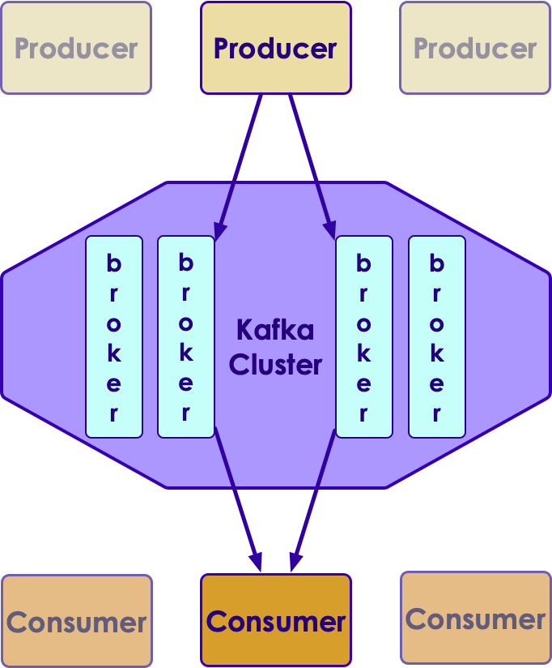<!-- {"left" : 3.17, "top" : 3.43, "height" : 4.72, "width" : 3.91} -->


Notes:


---

## Kafka Terminology


 * Roles
     -  **Producers**: write data to Kafka
     -  **Consumers**: read data from Kafka
     -  **Brokers**: Kafka nodes
     -  **Zookeeper**: Keep track of brokers

 * Data
     -  **Message:**  'basic unit' of data in Kafka
     -  **Topics**: Messages are organized as topics
     -  **Partitions**: Topics are split into partitions
     -  **Commit Log**: How data is organized

 * Advanced
     - **Consumer Group**: a set of consumers for scaling
     - **Offset**: message's position within a partition

Notes:


---

## A Kafka Use Case: 'My Connect'


 * Features
     - User's can connect with each other
     - Users can send messages to each other
     - Analyze user's usage pattern to customize home page
     - System metrics and diagnostics

 * Design
     - We will use a message queue instead of database
     - We are going to send messages for each event
        * Each user email is sent as a message
        * System metrics are sent as events

Notes:


---

## 'My Connect' Design


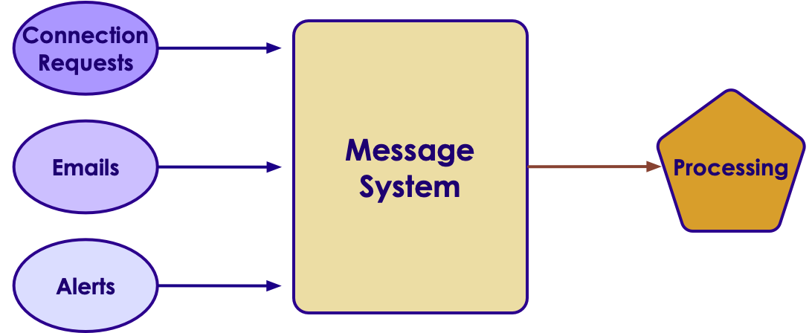<!-- {"left" : 0.49, "top" : 2.63, "height" : 3.8, "width" : 9.27} -->


Notes:


---

## Kafka Concepts


 * In Kafka a basic unit of data is a  **'message'**
     - Message can be email / connection request / alert event

 * Messages are stored in  **'topics**'
     - Topics are like 'queues'
     - Sample topics could be: `emails` / `alerts`

<!-- {"left" : 2.53, "top" : 4.3, "height" : 2.84, "width" : 5.2} -->


Notes:


---

## Topics


 * Analogous to a 'queue' in a queuing system

 * Logical / virtual entity

 * We can set expiration-times & replication settings per topic

 * Topics are broken into smaller units called partitions
     - One to many ( 1 -> M)
     - Think HDFS file -> blocks

<!-- {"left" : 0.39, "top" : 4.86, "height" : 2.78, "width" : 9.47} -->


Notes:


---

## Partitions


 * Partition is a physical entity

 * This is where data lives

 * One partition resides on ONE machine ( 1 to 1)

 * One machine will host many partitions ( N <-> M)

     - Possibly from many topics

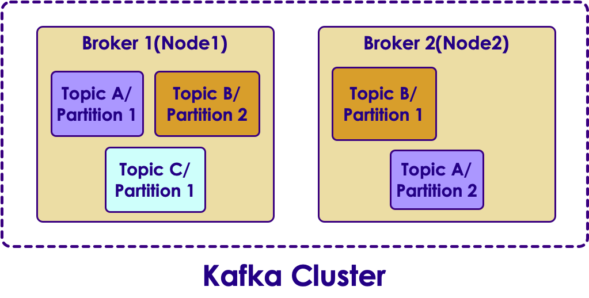<!-- {"left" : 1.44, "top" : 4.4, "height" : 3.67, "width" : 7.37} -->


Notes:


---

## Partitions / Replicas


 * One partition is stored in one machine (broker)
 * Partitions are replicated to prevent data loss, in case a machine crashes
 * Default setup is 2 copies (one primary, one replica)
     - One broker is the ' **owner** ' for a partition
 * Replicas are purely there to prevent data loss
 * Replicas are never written to,  nor read from
     - So increasing number of replicas does not increase throughput

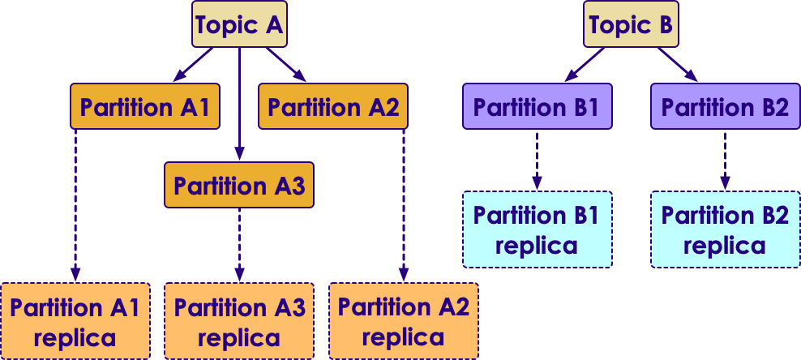<!-- {"left" : 1.7, "top" : 5.41, "height" : 3.07, "width" : 6.84} -->


Notes:


---

## Kafka Architecture Topics + Partitions + Replicas


<!-- {"left" : 2.09, "top" : 1.74, "height" : 6.16, "width" : 6.08} -->


Notes:


---

## Commit Log

<!-- {"left" : 7.47, "top" : 1.14, "height" : 2.83, "width" : 2.56} -->

 * In Kafka, data is stored in  **commit logs**
 * Commit Log is  **simple file on disk** that stores message bytes
 * Messages are always  **appended**  (to the end) of commit log
     - Commit log can not be modified in the middle ( **immutable** )
 * Commit log maintains order of messages
     - So clients can read messages in order
 * Provides high concurrency & high throughput
     - No locking
 * Each Partition has it's own commit log


<!-- {"left" : 1.81, "top" : 7.38, "height" : 1.49, "width" : 6.63} -->


Notes:


---

## Kafka Message

<!-- {"left" : 2.26, "top" : 7.27, "height" : 1.48, "width" : 5.73} -->

 * In Kafka basic 'data unit' is a message

 * Kafka treats messages as 'bunch of bytes'
     - Doesn't really care what the message payload is

 * Optionally messages can have metadata, like keys
    - Keys are bytes too
    - Keys are used to determine which partition to write to
        - Think 'hashing', Same key always go to same partition (more on this later)

 * Messages can have optional schema
     - Uses AVRO to specify schema
     - This is for the benefit of clients, Kafka doesn't care about schema


Notes:


---

## Putting It All Together: Topics / Partitions / Messages


 * Messages are written  **in order** on each partition

 * Partitions are  **ordered and immutable**

 *  **No order** maintained across partitions

 * Producers write at the end of partition (append)
     - Sequential writes -> higher throughput

<!-- {"left" : 1.02, "top" : 4.29, "height" : 2.97, "width" : 8.21} -->


Notes:


---

## Brokers

<!-- {"left" : 8.12, "top" : 2.34, "height" : 2.39, "width" : 1.98} -->


 * A Kafka broker is a Java process that runs on a  node (machine / host)
     - Runs as a daemon (background process)
 * One broker daemon per node
 * Brokers are designed to run as cluster
 * One broker is designated as controller
     - Selected automatically from all brokers
 * Controller
     - `administrator` of cluster
     - Monitors other brokers and handles failures
     - Assigns partition ownership
 * Performance
     - Usually bare metal preferred for performance  as opposed to virtualized machines
     - A single broker can handle thousands of partitions and millions of messages


---

## Broker Services

 * **Services to Producer**
     - Accepts messages from Producers
     - Assigns a unique offsets (incrementing) to messages
     - Commits the messages to commitlog

 * **Services to Consumer**
     - Serve message requests
     - Assign partitions to consumers in consumer groups


Notes:


---

## Kafka: Physical and Logical


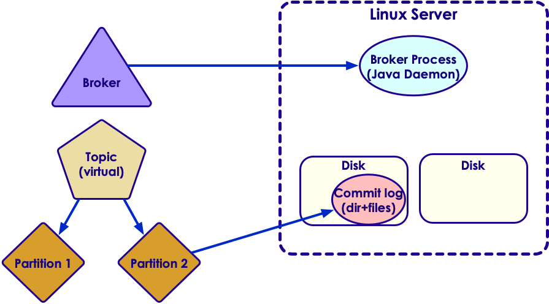<!-- {"left" : 1.05, "top" : 2.56, "height" : 4.52, "width" : 8.14} -->


Notes:


---

## Brokers / Leaders / Partitions / Replications


<!-- {"left" : 0.54, "top" : 2.56, "height" : 4.53, "width" : 9.16} -->


Notes:


---

## Brokers / Leaders / Partitions / Replications


 * Each partition has ONE broker as 'leader' (primary / owner)

 * One broker can be a leader for many partitions

     - One to many relationship

 * Producers write messages to partition leader

 * Data is then replicated into another broker by Kafka

 * Consumers also read from partition leader

Notes:


---

## Producers / Consumers / Topics / Partitions


<!-- {"left" : 1.27, "top" : 1.97, "height" : 5.7, "width" : 7.71} -->


Notes:


---

# Kafka Utilities

---


## Kafka Bundle

<!-- {"left" : 6.83, "top" : 1.3, "height" : 3.81, "width" : 3.16} -->

 *  **Bin**: has executables and utilities

 *  **Config**: config files

 *  **Libs**: jar files

 *  **Logs**: kafka logs


Notes:


---

## Kafka Command Utilities in BIN


 * Starting Kafka brokers

     - **bin/kafka-server-start**

     - **bin/kafka-server-stop**

 * Managing topics

     - **bin/kafka-topics**: Lists / create / delete topics

 * Sending Messages

     - **bin/kafka-console-producer.sh**

 * Consuming messages

     - **bin/kafka-console-consumer.sh**

Notes:


---

## Creating Topics


```bash
$   bin/kafka-topics.sh  --zookeeper localhost:2181  --list
# ... empty ...

## create a topic with one replica and two partitions
$  bin/kafka-topics.sh  --zookeeper localhost:2181  --create
--topic test --replication-factor 1  --partitions 2


$  bin/kafka-topics.sh --zookeeper localhost:2181 --describe --topic test

# Topic:test	PartitionCount:2	ReplicationFactor:1	Configs:	
# Topic: # test	Partition: 0	Leader: 0	Replicas: 0	Isr: 0	
# Topic: test	Partition: # 1	Leader: 0	Replicas: 0	Isr: 0

```
<!-- {"left" : 0, "top" : 1.07, "height" : 2.74, "width" : 10.25} -->

Notes:


---

## Using Producer / Consumer Utils


 *  **bin/**  **kafka**  **-console-producer**: utility for producing messages

 *  **bin/**  **kafka**  **-console-consumer**: utility for reading messages

<!-- {"left" : 0.88, "top" : 3.77, "height" : 3.55, "width" : 8.49} -->


Notes:


---

## Lab: Using Kafka Utilities

<!-- {"left" : 7.15, "top" : 1.3, "height" : 3.62, "width" : 2.71} -->


 *  **Overview**:
   - Use Kafka CLI tools

 *  **Builds on previous labs**:   
   - 1-install Kafka

 *  **Approximate Time**:   
   - 30 - 40 mins

 *  **Instructions**:   
    - lab-2: labs/2-kafka-utils.md

 *  **To Instructor**:


Notes:


---

# Producing / Consuming Messages

---


## Producing Messages

<!-- {"left" : 7.84, "top" : 1.17, "height" : 2.61 , "width" : 2.16} -->


 * Producers create new messages
 * Producers typically don't care which partition to write to
 * They will balance writing across multiple partitions.-> Provides scale & load balancing
 * Each message has a  **unique offset within a partition**
     - Increasing number (Long)
     - Added by Kafka automatically when a message is written
 * Producers ' **append** ' messages to the end of partition
 * If messages have a ' **key** '
     - A particular key is guaranteed to be written to the same partition
     - Done using hashing of key
     - Guarantees message order within a key

Notes:


---

## Writing To Partitions


 * Kafka randomly distributes data across partitions

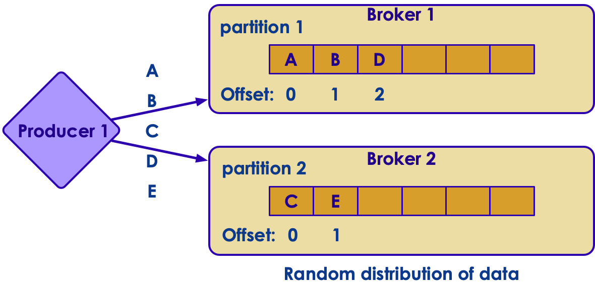<!-- {"left" : 1.02, "top" : 2.84, "height" : 3.97, "width" : 8.21} -->


Notes:


---

## Writing With Keys


 * Kafka will 'hash' same key to same partition

 * So all data for one key is maintained in order (as they are in ONE partition)

<!-- {"left" : 1.02, "top" : 3.79, "height" : 3.1, "width" : 8.21} -->


Notes:


---

## Class Discussion - Partition Data Skew

<!-- {"left" : 6.18, "top" : 1.34, "height" : 2.58, "width" : 3.89} -->


 * We are capturing network access logs in Kafka.

     - destination: google.com / yahoo.com  / facebook.com

     - User ID:

     - From IP Address:

     - Timestamp

 * Discuss the implication of choosing **key = destination**

 * Hint: Which domains do you think get a lot of traffic?

Notes:


---

## Batching of Messages


 * If each individual message is written to Kafka, this will increase network round trips.
     - Increased latency

 * Messages are written as batches
     - Reduces round trip
     - Increases throughput
     - Batches can be compressed (reduces network payload)

 * Large batches
     - Increase throughput
     - But it will take longer for individual messages to propagate

Notes:


---

## Consuming Messages


 * Consumers read messages off partitions

 * Consumers can subscribe one or more topics

 * They read messages in order (within a partition)

 * Resume from the  **offset**  of last message read

 * This offset is stored in Kafka ( **__offsets**  topic)

 * Consumers can resume after a crash by starting from the last seen offset

<!-- {"left" : 1.02, "top" : 5.64, "height" : 1.84, "width" : 8.21} -->


Notes:


---

## Consumer Group


 * Consumers belong to a  **consumer group**

 * A consumer group is  **collection of consumers** that consume a particular topic

 * Group makes sure each partition is only processed by one consumer  (no duplicate processing)

 * One partition is only read by one consumer

 * One consumer can read one or more partitions (one to many relationship)

 * Partition to consumer is mapping is called  **ownership**

Notes:


---

## Consumer Group


<!-- {"left" : 0.31, "top" : 3.3, "height" : 3.04, "width" : 9.62} -->


Notes:


---

## Partition Assignment for Consumer Group


 * Old Consumer depended on ZK for group management

 * New Consumers use the built-in group coordination protocol built into Kafka itself

     - Removes ZK dependency for clients

     - Faster allocation times

 * For each group, one broker is selected as  **group coordinator**

 * Group coordinator handles partition assignment

     - when new consumers arrive,

     - When old consumers leave

Notes:


---

## Putting It All Together


 * Consumers can read at a different pace than producers
     - If consumers fall behind in processing, messages are safely stored in Kafka
 * Consumers can scale with partitions using ownerships
     - 1-consumer-to-1 partition  or1 consumer-to-many-partitions
 * If a consumer fails, partition ownership is assigned to other consumers ( **rebalancing** )

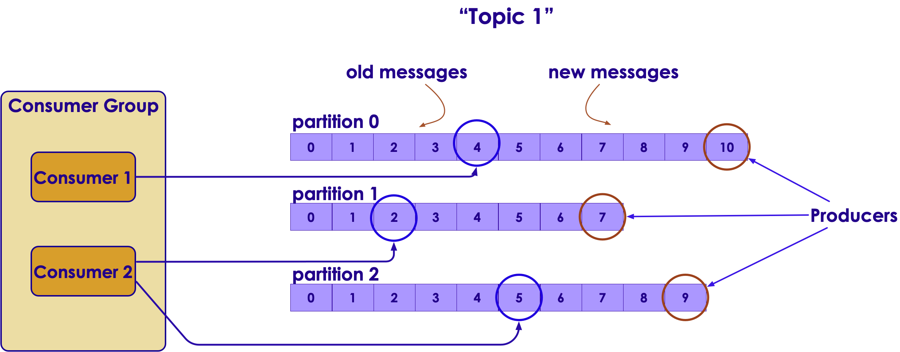<!-- {"left" : 1.02, "top" : 4.77, "height" : 3.22, "width" : 8.21} -->


Notes:


---

## Partition Rebalance


 * When a new consumer joins a consumer group, partitions are re-assigned.

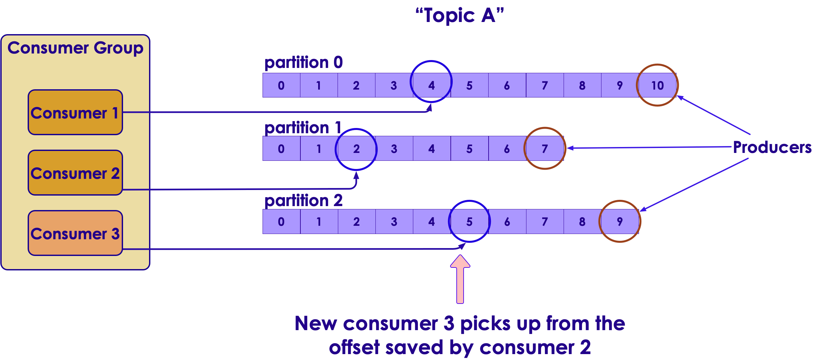<!-- {"left" : 1.02, "top" : 3, "height" : 3.64, "width" : 8.21} -->


Notes:


---

## Partition Rebalance Triggers


 * New consumers joining a consumer group
     - Sending a heartbeat to Group Coordinator (Kafka broker)

 * Consumers leaving a consumer group
     - a consumer crashes
     - Doesn't send heartbeat in time
     - Adjust  **max.poll.interval.ms and session.timeout.ms** to set the timeout

 * Topic is modified by adding more partitions

 * During rebalance period (usually few seconds) all consumers in a consumer group don't have access to data
     - 'Holding pattern'

Notes:


---

## Multiple Consumer Groups


 * Multiple consumer groups can read data  **independently** , without interfering with each other

 * Remember, reading a message doesn't delete it Kafka

     - Different semantics than other Q systems

<!-- {"left" : 1.02, "top" : 3.7, "height" : 3.65, "width" : 8.21} -->


Notes:


---

## Consumer Behavior


 * One consumer reads all partitions

<!-- {"left" : 1.42, "top" : 2.7, "height" : 4.25, "width" : 7.41} -->


Notes:


---

## Consumer Behavior


 * Consumers share partitions

<!-- {"left" : 1.06, "top" : 2.49, "height" : 4.66, "width" : 8.13} -->


Notes:


---

## Consumer Behavior


 * 1-1 mapping for partitions and consumers

     - Maximum scalability

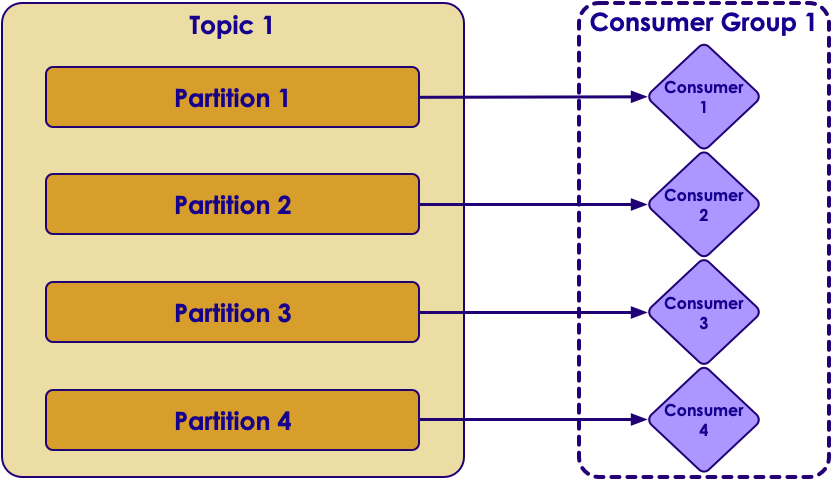<!-- {"left" : 1.59, "top" : 2.79, "height" : 4.07, "width" : 7.07} -->


Notes:


---

## Consumer Behavior


 * Too many consumers.  Some are idle

     - Not a good use of resources

 *  **Quiz: How can we fix this scenario?**

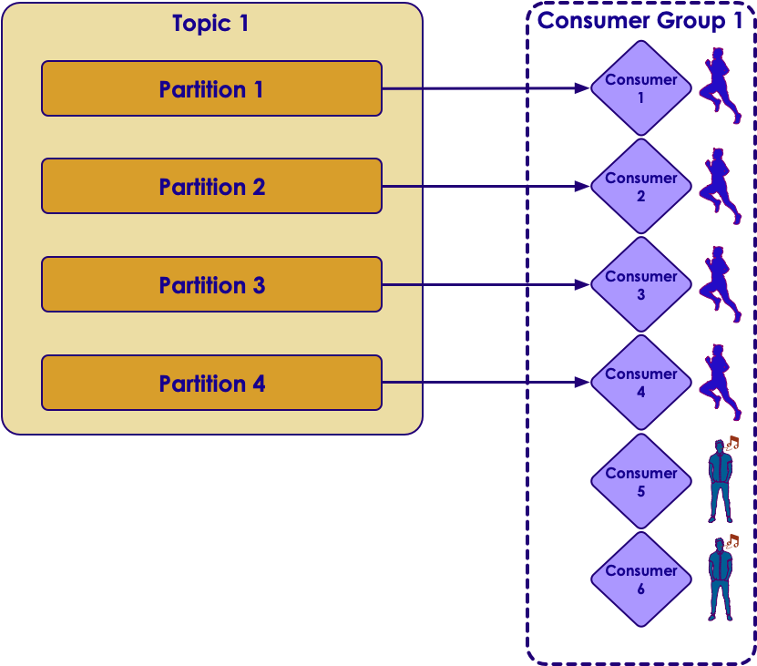<!-- {"left" : 2.66, "top" : 3.52, "height" : 4.07, "width" : 4.94} -->


Notes:


---

## Message Retention

 *  **Period based**
    - Retention period is configured per topic
    - Default is  **7 days**
    - Examples:
       - Topic "emails": store for 7 days
       - Topic "metrics": store for 2 hours
       - Topic "alerts": store 1 day

 *  **Size based**
    - Retention can be size-limited per topic
    - Once the limit is reached, Kafka will expire and purge messages automatically
    - Example:
       - Topic "temp_sensor": size limit 10 GB

Notes:


---

# Log Compaction

---


## Log Compaction

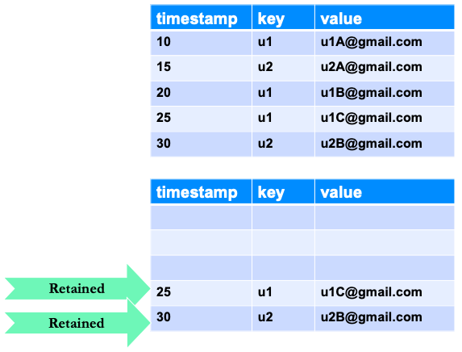<!-- {"left" : 5.84, "top" : 2.77, "height" : 3.23, "width" : 4.24} -->

 * Retains latest value of every key in the log.

 * Used in scenarios where only latest value is needed

 * For example, the changes to a database table

 *  See the diagram on right   
 original data (before compaction) on top, after compaction at the bottom


Notes:

Key 1 @ 00:19 and key 6 @ 01:17 are retended.


---

## Log Compaction Illustrated


 * Offsets don't change after compaction (Offsets uniquely identify messages)

<!-- {"left" : 1.22, "top" : 3.02, "height" : 4.93, "width" : 7.81} -->


Notes:


Image source: https://kafka.apache.org/documentation/


---

## Log Compaction


 * Head of log is same as traditional log model
 * Consumers can read all messages from log head
 * Tail is compacted
 * Kafka keeps track of head and tail
 * Compacted offsets are valid and next highest offset value is read
     - Eg: 3 , 4 and 5 are equivalent (3 and 4 are missing because of compaction)

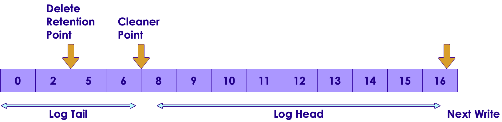<!-- {"left" : 1.02, "top" : 5.03, "height" : 2, "width" : 8.21} -->


Notes:


---

## Log Compaction Basics


 * The compaction is done in the background by Log Cleaner.

 * Log Cleaner uses a pool of background threads

     - that recopy log segment files,

     - removing records whose key appears in the head of the log

 *  **log .cleaner.min.compaction.lag.ms**: The minimum time a message will remain uncompacted in the log. Only applicable for logs that are being compacted.

Notes:


---

## Delete in compaction

<!-- {"left" : 5.1, "top" : 2.74, "height" : 3.25, "width" : 5.02} -->

 * A delete marker deletes prior messages with the same key.

 * It is a message with a key and null value payload.

 * It is no longer retained after delete retention point.

 * Will be deleted after delete retention point.


Notes:


---

## Multi Data Center Deployment


 * Kafka is very network intensive

     - Lots of traffic between nodes / brokers

 * So we don't want to 'split' a Kafka cluster across multiple data centers:

     - Not enough bandwidth for a single cluster.

<!-- {"left" : 1.11, "top" : 4.87, "height" : 2.73, "width" : 8.03} -->


Notes:


---

## Multi Data Center Deployment


 * Multi data center deployments are useful for
     - Disaster recovery
     - Isolating data according to local laws.E.g. European Union has stricter privacy rules.  So data collected there has to be hosted in a data center in EU.
 * Kafka has a utility called 'mirror maker'
 * It acts as both consumer and producer
     - It consumes data from one cluster
     - Turns around and 'produces' data into another cluster

<!-- {"left" : 1.31, "top" : 5.64, "height" : 2.59, "width" : 7.63} -->


Notes:


---

## 'My Connect' Design


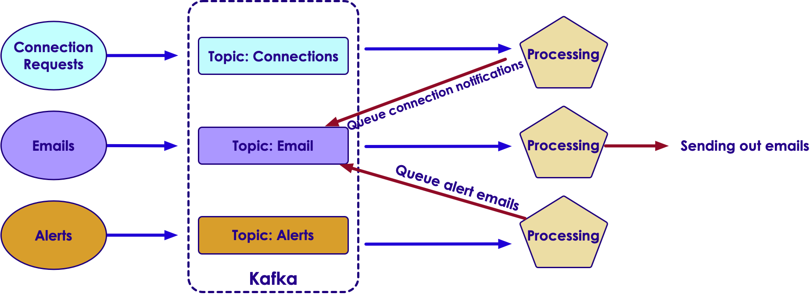<!-- {"left" : 0.74, "top" : 2.21, "height" : 4.65, "width" : 8.78} -->


Notes:


---

## Review Questions


<!-- {"left" : 6.03, "top" : 1.26, "height" : 2.82, "width" : 4.23} -->


 * How is Kafka different from
     - Hadoop
     - Database

 * Having more replicas will increase cluster throughput  
 True / False

 * Having more partitions will increase cluster throughput  
 True / False

Notes:
