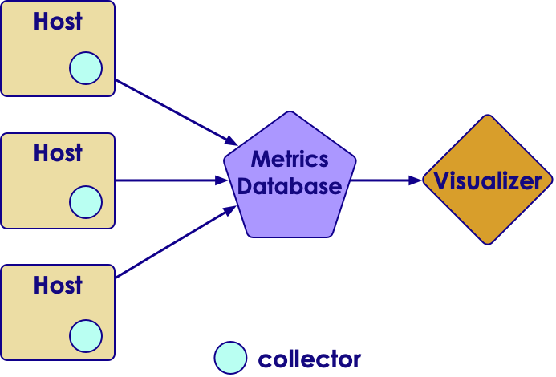

# Metrics


---


## Lesson Objectives


 * Learn how to instrument Kafka code

Notes: 

 


---

# Metrics Intro

---


## Metrics


 * Metrics tell us how a system / application is behaving

 * Useful for monitoring the health and performance of systems / applications

 * Two kinds of metrics

     - System (host level) metrics: CPU / Memory / Disk / Network ..etc.

     - Application metrics: function timers, database query times ..etc

Notes: 


---

## Metrics Mechanics


 * 3 main components: collector, database, visualizer

 * Collector

     - Collects metrics from the host and pushes to database

 * Database

     - Collects and stores metrics from various sources

     - Performs aggregations (current rate / last_1m rate / min / max)

     - A time-series database

 * Visualizer

     - Create nice looking visualizations of metrics

     - Various graphs

Notes: 


---

## Metrics Mechanics


<!-- {"left" : 0.7, "top" : 1.53, "height" : 6.01, "width" : 8.86} -->


Notes: 


---

## Metrics Database Choices

| Graphite                                       | InfluxDB                               | OpenTSDB                                           |
|------------------------------------------------|----------------------------------------|----------------------------------------------------|
| Popular choice                                 | Another popular choice                 | Based on HBase                                     |
| Easy to setup and maintain                     | Easy to setup and maintain             | Considerable effort required to setup and maintain |
| May not scale well for large amount of metrics | Good performance                       | Massively scalable                                 |
| open source                                    | Not open source (Single instance free) | Open source                                        |

<!-- {"left" : 0.25, "top" : 1.39, "height" : 3.07, "width" : 9.75} -->


<!-- {"left" : 0.37, "top" : 5.6, "height" : 0.91, "width" : 2.84} -->
&nbsp;<!-- {"left" : 3.67, "top" : 5.51, "height" : 1.08, "width" : 2.5} --> &nbsp;&nbsp; &nbsp;<!-- {"left" : 7.13, "top" : 5.77, "height" : 0.56, "width" : 2.74} -->

---

## Metrics Visualization - Grafana

<!-- {"left" : 2.01, "top" : 1.33, "height" : 4.01, "width" : 6.23} -->


<br/>

 * Modern, Open source

 * Very attractive graphs

 * Easy to setup and use

 * Supports multiple databases: Graphite / Influx / OpenTSDB


Notes: 

Image used under fair use , source: grafana.org


---

## Integrated Monitoring Choices - Nagios

<!-- {"left" : 2.17, "top" : 1, "height" : 4.14, "width" : 5.92} -->

<br/>
<br/>

 *  [**Nagios**](https://www.nagios.org/)

 * Scalable 

 * Very well field tested

 * Host level and application level monitoring

 * Large plugin library

 * User friendliness: medium


Notes: 


---

## Integrated Monitoring Choices - Ganglia

<!-- {"left" : 2.52, "top" : 1.16, "height" : 3.91, "width" : 5.21} -->


 * [**Ganglia**](ganglia.info/) 

 * Scalable 

 * Very well field tested

 * Host level and application level monitoring


Notes: 


---

# Metrics Library

---

## Metrics Demo 

<!-- {"left" : 0.45, "top" : 2.46, "height" : 4.73, "width" : 9.34} -->


---


## Metrics Library


 *  **Metrics**  is a Java library, that is used to report metrics.Formerly known as   *codahale*  *metrics* (authored by Coda Hale)

 * Light weight and fast

 * Widely used by many projects (Hadoop / Spark / Cassandra)

 * Supported backends: Graphite, Ganglia

 * Supported UIs: built-in UI,   JMX

 * http://metrics.dropwizard.io/ 

Notes: 

http://metrics.dropwizard.io/
https://github.com/dropwizard/metrics


---

## Metrics Library Getting Started


 * Metrics is a Java library

```xml
<dependencies>
  <dependency>
    <groupId>io.dropwizard.metrics</groupId>
    <artifactId>metrics-core</artifactId>
    <version>3.2.2</version>
  </dependency>
</dependencies> 
```
<!-- {"left" : 0, "top" : 1.78, "height" : 2.47, "width" : 8.65} -->


Notes: 


---

## Metrics Library Getting Started


```java
import java.util.concurrent.TimeUnit;
import com.codahale.metrics.ConsoleReporter;
import com.codahale.metrics.JmxReporter;
import com.codahale.metrics.MetricFilter;
import com.codahale.metrics.MetricRegistry;
import com.codahale.metrics.graphite.Graphite;
import com.codahale.metrics.graphite.GraphiteReporter;

private final MetricRegistry metrics = new MetricRegistry();

// console reporter
ConsoleReporter consoleReporter =
ConsoleReporter.forRegistry(metrics).convertRatesTo(TimeUnit.SECONDS)
        .convertDurationsTo(TimeUnit.MILLISECONDS).build();
consoleReporter.start(30, TimeUnit.SECONDS);

// graphite
final Graphite graphite = new Graphite(new
InetSocketAddress("localhost", 2003));
final GraphiteReporter graphiteReporter
GraphiteReporter.forRegistry(metrics).prefixedWith("myapp")

  .convertRatesTo(TimeUnit.SECONDS)
  .convertDurationsTo(TimeUnit.MILLISECONDS)
  .filter(MetricFilter.ALL)
  .build(graphite);
graphiteReporter.start(30, TimeUnit.SECONDS);  
```
<!-- {"left" : 0, "top" : 1.46, "height" : 6.81, "width" : 10.25} -->

Notes: 


---

## Metrics Library: Meters


 * A meter measures the rate of events over time.(e.g., "requests per second"). 

 * In addition to the mean rate, meters also track 1-, 5-, and 15-minute moving averages.

```java
private final Meter requests = metrics.meter("requests");

public void handleRequest(Request request, Response response) {
    requests.mark();
} 
```
<!-- {"left" : 0, "top" : 3.36, "height" : 1.58, "width" : 10.25} -->

<!-- {"left" : 1.63, "top" : 5.88, "height" : 2.43, "width" : 6.99} -->


Notes: 


---

## Metrics Library: Counters


 * A counter is used to 'count' things.Number of messages in queue, ...etc

 * Counter is an AtomicLongCan be incremented or decremented

```java
private final Counter msgCounter = metrics.counter("messages-in
q");

msgCounter.inc();
msgCounter.inc(10);

msgCounter.dec();
msgCounter.dec(5); 

```
<!-- {"left" : 0, "top" : 3.06, "height" : 2.37, "width" : 10.25} -->

<!-- {"left" : 1.45, "top" : 5.68, "height" : 2.89, "width" : 7.36} -->


Notes: 


---

## Metrics Library: Histograms


 * A  **histogram**  measures the statistical distribution of values in a stream of data. 

 * In addition to minimum, maximum, mean, etc., it also measures median, 75th, 90th, 95th, 98th, 99th, and 99.9th percentiles.

```java
private final Histogram msgSizes = metrics.histogram( "message_sizes");

msgSizes.update(100);
msgSizes.update(50); 
 
```
<!-- {"left" : 0, "top" : 3.73, "height" : 1.17, "width" : 10.25} -->

<!-- {"left" : 0.45, "top" : 5.72, "height" : 2.29, "width" : 9.36} -->


Notes: 


---

## Metrics Library: Timers


 * A  **timer**  measures the duration of piece of code

 * Also measures the rate the code is called

```java
private final Timer timerExec = metrics.timer("execTime"));

Timer.Context context = timerExec.time();
// do some work here
f();  // calling a function
context.stop(); 
```
<!-- {"left" : 0, "top" : 2.38, "height" : 1.98, "width" : 10.25} -->

<!-- {"left" : 1.51, "top" : 5.02, "height" : 2.67, "width" : 7.22} -->


Notes: 


---

## Lab 8: Metrics Labs


 *  **Overview:** Create and use Kafka streams

 *  **Builds on previous labs:** 

 *  **Approximate Time:** 30 - 40 mins

 *  **Instructions:** 

     - Please follow: lab 8

 *  **To Instructor:** 


Notes: 


---

# Kafka and Metrics

---


## Kafka Streams + Metrics


```java
import com.codahale.metrics.MetricRegistry;
import com.codahale.metrics.Meter;
import com.codahale.metrics.Timer;

private final MetricRegistry metrics = new MetricRegistry();
// register listener (Console & Graphite)

final Meter meterEvents = metrics.meter("events");
final Timer timerExec = metrics.Timer("time_to_process"); 
// ...snip...
final KStream<String, String> clickstream = // create stream

// process each record and report traffic
clickstream.foreach(new ForeachAction<String, String>() {
   public void apply(String key, String value) { 
     meterEvents.mark(); // got the event!
     
     Timer.Context context = timerExec.time();
     // process the event
     context.stop();
  }
});
// start the stream 
```
<!-- {"left" : 0, "top" : 1.5, "height" : 6.64, "width" : 10.25} -->


Notes: 


---

## Lab 9: Kafka Metrics Labs


 *  **Overview:** Use Metrics with Kafka

 *  **Builds on previous labs:** 

 *  **Approximate Time:** 30 - 40 mins

 *  **Instructions:** 

     - Please follow: lab 9

 *  **To Instructor:** 


Notes: 


---

## Review Questions


Notes: 

 


---

## Lesson Summary


Notes: 

 


