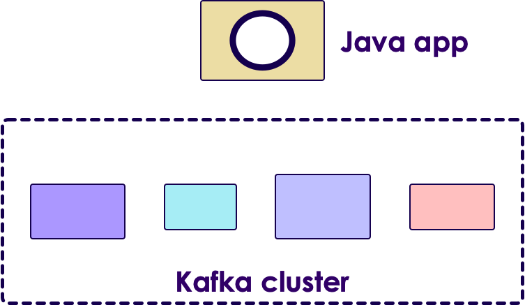

# Kafka Streams Intro

---

## Lesson Objectives

* Learn Kafka Streams architecture

* Learn Kafka Streams API

Notes:

---

# Kafka Streams Intro

---

## Streaming Platforms

* Kafka is a messaging bus

* The 'processing' portion was done outside Kafka

<!-- {"left" : 0.93, "top" : 2.92, "height" : 3.79, "width" : 8.39} -->

Notes:

---

## Kafka Application Using Java

- Pros: easy, simple

- Cons: not scalable, not fault tolerant

<!-- {"left" : 1.2, "top" : 2.55, "height" : 4.55, "width" : 7.84} -->

---

## Kafka Application Using Spark

- Pros: distributed, fault tolerant, lots of functionality

- Cons:
    - Need to setup and maintain a Spark cluster
    - Not so simple

<!-- {"left" : 1.62, "top" : 3.15, "height" : 5.49, "width" : 7.01} -->

---

## Case for Kafka Streams

<!-- {"left" : 6.03, "top" : 1.69, "height" : 2.55, "width" : 3.99} -->

- Java / Python application using Kafka Producer/Consumer APIs
    * Simple
    * Limited capability

- Distributed systems like  Spark / Flink
    * Excellent capabilities
    * Complex

- 'Kafka Streams' aims to fill the sweet spot between capabilities & complexities

Notes:

---

## Kafka Streams Features

* Kafka Streams is a **client-side** library for building distributed applications for Kafka

* Event-based processing (one event at a time). Not micro batch

* Stateful processing for joins / aggregations

* High level operations (map, filter, reduce)

* **Not** designed for analytics like Spark or Hive

Notes:

---

## Comparing Streams

- **Kafka Streams motto - "Build apps, not clusters"**

<br />

|      | Simple Java App                              | Kafka Streams                                | Distributed Streaming <br/>Frameworks                                                                                 |
|------|----------------------------------------------|----------------------------------------------|-----------------------------------------------------------------------------------------------------------------------|
|      | Using Java/ Python                           | Java                                         | Spark / Flink / Samza                                                                                                 |
|      |                                              |                                              |                                                                                                                       |
| Pros | -Simple to implement <br/>- Simple to deploy | -Simple to implement,<br/>- Simple to deploy | - Distributed out of the box,<br/>- Very good scaling,<br/>- Excellent capabilities like windowing / machine learning |
|      |                                              |                                              |                                                                                                                       |
| Cons | - Hard to scale                              | - Medium difficulty                          | - Heavy weight,<br/>- Complex operations,<br/>- Need to build a cluster,<br/>- Monitor / maintain                     |

<!-- {"left" : 0.25, "top" : 2.04, "height" : 5.59, "width" : 9.75, "columnwidth" : [0.88, 2.88, 2.88, 3.11]} -->

Notes:

---

# Kafka Streams API

---

## Kafka Streams (Abbreviated)

```java
// ** 1 : configure **
Properties config = new Properties();
config.put(ConsumerConfig.BOOTSTRAP_SERVERS_CONFIG, "localhost:9092");
config.put(StreamsConfig.APPLICATION_ID_CONFIG, "kafka-streams-consumer1");
config.put(StreamsConfig.DEFAULT_KEY_SERDE_CLASS_CONFIG, Serdes.String().getClass().getName());
config.put(StreamsConfig.DEFAULT_VALUE_SERDE_CLASS_CONFIG, Serdes.String().getClass().getName());

// ** 2 : define processing **
final StreamsBuilder builder = new StreamsBuilder();
final KStream < String, String > clickstream = builder.stream("topic1");// topic

clickstream.print(Printed.toSysOut());


// ** 3 : start the stream **
final KafkaStreams streams = new KafkaStreams(builder.build(), config);
streams.cleanUp();
streams.start();

Runtime.getRuntime().addShutdownHook(new Thread(streams::close));  
```
<!-- {"left" : 0, "top" : 1.28, "height" : 4.98, "width" : 10.25} -->

Notes:

---

## Lab: Kafka Streams Intro

<!-- {"left" : 6.76, "top" : 0.88, "height" : 4.37, "width" : 3.28} -->

* **Overview:**
    - Getting started with Kafka Streams

* **Approximate Time:**
    - 10 - 15 mins

* **Instructions:**
     - Please follow: lab 7.1

* **To Instructor:**
    - Please demo this lab on screen and do it together with students

Notes:

---

## Streams Operations

| Function     | Description                                                   |
|----------    |-----------------------------------------------------------    |
| ForEach      | Process one record at a time                                  |
| Filter       | Filter stream event by event                                  |
| map          | Transform the stream,<br/>(key1, value1) => (key2, value2)     |
| groupBy      | Group the stream by key                                       |
| count        | Count the stream                                              |

<!-- {"left" : 0.25, "top" : 1.2, "height" : 3.19, "width" : 9.75} -->

Notes:

---

## Kafka Streams: ForEach

```java
final StreamBuilder builder = new StreamBuilder();
final KStream < String, String > clickstream = builder.stream("topic1");

// Foreach : process events one by one
clickstream.foreach(new ForeachAction < String, String >() {

     public void apply(String key, String value) {

        logger.debug("key:" + key + ", value:" + value);
    }
});
```
<!-- {"left" : 0, "top" : 1.36, "height" : 2.66, "width" : 10.25} -->

* Using Java 8 Lambda functions

Notes:

---

## Lab: Kafka Streams Foreach

<!-- {"left" : 6.76, "top" : 0.88, "height" : 4.37, "width" : 3.28} -->

* **Overview:**
    - Kafka Streams: Foreach

* **Approximate Time:**
    - 10 - 15 mins

* **Instructions:**
     - Please follow: lab 7.2

* **To Instructor:**
    - Please demo this lab on screen and do it together with students

Notes:

---

## Kafka Streams: Filter

<!-- {"left" : 1.83, "top" : 1.28, "height" : 1.18, "width" : 6.59} -->

* Applying a filter to a stream produces another stream

<!-- {"left" : 0.27, "top" : 3.7, "height" : 3.17, "width" : 9.71} -->

Notes:

---

## Kafka Streams  : Filter

```java
final StreamBuilder builder = new StreamBuilder();
final KStream < String, String > clickstream = builder.stream("topic1");


// filter clicks only
final KStream<String, String> actionClickedStream = clickstream.filter((key, value) -> {
            try {
                ClickstreamData clickstreamData = gson.fromJson(value, ClickstreamData.class);
                return ((clickstreamData.action != null) && (clickstreamData.action.equals("clicked")));

            } catch (Exception e) {
                return false;
            }

        });

// another quick filter
final KStream < String, String > actionClickedStream =
    clickstream.
    filter((k, v) -> v.contains("action:clicked"));

actionClickstream.print(Printed.toSysOut());
```
<!-- {"left" : 0, "top" : 1.14, "height" : 2.43, "width" : 10.25} -->

<!-- {"left" : 0.46, "top" : 5.41, "height" : 1.02, "width" : 9.32} -->

Notes:

---

## Lab: Kafka Streams Filter

<!-- {"left" : 6.76, "top" : 0.88, "height" : 4.37, "width" : 3.28} -->

* **Overview:**
    - Kafka Streams Filter

* **Approximate Time:**
    - 10 - 15 mins

* **Instructions:**
     - Please follow: lab 7.3

* **To Instructor:**
    - Please demo this lab on screen and do it together with students

Notes:

---

## Kafka Streams: Map

* Map  **transforms**  a stream into another stream

* KStream<key1, value1>  ->   KStream <key2, value2>

* Map action

<!-- {"left" : 0.69, "top" : 3.42, "height" : 0.97, "width" : 8.87} -->

<!-- {"left" : 1.06, "top" : 5.33, "height" : 2.83, "width" : 8.14} -->

Notes:

---

## Kafka Streams: Map

```java
final StreamsBuilder builder = new StreamsBuilder();
final KStream < String, String > clickstream = builder.stream("topic1");

// map transform (String, String) to  (String, Integer)
final Gson gson = new Gson();

// k1 = domain,   v1 = {json}
// k2 = action    v2 = 1
final KStream<String, Integer> actionStream = clickstream.map (
    new KeyValueMapper<String, String, KeyValue<String, Integer>>() {

        public KeyValue<String, Integer> apply(String key, String value) {
            try {
                ClickstreamData clickstreamData = gson.fromJson(value, ClickstreamData.class);

                String action = clickstreamData.action;

                KeyValue<String, Integer> actionKV = new KeyValue<>(action, 1);

                return actionKV;
            } catch (Exception ex) {
                logger.error("", ex);
                return new KeyValue<String, Integer>("unknown", 1);
            }
        }
    });

}
);
actionStream.print(Printed.toSysOut());
```
<!-- {"left" : 0, "top" : 1.2, "height" : 4.34, "width" : 10.25} -->

Notes:

---

## Lab: Kafka Streams Map

<!-- {"left" : 6.76, "top" : 0.88, "height" : 4.37, "width" : 3.28} -->

* **Overview:**
    - Kafka Streams: Map

* **Approximate Time:**
    - 10 - 15 mins

* **Instructions:**
     - Please follow: lab 7.4

* **To Instructor:**
    - Please demo this lab on screen and do it together with students

Notes:

---

## Kafka Streams: GroupBy

* GroupBy will aggregate KStream by key

* Think of it like 'group by' operator in SQL

<!-- {"left" : 0.49, "top" : 3.28, "height" : 1.02, "width" : 9.27} -->

<!-- {"left" : 0.31, "top" : 5.32, "height" : 3.13, "width" : 9.63} -->

Notes:

---

## Lab: Kafka Streams GroupBy

<!-- {"left" : 6.76, "top" : 0.88, "height" : 4.37, "width" : 3.28} -->

* **Overview:**
    - Kafka Streams: groupby

* **Approximate Time:**
    - 10 - 15 mins

* **Instructions:**
     - Please follow: lab 7.5

* **To Instructor:**
    - Please demo this lab on screen and do it together with students

Notes:

---

## Kafka Streams: Join Example

* [Source](https://developer.confluent.io/learn-kafka/kafka-streams/joins/)

```java
KStream<String, String> leftStream = builder.stream("topic-A");
KStream<String, String> rightStream = builder.stream("topic-B");

ValueJoiner<String, String, String> valueJoiner = (leftValue, rightValue) -> {
    return leftValue + rightValue;
};
leftStream.join(rightStream, 
                valueJoiner, 
                JoinWindows.of(Duration.ofSeconds(10)));
```

---

# KTable

---

## KStreams vs. KTables

* **Kstream**

   - Each record/message represents an independent entity/event irrespective of its key.

* **Ktable**

   - Messages with same key are treated as updates of previous message.

```java
//-------- KStream example ------

// reading from Kafka
KStream < byte[], String > textLines = builder.stream("textlines-topic",
            Consumed.with(Serdes.ByteArray(), Serdes.String()));

// Transforming data 
KStream < byte[], String > upperCaseLines = textLines.mapValues(String::toUpperCase));
```
<!-- {"left" : 0, "top" : 1.74, "height" : 1.83, "width" : 10.25} -->

```java
// ------ KTable Example ----

KTable < String, Long > wordCounts = textLines.flatMapValues(
        textLine -> Arrays.asList(textLine.toLowerCase().split("\\W+"))).
        groupBy((key,word) -> word).
        count()

```
<!-- {"left" : 0, "top" : 4.39, "height" : 1.61, "width" : 10.25} -->

Notes:

---

## Joins on Kstream and KTables

| Kstream + KStream                                                                                 | Ktable + KTable                                                                                                                                           | KTable + KStream                                                                          |
|-----------------------------------------------------------------------------------------------    |-------------------------------------------------------------------------------------------------------------------------------------------------------    |---------------------------------------------------------------------------------------    |
| It is a sliding window join.,<br/>Results a KStream,<br/>Supports Left, Inner and Outer Joins     | Symmetric non-window join.,<br/>Results a continuously updating Ktable.,<br/>Supports Left, Inner and Outer Joins,<br/>(think like 2 database tables)     | Asymmetric non-window join.,<br/>Results a KStream.,<br/>Supports Left and Inner join     |

<!-- {"left" : 0.25, "top" : 1.44, "height" : 2.36, "width" : 9.75} -->

Notes:

---

## Kafka Streams: GroupBy

```java
final StreamsBuilder builder = new StreamsBuilder();
final KStream < String, String > clickstream = builder.stream( "topic1");

// map transform (String, String) --> (String, Integer)

final KStream < String, Integer > actionStream = clickstream.map( ... )

// Now aggregate and count actions
// we have to explicitly state the K,V serdes in groupby,
// as the types are changing

final KTable < String, Long > actionCount = actionStream
   .groupByKey(Serialized.with(Serdes.String(), Serdes.Integer()))
   .count ();

actionCount.toStream().print(Printed.toSysOut());
```
<!-- {"left" : 0, "top" : 1.27, "height" : 3.49, "width" : 10.25} -->

Notes:

---

## Wordcount in Kafka Streams

```java
// Serializers/deserializers (serde) for String and Long types
final Serde < String > stringSerde = Serdes.String();
final Serde < Long > longSerde = Serdes.Long();

// Construct a `KStream` from the input topic "topic1", where message values
// represent lines of text (for the sake of this example, we ignore whatever may be stored
// in the message keys).
KStream < String, String > textLines = builder.stream("topic1",
.with(stringSerde, stringSerde);

KTable < String, Long > wordCounts = textLines
    // Split each text line, by whitespace, into words.
    .flatMapValues(value -> Arrays.asList(value.toLowerCase().split("\\W+")))

    // Group the text words as message keys
    .groupBy((key, value) -> value)

    // Count the occurrences of each word (message key).
    .count();

// Store the running counts as a changelog stream to the output topic.
wordCounts.toStream().to("topic1-out", Produced.with(Serdes.String(), Serdes.Long()));
```

<!-- {"left" : 0, "top" : 1.28, "height" : 3.95, "width" : 10.25} -->

Notes:

---

## Windowing Operations

* Windowing is a common function in event processing

    - What is the average CPU utilization?

        * Over the last 5 minutes?

* Create groups of records with the  *same key* for aggregations or joins into " **windows** "

<!-- {"left" : 1.19, "top" : 4.64, "height" : 3.17, "width" : 7.88} -->

Notes:

---

## Windowing Parameters

* Retention Period

    - How long to wait for late-arriving records for a given window

* Advance Period/Interval

    - How much to move the window forward relative to the last one

* Window Size

    - Size of the window i.e. how long is the window in time units

* Maintain Period

    - How long to keep the window alive

Notes:

---

## Windowing Example

* TimeWindows.of("cpu-window", 60*1000)

    - Returns a time window of 1 min.

    - Advance period of 1 min.

    - Window maintained for 1 day

* Modify various parameters using functions in TimeWindows class

* https://kafka.apache.org/20/javadoc/org/apache/kafka/streams/kstream/TimeWindows.html

Notes:

---

## Counts visits per hour

```java
KStreamBuilder builder = new KStreamBuilder();
KStream < String, Long > visitsStream = builder.stream(Serdes.String(), Serdes.Long(),
                                     "visitsTopic");

// Group and count visits per URL/page
KGroupedStream < String, Long > groupedStream =
visitsStream.groupByKey();
KTable < String, Long > totalCount = groupedStream.count("totalVisitCount");

// Create window for visits per hour
KTable < Windowed < String >, Long > windowedCount =
groupedStream.count(TimeWindows.of(60 * 60 * 1000), "hourlyVisitCount");
```
<!-- {"left" : 0, "top" : 1.3, "height" : 2.42, "width" : 10.25} -->

Notes:

---

## Lab: Kafka Streams Windows

<!-- {"left" : 6.76, "top" : 0.88, "height" : 4.37, "width" : 3.28} -->

* **Overview:**
    - Kafka Streams: Windows

* **Approximate Time:**
    - 10 - 15 mins

* **Instructions:**
     - Please follow: lab 7.6

* **To Instructor:**
    - Please demo this lab on screen and do it together with students

Notes:

---

## Review and Q&A

<!-- {"left" : 8.56, "top" : 1.21, "height" : 1.15, "width" : 1.55} -->
<!-- {"left" : 6.53, "top" : 2.66, "height" : 2.52, "width" : 3.79} -->

* Let's go over what we have covered so far

* Any questions?

---

# Backup Slides

---

## Modifying RocksDB Configuration

* Setting cache size to 16 Meg

```java
public static class CustomRocksDBConfig implements RocksDBConfigSetter {
   @Override
   public void setConfig (final String storeName, final Options options,
   final Map < String, Object > configs) {

       BlockBasedTableConfig tableConfig = new
org.rocksdb.BlockBasedTableConfig();

     tableConfig.setBlockCacheSize(16 * 1024 * 1024L);
     /*
      * set more configuration here
      */
  }
}
Properties streamsSettings = new Properties();
streamsSettings.put(
  StreamsConfig.ROCKSDB_CONFIG_SETTER_CLASS_CONFIG,
  CustomRocksDBConfig.class);
```
<!-- {"left" : 0, "top" : 2.13, "height" : 4.03, "width" : 10.25} -->

Notes:

Code Description

Default rocks db configuration can be changed be creating a class implementing the RocksDBConfigSetter interface

And set the configurations as setConfig method(overridden) .

Add the class as a configuration to ROCKSDB_CONFIG_SETTER_CLASS_CONFIG

---

## Processor Topology

<!-- {"left" : 6.82, "top" : 1.65, "height" : 4.23, "width" : 2.98} -->

* Defines the logic for the application

* Topology is a graph

    - Nodes: Stream processors

    - Edges: Streams

* **Source processor**

    - Has no upstream processors. *Reads* topic

* **Sink processor**

    - Has no downstream processor. *Writes* topic

Notes:

---

## State Store

<!-- {"left" : 6.81, "top" : 3.03, "height" : 3.58, "width" : 3.17} -->

* Stateful operations like (Aggregations / Joins) require intermediate state storage

* Kafka Streams provides this storage at per node level

* Storage mediums
    - In memory cache
    - RocksDB (a very fast embedded DB, developed by Facebook)  
     Stored on disk on each node

* Tasks uses it to store and query data

* Every task can have one or more state stores

* Fault tolerant

* Automatic recovery

Notes:

---

## Replication and Fault Tolerance

* Kafka Partitions are replicated and highly available

* If Streams task fails

    - Kafka will restart it on another running instance of the application

* Stream data persisted to Kafka is still available in case application fails and wants to re-process it

* Local state stores are replicated as a topic called  **changelog**

    - **Changelog** has log compaction enabled

Notes:

---

## Overall Architecture

<!-- {"left" : 1.85, "top" : 1.64, "height" : 6.36, "width" : 6.55} -->

Notes:

- Here we see a Streams application,
- It is consuming messages from input Q
- And producing messages to another output Q

---

## Writing a Streams Application


* Use Kafka Streams DSL

    - High level API

    - Provides most common required functions for transformation, grouping, aggregation

* Use Processor API

    - Low-level API

    - Create, connect processors in topology and interact with State Stores directly

Notes:

---

## Why Streaming from Database (CDC)?

* Integrations with Legacy Applications‫
  - Avoid dual writes when integrating with legacy systems
* Smart Cache Invalidation
  - Automatically invalidate entries in a cache as soon as the record(s) for entries change or are removed.
* Monitoring Data Changes
  - Immediately react to data changes committed by application/user.
* Data Warehousing
  - Atomic operation synchronizations for ETL-type solutions.
* Event Sourcing (CQRS)
* ‫Totally ordered collection of events to asynchronously update the read-only views while writes can be recorded as normal

Notes:

---
