# Kafka Streams Intro


---


## Lesson Objectives


 * Learn Kafka Streams architecture

 * Learn Kafka Streams API

Notes:


---

# Kafka Streams Intro

---


## Streaming Platforms

* Kafka is a messaging bus

* The 'processing' portion was done outside Kafka


<!-- {"left" : 0.93, "top" : 2.92, "height" : 3.79, "width" : 8.39} -->


Notes:


---


## Kafka Application Using Java

- Pros: easy, simple

- Cons: not scalable, not fault tolerant

<!-- {"left" : 1.2, "top" : 2.55, "height" : 4.55, "width" : 7.84} -->


---

## Kafka Application Using Spark

- Pros: distributed, fault tolerant, lots of functionality

- Cons:
    - Need to setup and maintain a Spark cluster
    - Not so simple

<!-- {"left" : 1.62, "top" : 3.15, "height" : 5.49, "width" : 7.01} -->


---

## Kafka Application Using Kafka Streams

<!-- {"left" : 0.4, "top" : 2.08, "height" : 5.49, "width" : 9.46} -->


---

## Case for Kafka Streams

<!-- {"left" : 6.03, "top" : 1.69, "height" : 2.55, "width" : 3.99} -->


- Java / Python application using Kafka Producer/Consumer APIs
    * Simple
    * Limited capability

- Distributed systems like  Spark / Flink
    * Excellent capabilities
    * Complex

- 'Kafka Streams' aims to fill the sweet spot between capabilities & complexities

Notes:


---

## Kafka Streams Features


 * Kafka Streams is a **client-side** library for building distributed applications for Kafka

 * Features:

     - Event-based processing (one event at a time). Not micro batch

     - Stateful processing for joins / aggregations

     - High level operations (map, filter, reduce)

     - **Not** designed for analytics like Spark or Hive

Notes:


---

## Comparing Streams

- **Kafka Streams motto - "Build apps, not clusters"**


|      | Simple Java App                              | Kafka Streams                                | Distributed Streaming <br/>Frameworks                                                                                 |
|------|----------------------------------------------|----------------------------------------------|-----------------------------------------------------------------------------------------------------------------------|
|      | Using Java/ Python                           | Java                                         | Spark / Flink / Samza                                                                                                 |
|      |                                              |                                              |                                                                                                                       |
| Pros | -Simple to implement <br/>- Simple to deploy | -Simple to implement,<br/>- Simple to deploy | - Distributed out of the box,<br/>- Very good scaling,<br/>- Excellent capabilities like windowing / machine learning |
|      |                                              |                                              |                                                                                                                       |
| Cons | - Hard to scale                              | - Medium difficulty                          | - Heavy weight,<br/>- Complex operations,<br/>- Need to build a cluster,<br/>- Monitor / maintain                     |

<!-- {"left" : 0.25, "top" : 2.04, "height" : 5.59, "width" : 9.75, "columnwidth" : [0.88, 2.88, 2.88, 3.11]} -->

Notes:

---

## Kafka Streams Architecture

<!-- {"left" : 6.67, "top" : 1.7, "height" : 4.5, "width" : 3.49} -->

 * A  **Stream Partition** is an ordered set of records and maps to a Topic partition

 * A  **Data Record** in the stream => maps to a Kafka message

 * A  **Task**  processes a fixed set of partitions

     - Stream tasks can be processed parallely

 * A  **Thread**  executes one or more tasks


Notes:

Kafka Streams allows the user to configure the number of threads to parallelize processing within an application instance.
No state is shared across threads. So you can start as many threads as there are input Kafka topic partitions so that every thread's tasks has at least one partition to process


---

## Scaling Kafka Streams


<!-- {"left" : 1.02, "top" : 1.72, "height" : 6.21, "width" : 8.21} -->


Notes:


---

## Processor Topology

<!-- {"left" : 6.82, "top" : 1.65, "height" : 4.23, "width" : 2.98} -->


 * Defines the logic for the application

 * Topology is a graph

     - Nodes: Stream processors

     - Edges: Streams

 *  **Source processor**

     - Has no upstream processors. *Reads* topic

 *  **Sink processor**

     - Has no downstream processor. *Writes* topic


Notes:


---

## State Store

<!-- {"left" : 6.81, "top" : 3.03, "height" : 3.58, "width" : 3.17} -->


 * Stateful operations like (Aggregations / Joins) require intermediate state storage

 * Kafka Streams provides this storage at per node level

 * Storage mediums
     - In memory cache
     - RocksDB (a very fast embedded DB, developed by Facebook)  
     Stored on disk on each node

 * Tasks uses it to store and query data

 * Every task can have one or more state stores

 * Fault tolerant

 * Automatic recovery


Notes:


---

## Modifying RocksDB Configuration


```java
public static class CustomRocksDBConfig implements RocksDBConfigSetter {
   @Override
   public void setConfig (final String storeName, final Options options,
   final Map<String, Object> configs) {

       BlockBasedTableConfig tableConfig = new
org.rocksdb.BlockBasedTableConfig();

     tableConfig.setBlockCacheSize(16 * 1024 * 1024L);
     /*
      * set more configuration here
      */
  }
}
Properties streamsSettings = new Properties();
streamsSettings.put(
  StreamsConfig.ROCKSDB_CONFIG_SETTER_CLASS_CONFIG,
  CustomRocksDBConfig.class);
```
<!-- {"left" : 0, "top" : 1.4, "height" : 4.03, "width" : 10.25} -->


Notes:

Code Description

Default rocks db configuration can be changed be creating a class implementing the RocksDBConfigSetter interface

And set the configurations as setConfig method(overridden) .

Add the class as a configuration to ROCKSDB_CONFIG_SETTER_CLASS_CONFIG


---

## Replication and Fault Tolerance


 * Kafka Partitions are replicated and highly available

 * If Streams task fails

     - Kafka will restart it on another running instance of the application

 * Stream data persisted to Kafka is still available in case application fails and wants to re-process it

 * Local state stores are replicated as a topic called  **changelog**

     -  **Changelog** has log compaction enabled

Notes:


---

## Overall Architecture


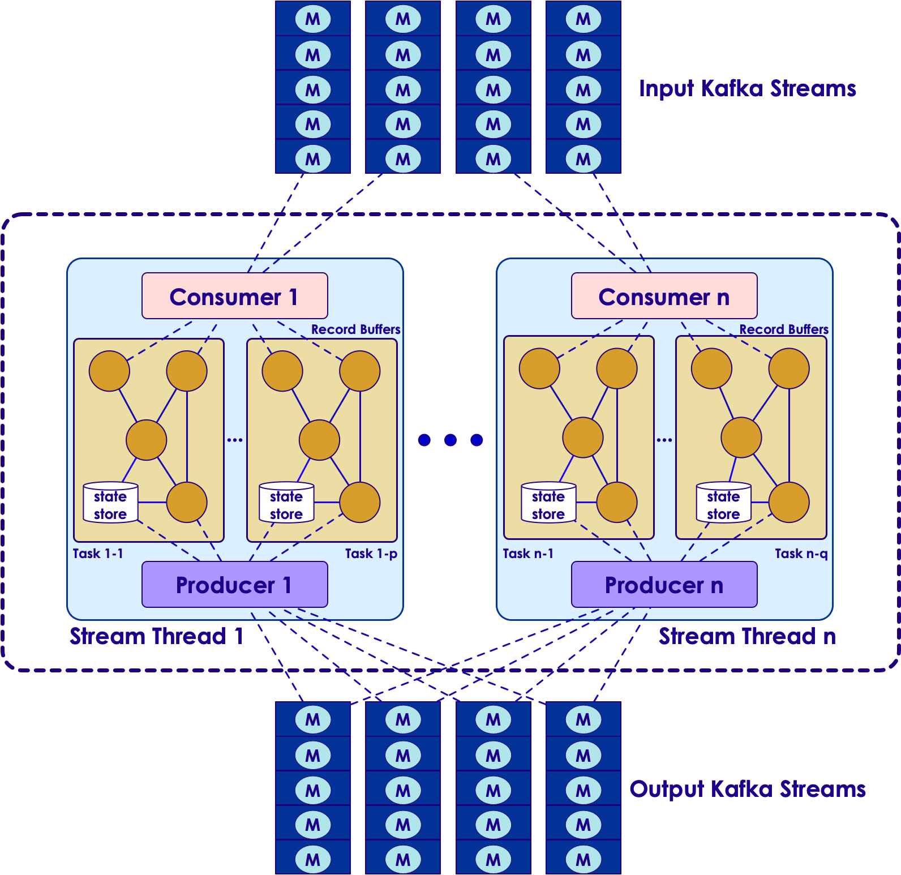<!-- {"left" : 1.85, "top" : 1.64, "height" : 6.36, "width" : 6.55} -->


Notes:

Here we see a Streams application,
It is consuming messages from input Q
And producing messages to another output Q


---

# Kafka Streams Details

---


## Writing a Streams Application


 * Use Kafka Streams DSL

     - High level API

     - Provides most common required functions for transformation, grouping, aggregation

 * Use Processor API

     - Low-level API

     - Create, connect processors in topology and interact with State Stores directly

Notes:


---

## Kafka Streaming (Abbreviated)


```java
// ** 1 : configure **
Properties config = new Properties();
config.put(ConsumerConfig.BOOTSTRAP_SERVERS_CONFIG,
       "localhost:9092");
config.put(StreamsConfig.APPLICATION_ID_CONFIG,
       "kafka-streaming-consumer1");
config.put(StreamsConfig.DEFAULT_KEY_SERDE_CLASS_CONFIG,
       Serdes.String().getClass().getName());
config.put(StreamsConfig.DEFAULT_VALUE_SERDE_CLASS_CONFIG,
       Serdes.String().getClass().getName());

// ** 2 : define processing **
final StreamsBuilder builder = new StreamsBuilder();
final KStream<String, String> clickstream = builder.stream("topic1");// topic

clickstream.print(Printed.toSysOut());


// ** 3 : start the stream **
final KafkaStreams streams = new KafkaStreams(builder.build(), config);
streams.cleanUp();
streams.start();

Runtime.getRuntime().addShutdownHook(new Thread(streams::close));  
```
<!-- {"left" : 0, "top" : 1.28, "height" : 4.98, "width" : 10.25} -->


Notes:


---

## Streaming Operations

| Function     | Description                                                   |
|----------    |-----------------------------------------------------------    |
| ForEach      | Process one record at a time                                  |
| Filter       | Filter stream event by event                                  |
| map          | Transform the stream,<br/>(key1, value1) => (key2, value2)     |
| groupBy      | Group the stream by key                                       |
| count        | Count the stream                                              |


<!-- {"left" : 0.25, "top" : 1.2, "height" : 3.19, "width" : 9.75} -->

Notes:


---

## Kafka Streaming: ForEach


```java
final StreamBuilder builder = new StreamBuilder();
final KStream<String, String> clickstream = builder.stream("topic1");

// Foreach : process events one by one
clickstream.foreach(new ForeachAction<String, String>() {

     public void apply(String key, String value) {

     logger.debug("key:" + key + ", value:" + value);
    }
});
```
<!-- {"left" : 0, "top" : 1.36, "height" : 2.66, "width" : 10.25} -->

 * Using Java 8 Lambda functions

Notes:


---

## Kafka Streaming: Filter

<!-- {"left" : 1.83, "top" : 1.28, "height" : 1.18, "width" : 6.59} -->


 * Applying a filter to a stream produces another stream

<!-- {"left" : 0.27, "top" : 3.7, "height" : 3.17, "width" : 9.71} -->


Notes:


---

## Kafka Streaming  : Filter


```java
final StreamBuilder builder = new StreamBuilder();
final KStream<String, String> clickstream = builder.stream("topic1");

// filter clicks only
final KStream<String, String> actionClickedStream =

    clickstream.
    filter((k, v) -> v.contains("action:clicked"));

actionClickstream.print(Printed.toSysOut());
```
<!-- {"left" : 0, "top" : 1.14, "height" : 2.43, "width" : 10.25} -->


<!-- {"left" : 0.46, "top" : 5.41, "height" : 1.02, "width" : 9.32} -->


Notes:


---

## Kafka Streaming: Map


 * Map  **transforms**  a stream into another stream

 * KStream<key1, value1>  ->   KStream <key2, value2>

 * Map action

<!-- {"left" : 0.69, "top" : 3.42, "height" : 0.97, "width" : 8.87} -->


<!-- {"left" : 1.06, "top" : 5.33, "height" : 2.83, "width" : 8.14} -->

Notes:


---

## Kafka Streaming: Map


```java
final StreamsBuilder builder = new StreamsBuilder();
final KStream<String, String> clickstream = builder.stream("topic1");

// map transform (String, String) to  (String, Integer)
final KStream<String, Integer> actionStream = clickstream.map( {

     // new KeyValueMapper<String, String, KeyValue<String, Integer>>()

   public KeyValue<String, Integer> apply(String key, String value) {

      logger.debug("map() : got : " + value);
      String new_key = key.toUpperCase();
      int new_value = 1;
      KeyValue<String, Integer> newKV =new KeyValue<>(new_key, new_value);
      logger.debug("map() : returning : " + newKV);
      return newKV;
  }
}
);
actionStream.print(Printed.toSysOut());
```
<!-- {"left" : 0, "top" : 1.2, "height" : 4.34, "width" : 10.25} -->


Notes:


---

## Kafka Streaming: GroupBy


 * GroupBy will aggregate KStream by key

 * Think of it like 'group by' operator in SQL


<!-- {"left" : 0.49, "top" : 3.28, "height" : 1.02, "width" : 9.27} -->


<!-- {"left" : 0.31, "top" : 5.32, "height" : 3.13, "width" : 9.63} -->


Notes:


---

## KStreams vs. KTables


 *  **Kstream**

   - Each record/message represents an independent entity/event irrespective of its key.

 *  **Ktable**

   - Messages with same key are treated as updates of previous message.

Notes:


---

## Joins on Kstream and KTables

| Kstream + KStream                                                                                 | Ktable + KTable                                                                                                                                           | KTable + KStream                                                                          |
|-----------------------------------------------------------------------------------------------    |-------------------------------------------------------------------------------------------------------------------------------------------------------    |---------------------------------------------------------------------------------------    |
| It is a sliding window join.,<br/>Results a KStream,<br/>Supports Left, Inner and Outer Joins     | Symmetric non-window join.,<br/>Results a continuously updating Ktable.,<br/>Supports Left, Inner and Outer Joins,<br/>(think like 2 database tables)     | Asymmetric non-window join.,<br/>Results a KStream.,<br/>Supports Left and Inner join     |

<!-- {"left" : 0.25, "top" : 1.44, "height" : 2.36, "width" : 9.75} -->

Notes:


---

## Kafka Streams: GroupBy


```java
final StreamsBuilder builder = new StreamsBuilder();
final KStream<String, String> clickstream = builder.stream( "topic1");

// map transform (String, String) --> (String, Integer)

final KStream<String, Integer> actionStream = clickstream.map( ... )

// Now aggregate and count actions
// we have to explicitly state the K,V serdes in groupby,
// as the types are changing

final KTable<String, Long> actionCount = actionStream
   .groupByKey(Serialized.with(Serdes.String(), Serdes.Integer()))
   .count ();
actionCount.toStream().print(Printed.toSysOut());
```
<!-- {"left" : 0, "top" : 1.27, "height" : 3.49, "width" : 10.25} -->

Notes:


---

## Wordcount in Kafka Streams


```java
// Serializers/deserializers (serde) for String and Long types
final Serde<String> stringSerde = Serdes.String();
final Serde<Long> longSerde = Serdes.Long();

// Construct a `KStream` from the input topic "topic1", where message values
// represent lines of text (for the sake of this example, we ignore whatever may be stored
// in the message keys).
KStream<String, String> textLines = builder.stream("topic1",
.with(stringSerde, stringSerde);

KTable<String, Long> wordCounts = textLines
    // Split each text line, by whitespace, into words.
    .flatMapValues(value -> Arrays.asList(value.toLowerCase().split("\\W+")))

    // Group the text words as message keys
    .groupBy((key, value) -> value)

    // Count the occurrences of each word (message key).
    .count();

// Store the running counts as a changelog stream to the output topic.
wordCounts.toStream().to("topic1-out", Produced.with(Serdes.String(), Serdes.Long()));
```

<!-- {"left" : 0, "top" : 1.28, "height" : 3.95, "width" : 10.25} -->


Notes:


---

## Lab 7: Streams Labs


 *  **Overview:** Create and use Kafka streams

 *  **Builds on previous labs:**

 *  **Approximate Time:** 30 - 40 mins

 *  **Instructions:**

     - Please follow: lab 7.1 - 7.5

 *  **To Instructor:**


Notes:


---

## Windowing Operations


 * Windowing is a common function in event processing

     - What is the average CPU utilization?

        * Over the last 5 minutes?

 * Create groups of records with the  *same key* for aggregations or joins into " **windows** "

<!-- {"left" : 1.19, "top" : 4.64, "height" : 3.17, "width" : 7.88} -->


Notes:


---

## Windowing Parameters


 * Retention Period

     - How long to wait for late-arriving records for a given window

 * Advance Period/Interval

     - How much to move the window forward relative to the last one

 * Window Size

     - Size of the window i.e. how long is the window in time units

 * Maintain Period

     - How long to keep the window alive

Notes:


---

## Windowing Example


 * TimeWindows.of("cpu-window", 60*1000)

     - Returns a time window of 1 min.

     - Advance period of 1 min.

     - Window maintained for 1 day

 * Modify various parameters using functions in TimeWindows class

 * https://kafka.apache.org/20/javadoc/org/apache/kafka/streams/kstream/TimeWindows.html

Notes:


---

## Counts visits per hour


```java
KStreamBuilder builder = new KStreamBuilder();
KStream<String, Long> visitsStream = builder.stream(Serdes.String(), Serdes.Long(),
                                     "visitsTopic");

// Group and count visits per URL/page
KGroupedStream<String, Long> groupedStream =
visitsStream.groupByKey();
KTable<String, Long> totalCount = groupedStream.count("totalVisitCount");

// Create window for visits per hour
KTable<Windowed<String>, Long> windowedCount =
groupedStream.count(TimeWindows.of(60 * 60 * 1000), "hourlyVisitCount");
```
<!-- {"left" : 0, "top" : 1.3, "height" : 2.42, "width" : 10.25} -->


Notes:


---

## Lab 7: Windowing Lab


 *  **Overview:** Create time windows and aggregate data

 *  **Builds on previous labs:**

 *  **Approximate Time:** 30 - 40 mins

 *  **Instructions:**

     - Please follow: lab 7.6

 *  **To Instructor:**


Notes:


---

## Review Questions


 * What is Kafka Streams?

 * What is a task?

 * How does Streams keep track of state?

Notes:


---

# Advanced Kafka Streams


---


## Why Streaming from Database (CDC)?

* Integrations with Legacy Applications‫
  - Avoid dual writes when integrating with legacy systems
* Smart Cache Invalidation
  - Automatically invalidate entries in a cache as soon as the record(s) for entries change or are removed.
* Monitoring Data Changes
  - Immediately react to data changes committed by application/user.
* Data Warehousing
  - Atomic operation synchronizations for ETL-type solutions.
* Event Sourcing (CQRS)
* ‫Totally ordered collection of events to asynchronously update the read-only views while writes can be recorded as normal


Notes:


---

# Kafka Connect

---

## Kafka Connect - Overview

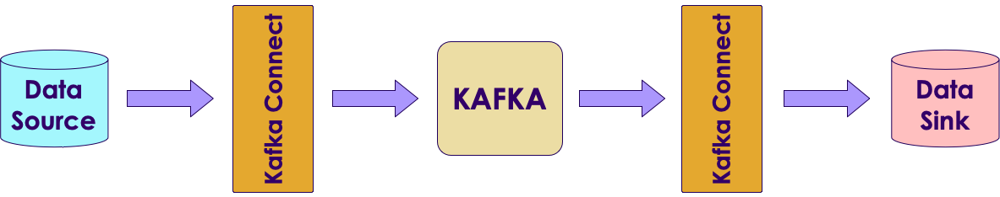

---

## Kafka Connect – Source / Confluent.io

* ActiveMQ
* DynamoDB
* MapRDB
* AWS Lambda
* HDFS
* Salesforce
* AWS CloudWatch
* Splunk
* Azure Events Hub
* IBM MQ
* AWS S3

---

## Kafka Connect – Source / Confluent.io

* Elasticsearch
* Cassandra
* Redshift
* Kinesis
* Teradata
* JDBC
* TIBCO
* Azure SQL Data Warehouse
* Oracle

---

## Kafka Connect – Sink / Confluent.io

* Azure Blob
* Google Cloud BigTable
* Flume
* JMS
* Azure Data Lake
* Apache HBase Sink
* HTTP
* IBM MQ
* Google BigQuery
* Flume as Consumer agents


---

## Kafka Connect

* **Connectors** – A logical process responsible for managing the copying of data between Kafka and
another system.


* There are two types of connectors

  - **Source Connectors** import data from another system
  - **Sink Connectors** export data from Kafka


* **Tasks** - Unit of process that handles assigned set of work load by connectors.
Connector configuration allows set to maximum number of tasks can be run by a connector.

* **Workers** – Unit of work that schedules connectors and tasks in a  process.

* There are two main type of workers: **standalone** and **distributed**

---
## Kafka Connect – Configuration

* **Common Connector Configuration**

  - name - Unique name for the connector. Attempting to register again with the same name will  fail.
  - connector.class - The Java class for the connector
  - tasks.max - The maximum number of tasks that should be created for this connector. The  connector may create fewer tasks if it cannot achieve this level of parallelism.

* **Please note** that connector configuration might vary, see specific connector documentation for  more information.

---
## Kafka Connect – Configuration

* **Distributed Mode - Worker Configuration**

  - bootstrap.servers - A list of host/port pairs to use for establishing the initial connection to the Kafka cluster.  
  - group.id - A unique string that identifies the Connect cluster group this worker belongs to.
  - config.storage.topic - The topic to store connector and task configuration data in. This must be the same for all  workers with the same group.id.
  - offset.storage.topic - The topic to store offset data for connectors in. This must be the same for all workers with the  same group.id
  - status.storage.topic - The name of the topic where connector and task configuration status updates are stored.
  - For more distributed mode worker configuration: http://docs.confluent.io/current/connect/userguide.html#configuring-workers

---
## Kafka Connect – Running an Instance

* It is recommended to run Kafka Connect on containerized environments such as Kubernetes, Mesos, Docker Swarm, or  YARN.

```text

$ docker run -d \
--name=kafka-connect \
--net=host \
-e CONNECT_BOOTSTRAP_SERVERS="kafka-broker:9092" \
-e CONNECT_GROUP_ID="group_1" \
-e CONNECT_CONFIG_STORAGE_TOPIC="kafka-connect-config" \
-e CONNECT_OFFSET_STORAGE_TOPIC="kafka-connect-offset" \
-e CONNECT_STATUS_STORAGE_TOPIC="kafka-connect-status" \
-e CONNECT_KEY_CONVERTER="org.apache.kafka.connect.json.JsonConverter" \
-e CONNECT_VALUE_CONVERTER="org.apache.kafka.connect.json.JsonConverter" \
-e CONNECT_INTERNAL_KEY_CONVERTER="org.apache.kafka.connect.json.JsonConverter" \
-e CONNECT_INTERNAL_VALUE_CONVERTER="org.apache.kafka.connect.json.JsonConverter" \
-e CONNECT_LOG4J_LOGGERS="io.debezium.connector.mysql=INFO" \
-v /opt/kafka-connect/jars:/etc/kafka-connect/jars \
--restart always \
confluentinc/cp-kafka-connect:3.3.0

```

* Kafka Connect distributed mode exposes port 8083 by default to serve management REST interface.


---

## Kafka Connect Best Practices – Advice from the Field

* best practices for configuring, managing, and tuning the connectors tools to monitor data flow through the pipeline using Kafka Streams applications to transform or enhance the data in flight

---
## How Blizzard Used Kafka to Save Data Pipeline

* "When Blizzard started sending gameplay data to Hadoop in 2013, we went through several iterations before settling on Flumes in many data centers around the world reading from RabbitMQ and writing to central flumes in our Los Angeles datacenter. While this worked at first, by 2015 we were hitting problems scaling to the number of events required. This is how we used Kafka to save our pipeline."


---

## Yelp’s Real-time Data Pipeline

* "Yelp moved quickly into building out a comprehensive service oriented architecture, and before long had over 100 data-owning production services. Distributing data across an organization creates a number of issues, particularly around the cost of joining disparate data sources, dramatically increasing the complexity of bulk data applications. Straightforward solutions like bulk data APIs and sharing data snapshots have significant drawbacks. Yelp’s Data Pipeline makes it easier for these services to communicate with each other, provides a framework for real-time data processing, and facilitates high-performance bulk data applications – making large SOAs easier to work with. The Data Pipeline provides a series of guarantees that makes it easy to create universal data producers and consumers that can be mashed up into interesting real-time data flows. We’ll show how a few simple services at Yelp lay the foundation that powers everything from search to our experimentation framework."


---

## Body Armor for Distributed System

* "We show a way to make Kafka end-to-end encrypted. It means that data is ever decrypted only at the side of producers and consumers of the data. The data is never decrypted broker-side. Importantly, all Kafka clients have their own encryption keys. There is no pre-shared encryption key. Our approach can be compared to TLS implemented for more than two parties connected together."


---

# Kafka Connect	- Debezium Stream MySQL events to Kafka

---

## Debezium.io

* Where did the name "Debezium" come from?

  - The name is a combination of "DBs", as in the abbreviation for multiple databases, and the "-ium" suffix used in the names of many elements of the periodic table. Say it fast: "DBs-ium". If it helps, we say it like "dee-BEE-zee-uhm".

* What databases can Debezium monitor?
  - The latest version of Debezium includes support for monitoring MySQL database servers, MongoDB replica sets or sharded clusters, PostgreSQL servers and SQL Server databases. In addition there are work-in-progress Debezium connectors for Oracle servers (based on XStream) and Cassandra databases which are released as preview (incubating) versions as of Debezium 1.0.
* What are some uses of Debezium?

  - The primary use of Debezium is to enable applications to respond almost immediately whenever data in databases change.


---

## Streaming databases in realtime with MySQL, Debezium, and Kafka


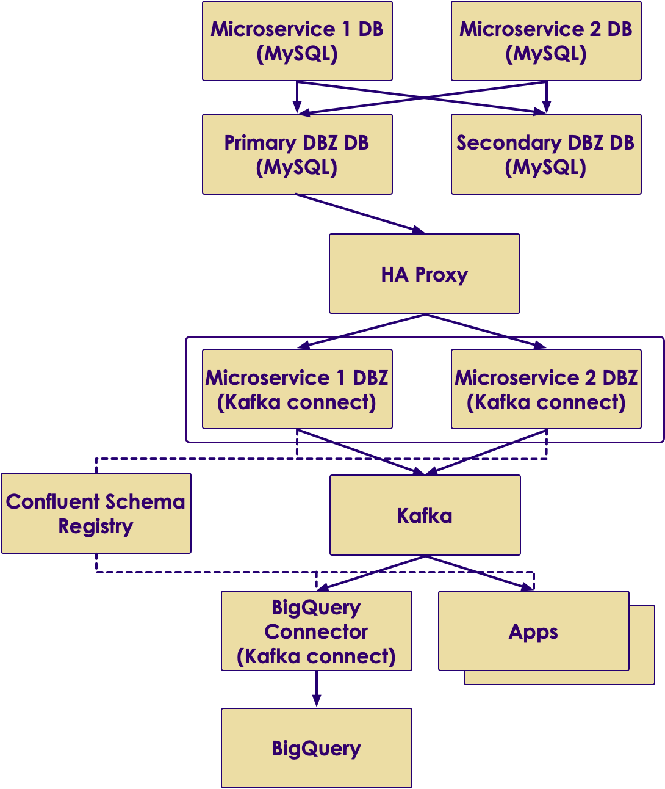

Notes:
Instructor read: https://wecode.wepay.com/posts/streaming-databases-in-realtime-with-mysql-debezium-kafka

---
## Debezium Connector


* What is Debezium?
  - Debezium is an open source distributed platform for change data capture using MySQL row-level binary  logs. Debezium built on top of Kafka Connect API Framework to support fault tolerance and high availability  using Apache Kafka eco system. Debezium records in a transaction log all row-level changes committed to  each database table.
* Supported Databases
Debezium currently able to support following list of database software.
  - MySQL
  - MongoDB
  - PostgreSQL
* For more Information: http://debezium.io/docs/connectors/

 &nbsp; &nbsp;&nbsp;  &nbsp;&nbsp;  &nbsp; &nbsp;  &nbsp; 

---

## Debezium Connector – MySQL Configuration

* Enable binary logs

```text
server-id = 1000001  
log_bin = mysql-bin  
binlog_format = row  
binlog_row_image = full  
expire_logs_days = 5

```

* Enable GTIDs

```text
gtid_mode = on  
enforce_gtid_consistency = on

```

* MySQL user with sufficient privileges

```text

GRANT SELECT, RELOAD, SHOW DATABASES, REPLICATION SLAVE, REPLICATION
CLIENT ON *.* TO 'debezium' IDENTIFIED BY password';

```
---

## Debezium Connector – MySQL Configuration

* Supported MySQL topologies

  - MySQL standalone
  - MySQL master and slave
  - Highly Available MySQL clusters
  - Multi-Master MySQL
  - Hosted MySQL eg: Amazon RDS and Amazon Aurora

---
## Debezium Connector – MySQL Connector  Configuration


* Example Configuration

```text

{
"name": "example-connector",  "config": {
"connector.class": "io.debezium.connector.mysql.MySqlConnector",  "tasks.max": "1",
"database.hostname": "127.0.0.1",
"database.port": "3306",  "database.user": "debezium",  "database.password": "dbz",  "database.server.id": "184054",
"database.server.name": "mysql-example",  "database.whitelist": "db1",  "database.history.kafka.bootstrap.servers": "kafka:9092",  "database.history.kafka.topic": "dbhistory.mysql-example"
}
}
```

* For more configuration: http://debezium.io/docs/connectors/mysql/

---

## Debezium Connector – Add Connector to Kafka  Connect


* List Available Connector plugins

```text

$ curl -s http://kafka-connect:8083/connector-plugins
[
{
"class": "io.confluent.connect.jdbc.JdbcSinkConnector"
},
{
"class": "io.confluent.connect.jdbc.JdbcSourceConnector"
},
{
"class": "io.debezium.connector.mysql.MySqlConnector"
},
{
"class": "org.apache.kafka.connect.file.FileStreamSinkConnector"
},
{
"class": "org.apache.kafka.connect.file.FileStreamSourceConnector"
}
]

```

---

## Debezium Connector – Add Connector to Kafka  Connect

* Add connector

  - $ curl -s -X POST -H "Content-Type: application/json" --data @connector-config.json http://kafka-connect:8083/con


* Remove connector
  - $ curl -X DELETE -H "Content-Type: application/json” http://kafka-connect:8083/connectors


* For more configuration: http://debezium.io/docs/connectors/mysql/
* More REST Endpoints: https://docs.confluent.io/current/connect/managing.html#using-the-rest-interface


---

## Debezium Connector – Sample CDC Event


* INSERT

```text

{
"schema": {},  "payload": {  "before": null,  "after": {
"id": 1004,
"first_name": "Anne Marie",  "last_name": "Kretchmar",  "email": "annek@noanswer.org"
},
"source": {
"name": "mysql-server-1",  "server_id": 223344,
"ts_sec": 1465581,  "gtid": null,
"file": "mysql-bin.000003",  "pos": 805,
"row": 0,  "snapshot": null
},
"op": "d",
"ts_ms": 1465581902461
}
}
```

---

## Debezium Connector – Sample CDC Event

* DELETE

```text
{
"schema": {},  "payload": {
"before": {
"id": 1004,
"first_name": "Anne Marie",  "last_name": "Kretchmar",  "email": "annek@noanswer.org"
},
"after": null,
"source": {
"name": "mysql-server-1",  "server_id": 223344,
"ts_sec": 1465889,  "gtid": null,
"file": "mysql-bin.000003",  "pos": 806,
"row": 0,  "snapshot": null
},
"op": "d",
"ts_ms": 1465581902500
}
}
```

---

## High Availability with Debezium

  * make it tolerant to machine failures (both the upstream MySQL server, and Debezium, itself
  * MySQL prior to version 5.6 modeled a replica’s location in its parent’s binlogs using a (binlog filename, file offset) tuple
  * MySQL 5.6, MySQL introduced the concept of global transaction IDs (GTIDs)
configuration that needs to be called out is the gtid.source.includes


---

## Debezium – Other use cases

* Monolithic database
* Large table snapshots
* Enhanced Monitoring
  - Debezium does expose metrics via JMX (see DBZ-134)
  - KAFKA-2376 is the open JIRA that’s meant to address an underlying Kafka connect issue
* More databases
* Unify compatibility checks
  - Confluent schema registry runs schema compatibility checks out of the box
  - Don’t have an equivalent check at the MySQL layer
* Automatic topic configuration

---

## Useful Links

* Kafka Connect – User Guide
  - http://docs.confluent.io/2.0.0/connect/userguide.  html
  - Kafka Connect – REST Endpoints
* http://docs.confluent.io/2.0.0/connect/userguide.html#rest-  interface
* Debezium – Interactive tutorial
  - http://debezium.io/docs/tutorial/
* Debezium – MySQL connector
  - http://debezium.io/docs/connectors/mysql/
* Kafka Connect – Connectors
  - https://www.confluent.io/product/connectors/
* Debezium Support/User Group
  - User: https://gitter.im/debezium/user
  - Dev: https://gitter.im/debezium/dev

---


# KSQL with Data Sources

---

## KSQL – an SQL streaming engine for Apache Kafka®

* Part of Confluent open source platfom
* KSQL lowers the entry bar to the world of stream processing
* Providing a simple and completely interactive SQL interface for processing data in Kafka
* No longer need to write code in a programming language such as Java or Python!
* KSQL is distributed, scalable, reliable, and real time.
* It supports a wide range of powerful stream processing operations including aggregations, joins, windowing, sessionization, and much more


---
## KSQL – the Streaming SQL Engine


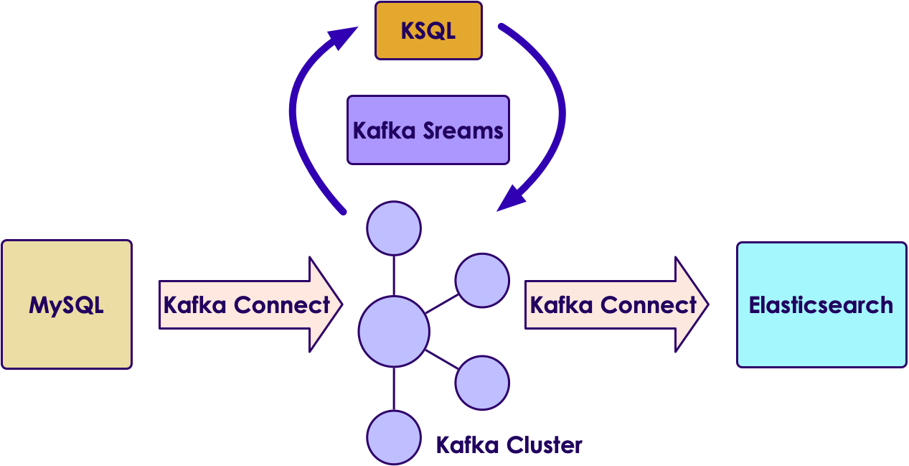


---

## Stream Processing – Concepts


 &nbsp; &nbsp; 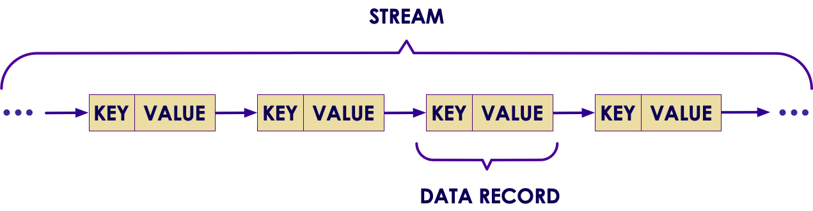

---

## Kafka Streams – Processor Topology

&nbsp; &nbsp; 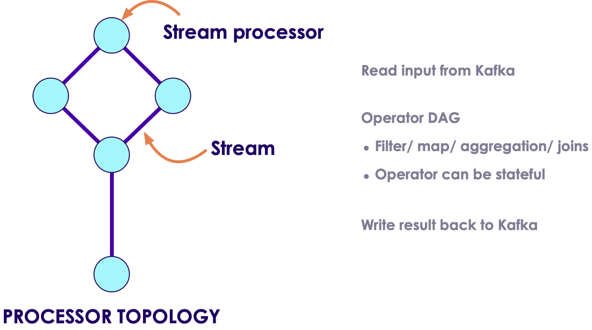

---

## Kafka Streams Runtime Architecture


 &nbsp; &nbsp; 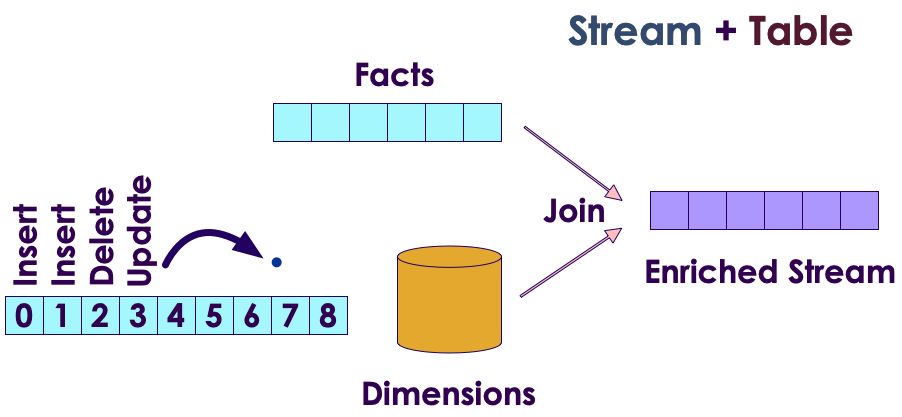

---

## Kstream and KTable

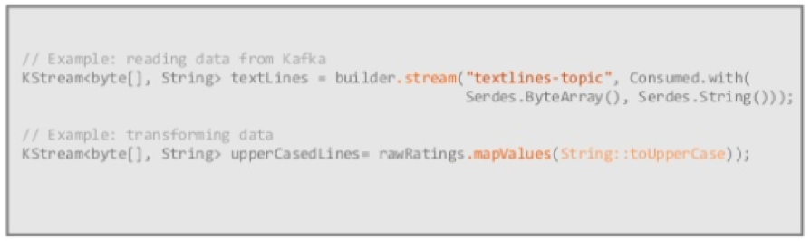 &nbsp; &nbsp; 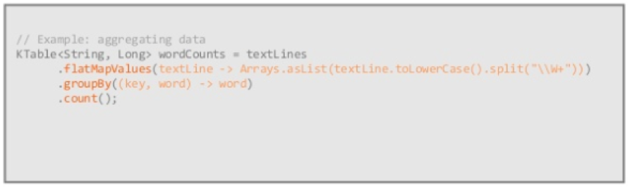

---

## KStreams vs. KSQL

 &nbsp; &nbsp; 


---

## Do not use KSQL for ...

* Powerful ad-hoc query
  - Limited span of time, usually retained in Kafka
  - No indexes
* BI Reports
  - No indexes
  - No JDBC (BI tools are not good with continuous results)


---

## KSQL Use Cases

* Real-time monitoring meets real-time analytics
* Security and anomaly detection
* Online data integration
* Application Development


---

## KSQL works with Topics on same node


* KSQL uses Kafka’s Streams API
* Kafka + KSQL turn the database inside out
* Joining streams declaratively
* Any Kafka consumer can access the new stream


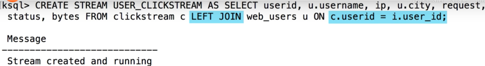

---

## ksqlDB Architecture (push, meet pull)

* It stores replicated, fault-tolerant tables of data
* It allows queries and processing in SQL
* You can work interactively against a cluster via a (RESTful) network API
* With EMIT CHANGES, this will be transformed into a push query that produces a continuously updating stream of current driver position coordinates, not just the current state


---
## KSQL for Quality Assurance – Use Case

* Checking for Malicious users


* Use Grafana to visualize


---
## Malicious User Sessions in Grafana


---
## Configure Kafka connect to get new KSQL Streams into Grafana


---
## KSQL Stream -> User Friendly Grafana Dashboard

* Malicious User Sessions Monitoring


---
## KSQL Select, CREATE STREAM Syntax

&nbsp; &nbsp; 

---
## Automatic Inference of Topic Schema (leveraging Confluent Schema Registry)

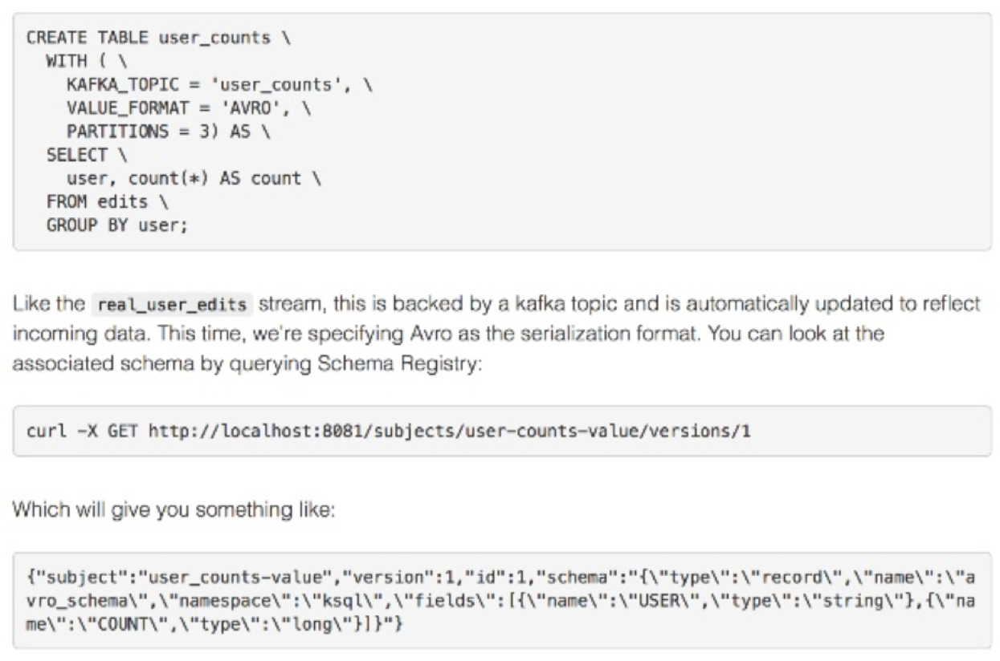

---
## WINDOWing


---
## KSQL Components

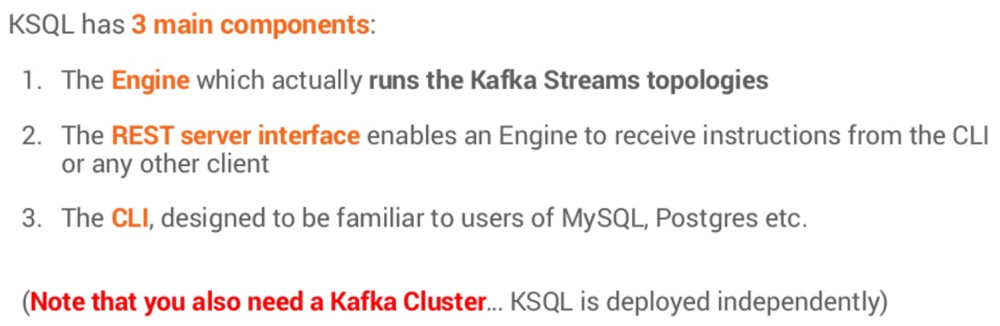

---
## KSQL – Client-Server (Interactive Mode)


---
## KSQL – Standalone App (Headless Mode)

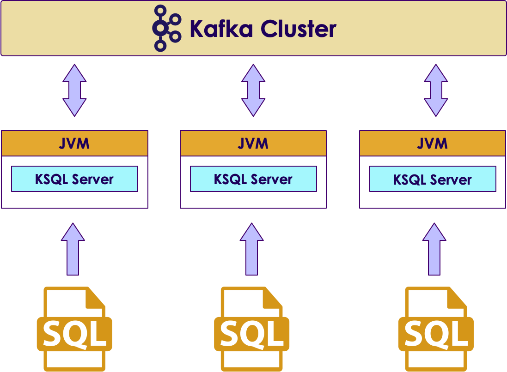

---
## KSQL – Embedded in Application (JVM Mode)


---
## KSQL – Dedicating Resources


---

## Review Questions

* What is the difference between KStreams and KTables?
* What are the good use cases for each?

Notes: 

 


---