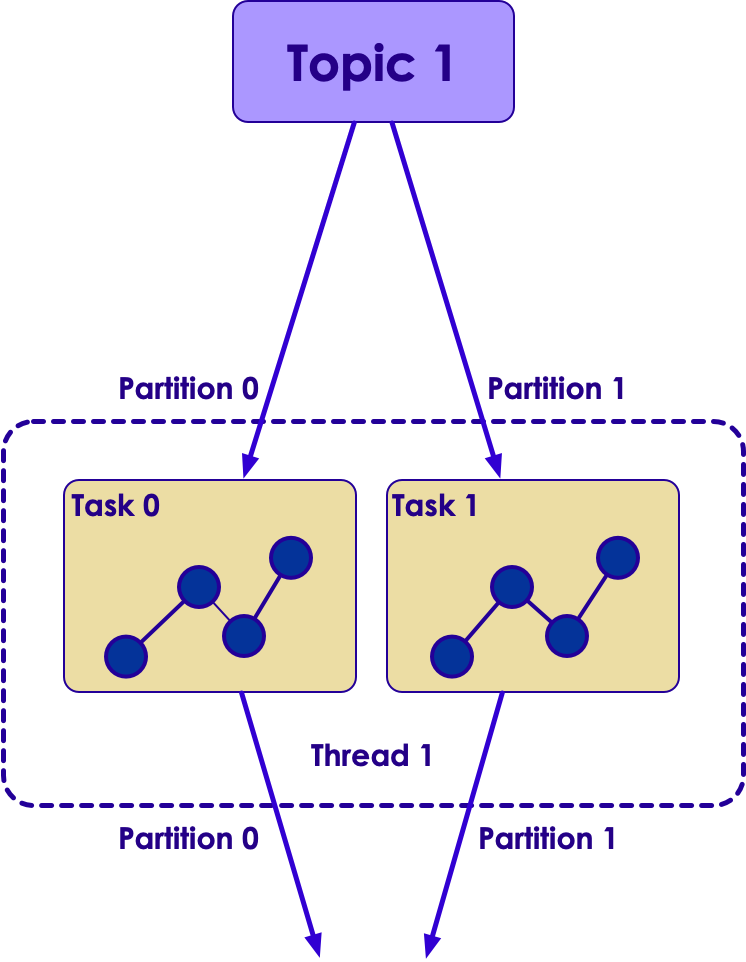
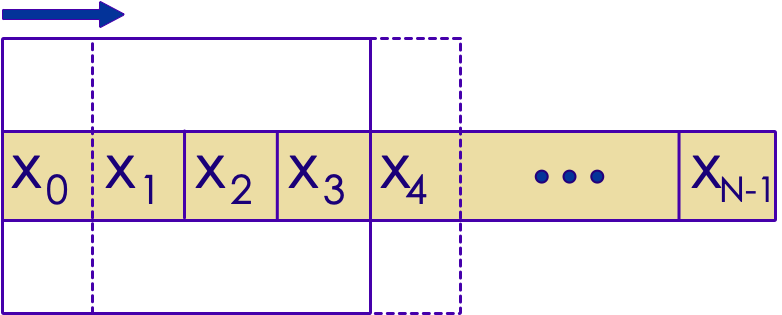

# Kafka Streams Intro


---


## Lesson Objectives


 * Learn Kafka Streams architecture

 * Learn Kafka Streams API

Notes: 

 


---

# Kafka Streams Intro

---


## Streaming Platforms

* Kafka is a messaging bus 

* The 'processing' portion was done outside Kafka


<!-- {"left" : 0.93, "top" : 2.92, "height" : 3.79, "width" : 8.39} -->


Notes: 


---


## Kafka Application Using Java 

- Pros : easy, simple 

- Cons : not scalable, not fault tolerant

<!-- {"left" : 1.2, "top" : 2.55, "height" : 4.55, "width" : 7.84} -->


---

## Kafka Application Using Spark

- Pros : distributed, fault tolerant, lots of functionality 

- Cons : 
    - Need to setup and maintain a Spark cluster 
    - Not so simple

<!-- {"left" : 1.62, "top" : 3.15, "height" : 5.49, "width" : 7.01} -->


---

## Kafka Application Using Kafka Streams

<!-- {"left" : 0.4, "top" : 2.08, "height" : 5.49, "width" : 9.46} -->


---

## Case for Kafka Streams

<!-- {"left" : 6.03, "top" : 1.69, "height" : 2.55, "width" : 3.99} -->


- Java / Python application using Kafka Producer/Consumer APIs
    * Simple
    * Limited capability
    
- Distributed systems like  Spark / Flink
    * Excellent capabilities
    * Complex

- 'Kafka Streams' aims to fill the sweet spot between capabilities & complexities

Notes: 


---

## Kafka Streams Features


 * Kafka Streams is a library for building distributed applications for Kafka

 * Features:

     - Event based processing (one event at a time).Not micro batch

     - Stateful processing for joins / aggregations

     - High level operations (map, filter, reduce)

 * It is not:

     - Designed for analytics like Spark / Hive

Notes: 


---

## Comparing Streams

- **Kafka Streams moto - "Build apps, not clusters"** 


|      | Simple Java App                              | Kafka Streams                                | Distributed Streaming </br>Frameworks                                                                                 |
|------|----------------------------------------------|----------------------------------------------|-----------------------------------------------------------------------------------------------------------------------|
|      | Using Java/ Python                           | Java                                         | Spark / Flink / Samza                                                                                                 |
|      |                                              |                                              |                                                                                                                       |
| Pros | -Simple to implement </br>- Simple to deploy | -Simple to implement,</br>- Simple to deploy | - Distributed out of the box,</br>- Very good scaling,</br>- Excellent capabilities like windowing / machine learning |
|      |                                              |                                              |                                                                                                                       |
| Cons | - Hard to scale                              | - Medium difficulty                          | - Heavy weight,</br>- Complex operations,</br>- Need to build a cluster,</br>- Monitor / maintain                     |
 
<!-- {"left" : 0.25, "top" : 2.04, "height" : 5.59, "width" : 9.75, "columnwidth" : [0.88, 2.88, 2.88, 3.11]} -->

Notes: 

---

## Kafka Streams Architecture

<!-- {"left" : 6.54, "top" : 3.87, "height" : 4.5, "width" : 3.49} -->

 * A  **Stream Partition** is an ordered set of records and maps to a Topic partition

 * A  **Data Record** in the stream **** maps to a Kafka message

 * A  **Task**  processes a fixed set of partitions

     - Stream tasks can be processed parallely

 * A  **Thread**  executes one or more tasks


Notes: 

Kafka Streams allows the user to configure the number of threads to parallelize processing within an application instance. 
No state is shared across threads. So you can start as many threads as there are input Kafka topic partitions so that every thread's tasks has at least one partition to process


---

## Scaling Kafka Streams


<!-- {"left" : 1.02, "top" : 1.72, "height" : 6.21, "width" : 8.21} -->


Notes: 


---

## Processor Topology

<!-- {"left" : 6.79, "top" : 2.42, "height" : 4.23, "width" : 2.98} -->


 * Defines the logic for the application

 * Topology is a graph

     - Nodes: Stream processors

     - Edges: Streams

 *  **Source processor** 

     - Has no upstream 
       </br> processors. *Reads* topic

 *  **Sink processor** 

     - Has no downstream 
       </br> processor.*Writes* topic


Notes: 


---

## State Store

<!-- {"left" : 6.81, "top" : 3.03, "height" : 3.58, "width" : 3.17} -->


 * Stateful operations like (Aggregations / Joins) require intermediate state storage

 * Kafka Streams provides this storage at per node level

 * Storage mediums
     - In memory cache
     - RocksDB (a very fast embedded DB, developed by Facebook)  
     Stored on disk on each node

 * Tasks uses it to store and query data

 * Every task can have one or more state stores

 * Fault tolerant

 * Automatic recovery 


Notes: 


---

## Modifying RocksDB Configuration


```java
public static class CustomRocksDBConfig implements RocksDBConfigSetter {
   @Override
   public void setConfig (final String storeName, final Options options,
   final Map<String, Object> configs) {

       BlockBasedTableConfig tableConfig = new
org.rocksdb.BlockBasedTableConfig();

     tableConfig.setBlockCacheSize(16 * 1024 * 1024L);
     /*
      * set more configuration here
      */
  }
}
Properties streamsSettings = new Properties();
streamsSettings.put(
  StreamsConfig.ROCKSDB_CONFIG_SETTER_CLASS_CONFIG,
  CustomRocksDBConfig.class); 
```
<!-- {"left" : 0, "top" : 1.4, "height" : 4.03, "width" : 10.25} -->


Notes: 

Code Description

Default rocks db configuration can be changed be creating a class implementing the RocksDBConfigSetter interface 

And set the configurations as setConfig method(overridden) .

Add the class as a configuration to ROCKSDB_CONFIG_SETTER_CLASS_CONFIG


---

## Replication and Fault Tolerance


 * Kafka Partitions are replicated and highly available

 * If Streams task fails

     - Kafka will restart it on another running instance of the application

 * Stream data persisted to Kafka is still available in case application fails and wants to re-process it

 * Local state stores are replicated as a topic called  **changelog** 

     -  **Changelog** has log compaction enabled

Notes: 


---

## Overall Architecture


<!-- {"left" : 1.85, "top" : 1.64, "height" : 6.36, "width" : 6.55} -->


Notes: 

Here we see a Streams application,
It is consuming messages from input Q
And producing messages to another output Q


---

# Kafka Streams Details

---


## Writing a Streams Application


 * Use Kafka Streams DSL

     - High level API

     - Provides most common required functions for transformation, grouping, aggregation

 * Use Processor API

     - Low-level API

     - Create, connect processors in topology and interact with State Stores directly

Notes: 


---

## Kafka Streaming (Abbreviated)


```java
// ** 1 : configure **
Properties config = new Properties();
config.put(ConsumerConfig.BOOTSTRAP_SERVERS_CONFIG,
       "localhost:9092");
config.put(StreamsConfig.APPLICATION_ID_CONFIG,
       "kafka-streaming-consumer1");
config.put(StreamsConfig.DEFAULT_KEY_SERDE_CLASS_CONFIG,
       Serdes.String().getClass().getName());
config.put(StreamsConfig.DEFAULT_VALUE_SERDE_CLASS_CONFIG,
       Serdes.String().getClass().getName());

// ** 2 : define processing **
final StreamsBuilder builder = new StreamsBuilder();
final KStream<String, String> clickstream = builder.stream("topic1");// topic

clickstream.print(Printed.toSysOut());


// ** 3 : start the stream **
final KafkaStreams streams = new KafkaStreams(builder.build(), config);
streams.cleanUp();
streams.start();

Runtime.getRuntime().addShutdownHook(new Thread(streams::close));  
```
<!-- {"left" : 0, "top" : 1.28, "height" : 4.98, "width" : 10.25} -->


Notes: 


---

## Streaming Operations

| Function     | Description                                                   |
|----------    |-----------------------------------------------------------    |
| ForEach      | Process one record at a time                                  |
| Filter       | Filter stream event by event                                  |
| map          | Transform the stream,</br>(key1, value1) -> (key2, value2)     |
| groupBy      | Group the stream by key                                       |
| count        | Count the stream                                              |


<!-- {"left" : 0.25, "top" : 1.2, "height" : 3.19, "width" : 9.75} -->

Notes: 


---

## Kafka Streaming  : ForEach


```java
final StreamBuilder builder = new StreamBuilder();
final KStream<String, String> clickstream = builder.stream("topic1");

// Foreach : process events one by one
clickstream.foreach(new ForeachAction<String, String>() {

     public void apply(String key, String value) {

     logger.debug("key:" + key + ", value:" + value);
    }
}); 
```
<!-- {"left" : 0, "top" : 1.36, "height" : 2.66, "width" : 10.25} -->

 * Using Java8 Lambda functions

Notes: 


---

## Kafka Streaming : Filter

<!-- {"left" : 1.83, "top" : 1.28, "height" : 1.18, "width" : 6.59} -->


 * Applying a filter to a stream produces another stream

<!-- {"left" : 0.27, "top" : 3.7, "height" : 3.17, "width" : 9.71} -->


Notes: 


---

## Kafka Streaming  : Filter


```java
final StreamBuilder builder = new StreamBuilder();
final KStream<String, String> clickstream = builder.stream("topic1");

// filter clicks only
final KStream<String, String> actionClickedStream =

    clickstream.
    filter((k, v) -> v.contains("action:clicked"));

actionClickstream.print(Printed.toSysOut());
```
<!-- {"left" : 0, "top" : 1.14, "height" : 2.43, "width" : 10.25} -->

 
<!-- {"left" : 0.46, "top" : 5.41, "height" : 1.02, "width" : 9.32} -->


Notes: 


---

## Kafka Streaming: Map


 * Map  **transforms**  a stream into another stream

 * KStream<key1, value1>  ->   KStream <key2, value2>

 * Map action

<!-- {"left" : 0.69, "top" : 3.42, "height" : 0.97, "width" : 8.87} -->


<!-- {"left" : 1.06, "top" : 5.33, "height" : 2.83, "width" : 8.14} -->

Notes: 


---

## Kafka Streaming: Map


```java
final StreamsBuilder builder = new StreamsBuilder();
final KStream<String, String> clickstream = builder.stream("topic1");

// map transform (String, String) to  (String, Integer)
final KStream<String, Integer> actionStream = clickstream.map( {
   
     // new KeyValueMapper<String, String, KeyValue<String, Integer>>()

   public KeyValue<String, Integer> apply(String key, String value) {

      logger.debug("map() : got : " + value);
      String new_key = key.toUpperCase();
      int new_value = 1;
      KeyValue<String, Integer> newKV =new KeyValue<>(new_key, new_value);
      logger.debug("map() : returning : " + newKV);
      return newKV;
  }
}
);
actionStream.print(Printed.toSysOut()); 
```
<!-- {"left" : 0, "top" : 1.2, "height" : 4.34, "width" : 10.25} -->


Notes: 


---

## Kafka Streaming: GroupBy


 * GroupBy will aggregate KStream by key

 * Think of it like 'group by' operator in SQL


<!-- {"left" : 0.49, "top" : 3.28, "height" : 1.02, "width" : 9.27} -->


<!-- {"left" : 0.31, "top" : 5.32, "height" : 3.13, "width" : 9.63} -->


Notes: 


---

## KStreams vs. KTables


 *  **Kstream** 

   - Each record/message represents an independent entity/event irrespective of its key.

 *  **Ktable** 

   - Messages with same key are treated as updates of previous message.

Notes: 


---

## Joins on Kstream and KTables

| Kstream + KStream                                                                                 | Ktable + KTable                                                                                                                                           | KTable + KStream                                                                          |
|-----------------------------------------------------------------------------------------------    |-------------------------------------------------------------------------------------------------------------------------------------------------------    |---------------------------------------------------------------------------------------    |
| It is a sliding window join.,</br>Results a KStream,</br>Supports Left, Inner and Outer Joins     | Symmetric non-window join.,</br>Results a continuously updating Ktable.,</br>Supports Left, Inner and Outer Joins,</br>(think like 2 database tables)     | Asymmetric non-window join.,</br>Results a KStream.,</br>Supports Left and Inner join     |

<!-- {"left" : 0.25, "top" : 1.44, "height" : 2.36, "width" : 9.75} -->

Notes: 


---

## Kafka Streams: GroupBy


```java
final StreamsBuilder builder = new StreamsBuilder();
final KStream<String, String> clickstream = builder.stream( "topic1");

// map transform (String, String) --> (String, Integer)

final KStream<String, Integer> actionStream = clickstream.map( ... )

// Now aggregate and count actions
// we have to explicitly state the K,V serdes in groupby,
// as the types are changing

final KTable<String, Long> actionCount = actionStream
   .groupByKey(Serialized.with(Serdes.String(), Serdes.Integer()))
   .count ();
actionCount.toStream().print(Printed.toSysOut()); 
```
<!-- {"left" : 0, "top" : 1.27, "height" : 3.49, "width" : 10.25} -->

Notes: 


---

## Wordcount in Kafka Streams


```java
// Serializers/deserializers (serde) for String and Long types
final Serde<String> stringSerde = Serdes.String();
final Serde<Long> longSerde = Serdes.Long();

// Construct a `KStream` from the input topic "topic1", where message values
// represent lines of text (for the sake of this example, we ignore whatever may be stored
// in the message keys).
KStream<String, String> textLines = builder.stream("topic1",
.with(stringSerde, stringSerde);

KTable<String, Long> wordCounts = textLines
    // Split each text line, by whitespace, into words.
    .flatMapValues(value -> Arrays.asList(value.toLowerCase().split("\\W+")))
 
    // Group the text words as message keys
    .groupBy((key, value) -> value)
 
    // Count the occurrences of each word (message key).
    .count();
 
// Store the running counts as a changelog stream to the output topic.
wordCounts.toStream().to("topic1-out", Produced.with(Serdes.String(), Serdes.Long()));
```

<!-- {"left" : 0, "top" : 1.28, "height" : 3.95, "width" : 10.25} -->


Notes: 


---

## Lab 7: Streams Labs


 *  **Overview:** Create and use Kafka streams

 *  **Builds on previous labs:** 

 *  **Approximate Time:** 30 - 40 mins

 *  **Instructions:**

     - Please follow: lab 7.1 - 7.5

 *  **To Instructor:** 


Notes: 


---

## Windowing Operations


 * Windowing is a common function in event processing

     - What is the average CPU utilization?

        * Over the last 5 minutes? 

 * Create groups of records with the  *same key* for aggregations or joins into " **windows** "

<!-- {"left" : 1.19, "top" : 4.64, "height" : 3.17, "width" : 7.88} -->


Notes: 


---

## Windowing Parameters


 * Retention Period

     - How long to wait for late-arriving records for a given window

 * Advance Period/Interval

     - How much to move the window forward relative to the last one

 * Window Size

     - Size of the window i.e. how long is the window in time units

 * Maintain Period

     - How long to keep the window alive

Notes: 


---

## Windowing Example


 * TimeWindows.of("cpu-window", 60*1000)

     - Returns a time window of 1 min. 

     - Advance period of 1 min.

     - Window maintained for 1 day

 * Modify various parameters using functions in TimeWindows class

 * https://kafka.apache.org/20/javadoc/org/apache/kafka/streams/kstream/TimeWindows.html

Notes: 


---

## Counts visits per hour


```java
KStreamBuilder builder = new KStreamBuilder();
KStream<String, Long> visitsStream = builder.stream(Serdes.String(), Serdes.Long(),
                                     "visitsTopic");

// Group and count visits per URL/page
KGroupedStream<String, Long> groupedStream = 
visitsStream.groupByKey();
KTable<String, Long> totalCount = groupedStream.count("totalVisitCount");

// Create window for visits per hour
KTable<Windowed<String>, Long> windowedCount =
groupedStream.count(TimeWindows.of(60 * 60 * 1000), "hourlyVisitCount");
```
<!-- {"left" : 0, "top" : 1.3, "height" : 2.42, "width" : 10.25} -->


Notes: 


---

## Lab 7: Windowing Lab


 *  **Overview:** Create time windows and aggregate data

 *  **Builds on previous labs:**

 *  **Approximate Time:** 30 - 40 mins

 *  **Instructions:**

     - Please follow: lab 7.6

 *  **To Instructor:**


Notes: 


---

## Review Questions


 * What is Kafka Streams?

 * What is a task?

 * How does Streams keep track of state?

Notes: 

 


---

## Lesson Summary


Notes: 

 
