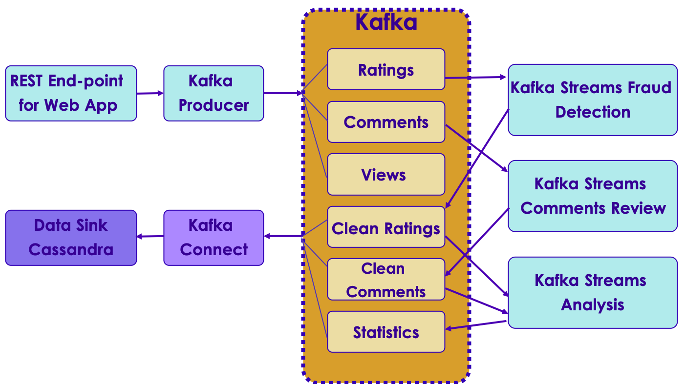

# Kafka Workshop


---


## Lesson Objectives


 * Learn to design and build a Kafka-based application end-to-end … well almost!


Notes:

Image from https://www.bright.consulting/service/implementation-services/


---

## About This Lesson


 * Heavily hands-on

 * Based on:

     - Actual use cases

     - Best practices available

Notes:


---

## Approach


 * We present a particular use case/problem

 * Work as groups to:

     - Come up with your solution

     - Present it to the class

 * Analyze

     - Your solution

     - Instructor's solution

---

## Approach

 * Discuss

     - Compromises & comparisons

     - Performance implications

     - Lessons learned

 * Reference:

     - Kafka docs: https://kafka.apache.org/documentation/

Notes:


---

## MyVideos


 *  allows users to upload videos

 * Users can view, rate and comment on videos

 * Rating is an integer 1 to 5

 * Comment is text up to 1K bytes

 * Need to handle millions of concurrent users

 * Need to store all  **views** ,  **ratings** ,  **comments** in some kind of database

 * Assume some "processing" on ratings/comments will be required

 * Lab:

     - Design a system to handle these requirements


Notes:

Only design queueing portion and producer/consumers. Not DB or web app
Have students draw a design on white board or project


---

## MyVideos Design: Our Solution


Notes:

Discussion: one topic vs multiple


---

## Lab: MyVideos Cluster setup


 *  **Overview**:

     - Setup a Kafka cluster for MyVideos

        * Use instances of your group to form the cluster

     - Create the MyVideos topics

        * Think about replicas, partitions

 *  **Builds on previous labs**: None

 *  **Approximate time**: 30 minutes


Notes:


---

## MyVideos: Topics and Messages


 * Producer

     - Receives all events - views, ratings, comments as they occur

     - It will send messages to Kafka topic(s)

     - For lab, assume we will generate the messages

 * Design Kafka topics and message formats


Notes:


---

## MyVideos: Topics and Messages: Our Solution


 * Topics

     - View

     - Rating

     - Comment

 * Messages – AVRO data format

     - View:    user_id, video_id, time_of_view, time_spent

     - Rating:  user_id, video_id, time_of_rating, rating

     - Comment: user_id, video_id, time_of_comment, comment

Notes:


---

## MyVideos: Messages Schema


 * Create Avro schemas

 * Reference: http://avro.apache.org/docs/current/spec.html


Notes:


---

## MyVideos: View Schema: Our Solution

```text
{"namespace": "com.example.videos",
  "type": "record",
  "name": "View",
  "fields": [
     {"name": "user_id", "type": "int"},
     {"name": "video_id", "type": "string"},
     {"name": "time_of_view", "type": { "type": "string", "logicalType": "timestamp
millis" }},
     {"name": "time_spent", "type": "int"}

  ]
}
```

Notes:


---

## MyVideos: View JSON: Our Solution


```text
Example JSON data for Views:
{
  "user_id": 123,
  "video_id": "VID45128-1",
  "time_of_view": "2019-01-02T12:30:01",
  "time_spent_in_secs": 3.5
}
```


 * Create schema at https://www.jsonschema.net/

Notes:


---

## MyVideos: Rating Schema: Our Solution


```text
{"namespace": "com.example.videos",
 "type": "record",
 "name": "Rating",
 "fields": [
     {"name": "user_id", "type": "int"},
     {"name": "video_id", "type": "string"},
     {"name": "time_of_rating", "type":
     { "type": "string", "logicalType": "timestamp-millis" }},
     {"name": "rating", "type": "int"}
  ]
}
```


Notes:


---

## MyVideos: Rating JSON: Our Solution


```text
Example JSON data for Views:
{
  "user_id": 123,
  "video_id": "VID45128-1",
  "time_of_rating": "2019-01-02T12:30:01",
  "rating": 4
}
```

 * Create schema at https://www.jsonschema.net/

Notes:


---

## MyVideos: Comment Schema: Our Solution


```text
{"namespace": "com.example.videos",
 "type": "record",
 "name": "Comment",
 "fields": [
     {"name": "user_id", "type": "int"},
     {"name": "video_id", "type": "string"},
     {"name": "time_of_rating", "type":
     { "type": "string", "logicalType": "timestamp-millis" }},
     {"name": "comment", "type": "string"
  ]
}
```


Notes:


---

## Lab: MyVideos Producers


 *  **Overview**:

     - Create Producers for the Rating topics

        - Think about the various settings, optimizations

 * Bonus: Create producers for the other topics as well!

 *  **Approximate time**: 60-90 minutes


Notes:


---

## Lab: MyVideos Producers


 *  **Overview**:

     - Create Producers for the Rating topics

        - Think about the various settings, optimizations

 * Bonus: Create producers for the other topics as well!

 *  **Approximate time**: 60-90 minutes


Notes:


---

## MyVideos: Stream Processing


 * Check ratings and comments for fraud and unacceptable content

     - Assume we have a separate Java class/library that can do this

 * We want real-time summary statistics such as number of views, ratings, comments per hour

     - Number of views per minute for the last hour

     - Count of ratings = 5 received per minute

     - Number of comments per minute

 * Modify your design to handle these requirements


Notes:

HINT: Use sliding window in KStreams


---

## MyVideos Design: Our Solution




Notes:


---

## MyVideos: Stream Processing


 * We want real-time summary statistics such as:

     - Number of views per minute

     - Count of highest rating (i.e. 5) received per minute

 * How would you implement this?


Notes:

HINT: Use sliding window in KStreams


---

## MyVideos: Statistics: Our Solution


 * Add a new Consumer app "statistics"

     - Process 'view' and 'rating' topics using Kstreams:

        * Create hopping windows of one minute

 * Reference: https://kafka.apache.org/20/documentation/streams/developer-guide/dsl-api.html#streams-developer-guide-dsl-windowing

Notes:


---

## Lab: MyVideos Consumers

 *  **Overview**:

     - Implement Statistics app

        * Consume Rating events

        * Create Statistics topic

 *  **Approximate time**: 1 hour


Notes:


---

## MyVideos: Bonus: User Devices


 * A user has multiple devices (TV, tablet, phone, computer)

 * We want to track devices used to view videos

     - How many videos are viewed using which devices

 * Device attributes:

     - device_id (something unique)

     - Device Type (phone/tv/tablet/set-top)

     - Device belongs to ONE user

 * Modify your design to handle devices


Notes:


---

## MyVideos: User Devices: Our Solution


 * Add following fields to "View" schema:

     - device_id, device_type

 * Add a new Consumer app

     - Process 'view' topic using Kstreams:

        * Group messages by device_type and count them

Notes:


---

# User Activity Logging

---


## Next: Log Collection


Notes:


---

## Log Processing


 * Collect and analyze logs on massive scale
 * Use cases:
     - Large data center
        * Keep track of logins
        * Detect attacks
     - Web properties (e-commerce sites or LinkedIn)
        * Log user activities
        * Analyze user activities (which button users click most…etc.)
 * Distributed log collection
     - Need to collect from multiple sources (100s or even 1000s)
 * Tools
     - Flume (part of Hadoop ecosystem)
     - Kafka (distributed message queue)
     - Log Stash

Notes:


---

## Distributed Log Collection Tools: Flume


 * Part of Hadoop ecosystem

 * Works on `agent -> hub` model

 * Agents run on `log source` and keep sending data upstream

 * Can handle failures


Notes:


---

## Log Processing: Log format


 * Logs contain:

     - Source (ip or application_name)

     - Severity (info, error)

     - Timestamp

 * Design a system to ingest the log files on a continuously basis

 * Goal: To analyze the logs

     - Find log events for a certain host (latest event first)

     - Find log events of a particular severity


Notes:


---

## Log Processing: Our Solution


 * Use Kafka Connect syslog plugin to ingest data into Kafka

     - https://docs.confluent.io/current/connect/kafka-connect-syslog/index.html

 * Consume messages and process using Kstreams/KSQL

Notes:


---

## Review Questions


Notes:
