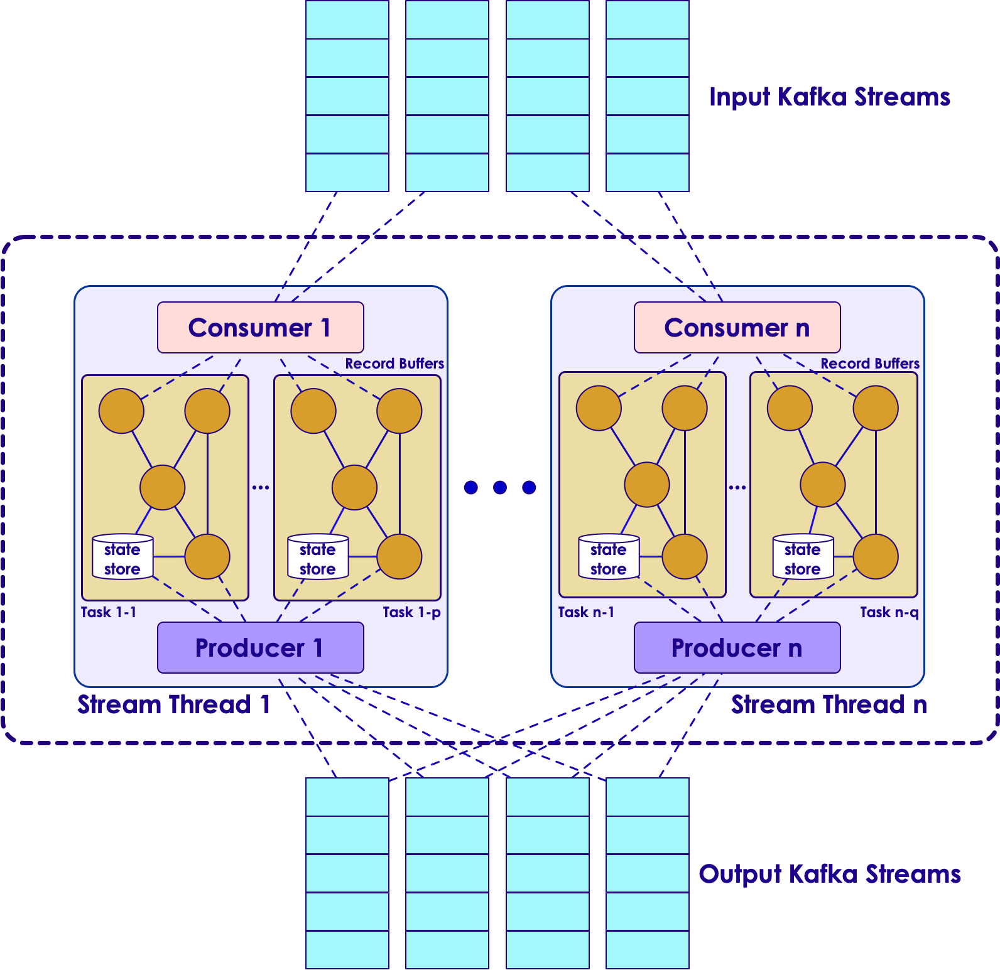

## Kafka Streams - Processor Topology

&nbsp; &nbsp; 

---

## Kafka Streams Runtime Architecture


 &nbsp; &nbsp; 

---

# Kafka Connect 
---

# Kafka Connect	- Debezium Stream MySQL events to Kafka

---

## Debezium.io

* Where did the name "Debezium" come from?

  - The name is a combination of "DBs", as in the abbreviation for multiple databases, and the "-ium" suffix used in the names of many elements of the periodic table. Say it fast: "DBs-ium". If it helps, we say it like "dee-BEE-zee-uhm".

* What databases can Debezium monitor?
  - The latest version of Debezium includes support for monitoring MySQL database servers, MongoDB replica sets or sharded clusters, PostgreSQL servers and SQL Server databases. In addition there are work-in-progress Debezium connectors for Oracle servers (based on XStream) and Cassandra databases which are released as preview (incubating) versions as of Debezium 1.0.
* What are some uses of Debezium?

  - The primary use of Debezium is to enable applications to respond almost immediately whenever data in databases change.


---

## Streaming databases in realtime with MySQL, Debezium, and Kafka


Notes:
Instructor read: https://wecode.wepay.com/posts/streaming-databases-in-realtime-with-mysql-debezium-kafka

---
## Debezium Connector


* What is Debezium?
  - Debezium is an open source distributed platform for change data capture using MySQL row-level binary  logs. Debezium built on top of Kafka Connect API Framework to support fault tolerance and high availability  using Apache Kafka eco system. Debezium records in a transaction log all row-level changes committed to  each database table.
* Supported Databases
Debezium currently able to support following list of database software.
  - MySQL
  - MongoDB
  - PostgreSQL
* For more Information: http://debezium.io/docs/connectors/

 &nbsp; &nbsp;&nbsp;  &nbsp;&nbsp;  &nbsp; &nbsp;  &nbsp; 

---

## Debezium Connector - MySQL Configuration

* Enable binary logs

```text
server-id = 1000001  
log_bin = mysql-bin  
binlog_format = row  
binlog_row_image = full  
expire_logs_days = 5

```

* Enable GTIDs

```text
gtid_mode = on  
enforce_gtid_consistency = on

```

* MySQL user with sufficient privileges

```text

GRANT SELECT, RELOAD, SHOW DATABASES, REPLICATION SLAVE, REPLICATION
CLIENT ON *.* TO 'debezium' IDENTIFIED BY password';

```
---

## Debezium Connector - MySQL Configuration

* Supported MySQL topologies

  - MySQL standalone
  - MySQL master and slave
  - Highly Available MySQL clusters
  - Multi-Master MySQL
  - Hosted MySQL eg: Amazon RDS and Amazon Aurora

---
## Debezium Connector - MySQL Connector  Configuration


* Example Configuration

```text

{
"name": "example-connector",  "config": {
"connector.class": "io.debezium.connector.mysql.MySqlConnector",  "tasks.max": "1",
"database.hostname": "127.0.0.1",
"database.port": "3306",  "database.user": "debezium",  "database.password": "dbz",  "database.server.id": "184054",
"database.server.name": "mysql-example",  "database.whitelist": "db1",  "database.history.kafka.bootstrap.servers": "kafka:9092",  "database.history.kafka.topic": "dbhistory.mysql-example"
}
}
```

* For more configuration: http://debezium.io/docs/connectors/mysql/

---

## Debezium Connector - Add Connector to Kafka  Connect


* List Available Connector plugins

```text

$ curl -s http://kafka-connect:8083/connector-plugins
[
{
"class": "io.confluent.connect.jdbc.JdbcSinkConnector"
},
{
"class": "io.confluent.connect.jdbc.JdbcSourceConnector"
},
{
"class": "io.debezium.connector.mysql.MySqlConnector"
},
{
"class": "org.apache.kafka.connect.file.FileStreamSinkConnector"
},
{
"class": "org.apache.kafka.connect.file.FileStreamSourceConnector"
}
]

```

---

## Debezium Connector - Add Connector to Kafka  Connect

* Add connector

  - $ curl -s -X POST -H "Content-Type: application/json" --data @connector-config.json http://kafka-connect:8083/con


* Remove connector
  - $ curl -X DELETE -H "Content-Type: application/json” http://kafka-connect:8083/connectors


* For more configuration: http://debezium.io/docs/connectors/mysql/
* More REST Endpoints: https://docs.confluent.io/current/connect/managing.html#using-the-rest-interface


---

## Debezium Connector - Sample CDC Event


* INSERT

```text

{
"schema": {},  "payload": {  "before": null,  "after": {
"id": 1004,
"first_name": "Anne Marie",  "last_name": "Kretchmar",  "email": "annek@noanswer.org"
},
"source": {
"name": "mysql-server-1",  "server_id": 223344,
"ts_sec": 1465581,  "gtid": null,
"file": "mysql-bin.000003",  "pos": 805,
"row": 0,  "snapshot": null
},
"op": "d",
"ts_ms": 1465581902461
}
}
```

---

## Debezium Connector - Sample CDC Event

* DELETE

```text
{
"schema": {},  "payload": {
"before": {
"id": 1004,
"first_name": "Anne Marie",  "last_name": "Kretchmar",  "email": "annek@noanswer.org"
},
"after": null,
"source": {
"name": "mysql-server-1",  "server_id": 223344,
"ts_sec": 1465889,  "gtid": null,
"file": "mysql-bin.000003",  "pos": 806,
"row": 0,  "snapshot": null
},
"op": "d",
"ts_ms": 1465581902500
}
}
```

---

## High Availability with Debezium

  * make it tolerant to machine failures (both the upstream MySQL server, and Debezium, itself
  * MySQL prior to version 5.6 modeled a replica’s location in its parent’s binlogs using a (binlog filename, file offset) tuple
  * MySQL 5.6, MySQL introduced the concept of global transaction IDs (GTIDs)
configuration that needs to be called out is the gtid.source.includes


---

## Debezium - Other use cases

* Monolithic database
* Large table snapshots
* Enhanced Monitoring
  - Debezium does expose metrics via JMX (see DBZ-134)
  - KAFKA-2376 is the open JIRA that’s meant to address an underlying Kafka connect issue
* More databases
* Unify compatibility checks
  - Confluent schema registry runs schema compatibility checks out of the box
  - Don’t have an equivalent check at the MySQL layer
* Automatic topic configuration

---

## Useful Links

* Kafka Connect - User Guide
  - http://docs.confluent.io/2.0.0/connect/userguide.  html
  - Kafka Connect - REST Endpoints
* http://docs.confluent.io/2.0.0/connect/userguide.html#rest-  interface
* Debezium - Interactive tutorial
  - http://debezium.io/docs/tutorial/
* Debezium - MySQL connector
  - http://debezium.io/docs/connectors/mysql/
* Kafka Connect - Connectors
  - https://www.confluent.io/product/connectors/
* Debezium Support/User Group
  - User: https://gitter.im/debezium/user
  - Dev: https://gitter.im/debezium/dev

---


