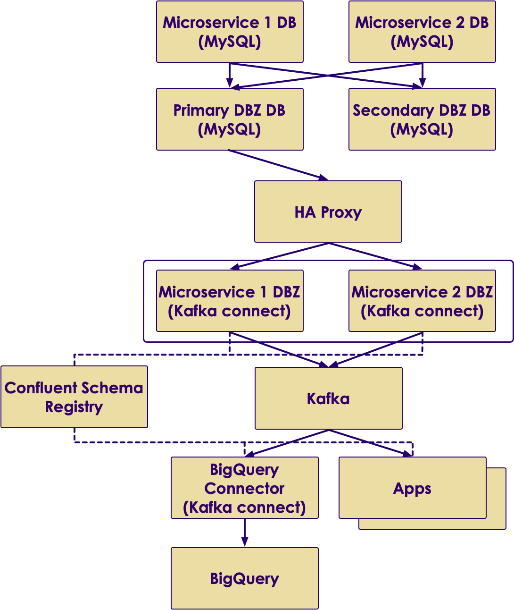
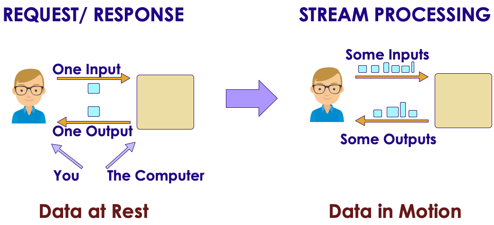
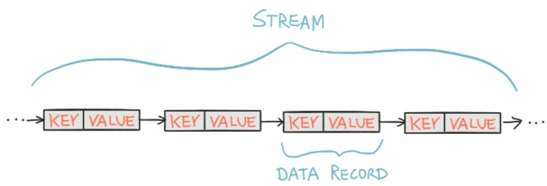
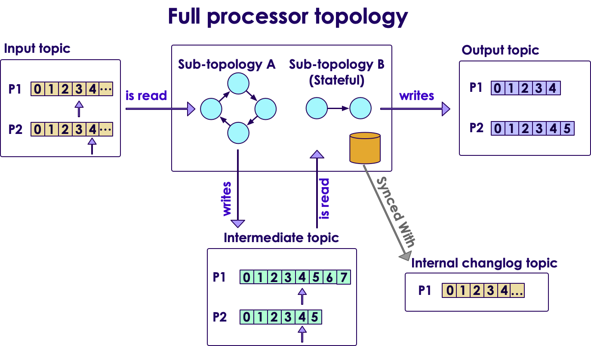
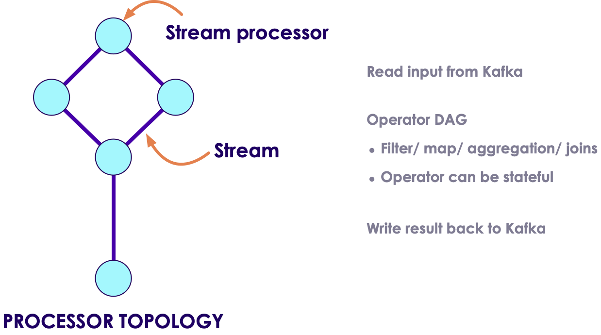
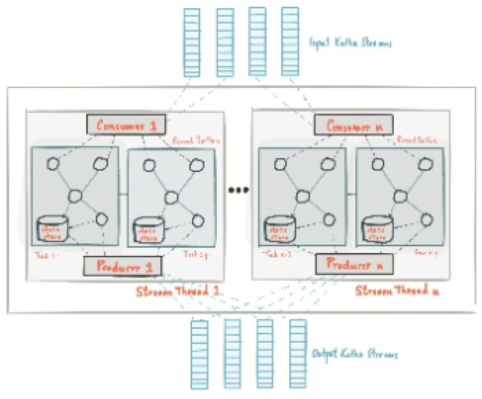
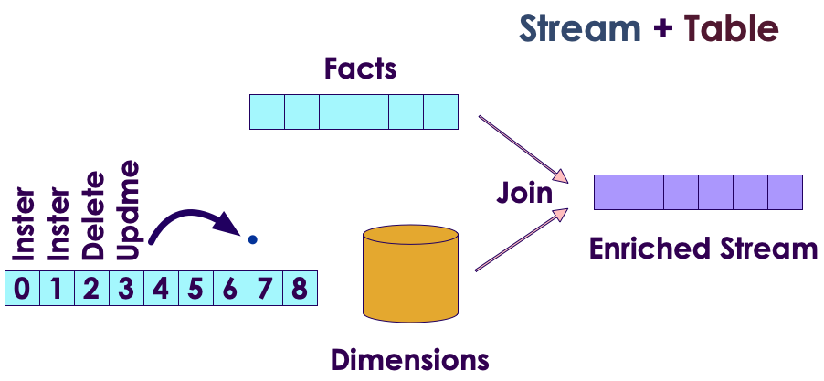
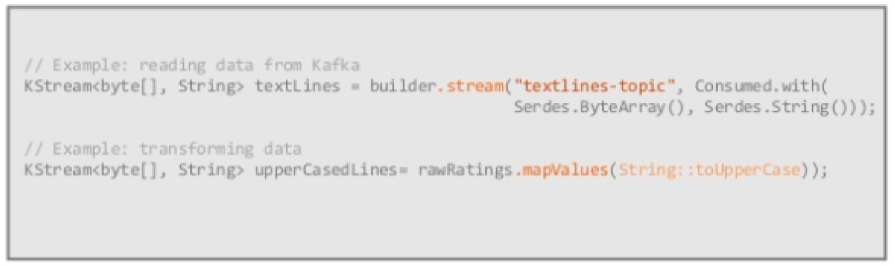
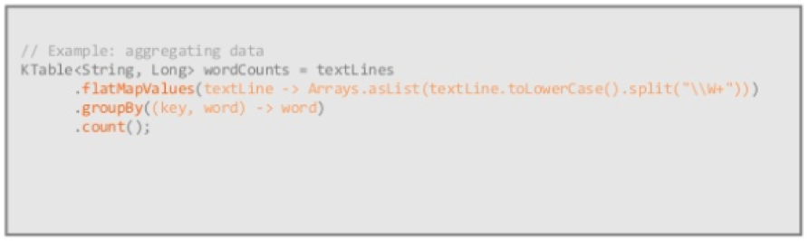

# Streaming Data from SQL Databases


---


## Why Streaming from Database (CDC)?

* Integrations with Legacy Applications‫.‬ 
  ‫-‬ Avoid dual writes when Integrating with legacy systems.
‫*‬ Smart Cache Invalidation
  ‫-‬ Automatically invalidate entries in a cache as soon as the record(s) for entries change or are removed.
‫*‬ Monitoring Data Changes
  ‫-‬ Immediately react to data changes committed by application/user.
‫*‬ Data Warehousing
  ‫-‬ Atomic operation synchronizations for ETL-type solutions.
‫*‬ Event Sourcing (CQRS)
  ‫-‬ Totally ordered collection of events to asynchronously update the read-only views while writes can be recorded as normal.


Notes: 


---

# Kafka Connect

---

## Kafka Connect - Overview


---

## Kafka Connect – Source / Confluent.io

* ActiveMQ 
* DynamoDB 
* MapRDB 
* AWS Lambda 
* HDFS 
* Salesforce 
* AWS CloudWatch 
* Splunk 
* Azure Events Hub 
* IBM MQ 
* AWS S3 

---

## Kafka Connect – Source / Confluent.io

* Elasticsearch 
* Cassandra 
* Redshift 
* Kinesis 
* Teradata 
* JDBC 
* TIBCO 
* Azure SQL Data Warehouse 
* Oracle 
  
---

## Kafka Connect – Sink / Confluent.io

* Azure Blob 
* Google Cloud BigTable 
* Flume 
* JMS 
* Azure Data Lake 
* Apache Hbase Sink
* HTTP 
* IBM MQ 
* Google BigQuery 
* Flume as Consumer agents 


---

## Kafka Connect

* **Connectors** – A logical process responsible for managing the copying of data between Kafka and
another system.


* There are two types of connectors

  - **Source Connectors** import data from another system
  - **Sink Connectors** export data from Kafka


* **Tasks** - Unit of process that handles assigned set of work load by connectors.
Connector configuration allows set to maximum number of tasks can be run by a connector.

* **Workers** – Unit of work that schedules connectors and tasks in a  process.

* There are two main type of workers: **standalone** and **distributed**

---
## Kafka Connect – Configuration

* **Common Connector Configuration**

  - name - Unique name for the connector. Attempting to register again with the same name will  fail.
  - connector.class - The Java class for the connector
  - tasks.max - The maximum number of tasks that should be created for this connector. The  connector may create fewer tasks if it cannot achieve this level of parallelism.

* **Please note** that connector configuration might vary, see specific connector documentation for  more information.

---
## Kafka Connect – Configuration

* **Distributed Mode - Worker Configuration**

  - bootstrap.servers - A list of host/port pairs to use for establishing the initial connection to the Kafka cluster.  
  - group.id - A unique string that identifies the Connect cluster group this worker belongs to.
  - config.storage.topic - The topic to store connector and task configuration data in. This must be the same for all  workers with the same group.id.
  - offset.storage.topic - The topic to store offset data for connectors in. This must be the same for all workers with the  same group.id
  - status.storage.topic - The name of the topic where connector and task configuration status updates are stored.
  - For more distributed mode worker configuration: http://docs.confluent.io/current/connect/userguide.html#configuring-workers

---
## Kafka Connect – Running A Instance

* It is recommended to run Kafka Connect on containerized environments such as Kubernetes, Mesos, Docker Swarm, or  YARN.

```text

$ docker run -d \
--name=kafka-connect \
--net=host \
-e CONNECT_BOOTSTRAP_SERVERS="kafka-broker:9092" \
-e CONNECT_GROUP_ID="group_1" \
-e CONNECT_CONFIG_STORAGE_TOPIC="kafka-connect-config" \
-e CONNECT_OFFSET_STORAGE_TOPIC="kafka-connect-offset" \
-e CONNECT_STATUS_STORAGE_TOPIC="kafka-connect-status" \
-e CONNECT_KEY_CONVERTER="org.apache.kafka.connect.json.JsonConverter" \
-e CONNECT_VALUE_CONVERTER="org.apache.kafka.connect.json.JsonConverter" \
-e CONNECT_INTERNAL_KEY_CONVERTER="org.apache.kafka.connect.json.JsonConverter" \
-e CONNECT_INTERNAL_VALUE_CONVERTER="org.apache.kafka.connect.json.JsonConverter" \
-e CONNECT_LOG4J_LOGGERS="io.debezium.connector.mysql=INFO" \
-v /opt/kafka-connect/jars:/etc/kafka-connect/jars \
--restart always \
confluentinc/cp-kafka-connect:3.3.0

```

* Kafka Connect distributed mode exposes port 8083 by default to serve management REST interface.


---

## Kafka Connect Best Practices – Advice from the Field

* best practices for configuring, managing, and tuning the connectors tools to monitor data flow through the pipeline using Kafka Streams applications to transform or enhance the data in flight

---
## How Blizzard Used Kafka to Save Data Pipeline

* When Blizzard started sending gameplay data to Hadoop in 2013, we went through several iterations before settling on Flumes in many data centers around the world reading from RabbitMQ and writing to central flumes in our Los Angeles datacenter. While this worked at first, by 2015 we were hitting problems scaling to the number of events required. This is how we used Kafka to save our pipeline. 


---

## Yelp’s Real-time Data Pipeline 

* Yelp moved quickly into building out a comprehensive service oriented architecture, and before long had over 100 data-owning production services. Distributing data across an organization creates a number of issues, particularly around the cost of joining disparate data sources, dramatically increasing the complexity of bulk data applications. Straightforward solutions like bulk data APIs and sharing data snapshots have significant drawbacks. Yelp’s Data Pipeline makes it easier for these services to communicate with each other, provides a framework for real-time data processing, and facilitates high-performance bulk data applications – making large SOAs easier to work with. The Data Pipeline provides a series of guarantees that makes it easy to create universal data producers and consumers that can be mashed up into interesting real-time data flows. We’ll show how a few simple services at Yelp lay the foundation that powers everything from search to our experimentation framework. 


---

## Body Armor for Distributed System 

* We show a way to make Kafka end-to-end encrypted. It means that data is ever decrypted only at the side of producers and consumers of the data. The data is never decrypted broker-side. Importantly, all Kafka clients have their own encryption keys. There is no pre-shared encryption key. Our approach can be compared to TLS implemented for more than two parties connected together. 


---

# Kafka Connect	- Debezium Stream MySQL events to Kafka

---

## Debezium.io

* Where did the name "Debezium" come from? 

  - The name is a combination of "DBs", as in the abbreviation for multiple databases, and the "-ium" suffix used in the names of many elements of the periodic table. Say it fast: "DBs-ium". If it helps, we say it like "dee-BEE-zee-uhm". 

* What databases can Debezium monitor?
  - The latest version of Debezium includes support for monitoring MySQL database servers, MongoDB replica sets or sharded clusters, PostgreSQL servers and SQL Server databases. In addition there are work-in-progress Debezium connectors for Oracle servers (based on XStream) and Cassandra databases which are released as preview (incubating) versions as of Debezium 1.0. 
* What are some uses of Debezium?

  - The primary use of Debezium is to enable applications to respond almost immediately whenever data in databases change. 


---

## Streaming databases in realtime with MySQL, Debezium, and Kafka




Notes:
Instructor read: https://wecode.wepay.com/posts/streaming-databases-in-realtime-with-mysql-debezium-kafka

---
## Debezium Connector


* What is Debezium?
  - Debezium is an open source distributed platform for change data capture using MySQL row-level binary  logs. Debezium built on top of Kafka Connect API Framework to support fault tolerance and high availability  using Apache Kafka eco system. Debezium records in a transaction log all row-level changes committed to  each database table.
* Supported Databases
Debezium currently able to support following list of database software.
  - MySQL
  - MongoDB
  - PostgreSQL
* For more Information: http://debezium.io/docs/connectors/

 &nbsp; &nbsp;&nbsp;  &nbsp;&nbsp;  &nbsp; &nbsp;  &nbsp; 

---

## Debezium Connector – MySQL Configuration

* Enable binary logs

```text
server-id = 1000001  
log_bin = mysql-bin  
binlog_format = row  
binlog_row_image = full  
expire_logs_days = 5

```

* Enable GTIDs

```text
gtid_mode = on  
enforce_gtid_consistency = on

```

* MySQL user with sufficient privileges

```text

GRANT SELECT, RELOAD, SHOW DATABASES, REPLICATION SLAVE, REPLICATION
CLIENT ON *.* TO 'debezium' IDENTIFIED BY password';

```
---

## Debezium Connector – MySQL Configuration

* Supported MySQL topologies

  - MySQL standalone
  - MySQL master and slave
  - Highly Available MySQL clusters
  - Multi-Master MySQL
  - Hosted MySQL eg: Amazon RDS and Amazon Aurora

---
## Debezium Connector – MySQL Connector  Configuration


* Example Configuration

```text

{
"name": "example-connector",  "config": {
"connector.class": "io.debezium.connector.mysql.MySqlConnector",  "tasks.max": "1",
"database.hostname": "127.0.0.1",
"database.port": "3306",  "database.user": "debezium",  "database.password": "dbz",  "database.server.id": "184054",
"database.server.name": "mysql-example",  "database.whitelist": "db1",  "database.history.kafka.bootstrap.servers": "kafka:9092",  "database.history.kafka.topic": "dbhistory.mysql-example"
}
}
```

* For more configuration: http://debezium.io/docs/connectors/mysql/

---

## Debezium Connector – Add Connector to Kafka  Connect


* List Available Connector plugins

```text

$ curl -s http://kafka-connect:8083/connector-plugins
[
{
"class": "io.confluent.connect.jdbc.JdbcSinkConnector"
},
{
"class": "io.confluent.connect.jdbc.JdbcSourceConnector"
},
{
"class": "io.debezium.connector.mysql.MySqlConnector"
},
{
"class": "org.apache.kafka.connect.file.FileStreamSinkConnector"
},
{
"class": "org.apache.kafka.connect.file.FileStreamSourceConnector"
}
]

```

---

## Debezium Connector – Add Connector to Kafka  Connect

* Add connector

  - $ curl -s -X POST -H "Content-Type: application/json" --data @connector-config.json http://kafka-connect:8083/con


* Remove connector
  - $ curl -X DELETE -H "Content-Type: application/json” http://kafka-connect:8083/connectors


* For more configuration: http://debezium.io/docs/connectors/mysql/
* More REST Endpoints: https://docs.confluent.io/current/connect/managing.html#using-the-rest-interface


---

## Debezium Connector – Sample CDC Event


* INSERT

```text

{
"schema": {},  "payload": {  "before": null,  "after": {
"id": 1004,
"first_name": "Anne Marie",  "last_name": "Kretchmar",  "email": "annek@noanswer.org"
},
"source": {
"name": "mysql-server-1",  "server_id": 223344,
"ts_sec": 1465581,  "gtid": null,
"file": "mysql-bin.000003",  "pos": 805,
"row": 0,  "snapshot": null
},
"op": "d",
"ts_ms": 1465581902461
}
}
```

---

## Debezium Connector – Sample CDC Event

* DELETE

```text
{
"schema": {},  "payload": {
"before": {
"id": 1004,
"first_name": "Anne Marie",  "last_name": "Kretchmar",  "email": "annek@noanswer.org"
},
"after": null,
"source": {
"name": "mysql-server-1",  "server_id": 223344,
"ts_sec": 1465889,  "gtid": null,
"file": "mysql-bin.000003",  "pos": 806,
"row": 0,  "snapshot": null
},
"op": "d",
"ts_ms": 1465581902500
}
}
```

---

## High Availability with Debezium

  * make it tolerant to machine failures (both the upstream MySQL server, and Debezium, itself 
  * MySQL prior to version 5.6 modeled a replica’s location in its parent’s binlogs using a (binlog filename, file offset) tuple 
  * MySQL 5.6, MySQL introduced the concept of global transaction IDs (GTIDs) 
configuration that needs to be called out is the gtid.source.includes


---

## Debezium – Other use cases 

* Monolithic database 
* Large table snapshots
* Enhanced Monitoring
  - Debezium does expose metrics via JMX (see DBZ-134) 
  - KAFKA-2376 is the open JIRA that’s meant to address an underlying Kafka connect issue 
* More databases
* Unify compatibility checks
  - Confluent schema registry runs schema compatibility checks out of the box 
  - Don’t have an equivalent check at the MySQL layer 
* Automatic topic configuration

---

## Useful Links

* Kafka Connect – User Guide
  - http://docs.confluent.io/2.0.0/connect/userguide.  html
  - Kafka Connect – REST Endpoints
* http://docs.confluent.io/2.0.0/connect/userguide.html#rest-  interface
* Debezium – Interactive tutorial
  - http://debezium.io/docs/tutorial/
* Debezium – MySQL connector
  - http://debezium.io/docs/connectors/mysql/
* Kafka Connect – Connectors
  - https://www.confluent.io/product/connectors/
* Debezium Support/User Group
  - User: https://gitter.im/debezium/user
  - Dev: https://gitter.im/debezium/dev

---

# KSQL with Data Sources

---

## KSQL – an SQL streaming engine for Apache Kafka® 

* Part of Confluent open source platfom 
* KSQL lowers the entry bar to the world of stream processing
* Providing a simple and completely interactive SQL interface for processing data in Kafka
* No longer need to write code in a programming language such as Java or Python! 
* KSQL is distributed, scalable, reliable, and real time. 
* It supports a wide range of powerful stream processing operations including aggregations, joins, windowing, sessionization, and much more 


---
## KSQL – the Streaming SQL Engine


---

## Stream Processing – Concepts 


 &nbsp; &nbsp; 

---

## Kafka Streams – Processor Topology

&nbsp; &nbsp; 

---

## Kafka Streams Runtime Architecture


 &nbsp; &nbsp; 

---

## Kstream and KTable

 &nbsp; &nbsp; 

---

## KStreams vs. KSQL

 &nbsp; &nbsp; 


---

## Do not use KSQL for ...

* Powerful ad-hoc query 
  - Limited span of time, usually retained in Kafka 
  - No indexes 
* BI Reports 
  - No indexes 
  - No JDBC (note : BI tools are not good with continuous results) 


---

## KSQL Use Cases

* Real-time monitoring meets real-time analytics 
* Security and anomaly detection 
* Online data integration 
* Application Development 


---

## KSQL works with Topics on same node 


* KSQL uses Kafka’s Streams API 
* Kafka + KSQL turn the database inside out 
* Joining streams declaratively 
* Any Kafka consumer can access the new stream 


---

## KSQLDB Architecture (push, meet pull) 

* It stores replicated, fault-tolerant tables of data
* It allows queries and processing in SQL
* You can work interactively against a cluster via a (RESTful) network API
* With EMIT CHANGES, this will be transformed into a push query that produces a continuously updating stream of current driver position coordinates, not just the current state


---
## KSQL for Quality Assurance – Use Case

* Checking for Malicious users


* Use Grafana to visualize 


---
## Malicious User Sessions in Grafana 


---
## Configure Kafka connect to get new KSQL Streams into Grafana 


---
## KSQL Stream -> User Friendly Grafana Dashboard

* Malicious User Sessions Monitoring 


---
## KSQL Select, CREATE STREAM Syntax 

&nbsp; &nbsp; 

---
## Automatic Inference of Topic Schema (leveraging Confluent Schema Registry) 


---
## WINDOWing


---
## KSQL Components


---
## KSQL – Client-Server (Interactive Mode) 


---
## KSQL – Standalone App (Headless Mode)


---
## KSQL – Embedded in Application (JVM Mode) 


---
## KSQL – Dedicating Resources


