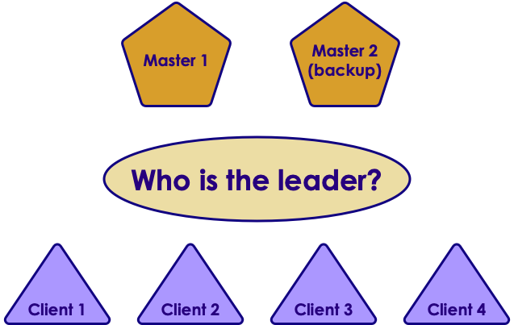
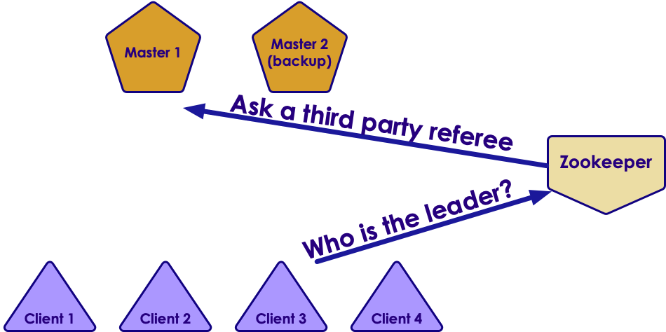
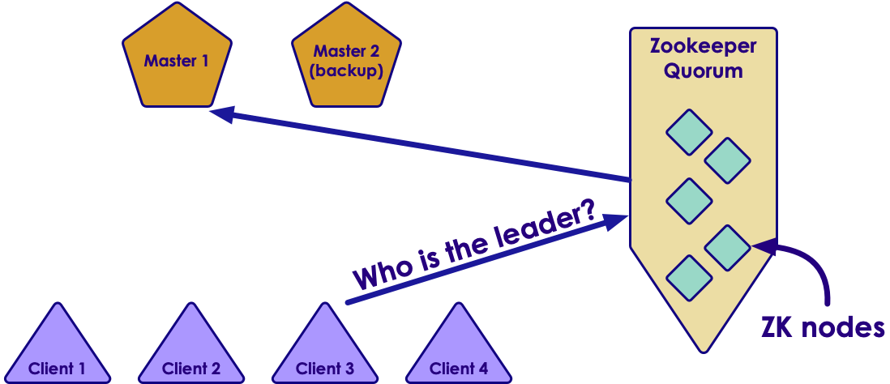
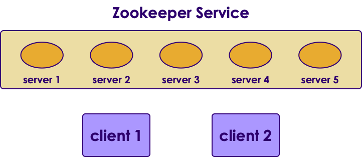

# Zookeeper Primer

---

## A Little Computing History

<!-- {"left" : 8.13, "top" : 1.11, "height" : 1.71, "width" : 1.85} -->

 * 1990s we had single core processors
     - Programs ran in single 'thread' mode
     - The game was faster and faster clock speeds  (200MHZ ! ...)

 

<!-- {"left" : 7.67, "top" : 4.34, "height" : 1.84, "width" : 2.45} -->

 * 2000s: multi core processors
     - Multiple threads
     - How do we co-ordinate
     - Synchronization
     - Locks, mutex, semaphores
     - Java made multi-threaded programming easier

Notes:

Image credit: wikimedia.org

---

## Now

 * Distributed systems with

     - Multiple nodes

     - Each with multiple cores

 * How do we co-ordinate them all?

<!-- {"left" : 0.52, "top" : 4.15, "height" : 3.08, "width" : 9.21} -->

Notes:

---

## Distributed System Problem: Leader Election

 * There Can Be Only One!

<!-- {"left" : 1.02, "top" : 2.82, "height" : 3.42, "width" : 8.21} -->

Notes:

 * Source: Ki Young Lee via Flickr

---

## A Distributed System Problem: Leader Election

<!-- {"left" : 1.01, "top" : 1.93, "height" : 5.2, "width" : 8.22} -->

Notes:

---

## Leader Election With Zookeeper

<!-- {"left" : 0.72, "top" : 2.33, "height" : 4.4, "width" : 8.81} -->

Notes:

---

## Zookeeper Cluster / Quorum

 * What if ZK goes down?

 * Run ZK as a cluster - `quorum`

     - No single point of failure

<!-- {"left" : 0.73, "top" : 3.26, "height" : 3.79, "width" : 8.78} -->

Notes:

---

## Zookeeper

<!-- {"left" : 7.86, "top" : 1.32, "height" : 2.9, "width" : 2.03} -->

 * Distributed service that provides
     - Configuration
     - Synchronization
     - Name registry
     - Consensus
     - Leader election

 * Open source

 * Apache open source project

 * Battle tested with very large distributed projects
     - Hadoop, HBase, Kafka

Notes:

---

## Zookeeper

 * Runs as a quorum (multiple nodes)
     - No single point of failure
 * Odd number of nodes (3, 5, 7 ...etc)
     - Odd number to break tie when voting
     - Minimum 3 nodes
     - Small number of nodes can support thousands of clients
 * Consensus protocol is called 'ZAB' - Zookeeper Atomic Broadcast.Similar to PAXOS protocol

<!-- {"left" : 1.94, "top" : 5.29, "height" : 2.76, "width" : 6.37} -->

Notes:

ZAB paper: http://web.stanford.edu/class/cs347/reading/zab.pdf
Paxos: https://en.wikipedia.org/wiki/Paxos_(computer_science)

---

## ZK File System / Configuration

 * ZK exposes a virtual, file system hierarchy

<!-- {"left" : 0.88, "top" : 2.46, "height" : 3.79, "width" : 8.49} -->

Notes:

---

## Zookeeper Clients

 * Clients can set key values.
     - Set  *zoo.lion.feeding_time*  = 12pm
     - ZK will make sure of no race conditions if multiple clients are trying to update

 * Clients can be notified of changes."Notify me when '*zoo.lion.feeding_time*' changes"

<!-- {"left" : 1.61, "top" : 4.36, "height" : 3.14, "width" : 7.03} -->

Notes:
