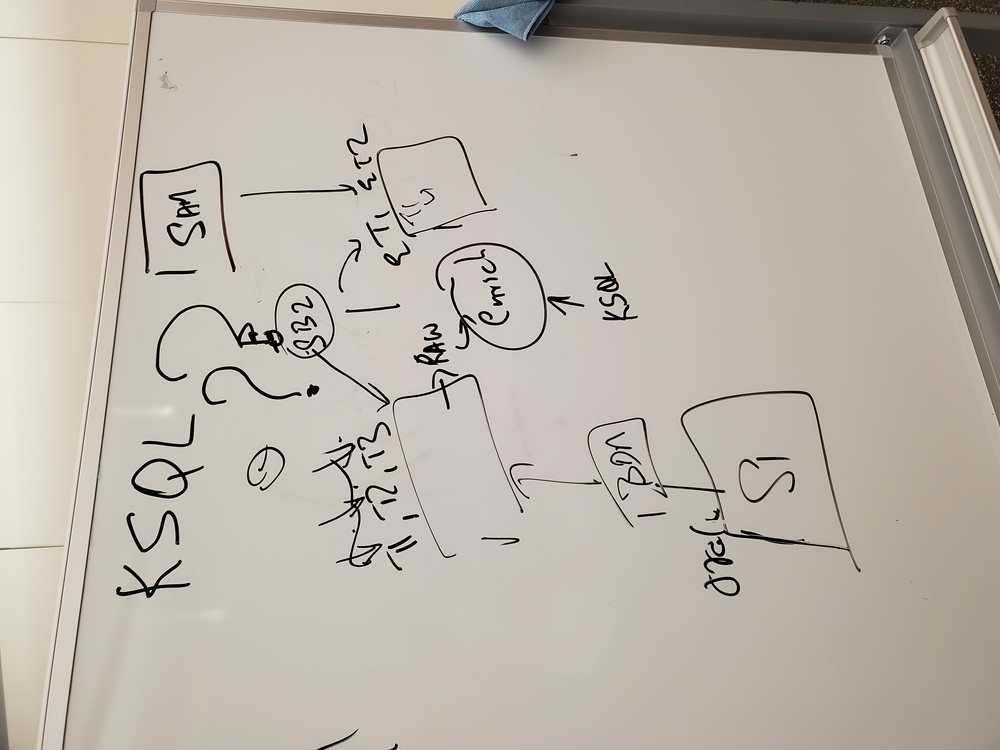

# Use case 02 question

### Questions
* You have three applications. They are publishing their state 
into the SQL database. From there, a Kafka producer publishes information 
onto 3 topics, T1, T2, and T3.
* 

### Answer
* There are three legacy applications that publish their results into an SQL database
* The database will publish three topics, one per each application
* 