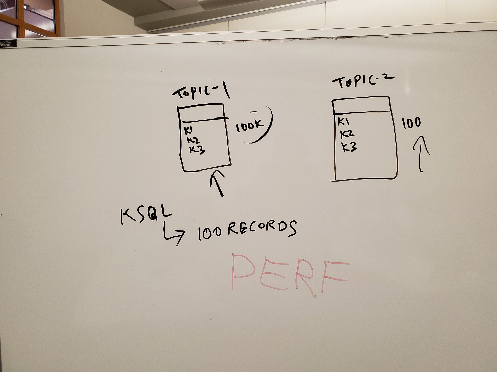

# Use case 01 question

### Questions
* Topic 1 had 100,000 records
* Topic 2 has no records
* So nothing in the KSQL join
* When topic 2 begins to get data, the KSQL join may be huge. 
Suddenly we become slow or run out of memory. Is that true? 
This depends on the internal implementation of of KSQL join.

### Answer
* ??? 