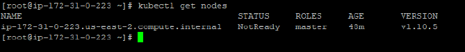
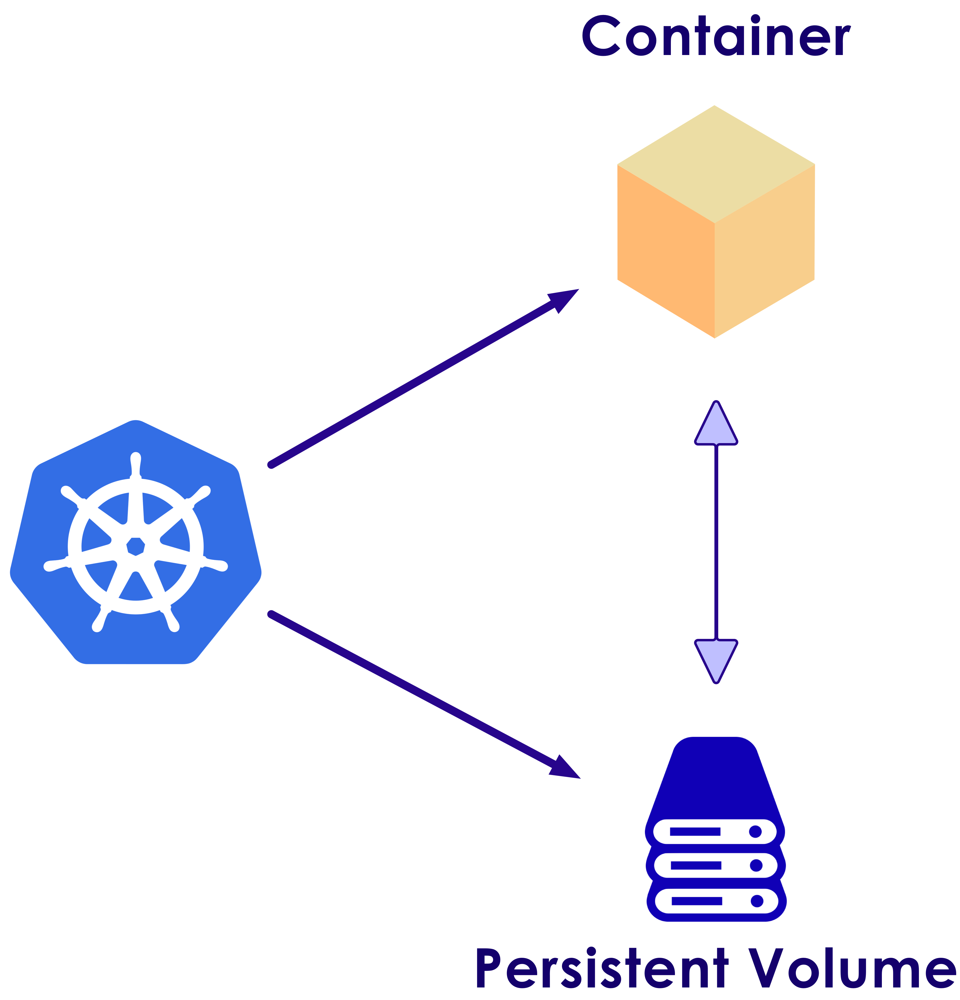
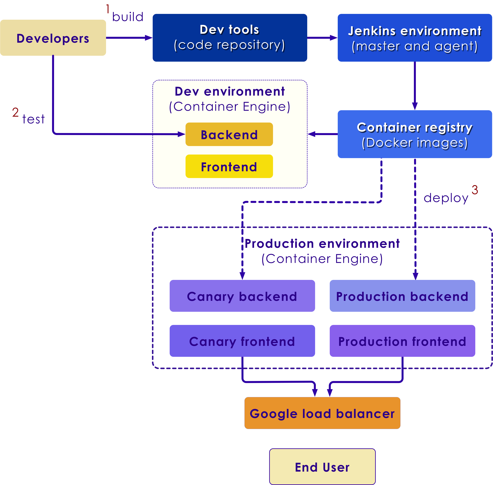
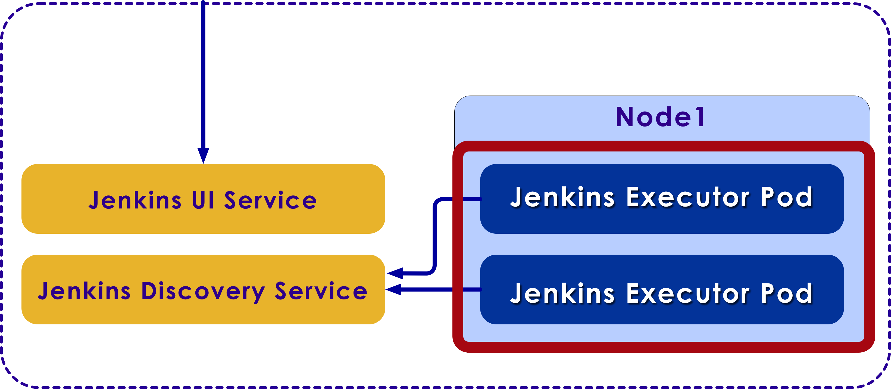
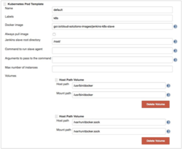
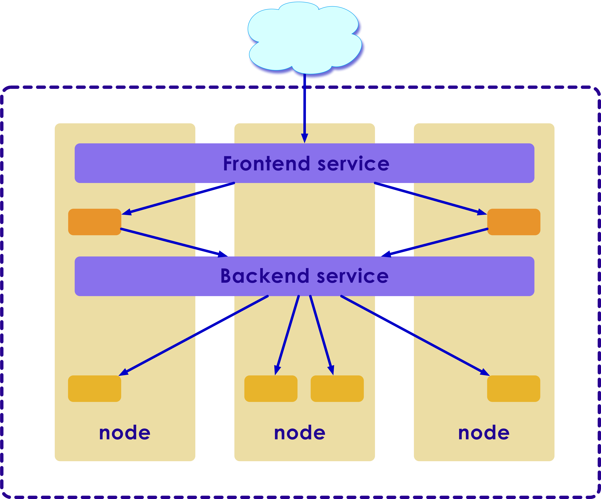
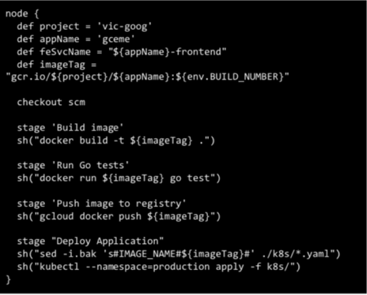
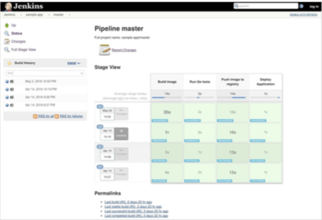

Kubernetes: Cluster
===================

---


## Kubernetes: Common [kubectl](https://kubernetes.io/docs/reference/kubectl/cheatsheet/)

  * Requires config file in .kube
  * Commonly used commands
  * Namespace
  * Pods
  * Secrets

```bash
kubectl version
kubectl # lists commands
kubectl create –f my-workflow.yaml # use argo command instead
kubectl get pods
kubectl port-forward –namespace=spark-als-driver 4040:4040
# kubectl port-forward –namespace=argo argo-ui-xxx 8001:8001
kubectl logs <pod-name> -n <namespace>
```
<!-- {"left" : 0, "top" : 3.37, "height" : 1.99, "width" : 10.25} -->

---

## Adding Node 01 and Node 02 to the Cluster


  * Now, join any number of machines by running the following command on each node as root:

```python
kubeadm join --token 4d138d.f5b4b78e952fb7fd 172.31.45.206:6443
--discovery-token-ca-cert-hash sha256:2b0a52b0b161ac7c8584c5478d45e0fe4a751205353f9b3b3da47b8553a08811
```

  * Check if the node is registered to the Kubernetes cluster:

```python
kubectl get nodes
```

 <!-- {"left" : 0.52, "top" : 5.39, "height" : 1.04, "width" : 9.28} -->


Notes:

Instructor Notes :

Participant Notes :

In this step, we will add node01 and node02 to join the 'k8s' cluster.
Connect to the node01 server and run the kubeadm join command.
Connect to the node02 server and run the kubeadm join command.
Wait a few minutes and go back to the 'k8s-master' master cluster server and check the nodes and pods using the following command:
kubectl get nodes 

Now, you will get node01 and node02 has been added to the cluster with status 'ready'.
node01 and node02 have been added to the kubernetes cluster.

---

# State and Storage

## State and Storage

  * **State**

    - State are purposeful to be used with stateful applications and distributed systems.
    - Stateless application process will not keep trac of past interactions.
    - Stateful application process has a record of previous interactions and can respond, based on it.

  * **Storage**

    - A persistent way to retain data.
    - The process executed in main memory on the data and not in a disk I/O.
    - If disk I/O is carried out, it might be either read-only or in a read-write manner.


Notes:

Instructor Notes :

Participant Notes :

State is a temporal property of a process. Stateless application process does not keep track of past interactions. It's a purely functional behavior.

Stateful, on the other hand, retains and responds based on the previous interactions record

Where the state is kept, that is, in main memory or persisted on disk, is a different question.

Storage is a persistent way to keep data around.A process executed purely on data in main memory, there's no disk I/O. If disk I/O is carried out, it might be read-only or in a read-write manner.


---
## StatefulSet Basics

  * StatefulSets were designed specifically to solve the problem of running stateful, replicated services inside Kubernetes.

  * StatefulSets to run a replicated database within Kubernetes is providing each pod a unique ID that persists.

  * Stateful applications with read-write disk access such as a service carrying out a financial transaction backed by an RDBMS.

  * Stateful applications without disk access (quadrant D), like a shopping basket service in an eCommerce site.

Notes:

Instructor Notes :

Participant Notes :

Stateful Sets represent a set of Pods with unique, persistent identities and stable hostnames 

State information and other resilient data is maintained in a persistent storage object associated with StatefulSet.

They are designed to solve the issues from running stateful, replicated services within Kubernetes. StatefulSets provides each pod a unique id as it runs a replicated database

Stateful applications with read-write disk access such as a service carrying out a financial transaction backed by an RDBMS.

Stateful applications without disk access (quadrant D), like a shopping basket service in an eCommerce site. 


---
## Stateless Basics

  * Stateless applications are applications which do not store data or application state to the cluster or to persistent storage.

  * Stateless applications with read-write disk access.

  * Stateless applications with read-only disk access such as a web server that reads the static content it serves from an external storage.

  * Stateless applications without disk access such as a converter services for geo coordinates.

Notes:

Instructor Notes :

Participant Notes :

A stateless application is one which depends on no persistent storage. 

Clusters are responsible for the code, and other static content hosted on it. It has no control over databases or the pods that has write or left over files. Thus, Stateless applications do not store data or app state to the persistent storage

Stateless applications with read-only disk access such as a web server that reads the static content it serves from an external storage

Stateless applications without disk access such as a converter services for geo coordinates.


---

# Deploying a Stateless Application

## Stateless - Overview

  * Stateless applications are ones that do not store data or application state to the cluster or to any persistent storage.

  * Deployment acts as the Controller for stateless pattern.

  * The client stores the Data and application state, making stateless applications more scalable.

  * Typically a frontend application is stateless.

  * Allows one to deploy multiple replicas to increase its availability and scale down when not required.

  * Deployment controller deploys stateless applications as uniform, non-unique Pods.

 <!-- {"left" : 7.32, "top" : 5.2, "height" : 1.64, "width" : 2.46} -->

Notes:

Instructor Notes :

Participant Notes :

Stateless applications are applications which do not store data or application state to the cluster or to persistent storage. 
Instead, data and application state stay with the client.
This makes stateless applications more scalable.
For example, a frontend application is stateless.


---

## Deployments Specification

  * Deployments manage the desired state of your application:
    - Ensures the required number of pods that are needed for running the application.
    - Which container image version should be run.
    - How the pods should be labeled.

  * Perform dynamic changes to the desired state through updates to the Deployment's Pod specification.

    - Stateless applications are in contrast to stateful applications:
    - Stateless – Don't use persistent storage to save data.
    - Stateful – Use persistent storage to save data.


 <!-- {"left" : 8.23, "top" : 2, "height" : 1.53, "width" : 1.53} -->


Notes:

Instructor Notes :

Participant Notes :

An example of stateful application is a Web application.  
Usually data is saved in a database.

An example of stateless application would be 'time of day' web service.
It simply returns the current time.
There is no need to save data into a database.


---

## Deployments Specification

  * NGINX is open source software for web serving, reverse proxying, caching, load balancing, media streaming

  * Runs an application by creating a Kubernetes Deployment object

  * Describes Deployment in a YAML file

  * For example, the below YAML file describes a Deployment that runs the nginx:1.7.9 Docker image

  * Create a Deployment based on the YAML file:

     - kubectl apply -f
https://k8s.io/docs/artifacts/application/deployment.yaml

  * Display information about the Deployment:

    - kubectl describe deployment nginx-deployment


Notes:

Instructor Notes :

Participant Notes :

Create an nginx deployment.
Use kubectl to list information about the deployment.
You can run an application by creating a Kubernetes Deployment object, and you can describe a Deployment in a YAML file. For example, this YAML file describes a Deployment that runs the nginx:1.7.9 Docker image:
Create a Deployment based on the YAML file.
Describe the information about the Deployment in a pod. It will list all details for the pod. Like pod name, namespace, labels, annotations, selectors, replicas, pod template, and etc.


---

# Deploying a Stateful Sets Application

## Stateful Sets Application


 <!-- {"left" : 2.29, "top" : 1.09, "height" : 5.91, "width" : 5.67} -->


Notes:

Instructor Notes :

Participant Notes

Explained in following slides. 


---
## Stateful Sets - Overview

   * StatefulSet manages Pods that are based on an identical container spec:

     - Maintains their unique, persistent identity and their corresponding stable host names
     - Despite being created from the same spec, they are not interchangeable
     - Persistent identifier is maintained across any rescheduling
  * State information and other resilient data is also maintained.

  * Ordinal index is used by the StatefulSets for identifying and ordering of their Pods.

  * Stateful Set Pods are deployed in sequential order and are terminated in reverse ordinal order.

Notes:

Instructor Notes :

Participant Notes :

Examples of StatefulSets are Kafka, MySQL, Redis, ZooKeeper, etc.
These applications need unique, persistent identities and stable hostnames, so other applications can find them.

---
## Deployments Specification

  * Stateful Sets use a Pod template, which contains a specification for its Pods.

  * Pod specification determines how each Pod would work:

    - What applications should run inside its containers.
    - Which volumes should be mounted.
    - The pod's labels and selectors.

  * StatefulSet ensures that the desired number of Pods are running and are available at all times

  * Incase of a pod failure or drop, StatefulSet automatically replaces it and associates the new pods with the storage resources.


Notes:

Instructor Notes :

Participant Notes :

Here is a sample deployment specification yaml file:

apiVersion: webservice1
  kind: Deployment
  metadata:
    name: nginx-deployment
  spec:
    template:
      spec:
        containers:
        - name: nginx
          image: nginx:1.7.9

---

## Running a Stateful Application - Example


 <!-- {"left" : 8.34, "top" : 0.9, "height" : 1.73, "width" : 1.67} -->


  * To Run a stateful application:

    - Create a Kubernetes Deployment and
    - Connect it to an existing Persistent Volume using a Persistent Volume Claim.

  * Create a Persistent Volume that references a disk in the existing environment.

  * Create a MySQL Deployment with Persistent Volume.

  * YAML file describes a Deployment that runs MySQL and references the PersistentVolumeClaim.

  * Creates a PersistentVolumeClaim for a 20G volume.


Notes:

Instructor Notes :

Participant Notes :

You can run a stateful application by creating a Kubernetes Deployment and connecting it to an existing Persistent Volume using a Persistent Volume Claim.
For example, this YAML file describes a Deployment that runs MySQL and references the PersistentVolumeClaim.
The file defines a volume mount for /var/lib/mysql, and then creates a PersistentVolumeClaim that looks for a 20G volume. 
This claim is satisfied by any existing volume that meets the requirements, or by a dynamic provisioner.

---

## Deploy a Stateful Application


  1) Deploy the PV and PVC of the YAML file:

```python
kubectl create -f
https://k8s.io/docs/tasks/run-application/mysql-pv.yaml
```
  2) Deploy the contents of the YAML file:

```python
kubectl create -f
https://k8s.io/docs/tasks/run-application/mysql-deployment.yaml
```

## Deploy a Stateful Application

  3) Display information about the Deployment:

```python
kubectl describe deployment mysql
```

  4) List the pods created by the Deployment:

```python
kubectl get pods -l app=mysql
```

  5) Inspect the PersistentVolumeClaim:

```python
kubectl describe pvc mysql-pv-claim

```
Notes:

Instructor Notes :

Participant Notes :

Created the PVC volume for the pod. 
Deployed the pod on top of PVC volume. 
Display the information about the deployment.  Here you will get the Name and IP address and External IP and Ports Age.
Pod shows up as "Running" when listed in client commands.
The cluster inspects the claim to find the bound volume and mounts that volume for a pod. For volumes which support multiple access modes, the user specifies which mode is desired when using their claim as a volume in a pod.

---
## Stateful vs. Stateless

  * **Stateful Container**

    - Secrets – Public/private keys, Passwords, etc.

    - Databases – Databases, shared, clustered

    - Logs – to collect support bundles, run analytics for data mining, etc.

    - Other – CI repo data, Transcoded bits...


* **Stateless Container**

    - Nothing to Disk

    - Web Front-End

    - Can stop and start as many container as you like

    - Like http is stateless

    - Container is ephemeral

    - Does not care about what has happened or changed


Notes:

Instructor Notes :

Participant Notes :

Stateful containers need stable hostname and IP.
Example: Mysql, Postgresql, zookeeper, Kafka. 

Stateless applications are applications which do not store data to persistent storage.
Web applications are stateless application. 
We can start and stop the application. 

---
## Lab 3: Running a MongoDB database using Stateful States


* **Overview:**

    - In this lab, you will get some practical experience with Kubernetes by learning how to set up a MongoDB database with a StatefulState.

* **What you'll learn**

    - How to deploy a Kubernetes cluster, a headless service, and a StatefulSet.
    - How to connect a Kubernetes cluster to a MongoDB replica set.
    - How to scale MongoDB replica set instances up and down.
    - How to clean up your environment and shutdown the above services.


Notes:

---

## Lab 3: Running a MongoDB database using stateful states


  * **Approximate time:**

    - 20-30 minutes

* **Link to the lab**

    - https://www.qwiklabs.com/focuses/640?parent=catalog

Notes:

---


# Creating a Continuous Delivery Pipeline


## Jenkins workflow

  * Here is the workflow that you will go through with Jenkins


 <!-- {"left" : 2.12, "top" : 1.52, "height" : 5.91, "width" : 6.01} -->

Notes:

---

## Provisioning Jenkins

  * How Jenkins gets deployed to Kubernetes

 <!-- {"left" : 1.65, "top" : 1.9, "height" : 5.26, "width" : 6.95} -->

Notes:

---

## Jenkins deployment

* Jenkins is run using a Kubernetes deployment
* For the master, you define:
    - 1 replica set
    - Image
    - Ports
    - Mount volume and path

 <!-- {"left" : 3.42, "top" : 3.89, "height" : 3.04, "width" : 2.77} -->

 <!-- {"left" : 6.41, "top" : 1.62, "height" : 5.43, "width" : 3.53} -->


Notes:

---
## Jenkins deployment - Ingress

  * For the ingress you define
    - TLS cert secret
    - Service name
    - Service port


 <!-- {"left" : 2.78, "top" : 2.03, "height" : 4.24, "width" : 2.73} -->

 <!-- {"left" : 5.79, "top" : 1.71, "height" : 4.58, "width" : 4.46} -->


Notes:

---
## Jenkins Agents

* The Jenkins executors or agents are defined within Jenkins
* The following components are defined:
    - Docker image to run
    - Docker binary/socket

 <!-- {"left" : 0.3, "top" : 3.82, "height" : 1.86, "width" : 4.26} -->

 <!-- {"left" : 4.83, "top" : 2.68, "height" : 4.15, "width" : 5.07} -->


Notes:

---

## Understanding Application

  * The application is similar to the one discussed earlier with the fronted exposed to the internet


 <!-- {"left" : 3.86, "top" : 1.77, "height" : 5.04, "width" : 6.06} -->

Notes:

---

## Jenkins Pipeline

  * Jenkins pipeline defines how the build, test, and deploy cycle will be managed


 <!-- {"left" : 0.38, "top" : 3.21, "height" : 1.07, "width" : 9.49} -->

Notes:

---

## Jenkins Pipeline example

  * Example - Jenkins pipeline file with checkout, build, test, push, and deployment


 <!-- {"left" : 1.91, "top" : 2.09, "height" : 5.2, "width" : 6.44} -->

Notes:

---

## Jenkins Pipeline Configured

  * Example of when a pipeline is configured and has run a few times with different stages, times, status, and logs

  * https://jenkins.io/


 <!-- {"left" : 0.67, "top" : 2.49, "height" : 4.29, "width" : 6.29} -->

Notes:

---

## Canary Release

  * Using Canary, we will have the same labels across all deployments

 <!-- {"left" : 0, "top" : 2.38, "height" : 3.61, "width" : 10.25} -->

Notes:

---
## Canary Release

  * The label will distinguish production from staging

 <!-- {"left" : 0, "top" : 2.38, "height" : 3.61, "width" : 10.25} -->

Notes:

---

## Lab 4: Continuous Delivery Pipelines with Kubernetes

  * **Overview:** 

     - This lab shows you how to create a continuous delivery pipeline using Kubernetes, Google Cloud Source Repositories, Google Cloud Container Builder, and Spinnaker.

     - After the application is created, you configure the services to automatically build, test, and deploy it.

     - When the application code is modified, the changes trigger the continuous delivery pipeline to automatically rebuild, retest, and redeploy the new version.


Notes:

---

## Lab 4: Continuous Delivery Pipelines with Kubernetes

  * **Approximate time:**

    - 20-30 minutes

  * **Link to the lab**

    - https://www.qwiklabs.com/focuses/1104

Notes:

---

## Exercise 1: Q&A Session


  * **Overview:**

    - Review and Q&A

  * **Time:**

    - 10-15 Minutes

    - In this session, we have learned about Kubernetes.
Let's review this session.
Q1 : What infrastructure Kubernetes can replace at your company?
Q2 : What applications at your company that you can port over to Kubernetes?
Any other questions?


Notes:

Instructor Notes :
Purpose:
Instruction Time Estimate:   minutes.
Instructions: 
Question: 
Answer: 
Follow-up/Debrief:

Participant Notes :

Review the material from this Module and test your understanding. 

---

## Exercise 2: Kubernetes Lab: Container Orchestration


* **Overview:**

- We will perform the container orchestration lab.
- Time: 30-45 Minutes
- In this exercise, you will:
- Deploy containers to run on Kubernetes.

**Lab Notes:**

Refer to Student Exercise Manual.doc to complete this exercise.


Notes:

Instructor Notes :
Purpose:
Instruction Time Estimate:   minutes.
Instructions: 
Question: 
Answer: 
Follow-up/Debrief:

Participant Notes :

Review the material from this Module and test your understanding. 

---
