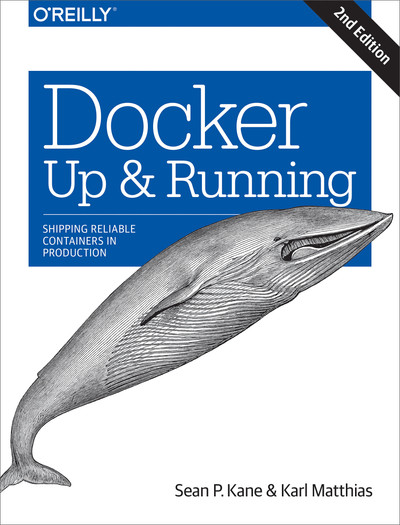
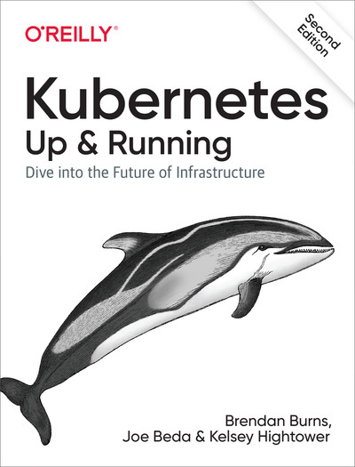

# Docker and Kubernetes

 

---

## Instructor Introduction

* Instructor, please introduce yourself

* Talk about your background and your experience in the subject

---

## About This Class

 

* Objectives:
    - Learn about Docker and Kubernetess
    - Get hands-on experience

* A **practical approach to Docker and Kubernetes**

* Skill level: **Intro to intermediate**

* Format: **50% lectures + 50% labs**

* This is a **very hands-on** class

Notes:

---

## Agenda

* 5 days; 2 days o Docker + 3 days of Kubernetes

* **Day 1 - Docker**
    - Containers intro
    - Docker intro
    - Images and containers
    - Docker networking

* **Day 2 - Docker**
    - Docker volumes
    - Dockerfiles
    - Container registries
    - Dockercompose

---

## Agenda Continued

 

* **Day 3 - Kubernetes**
    - Kubernetes introduction
    - Kubernetes architecture
    - Deploying scalable services

* **Day 4 - Kubernetes**
    - labels and selectors
    - Storage
    - Networking

* **Day 5 - Kubernetes**
    - Security
    - Kubernetes addons
    - Practical examples
    - Kubernetes in the cloud
    - Workshops

---

## Pre-requisites & Expectations

* Intended audience:
    - Admins, developers, architects

* **Basic Linux knowledge** is assumed

* Some software development experience (languages, databases, ...)

* Curiosity!

    - Ask a lot of questions

* This is an **intro-intermediary** class.

---

## Our Teaching Philosophy

<!-- {"left" : 1.78, "top" : 3.22, "height" : 5.4, "width" : 6.7} -->

* Emphasis on concepts & fundamentals

* Highly interactive (questions, discussions, etc. are welcome)

* Hands-on (learn by doing)

---

## Class Introductions

* Run a quick background survey if applicable, and go over the responses

* Students please introduce yourselfs (time permitting)
    - Your Name
    - Your background (developer, admin, manager, etc.)
    - Technologies you are familiar with
    - Familiarity with Docker and Kubernetes   
    (scale of 1 - 4 ;  1 - new, 2 - know some concepts,  3 - too a course, 4 -  using it at work)
    - Something non-technical about you!  
    (favorite ice cream flavor / hobby...etc)

 &nbsp; <!-- {"left" : 1.55, "top" : 6.43, "height" : 1.76, "width" : 1.99} --> &nbsp; <!-- {"left" : 3.56, "top" : 6.45, "height" : 1.7, "width" : 3.13} --> &nbsp; <!-- {"left" : 6.71, "top" : 6.43, "height" : 1.76, "width" : 1.99} -->

---

## Recommended Resources

* Books
    - [Docker: Up & Running, 2nd edition](https://learning.oreilly.com/library/view/docker-up/9781492036722/)
    - [Kubernetes: Up & Running, 2nd Edition](https://learning.oreilly.com/library/view/kubernetes-up-and/9781492046523/)

* Online
    - [docs.docker.com](https://docs.docker.com/)
    - [Docker cheat sheet](https://www.docker.com/sites/default/files/d8/2019-09/docker-cheat-sheet.pdf)
    - [kubernetes.io/docs](https://kubernetes.io/docs/home/) 
    - [Kubernetes cheat sheet](https://kubernetes.io/docs/reference/kubectl/cheatsheet/)

---

## Class Logistics

* Instructor's contact

* Slides

* Labs

* Lab environment

---

## Let's Get Started!

  &nbsp;  &nbsp;