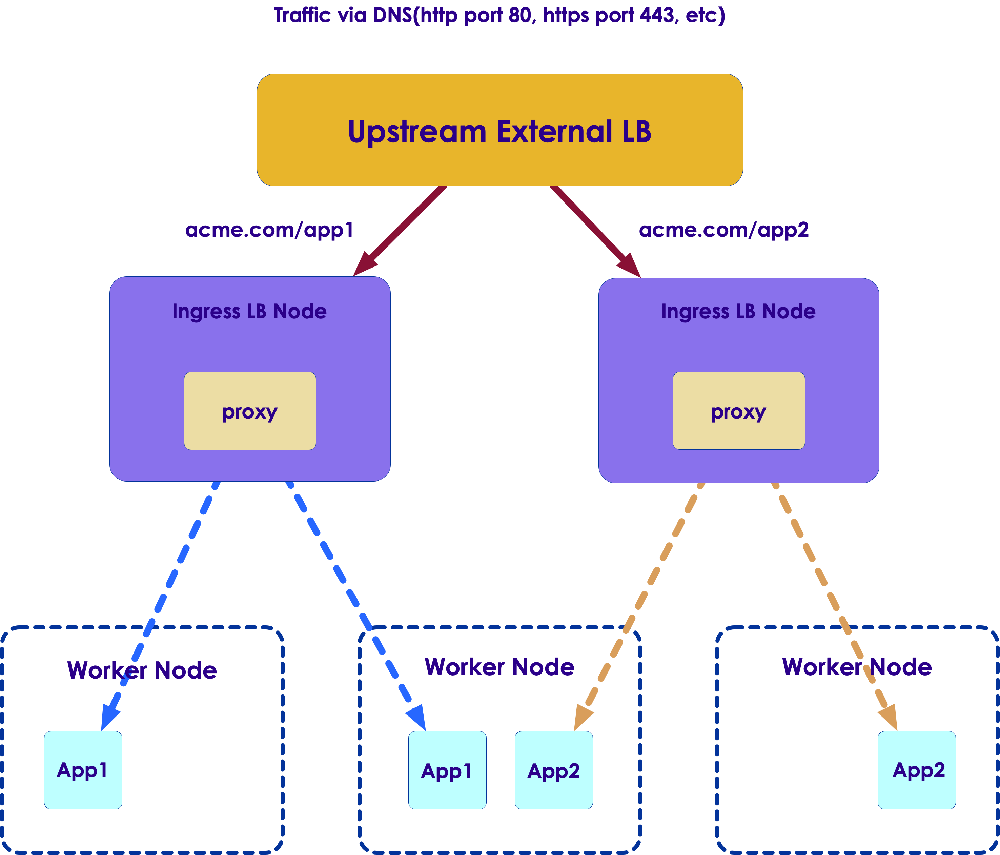

Kubernetes: Advanced
===================

## Module Objectives

After this module, participants will be able to:

  * Review what Kubernetes is

  * Identify DNS for Services and Pods

  * Service Discovery & Load balancing

  * Understand Kubernetes networking

  * Implement charts using Helm

  * Implement Ingress load balancing.

Notes:

Instructor Notes:

Please let students know that in addition to the objectives they identified for themselves in taking this module, these are the ones we expect to achieve based on the material provided.

Participant Notes:

In addition to the objectives you identified in taking this module, these are the ones we expect to achieve based on the material provided.

---

# Kubernetes Networking

## Cluster Networking

  * Kubernetes requirements:

    - Pods are routable on a flat network.

    - Pods should see their own routable IP address.

    - Nodes can communicate with all containers.

    - In many cases, to meet above requirements SDN need to be used.

    - All SDNs accomplish the same three goals – however, they may have different implementations with often unique features.


Notes:

Instructor Notes:

Participant Notes:

In a Kubernetes cluster, it is recommended practice to have all nodes on a 'flat' network – meaning no hierarchical network layout.
Node to Node communication is essential, and nodes are free to communicate with each other.

An SDN – Software Defined Networking – can help to define various network layouts.
How ever, SDNs can get complicated to administer.


---

## Docker Model

  * Docker:

    - Uses host-private networking Pods.

    - Creates a virtual bridge called docker0.

    - For each container that Docker creates, it allocates a virtual Ethernet device (called veth) that is attached to the virtual bridge.

    - The veth is mapped to appear as eth0 in the container.

    - Containers can talk with each other if they are present in the same machine.

    - For Docker containers to communicate across machines port allocation needs to be done on the parent machine’s own IP address.


Notes:

Instructor Notes:

Participant Notes:

By default, Docker uses host-private networking..
So Docker containers can only talk to other Docker containers running on the same machine.
But in a Kubernetes cluster, all containers need to communicate with each other freely.
So we need to allocate ports on hosts carefully so there is no conflict among Docker containers.
 

---

## Kubernetes Networking Model

   * Highly-Coupled Container-to-Container Communication

   * Pod-to-Pod Communication

   * Pod-to-Service Communication

   * External-to-Internal Communication


Notes:

Instructor Notes:

Participant Notes:

Highly-Coupled Container-to-Container Communication
This happens within a pod and can be treated similarly to the localhost traffic. However, as it does not feature any networking, it is out of the scope of this article.

Pod-to-Pod Communication
A pod is the smallest deployable computing unit that can be created and managed in Kubernetes. 
Each pod in a Kubernetes cluster is assigned an IP in a flat shared networking namespace.
This forms a networking model where each pod can communicate with the network just like in a virtual machine.

Pod-to-Service Communication
In the Pod-to-Service Communication model, services are assigned to client-accessible IPs. 
They are then transparently proxied to the pods grouped by that service. 
Requests to the service IPs are intercepted by a kube-proxy process running on all hosts, which then routes to the correct pod.

External-to-Internal Communication
Permitting external traffic into the cluster is finished mostly by mapping outside load balancers to explicitly uncovered services in the cluster. 
This mapping permits the kube-intermediary procedure to course the external requests to the proper pods using the cluster’s pod-network. 
Once traffic arrives at a node, it is routed to the correct service backends via the kube-proxy.

---

## Kubernetes Networking Model (Cont.)

  * Some of the plugins listed below were developed exclusively for Kubernetes, while others are more general purpose solutions.


  * **Kubenet**

    - Kubenet is typically useful for single-node environments.

  * **Flannel**

    - Flannel is a networking overlay fabric specifically designed for Kubernetes and created by CoreOS.

  * **Weave**

   - Weave is used to connect, monitor, visualize, and control Kubernetes.

## Kubernetes Networking Model (Cont.)

  * **OpenVSwitch**

   - OpenVSwitch is used to set up networking between pods across nodes. 

  * **Calico**

   - Calico provides simple, scalable and secure virtual networking.


Notes:

Instructor Notes:

Participant Notes:

Kubenet
It is typically useful for single-node environments. It can be utilized for communication between nodes by using it together with a cloud provider that establishes the rules. 
Kubenet is a very basic network plugin, so if you are looking for features such as cross-node networking or network policy, Kubenet will be of little help.

Flannel
Flannel is a networking overlay fabric specifically designed for Kubernetes and created by CoreOS. 
Flannel’s main advantage is it is well-tested and incurs a low cost. 
Flannel distributes the full workload across the entire cluster. Kubernetes, for proper communication and for locating services, performs port-mapping and assigns a unique IP address to each pod.  

Weave
Developed by Weaveworks, Weave is used to connect, monitor, visualize, and control Kubernetes. With Weave, you can create networks, firewalls with faster deployments, and gain powerful insights with easy automation troubleshooting and networking.   

OpenVSwitch using GRE/VXLAN
OpenVSwitch is used to set up networking between pods across nodes. 
The tunnel type could be VxLAN or GRE (Generic Routing Encapsulation). GRE is used for tunneling of frames over an IP network. 
VXLAN is preferable for big data centers when large-scale isolation needs to be performed within the network. 

Calico
Introduced with Kubernetes 1.0, Calico provides L3 routed networking for Kubernetes Pods. 
Calico provides simple, scalable and secure virtual networking.
 It uses Border Gateway Protocol (BGP) for root distribution for each pod allowing integration of Kubernetes clusters with existing IT infrastructure. 

---

## Cross Node Pod-to-Pod Network Connectivity


 <!-- {"left" : 0.55, "top" : 1.77, "height" : 3.27, "width" : 9.17} -->


Notes:

Instructor Notes:

Participant Notes:

For the illustration of these requirements let us use a cluster with two cluster nodes.
Nodes are in subnet 192.168.1.0/24 and pods use 10.1.0.0/16 subnet, with 10.1.1.0/24 and 10.1.2.0/24 used by node1 and node2 respectively for the pod IP’s.

So from above Kubernetes requirements following communication paths must be established by the network.

1) Nodes should be able to talk to all pods. For e.g., 192.168.1.100 should be able to reach 10.1.1.2, 10.1.1.3, 10.1.2.2 and 10.1.2.3 directly (without NAT)
2) A pod should be able to communicate with all nodes. For e.g., pod 10.1.1.2 should be able to reach 192.168.1.100 and 192.168.1.101 without NAT
3) A pod should be able to communicate with all pods. For e.g., 10.1.1.2 should be able to communicate with 10.1.1.3, 10.1.2.2 and 10.1.2.3 directly (without NAT)


---

# DNS for Services and Pods

## Service Anatomy


 <!-- {"left" : 1.47, "top" : 1.12, "height" : 5.27, "width" : 7.31} -->

Notes:

Instructor Notes:

Participant Notes:

Here Load Balancer is used to send traffic evenly to running instances.
As instances are added or removed from the service pool, the Load Balancer will adjust.

Explained in slide 39: Service Discovery Components 


---

## Client vs. Server Side Service Discovery

**Client Discovery**

 <!-- {"left" : 3.65, "top" : 0.93, "height" : 3.09, "width" : 4.29} -->

**Server Discovery**

 <!-- {"left" : 1.97, "top" : 4.48, "height" : 2.82, "width" : 4.82} -->


Notes:

Instructor Notes:

Participant Notes:

Client Discovery: 
Client talks to the Service registry and does load balancing.
Client service needs to be Service registry aware.
Example: Netflix OSS

Server Discovery:
Client talks to the load balancer and the load balancer talks to the Service registry. 
Client service need not be Service registry aware.
Examples: Consul, AWS ELB, K8s, Docker


---

## Autoscaling During Rolling Update


  * **Discovery**

    - Services need to discover each other dynamically, to get IP addresses and port details to communicate with other services in the cluster
    - Service Registry maintains a database of services and provides an external API (HTTP/DNS) as a distributed key/value store
    - Registrator registers services dynamically to the Service registry by listening to the Service creation and deletion events


  * **Health Check**

     - Monitors Service instance health dynamically and updates the Service registry accordingly


  * **Load Balancing**

    - Dynamic load balancing of traffic to healthy instances that provide the target service

Notes:

Instructor Notes:

Participant Notes:

The registry serves as a place to publish available services – think like a 'yellow pages'.
For example a service that offers zipcode lookup can be advertised in the registry, that can be discovered by other services.

A health check is performed every few seconds on the containers.
This ensures the containers are alive and running.

Load balancing is explained in slide no. 42. 


---

## Health Check Options


  * **Script based check**

    - Running user provided script on a periodic basis

  * **HTTP based check**

    - Periodic HTTP based check to the service IP and endpoint address

  * **TCP based check**

    - TCP based check is done to service IP and specified port periodically

  * **Container based check**

    - Health check application is also available as a Container
    - Container is periodically invoked by Health Check Manager


Notes:

Instructor Notes:

Participant Notes:

There various ways of doing health checks.

For example to test a Web Service, we can perform a HTTP check.
We can query the Web Service and examine the return code.
If we get return code 200, then we know the Web Service is alive.
If we get a 404 code, we know the Web Service is down.


---

## Lab 5: Orchestrating the cloud with the Kubernetes


  * **Overview**

    - Kubernetes is all about applications. In this part of the lab you will use an example application called "app" to complete the labs.

  * **In this lab you will learn how to :**

   - Provision a complete  cluster using Kubernetes
   - Deploy and manage Docker containers using kubectl.
   - Break an application into microservices using Kubernetes' Deployments and Services.


Notes:

---

## Lab 5: Orchestrating the cloud with the Kubernetes

  * Approximate time:

    - 20-30 minutes

  * Link to the lab

    - https://www.qwiklabs.com/focuses/557?parent=catalog

Notes:

---

# Service Discovery and Load Balancing


## Service Discovery

  * Kubernetes provides two options for internal service discovery:

  * **Environment Variable**

    - When a new Pod is created, environment variables of the older services can be imported, allowing the services to talk to each other thereby enforcing a order in service creation.

  * **DNS**

    - Kubernetes provides the kube-dns service for registering services to the DNS service. Using this, new services can find each other and talk to other services.


Notes:

Instructor Notes:

Participant Notes:

Here is an example of an environment variable:
     export  ZIP_CODE_LOOKUP=http://192.168.1.10

A DNS based lookup could be : 'zip_lookup.company.com' points to IP address  192.168.1.10 

Either way, we can reach the Zipcode lookup service.


---

## Load Balancing

  * Kubernetes provides several ways to expose services to the outside.


  * **Discovery**

    - Kubernetes exposes the service through special ports (30000-32767) of the node IP address.


  * **Load balancer**

    - Kubernetes interacts with the cloud provider to create a load balancer that redirects the traffic to the Pods. This approach is currently available with GCE.


  * **Ingress Controller**

    - Kubernetes ingress includes support for TLS and L7 http-based traffic routing. This feature is available from Kubernetes v1.2.0.


Notes:

Instructor Notes:

Participant Notes:

A NodePort service is the most basic way to get external to the service. 
Specific ports on all the Nodes are open and serve requests.
You can only have one service per port, and you can only use ports 30000–32767.

A Load Balacer is a recommended approach to route traffic to multiple Pods.
It will take into consideration the load on Pods before sending traffic over.

---

## Internal Load Balancing

 <!-- {"left" : 1.73, "top" : 1.47, "height" : 4.71, "width" : 6.85} -->

Notes:

Instructor Notes:

Participant Notes:

Service name gets mapped to Virtual IP and port using Skydns
Kube-proxy watches Service changes and updates IPtables. Virtual IP to Service IP, port remapping is achieved using IP tables 
Kubernetes does not use DNS based load balancing to avoid some of the known issues associated with it


---

## Internal Load Balancing (Cont.)


.png) <!-- {"left" : 1.27, "top" : 1.66, "height" : 4.69, "width" : 7.79} -->

Notes:

Instructor Notes:

Participant Notes:

Service name gets mapped to Virtual IP and port using Skydns
Kube-proxy watches Service changes and updates IP tables. Virtual IP to Service IP, port remapping is achieved using IP tables 
Kubernetes does not use DNS based load balancing to avoid some of the known issues associated with it

Here we see a Load Balancer (LB)  in action.
Client contacts the LB at 10.0.0.1
And the traffic can be sent to any one of 3 Pods (color : Red)

---

# Helm

## Helm - Introduction

  * Helm is a tool that streamlines installing and managing Kubernetes applications.

  * Helm has two parts: a client (helm) and a server (tiller)

  * Tiller runs inside of your Kubernetes cluster, and manages releases (installations) of your charts.

  * Helm runs on your laptop, CI/CD, or wherever you want it to run.

  * Charts are Helm packages that contain at least two things:

  * A description of the package (Chart.yaml)

  * One or more templates, which contain Kubernetes manifest files

  * Charts can be stored on disk, or fetched from remote chart repositories (like Debian or RedHat packages)

Notes:

---

## Helm - Introduction

  * Helm helps you manage Kubernetes applications

  * Helm Charts helps you define, install, and upgrade even the most complex Kubernetes application.

  * Charts are easy to create, version, share, and publish

  * The latest version of Helm is maintained by the CNCF - in collaboration with Microsoft, Google, Bitnami and the Helm contributor community.


Notes:

---

## Uses of Helm

  * Helm is used to :

    - Find and use popular software packaged as Helm charts to run in Kubernetes
    - Share your own applications as Helm charts
    - Create reproducible builds of your Kubernetes applications
    - Intelligently manage your Kubernetes manifest files
    - Manage releases of Helm packages


Notes:

---

## Architecture

  * There are three main components of Helm :

    - The **chart** is a bundle of information necessary to create an instance of a Kubernetes  application.
    - The **config** contains configuration information that can be merged into a packaged chart to create a **releasable** object.
    - A release is a running instance of a chart, combined with a specific **config**.


Notes:

---

## Architecture


  * Helm has two major components: Helm Client and Tiller Server

  * **The Helm Client** is a command-line client for end users.

  * The client is responsible for the following domains:
    - Local chart development
    - Managing repositories
    - Interacting with the Tiller server
       - Sending charts to be installed
       - Asking for information about releases
       - Requesting upgrading or uninstalling of existing releases

Notes:

---

## Architecture

  * **The Tiller Server** is an in-cluster server that interacts with the Helm client, and interfaces with the Kubernetes API server.

  * The server is responsible for the following:

    - Listening for incoming requests from the Helm client
    - Combining a chart and configuration to build a release
    - Installing charts into Kubernetes, and then tracking the subsequent release
    - Upgrading and uninstalling charts by interacting with Kubernetes

Notes:

---

## Implementation

  * The Helm client is written in the Go programming language, and uses the gRPC protocol suite to interact with the Tiller server.

  * The Tiller server is also written in Go. It provides a gRPC server to connect with the client, and it uses the Kubernetes client library to communicate with Kubernetes. Currently, that library uses REST+JSON.

  * The Tiller server stores information in ConfigMaps located inside of Kubernetes. It does not need its own database.

  * Configuration files are, when possible, written in YAML


Notes:

---

## Helm Charts


  * Helm uses a packaging format called charts. A chart is a collection of files that describe a related set of Kubernetes resources.

  * A single chart might be used to deploy something simple, like a memcached pod, or something complex, like a full web app stack with HTTP servers, databases, caches, and so on.

  * Charts are created as files laid out in a particular directory tree, then are packaged into versioned archives to be deployed.

Notes:

---

## Helm Charts and versioning

  * Every chart must have a version number.

  * A version must follow the SemVer 2 standard.

  * Unlike Helm Classic, Kubernetes Helm uses version numbers as release markers. Packages in repositories are identified by name plus version.

  * For example, an nginx chart whose version field is set to version: 1.2.3 will be named:

```python
nginx-1.2.3.tgz
```


Notes:

---

# Ingress Load Balancing

## Ingress Load Balancing

Kubernetes provides several ways to expose services to the outside.

  * If we choose NodePort to expose our services, Kubernetes will generate ports corresponding to the ports of your pods in the range of 30000-32767.

  * Need to add an external proxy layer that uses DNAT to expose more friendly ports.

  * **ClusterIP** and **ExternalName** similarly, while easy to use, have the limitation where we can add any routing or load balancing rules.

  * Choosing **LoadBalancer** is probably the easiest of all methods to get your service exposed to the internet. The limitation is reliance on an external load balancer.

 <!-- {"left" : 7.65, "top" : 6.34, "height" : 0.97, "width" : 2.39} -->


Notes:

Instructor Notes:

Participant Notes:

Standard ports to be used are 30,000 – 32,767.
If we want to use other ports, we need to use DNAT Proxy service.

While NodePort approach is simpler, in production systems a Load Balance is recommended.

---

## What is Kubernetes Ingress?

  * Services and pods have only IP routable by the network. Thus, when traffic hits the edge router, it gets either forwarded or dropped at that point. This is where Ingress helps to minimize the drops and wrong routing.

  * Ingress resource is a collection of rules that map to Kubernetes services within the cluster. Ingress resources are defined within the cluster as an object, so that other entities can watch and respond to them.

## What is Kubernetes Ingress?

  * Ingress needs apiVersion, kind and metadata for config. It also needs information needed to configure the load balancer or proxy server such as list of rules that can match against all the incoming requests.

  * Ingress Supports defining following rules in beta stage:

    - **host header:**  Forward traffic based on domain names.
    - **paths:** Looks for a match at the beginning of the path.
    - **TLS:** If the ingress adds TLS, HTTPS and a certificate configured through a secret will be used.


Notes:

Instructor Notes:

Participant Notes:

Think of Ingress as a 'router'.
It uses 'host names' and 'paths' to route the traffic to the correct Pod.
Ingress uses 'rules' to find out the destination to send the request.
For example, we can specify all HTTPS (secure HTTP) traffic to be sent to certain Pods.

---

## Ingress-based HTTP Load Balancer


 <!-- {"left" : 2.01, "top" : 1.01, "height" : 5.48, "width" : 6.24} -->


Notes:

Instructor Notes:

Participant Notes:

Here we see we are routing traffic based on rules.
We are serving both HTTP and HTTPS requests.

Acme.com/app1  is going to 2 worker nodes on left.
Acme.com/app2  is going to 2 worker nodes on right.

---

## Lab 6: NGINX Ingress Controller on Kubernetes 


  * **Overview:**

    - In Kubernetes, Ingress allows external users and client applications access to HTTP services. Ingress consists of two components, an Ingress Resource and an Ingress Controller

    - Ingress Resource is a collection of rules for the inbound traffic to reach Services. These are Layer 7 (L7) rules that allow hostnames (and optionally paths) to be directed to specific Services in Kubernetes.

    - Ingress Controller acts upon the rules set by the Ingress Resource, typically via an HTTP or L7 load balancer. It is vital that both pieces are properly configured so that traffic can be routed from an outside client to a Kubernetes Service

    - NGINX is a high performance web server and is a popular choice for an Ingress Controller because of its robustness and the many features it boasts


Notes:

---

## Lab 6: NGINX Ingress Controller on Kubernetes


  * **Approximate time:**

    - 20-30 minutes

  * **Link to the lab**

    - https://www.qwiklabs.com/focuses/872?parent=catalog

Notes:

---
