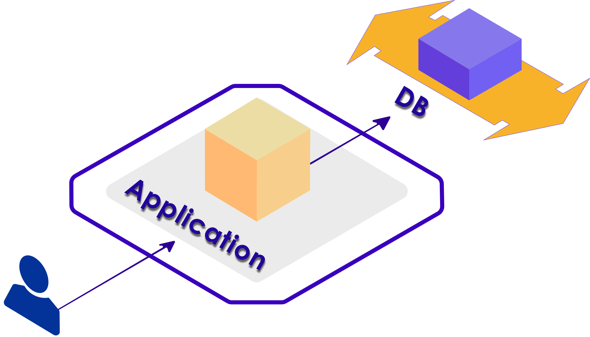
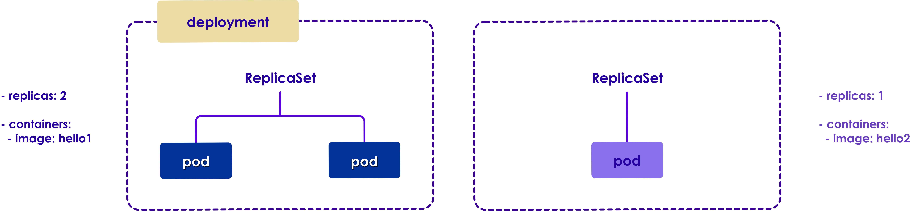
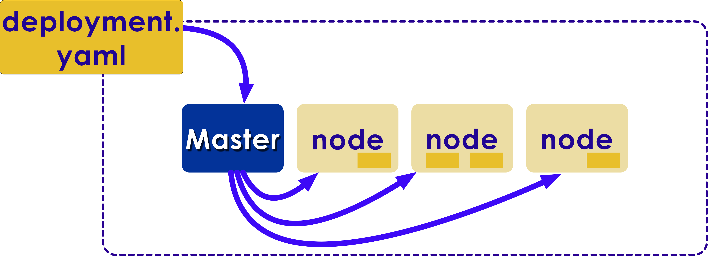

Kubernetes: Basics
===================

## Module Objectives

After this module, participants will be able to:

 * Enumerate the advantages of microservices

 * Explain the use of container.

 * Describe the purpose of cloud orchestration.

 * Understand the basics of Kubernetes

 * Work with pods configurations, deployments, and replica sets and replication controller

Notes:

Instructor Notes :

Please let students know that in addition to the objectives they identified for themselves in taking this module, these are the ones we expect to achieve based on the material provided.

Participant Notes :

In addition to the objectives you identified in taking this module, these are the ones we expect to achieve based on the material provided.

---

## What is Microservice?

  * Microservices is a software design principle. It lets individual components focus on their well-defined functionality and implementation technology.

    - Microservices allow to break the monolithic application into a collection of smaller-scale services.
    - Microservice is an independently deployable service modeled around a business domain.
    - Microservice is self-contained and implements a single business capability.
    - Smart components using simple communication channels like a simple RESTish protocol or lightweight messaging queue.
    - Microservices can help create scalable, testable software that can be delivered weekly, not yearly.

Notes:

Instructor Notes :

Please let students know that in addition to the objectives they identified for themselves in taking this module, these are the ones we expect to achieve based on the material provided.

Participant Notes :

In addition to the objectives you identified in taking this module, these are the ones we expect to achieve based on the material provided.

---

## What is Microservice?

  * Simpler To Deploy
  * Componentization
  * Business Capabilities
  * Faster Defect Isolation
  * Responsibility

 <!-- {"left" : 6.87, "top" : 2.37, "height" : 3.14, "width" : 3.13} -->

Notes:

Instructor Notes :

Participant Notes :

Below are the explanations of the bullet points.

Simpler To Deploy – Because one can deeply individual pieces, without touching the other deployments.
Componentization – Each microservices is a separate component, maintained by its team, and updated independently.
Business Capabilities –  One microservice can be used by different business functionalities. 
Faster Defect Isolation – When a microservice goes down or a test fails, one can find out the reason fast.
Responsibility – Separation of responsibility is a great software development principle, and here it can be implemented through microservices.

---

## Microservice Pros

* Develop independently
* Deploy frequently
* Test often and individually
* Each group is free to use the preferred latest technology
* Easy to install
* Easy to detect and debug issues in an individual microservice

Notes:

Instructor Notes :

Participant Notes :

Microservice architecture gives developers the freedom to independently develop and deploy services
Independent, easy and frequent deployment. One service can be tested, built and deployed without doing this for all services (or the whole application).
Independent services are easier to test.
Easy to understand and modify for developers, thus can help a new team member become productive quickly.
The developers can make use of the latest technologies and code is organized around business capabilities.
Easy installation, configuration and deployment. This can be a pain when using application servers.
It is easier to debug any issues with a specific Microservice.

---

## Microservice Cons

  * Not all qualities of microservices are perfect.
  * The division is too granular and testing becomes more complicated and tedious.
  * There is additional organizational overhead.
  * Teams may duplicate their efforts.
  * More configuration management is required.
  * Transactions may require multi-phase commit.
  * Partitioning of the application into microservices depends on the skills of the architect.
  * Good architects are rare.

Notes:

Instructor Notes :

Participant Notes :

Due to distributed deployment, testing can become complicated and tedious A microservice can be developed by a fairly small team.
Increased effort for operations, deployment and monitoring. Each service is a separate deployment units, which has to be released, tested and monitored. This means a) that the delivery workflow has be automated
Being a distributed system, it can result in duplication of effort
Increased configuration management. For each microservice we need to create a dedicated build and delivery pipeline. 
When the number of services increases, integration and managing whole products can become complicated.
Partitioning the application into microservices is very much an art.
It is extremely difficult to find good architects for creating Microservice architecture in the right way.

---

## Shipping Software is Hard

 <!-- {"left" : 0.41, "top" : 1.46, "height" : 4.58, "width" : 9.43} -->

Notes:

Instructor Notes :

Participant Notes :

There multiple problems that one typically faces when shipping software. These are illustrated in this diagram. They can be enumerated as

There are multiple software stack that all play together; they have to be combined in the final shipped product
There are multiple hardware layers underlying the deployment.

---

## Matrix from Hell

|                  | Dev VM | QA Server| Prod Instance | Prod Cluster | AWS | Laptop |
|------------------|--------|----------|---------------|--------------|-----|--------|
| HTML/CSS         | ???    | ???      | ???           | ???          | ??? | ???    |
| Back-End Code    | ???    | ???      | ???           | ???          |     | ???    |
| App DB           | ???    | ???      | ???           | ???          | ??? | ???    |
| Analytics DB     | ???    | ???      | ???           | ???          | ??? | ???    |
| Worker Processes | ???    | ???      | ???           | ???          | ??? | ???    |
| Queue            | ???    | ???      | ???           | ???          | ??? | ???    |

Notes:

Instructor Notes :

Participant Notes :

There multiple problems that one typically faces when shipping software. These are illustrated in this diagram. They can be enumerated as

There are multiple software stack that all play together; they have to be combined in the final shipped product
There are multiple hardware layers underlying the deployment.

---

# Containers

## Containers – Introduction

  * Containers virtualize the OS just like hypervisors virtualizes the hardware.
  * Containers enable any payload to be encapsulated as a lightweight, portable, self-sufficient container.
  * Wraps up a piece of software in a complete filesystem that contains everything it needs to run, such as:
    - Code
    - Runtime
    - System tools
    - Libraries, etc.  

Notes:

Instructor Notes :

Participant Notes :

Due to distributed deployment, testing can become complicated and tedious A microservice can be developed by a fairly small team.  

Increased effort for operations, deployment and monitoring. Each service is a separate deployment units, which has to be released, tested and monitored. This means a) that the delivery workflow has be automated  

Being a distributed system, it can result in duplication of effort

Increased configuration management. For each microservice we need to create a dedicated build and delivery pipeline. 

When the number of services increases, integration and managing whole products can become complicated.

Partitioning the application into microservices is very much an art.

It is extremely difficult to find good architects for creating Microservice architecture in the right way.

---

## Containers – Introduction (Cont.)

  * Docker, LXCs are some of the most popular implementations of containers today.
  * Can be run on any Linux Server -  VMs, physical Hosts, open stack.
  * Ability to move around between machines without any modification.
  * Ability of containers to work together.

Notes:

Instructor Notes :

Participant Notes :

The basic properties of containers is that they deliver of promises made above. 

They can run on top of any Linux – because they re-use the Linux kernel functionality.
And, because they build their own environment, they can be moved to another OS.
Finally, built into the container architecture is their ability to work well together.

---

## Container Based Architecture

  * Container-based architecture is characterized by the following:

    - Containers are organized on the networking level
    - Container image is a package of software that is stand alone and lightweight
    - Container image is a package of software that is stand alone and lightweight
    - For each application, containers provide their functionality the over design
    - As a result, container-based solutions can be easily moved between different environments

Notes:

Instructor Notes :

Participant Notes :

Applications are typically made up of individually containerized components (often called microservices) that must be organized at the networking level in order for the application to run as intended. 

A container image is a lightweight, stand-alone, executable package of a piece of software that includes everything needed to run it: code, runtime, system tools, system libraries, settings. 

Containers are a solution to the problem of how to get software to run reliably when moved from one computing environment to another. 
This could be from a developer's laptop to a test environment, from a staging environment into production, and perhaps from a physical machine in a data center to a virtual machine in a private or public cloud.

---

## Docker is the Shipping Container for Code

 <!-- {"left" : 0.48, "top" : 1.47, "height" : 4.5, "width" : 9.28} -->

Notes:

Instructor Notes :

Participant Notes :

By contrast to the situation we described before, Docker allows to ship software into the pre-defined, controlled environment. That is because each container is built by Docker and is therefore know and tested.

---

## What is Docker?

  * Docker is a management tool that allows you to wrap all the necessary parts of an application into containers.
  * **Increased Portability:** Deploy across multiple platforms allows Docker to be run almost anywhere.
  * **Faster Startup Speeds:** Docker allows us to easily start and stop the correct containers for each client in seconds.
  * **Higher Security:** All Docker containers are run as isolated environments, each with its own process space and network space.
  * **Smart & Efficient Debugging:** Docker lets developers troubleshoot production environment bugs locally.

Notes:

Instructor Notes :

Participant Notes :

Increased Portability:  
The ability to add to the container and then deploy across multiple platforms allows Docker to be run almost anywhere. This is important because it lets developers write code on a local development environment, test it locally and then push to production without having to worry about things not working. All environments are exactly the same; you won’t hear the phrase “It worked on my local environment!” ever again.

Faster Startup Speeds:  
We try to have all our clients running on the same environment, but with so many hosting solutions and CMS systems being used, this just isn’t a feasible or scalable solution. For our developers, switching between client production environments used to mean wasting time waiting for virtual machines to get up and running. Not anymore. Docker allows us to easily start and stop the correct containers for each client in seconds. Getting our local environments up and running quickly means we can get to work fixing issues right away.

Higher Security  
All Docker containers are run as isolated environments, each with its own process space and network space. This allows the Docker container to run only the applications you really need, cutting down on security patches and updates while eliminating unnecessary risk. Additionally, because the software is open source, many developers have contributed wonderful security tools for scanning and securing containers. Docker lowers your maintenance needs, raises site security, and puts a ton of tools at your fingertips.

Smart & Efficient Debugging  
Another great development feature: Docker lets developers troubleshoot production environment bugs locally. When things aren’t working correctly on a client’s site, we often have to enable many different debugging features to pinpoint the problem. These features, while effective, can slow down the site, which of course directly impacts conversions. With Docker, we can easily fire up our local environment, replicate the issue and debug locally before pushing a fix to the live site. Keeping diagnostic processes off the live production environment lets your site stay lean, light, and lightning fast.

---

## Virtual Machine vs. Docker

  * Virtual Machine
    - Contains App (Megabytes)
    - On a guest OS (Gigabytes)
    - Heavyweight
    - Hard to Maintain

  * Docker
    - Just app
    - Plus Dependencies
    - Shared Kernel
    - Portable
    - Efficient

 <!-- {"left" : 6.00, "top" : 1.00, "height" : 5.55, "width" : 2.98} -->

Notes:

Instructor Notes :

Each virtualized application includes not only the application-which may be only 10s of MB – and the necessary binaries and libraries, but also an entire guest operating system- which may weigh 10s of GB.

The Docker Engine container comprises just the application and its dependencies. It runs as an isolated process in userspace on the host operating system, sharing the kernel with other containers. Thus, it enjoys the resource isolation and allocation benefits of VMs but is much more portable and efficient

Participant Notes :

How do Docker container compare to virtual machines? Docker is lightweight. It allows isolation from the surrounding environment but not the total isolation. Since it re-uses some of the underlying Linux implementations, it does not have to re-implement them. This makes it fast.

---

## Docker Components

  * Docker is a full development platform for creating containerized apps.

    - Docker server
    - Docker Images (and Docker File)
    - Registries
    - Containers
    - Command line tools for management
    - REST API for management (and automation)
    - Git philosophy and Docker images

Notes:

Instructor Notes :

Participant Notes :

Docker server: Docker server is a tool that lets you install Docker Engine on virtual hosts, and manage the hosts with docker-server commands.
Docker Images: An image is an inert, immutable, file that's essentially a snapshot of a container.
Registries: A registry is a storage and content delivery system, holding named Docker images, available in different tagged versions.
Container: Docker containers isolate applications from one another and from the underlying infrastructure.
Command line: Docker manages most of the files in the configuration directory and you should not modify them. However, you can modify the config.json file to control certain aspects of how the docker command behaves.
REST API:  Docker provides an API for interacting with the Docker daemon.
Git:  Git and Docker both have a significant learning curve and can be a costly switch.

---

## How Does Docker Work?

 <!-- {"left" : 0.59, "top" : 1.57, "height" : 4.88, "width" : 9.16} -->

Notes:

Instructor Notes :

Participant Notes :

This diagram explains the basic Docker architecture. Images are stored in repositories and are used for building container. Every time you change something in a container, you are adding on top of the container.

This is implemented with Docker Daemon. It is a server responsible for all actions related to containers. This Daemon gets its commands from the Docker client, either with CLI or REST API.

---

## Advantages of Docker

  * An easy and lightweight way to create dedicated containers.
  * Docker containers are lightweight by design and ideal for enabling microservices application development.
  * Continuous integration and development.
  * Cloud migration, multi-cloud or hybrid cloud infrastructure require frictionless portability of applications.
  * The first step with Docker is to modernize the existing application portfolio.

Notes:

Instructor Notes :

Participant Notes :

Docker containers are lightweight by design and ideal for enabling microservices application development. 
Accelerate development, deployment and rollback of tens or hundreds of containers composed as a single application. 

Integrate modern methodologies and automate development pipelines with the integration of Docker and DevOps.

Cloud migration, multi-cloud or hybrid cloud infrastructure require frictionless portability of applications. Docker packages applications and their dependencies together into an isolated container making them portable to any infrastructure. Eliminate the “works on my machine” problem once and for all. Docker certified infrastructure ensures the containerized applications work consistently.

The first step with Docker is to modernize the existing application portfolio. Packaging existing apps into containers immediately improves security, reduce costs, and gain cloud portability.

---

## What Has Docker Done For Us?

* Continuous delivery

* Improved Security

* Run anything, anywhere

* Reproducibility

 <!-- {"left" : 6.32, "top" : 1.89, "height" : 4.74, "width" : 3.76} -->

Notes:

Instructor Notes :

Participant Notes :

Before Docker, Virtual Machines were used to provide reliable environment for applications.
VMWare is a vendor for virtualized containers.

How ever Virtual Machines (VM) were heavy weight and clunky.
They had lot of overhead in running and creating them was usually a manual process that is error prone.

Docker provides a light weight container that provides a reliable environment to run application.

---

## What Has Docker Done For Us? (Cont.)

  * **Continuous delivery**

    - Gaining traction for its consistency in delivery and deployment across  environment.
    - Configured to maintain all configurations and dependencies internally.

  * **Improved Security**

    - Ensures applications and resources are isolated and segregated from each other.

---

## What Has Docker Done For Us? (Cont.)

  * **Run anything, anywhere**

    - Portability across multi-cloud platforms such as AWS, Azure, Rackspace, etc.
    - Allows for a high-level of abstraction from your infrastructure layer.

  * **Reproducibility**

    - Ensure consistency across multiple development and release cycles.
    - Standardizes environment and allows version control.

Notes:

Instructor Notes :

Participant Notes :

Docker containers are supported across many operating systems (Windows, Mac and Linux) – these are called 'host environment'.
So an application running within a Docker container will have the exact same environment regardless of the host environment.

Also Docker images are built using a 'Dockerfile' – it specifies how exactly the Docker image is to be constructed.
This is why we consider Docker a reproducible environment.

---

# Container Orchestration

## Container Orchestration

  * Container orchestration as doing the same job for the data center.
  * Container orchestration is the big fight of the moment.
  * By definition, container orchestration is that portion of the management software that brings all of the containers together.
  * A single container cannot work without the others.
  * In the data center, containers service to automate the complete operation
  * Container orchestration is not easy.

Notes:

Instructor Notes :

Participant Notes :

As we mentioned above, it is easy to explain what the container orchestration does, and there are tools for that. But it is the same as project management. Although the tools for project management are not lacking, a good project manager is the person who brings the project together. The same goes for a container-based application.

---

## Simple Webapp 
 * Nginx/Appache + PHP + DB
 * Probably don't need orchestration

 <!-- {"left" : 0.65, "top" : 2.00, "height" : 5.12, "width" : 8.94} -->

Notes:

Instructor Notes :

Participant Notes :

If your current software infrastructure looks something like this — maybe Nginx/Apache + PHP/Python/Ruby/Node.js app running on a few containers that talk to a replicated DB — then you might not require container orchestration, you can probably manage everything yourself.

---

## Decoupling
  * Scalability Requires Decoupling
  * Caches and Queues Help Decouple

 <!-- {"left" : 0.44, "top" : 2.0, "height" : 5.29, "width" : 9.36} -->

Notes:

Instructor Notes :

Participant Notes :

The standard challenges of container orchestration and application growth are Service Discovery, Load Balancing, Secrets/configuration/storage management, Health checks, and auto deployment.

These are solved with the following architectural principle: decoupling. Decoupling can be implemented with queues or caches, as illustrated on this diagram.

---

# Kubernetes

## What is Kubernetes?

  * Open source project originally conceived by Google.
  * Google’s 15+ years of experience with containerized apps.
  * Currently maintained by Cloud Native Computing Foundation.
  * Red Hat has been a member since day one.
  * Red Hat is the second largest contributing member.
  * Greek: Kubernetes  = Helmsman
  * Also called K8s
     - Abbreviation derived by replacing 8 letters of “ubernete” with ‘8’ and subsequent ‘s’.

 <!-- {"left" : 3.65, "top" : 4.84, "height" : 2.42, "width" : 2.95} -->

Notes:

Instructor Notes :

Participant Notes :
Kubernetes is a powerful open-source system, initially developed by , for managing containerized applications in a clustered environment. It aims to provide better ways of managing related, distributed components and services across varied infrastructure.

Its basic level, is a system for running and coordinating containerized applications across a cluster of machines. It is a platform designed to completely manage the life cycle of containerized applications and services using methods that provide predictability, scalability, and high availability.

Kubernetes originates from Greek, meaning helmsman or pilot, and is the root of governor and cybernetic. K8s is an abbreviation derived by replacing the 8 letters “ubernete” with “8”.

---

## What is Kubernetes? (Cont.)

  * Particularly suited for horizontally scalable, stateless, or 'microservices' application architectures.
  * Start, stop, update, and manage a cluster of machines running containers in a consistent and maintainable way.
  * Additional functionality to make containers easier to use in a cluster.
  * Provides container-centric management environment.
  * Provides the simplicity of PaaS with the flexibility of IaaS.
  * Enables portability across infrastructure providers.

 <!-- {"left" : 3.74, "top" : 5, "height" : 2.26, "width" : 2.77} -->

Notes:

Instructor Notes :

Participant Notes :
With Horizontal Pod Autoscaling, Kubernetes automatically scales the number of pods in a replication controller, deployment or replica set based on observed CPU utilization.

Creating a new replication controller with the updated configuration.
Increasing/decreasing the replica count on the new and old controllers until the correct number of replicas is reached.
Deleting the original replication controller.

---

## What Does Kubernetes Do?

* Improves Reliability

* Better Use of Infrastructure Resources

* Easy Co-ordination of Deployments

 <!-- {"left" : 3.66, "top" : 3.81, "height" : 2.66, "width" : 2.92} -->

Notes:

Instructor Notes :

Participant Notes :

Kubernetes is an open source container-orchestration system.
It was originally developed by Google and open sourced under Apache 2 License.
Kubernetes supports multiple containers, including the very popular Docker containers.

Reference :
https://kubernetes.io/

---

## What Does Kubernetes Do? (Cont.)

  * **Improves Reliability**

    - Handles the work of deploying, scaling and managing the containerized applications.

    - Brings software development and operations together by design.

* **Better use of Infrastructure Resources**

    - Eliminates infrastructure lock-in by providing core capabilities for containers without imposing restrictions through Pods and Services.

    - Containers allow modularizing for application components thereby enabling faster development and dependency isolation.

    - Allows for elasticity of entire platform – easy to scale up and down.

* **Easily Coordinates Deployments on your System**

    - Which containers need to be deployed and where?

Notes:

Instructor Notes :

Participant Notes :

Kubernetes manages containers across a cluster.
It has been proven at large scale infrastructure – remember Google uses Kubernetes at a massive scale.

When scheduling containers, Kubernetes considers the load across the cluster.
Kubernetes tries to evenly balance the load on the cluster machines.  So there are not 'hot spots' and 'idle machines'.

---

# Kubernetes Architecture

## A Big Picture Overview of Kubernetes

 <!-- {"left" : 0.47, "top" : 1.56, "height" : 4.38, "width" : 9.31} -->

Notes:

---

## User Perspective

  * User view

 <!-- {"left" : 0.28, "top" : 3.13, "height" : 1.75, "width" : 9.73} -->

Notes:

---

## Kubernetes Architecture

 <!-- {"left" : 0.33, "top" : 1.05, "height" : 5.91, "width" : 9.58} -->

Notes:

Instructor Notes :

Participant Notes :

Kubernetes engine is a cluster. It has at least one master and potentially multiple worker machines. Worker machines are called nodes. The master and the node machines together perform cluster orchestration.

Kubernetes master
The master's lifecycle is managed by Kubernetes Engine when you create or delete  a cluster. 

Kubernetes node 
A typical cluster has one or more nodes, that are called worker machines, which run the containerized application and other workloads. A Master manages all the nodes and hence receives updates on the status of each node.

---

## Kubernetes Master Architecture

 <!-- {"left" : 0.43, "top" : 1.29, "height" : 4.92, "width" : 9.38} -->

Notes:

Instructor Notes :

Participant Notes :

**Etcd**
Configuration information is stored in Etcd and this information can be used by each of the nodes in the cluster.  
Etcd is an HA key value store and can be distributed among various nodes in the cluster. Being a distributed key value store, it is accessible to all.
Etcd contains sensitive information and hence is accessible only by the Kubernetes API server.  

**API Server**
Kubernetes, an API server provides for all the operation using the API, in the cluster. 
API server acts as an interface, whereby different tools and libraries can readily communicate with it. In this case, it is used to communicate with API, UI, and CLI clients.

**Scheduler** 
Scheduler, being one of the key components of Kubernetes master, is responsible for workload distribution.
It is also responsible for monitoring, tracking of utilization and redistribution of the workload on the nodes based on their resource availability.
Scheduler is also responsible for allocation of the pod to a new node.

**Controller** 
Kubernetes Controller is a daemon that embeds the core control loops shipped with Kubernetes. 
Controller continuously monitors the state of the cluster through the API Server watch feature. Upon notification, it initiates necessary changes to move to the desired state.

---

## Kubernetes Architecture: Node

 <!-- {"left" : 0.46, "top" : 1.81, "height" : 3.88, "width" : 9.33} -->

Notes:

Instructor Notes :

Participant Notes :

Key components of the Node server that are necessary to communicate with Kubernetes master: 
**Docker**
Docker is a basic requirement for each node. Dockers help in running the encapsulated app containers in an isolated, self-contained, lightweight environment.
Kubelet 
Kubelet, the primary “node agent”, runs on each node and works in line with PodSpec.
Kubelet communicates with the master component for receiving the commands and for working. It is responsible for maintaining the status quo of the work process and node server. 

**Kube-Proxy** 
This proxy service runs on each of the nodes and helps in ensuring that services are available to the external host. It also helps in forwarding the service requests to the right containers and performs basic level of load balancing.
Kube-Proxy ensures the predictability of the networking environment in terms of accessibility without compromising on the isolation.
It also manages pods on node, volumes, secrets, creating new containers’ health checkup, etc.

Subsequent section covers pod component in detail. 

---

# Kubernetes Pod

## Pod

  * The Pod is the core component of Kubernetes
  * The Pod is co-located, co-scheduled, and run in a shared context
  * Containers in the same pod share the same hostname
  * Each pod is isolated by:

    - Process ID (PID) namespace
    - Network namespace
    - Inter Process Communication (IPC) namespace
    - Unix Time Sharing (UTS) namespace

  * Pods are scaled up and down

Notes:

Instructor Notes :

Participant Notes :

The pod serves as Kubernetes’ core unit of management. 
A pod is a group of one or more co-located and co-scheduled containers with shared storage/network and run in a shared context.
It hosts all the specifications that are required run the containers.

A pod models an application-specific “logical host” containing one or more application containers which are relatively tightly coupled.

---

## What is a Pod?

  * A Pod is a group of containers which shares networking and storage which are separate from the node

 <!-- {"left" : 2.37, "top" : 2.11, "height" : 4.88, "width" : 5.52} -->

Notes:

---

## Pod vs. Container

 <!-- {"left" : 0.48, "top" : 1.33, "height" : 4.84, "width" : 9.3} -->

Notes:

Instructor Notes :

Participant Notes :

Typically, Containers are often used for solving narrowly defined problems. However, most of the time we end designing for multiple containers to solve a single problem. 

Thus the main purpose of a multi-container Pod is to support those helper process that are co-located, co-managed for a primary application. 

Few if those are listed below: 

**Sidecar ** “help” the main container – examples are log or data change watchers, monitoring adopters, data loaders that generates data for the primary container etc. Basically, these sidecar containers can be repurposed or reused either within the same group or by different groups.
**Proxies, bridges, and adapters** creates a connect  between the main container and external world. These can also re-route the traffic to the external work. Thus proxies and bridges make it possible for the main container to access the localhost without any service discovery.

---

## Pod vs. Container

 <!-- {"left" : 0.45, "top" : 1.23, "height" : 4.83, "width" : 9.32} -->

Notes:

Instructor Notes :

Participant Notes :

Pod: In this Yaml file a group of one or more container is declared, so we call it a Pod. In containers in a Pod are deployed together, and are started, stopped, and replicated as a group.

Container: Docker and Kubernetes pods both are configuration files(Yaml) that define container instances from images. Docker by itself is just a file that has the capacity to contain services(containers) for communication, it is inherently non distributed.

---

## How Pods Manage Multiple Containers

  * A Pod might encapsulate an application composed of multiple co-located containers that are tightly coupled and need to share resources.
  * **Pod diagram:** Pods provide 2 types pf shared resources for containers constituent in them:
    - Networking
    - Storage
  * Each Pod is assigned a unique IP address and containers within them communicate with each another using localhost.
  * Pod can specify a set of shared storage volumes which can be shared by all the containers within.

Notes:

Instructor Notes :

Participant Notes :

Pods are designed to support cohesive multiple cooperating processes or containers. These containers, by default, are co-located and co-scheduled in the same machine in the cluster. The machine can be physical or virtual.
Each of these containers share resources and dependencies, and can communicate and coordinate with one another.

Networking
Each Pod is assigned a unique IP address, and every container in the pod shared the same namespace, IP address, and network ports. They communicate with one another using localhost.

Storage
Set of shared storage volumes can be specified in a Pod, which can be accessed by all containers to share the same set of data. 
Volumes allow persistent data in a Pod in case of container restart within the pod.

---

# Kubernetes Pod Config

## General Configuration

  * Configurations are defined with the latest stable API version.
  * Configuration files should be stored in version control before being pushed to the cluster.
  * Configuration files allow you to quickly roll back a configuration change if necessary.
  * It also aids cluster re-creation and restoration.
  * YAML is preferred over JSON as it is more user friendly and can be used inter-changeably.

Notes:

Instructor Notes :

Participant Notes :

Latest stable API versions are specified when defining configurations.

Version control stores all the Configuration files prior to pushing them to the cluster. This allows for quick roll-backs if necessary.

YAML is preferred for writing Config files.

---

## General Configuration Cont.

  * Group related objects into a single file wherever possible, which makes it easy to manage
  * Note  that many kubectl commands can be called on a directory.
  * Avoid specifying default values - simple, minimal configuration make it less error prone.
  * Put object descriptions in annotations, to allow better introspection.
  * Avoid naked Pods - Naked Pods will not be rescheduled when node fails.

Notes:

Instructor Notes :

Participant Notes :

Group related objects into a single file whenever it makes sense. One file is often easier to manage than several. 

Many kubectl commands can be called on a directory.

Default values should not be specified unnecessarily to minimize the errors during configuration.

Put object descriptions in annotations, to allow better introspection.

---

## Configuring a Pod  

  * Define a pod with a YAML file

 <!-- {"left" : 0.49, "top" : 1.78, "height" : 4.94, "width" : 5.17} -->

Notes:

---

## Uploading the Configuration

  * Upload the YAML file to the master

 <!-- {"left" : 0.99, "top" : 2.43, "height" : 3.15, "width" : 8.27} -->

Notes:

---
## Master Creates the Pod  

  * The master creates a pod on your set of nodes

 <!-- {"left" : 0.99, "top" : 2.18, "height" : 3.15, "width" : 8.27} -->

Notes:

---

## Composition of Pod YAML file -

  * A pod file is consists of several parts, for example

 <!-- {"left" : 0.26, "top" : 2.02, "height" : 3.99, "width" : 6.25} -->

Notes:

---

## Lab: Hello Node Kubernetes

  * **Overview:** In this lab we will create the first Node in Kubernetes. The goal of this hands-on lab is for you to turn code that you have developed into a replicated application running on Kubernetes

  * **What you'll do**
    - Create a Node.js server
    - Create a Docker container image
    - Create a container cluster
    - Create a Kubernetes pod
    - Scale up your services

Notes:

---

## Lab: Hello Node Kubernetes

  * **Approximate time:**

    - 20-30 minutes

* **Link to the lab**

    - https://www.qwiklabs.com/focuses/564?parent=catalog

Notes:

---

# Replica Sets

## What is Kubernetes Replication ?

  * Typically you would want to replicate your containers.
    Keep the replication simple.
  * Offer powerful, flexible deployment topologies for the development community.
    - **Reliability:** The impact of failure can be minimized with multiple versions of an application being stored.
    - **Load balancing:** Moreover, maintaining multiple versions of a container allows you to re-route the traffic to other instances with similar versions. This will prevent overloading of any particular node.
    - **Scaling:** If the load increase become unmanageable for the existing instances, then Kubernetes allows us to scale-up the instances with similar versions.

Notes:

Instructor Notes :

Participant Notes :
Before we go into how you would do replication, let’s talk about why.  

Typically one may prefer container replication for a variety of reasons.

Replication logic has to be simple by design but should offer powerful and flexible deployment topologies

Reliability: By having multiple versions of an application, you prevent problems if one or more fails.  This is particularly true if the system replaces any containers that fail.

Load balancing: Multiple versions allow for re-directing the traffic incase of a overload on single instance or node in Kubernetes.

Scaling: If the load increase become unmanageable for the existing instances, then Kubernetes allows us to scale-up the instances with similar versions.

---

## ReplicaSet

 <!-- {"left" : 0.58, "top" : 1.5, "height" : 5, "width" : 9.08} -->

Notes:

Instructor Notes :

Participant Notes :

We are running 4 copies of the application using ReplicaSet. Please note that name, selector, podTemplate and replica syntaxes used.

---

## ReplicaSet

 <!-- {"left" : 0.6, "top" : 0.99, "height" : 5.51, "width" : 9.06} -->

Notes:

Instructor Notes :

Participant Notes :

The replication Controller is 4 
Desired = 4 ( The Defined replication is up and running )
Current = 4 ( 4 pods are running )
Node    = 4

---

## ReplicaSet

 <!-- {"left" : 0.6, "top" : 0.99, "height" : 5.51, "width" : 9.06} -->

Notes:

Instructor Notes :

Participant Notes :

The replication Controller is 4 
Desired Pod = 4 ( The Defined replication is up and running )
Current Pod = 4 ( 4 pods are running )
Node    = 3

Then, one node is going to down. Let’s see how the replica set will replicate the pod. 

---

## ReplicaSet

 <!-- {"left" : 0.6, "top" : 0.99, "height" : 5.51, "width" : 9.06} -->

Notes:

Instructor Notes :

Participant Notes :

The replication Controller is 4 
Desired Pod = 4 ( The Defined replication is up and running )
Current Pod = 3 ( 3 pods are running )
Node    = 3

Then, one node is going to down. We now have 3 nodes.

---

## ReplicaSet

 <!-- {"left" : 0.6, "top" : 0.99, "height" : 5.51, "width" : 9.06} -->

Notes:

Instructor Notes :

Participant Notes :

The replication Controller is 4 
Desired Pod = 4 ( The Defined replication is up and running )
Current Pod = 4 ( 4 pod are running )
Node    = 3

The one pod is replicated into node 3. 

---

# Replication Controller

## Replication Controller

  * Replication Controller – the original form of replication in Kubernetes
  * Fast being replaced by Replica Sets.
  * Replication Controller structure enables easy creation of multiple pods and ensures   they are live
  * Replication Controllers allows pod scalability.
  * Replication Controller can be created with an imperative command, or declaratively

Notes:

Instructor Notes :

Participant Notes :

Despite being replaced by ReplicaSets, Replication Controller, the original form of replication is still widely in use.

A Replication Controller allows us to easily create multiple pods ensures that the pods are live and available. Replication Controller provides elasticity in managing the pods including the ability to autoscale or update the pods by a single command.

---

## Replication Controller Example

  * For example, create a new file called rc.yaml and add the following text:

 <!-- {"left" : 1.62, "top" : 1.95, "height" : 4.66, "width" : 7.02} -->

Notes:

Instructor Notes :

Participant Notes :

Creating replication using Replication controller. 

Name:        nginx
Namespace:   default
Selector:    app=nginx
Labels:      app=nginx
Annotations:    <none>
Replicas:    3 current 
Pod Template:
  Labels:       app=nginx

---

## Replica Sets

  * Replica Sets are in some ways comparable to Replication Controllers. They have a mix of advantage and disadvantages compared to Replication Controllers.
  * Replica Sets and Replication Controllers are declared almost in the same way except they have more options for the selector.
  * Replica Set makes sure that the specified number of pod replicas are always up and running.

Notes:

Instructor Notes :

Participant Notes :

Replica Sets are fast replacing RCs. 

Replica Sets though, are declared in the same way as Replication Controllers, but they possess more options for the selector. 
Replica Set makes sure that required number of pod replicas are running at all times.

---

## Replica Set Example

  * For example, we could create a Replica Set like this:

 <!-- {"left" : 1.91, "top" : 1.63, "height" : 4.73, "width" : 6.44} -->

Notes:

Instructor Notes :

Participant Notes :

Creating replication using Replica set controller. 

Name:	frontend
Namespace:	default
Selector:	tier=frontend,tier in (frontend)
Labels:	app=guestbook
tier=frontend
Replicas:	3 current / 3 desired
Pod Template:
  Labels:       app=guestbook
  tier=frontend
  Containers:
   php-redis:
    Image:      gcr.io/_samples/gb-frontend:v3
    Port:       80/TCP

---

# Deploying to Kubernetes

##  Deployments

  * Deployments are intended to replace Replication Controllers.
  * In addition to the functions of Replication Controllers, Deployments provide roll-out and roll-back options
  * Deployment ensures desired state of the deployment object is achieved and maintained through deployment controller
  * Pause the Deployment to apply multiple fixes to its PodTemplateSpec and then resume it to start a new rollout.

Notes:

Instructor Notes :

Participant Notes :
Deployments, intended to replace Replication Controllers, provide the same replication functions (through Replica Sets) but additionally provide the ability to roll out and roll back the changes if required.

When the desired state is specified in the Deployment object, and the Deployment controller ensures the movement to the desired state from the actual state at a controlled rate. 

Pause the Deployment to apply multiple fixes to its PodTemplateSpec and then resume it to start a new rollout.

---

## Deployment

  * Deployments depend on ReplicaSets to manage and run pods

 <!-- {"left" : 0.57, "top" : 1.82, "height" : 4.34, "width" : 9.14} -->

Notes:

---

## Deployment

  * Deployments monitor cluster and update changes when required

 <!-- {"left" : 0.55, "top" : 2.33, "height" : 3.65, "width" : 9.18} -->

Notes:

---

## Deployment

  * Deployments monitor pods and make correction when then stop working

 <!-- {"left" : 0.9, "top" : 2.42, "height" : 4.02, "width" : 8.46} -->

Notes:

---

## Deployment

  * Deployments constantly monitor cluster to observe changes

 <!-- {"left" : 0.79, "top" : 2.27, "height" : 3.45, "width" : 8.68} -->

Notes:

---

## Rolling updates

  * Rolling updates permit you to update from one image version to another

 <!-- {"left" : 0.99, "top" : 1.89, "height" : 4.93, "width" : 8.28} -->

Notes:

---

## Rolling updates

  * This deployment allows you to create a second ReplicaSet

 <!-- {"left" : 0.47, "top" : 2.91, "height" : 2.17, "width" : 9.31} -->

Notes:

---

## Rolling updates

  * It gradually increases the number of replicas in the second ReplicaSet

 <!-- {"left" : 0.51, "top" : 2.92, "height" : 2.15, "width" : 9.23} -->

Notes:

---

## Rolling updates

  * This decreases replicas in the first ReplicaSet

 <!-- {"left" : 0.69, "top" : 2.72, "height" : 2.07, "width" : 8.88} -->

Notes:

---

## Rolling updates

  * Hence at any given point of time there are at most 4 pods

 <!-- {"left" : 0.74, "top" : 2.73, "height" : 2.04, "width" : 8.76} -->

Notes:

---

## Rolling updates

  * Minimum of 3 pods

 <!-- {"left" : 0.74, "top" : 2.73, "height" : 2.04, "width" : 8.76} -->

Notes:

---

## Rolling updates

  * The same state continues

 <!-- {"left" : 0.74, "top" : 2.73, "height" : 2.04, "width" : 8.76} -->

Notes:

---

## Rolling updates

  * The previous state continues until new image version is rolled out

 <!-- {"left" : 0.74, "top" : 2.73, "height" : 2.04, "width" : 8.76} -->

Notes:

---

## Canary deployment

  * A Canary deployment depends on a service to balance the load during traffic to primary pods based on label selectors

 <!-- {"left" : 1.03, "top" : 2.35, "height" : 3.71, "width" : 8.2} -->

Notes:

---

## Canary deployment

  * Canary deployment tests a second deployment by load balancing a subset of traffic to new pods with the same label

 <!-- {"left" : 0.4, "top" : 2.21, "height" : 3.09, "width" : 9.45} -->

Notes:

---

## Blue green deployment

  * A blue-Green deployment make use the service label selector to change all traffic from one deployment to another

 <!-- {"left" : 0.97, "top" : 2.35, "height" : 3.87, "width" : 8.3} -->

Notes:

---

## Blue green deployment

  * Initially bring up and test new deployment without live traffic

 <!-- {"left" : 0.62, "top" : 2.25, "height" : 3, "width" : 9.01} -->

Notes:

---

## Blue green deployment

  * To make the version go live, change the service label selector which switches all traffic

 <!-- {"left" : 0.49, "top" : 2.73, "height" : 3, "width" : 9.27} -->

Notes:

---

# Deployment definition

## What is a Deployment object?  

 * A deployment object ensures that _N_ pods are running in a cluster at any given point of time

 <!-- {"left" : 0.99, "top" : 2.18, "height" : 3.15, "width" : 8.27} -->

Notes:

---

## Defining a Deployment Object  

  * A deployment is defined with a YAML file

 <!-- {"left" : 0.77, "top" : 1.47, "height" : 5.49, "width" : 5.21} -->

Notes:

---

## Communication with the Pod  

  * A service assigns a fixed IP to your pod replicas

  * A service allows other pods or services to communicate with the pod replicas

 <!-- {"left" : 1.19, "top" : 2.41, "height" : 4.33, "width" : 7.87} -->

Notes:

---

## Multiple Services

  * You can have multiple services with varying configurations and features at any given time

 <!-- {"left" : 0.87, "top" : 1.92, "height" : 4.77, "width" : 8.5} -->

Notes:

---

## Service YAML Definition

  * Define a service with a YAML file

 <!-- {"left" : 0.77, "top" : 1.78, "height" : 4.62, "width" : 5.66} -->

Notes:

---

## Deployment Example

  * Let’s create a simple Deployment.

 <!-- {"left" : 0.77, "top" : 1.78, "height" : 4.62, "width" : 5.66} -->

Notes:

Instructor Notes :

Participant Notes :

Deployment, nginx-deployment is created and is indicated by the .metadata.name field.
Three replicated pods are created by the deployment as mentioned in the replicas field
Deployment manages the pods based on the selector field definition.
Sophisticated selection rules can be created subject to pod template satisfying the rule.
.template.spec field or Pod template’s specification indicates that the Pods run one container, nginx, which runs the nginx Docker Hub image at version 1.7.9.
The Deployment opens port 80 for use by the Pods.

The template field contains the following instructions:
- Pods are labeled app: nginx
- Create one container with name nginx.
- Run the nginx image at version 1.7.9.
- Open port 80 for the container to send and accept traffic.

---

## Uploading YAML File  

  * Upload the YAML file to master, and the scheduler decides where to run the pods

simple Deployment.

 <!-- {"left" : 0.99, "top" : 2.67, "height" : 3.15, "width" : 8.27} -->

Notes:

---

## Lab 2: Managing deployments with Kubernetes

  * **Overview:**
    - This lab will provide practice in scaling and managing containers so you can accomplish these common scenarios where multiple heterogeneous deployments are being used.

  * **What you'll do**
    - Practice with kubectl tool
    - Create deployment yaml files
    - Launch, update, and scale deployments
    - Practice with updating deployments and deployment styles

Notes:

---

## Lab 2: Managing deployments with Kubernetes

  * **Approximate time:**
    - 20-30 minutes

  * **Link to the lab**
    - https://www.qwiklabs.com/focuses/639?parent=catalog
