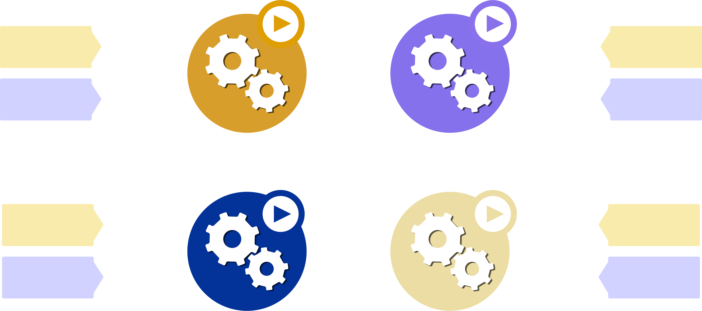
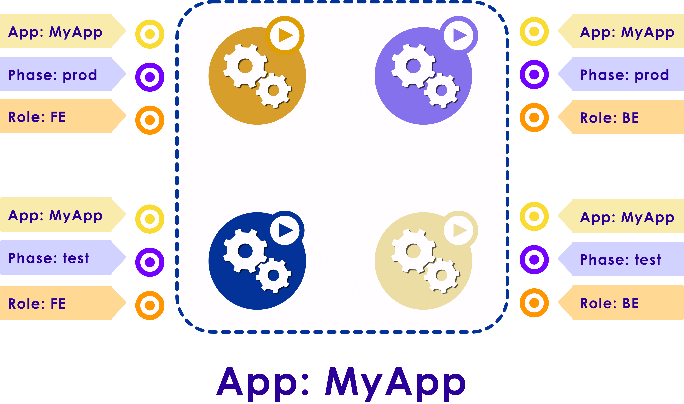
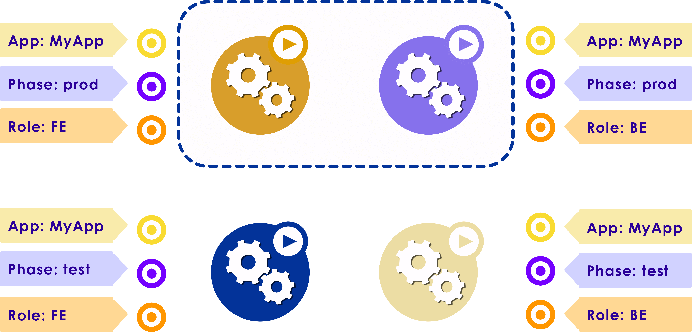
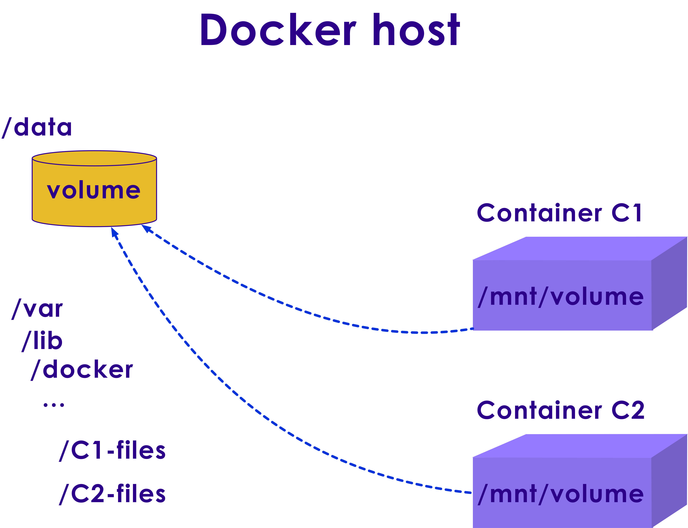
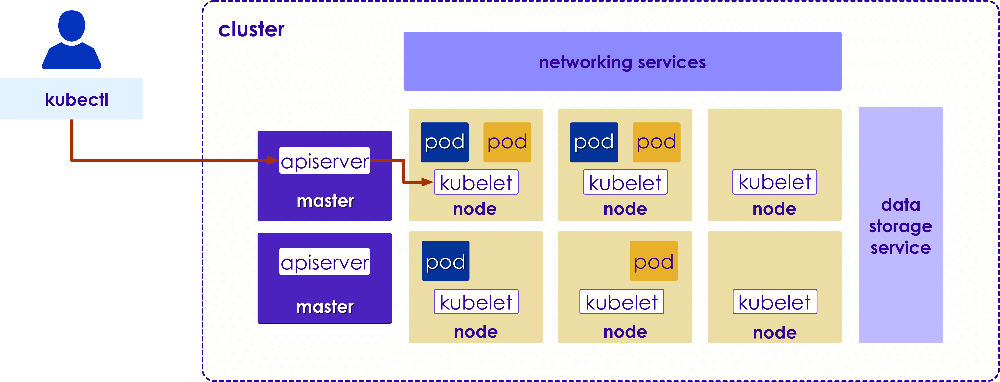

Kubernetes: Cluster
===================

## Module Objectives

After this module, participants will be able to:

  * Understand Kubernetes Primitives.

  * Install and set up Kubectl
 
  * Deploy stateless application

  * Deploy stateful set application

  * Create a continuous delivery pipeline

Notes:

Instructor Notes :
Please let students know that in addition to the objectives they identified for themselves in taking this module, these are the ones we expect to achieve based on the material provided.

Participant Notes :
In addition to the objectives you identified in taking this module, these are the ones we expect to achieve based on the material provided.

---
# Kubernetes Primitives

## Kubernetes Primitives

  * Cluster
  * Pod
  * Labels and Selectors
  * ReplicaSets / StatefulSets
  * Service
  * Namespace

 <!-- {"left" : 6.46, "top" : 2.65, "height" : 3.15, "width" : 3.49} -->


Notes:

Instructor Notes :

Participant Notes :

Pod:  represents a running process.  Usually this is an application container
Service: This is a logical set of Pods that provide a particular service (like web service)
Namespace : Namespace provides a 'logical' structure to host applications.  A single physical cluster can be divided into multiple namespaces (logical clusters)
Labels : Labels can be used to identify resources

We will examine all these concepts in the next few sections.

---
## What is a cluster?

  * A cluster is a set of computing instance that Kubernetes manages

 <!-- {"left" : 1.01, "top" : 2.86, "height" : 3.23, "width" : 8.28} -->

Notes:

---

## Can One Serve Two Masters?

  * Yes!
  * A cluster can have multiple masters and lots of nodes

 <!-- {"left" : 3.16, "top" : 2.02, "height" : 5.2, "width" : 4.12} -->

Notes:

---

## Pod - Recap

  * The Pod is the basic building block and hence is the smallest deployable object in the Kubernetes object model.
  * Each Pod, though meant to be run as a single instance of an application, multiple pods need to be used for horizontal scaling up of application.
  * Creation of multiple pods is replication.
  * Replicated pods are created and managed as a group by an abstraction called Controller.
  * A Pod is a group of one or more containers with shared storage/network and a specification for how to run the containers.
  * A Pod is co-located, co-scheduled, and run in a shared context.
  * Containers in the same pod have the same hostname.

Notes:

Instructor Notes :

Participant Notes :

The pod serves as Kubernetes’ core unit of management. 
A pod is a group of one or more containers with shared storage/network, and a specification for how to run the containers.  
A pod’s contents are always co-located and co-scheduled, and run in a shared context. 
A pod models an application-specific “logical host” - it contains one or more application containers which are relatively tightly coupled-in a pre-container world, they would have executed on the same physical or virtual machine.


---
## Deploying a Pod

 <!-- {"left" : 0.4, "top" : 1.58, "height" : 4.33, "width" : 9.45} -->

Notes:

Instructor Notes :

Participant Notes :

Here we see 2 Pod definitions. 
A Python one for web application
A Redis one for datastore

Master – All communication paths from the cluster to the master terminate at the API server.
Web Pod – Deployed the web application into the kubernetes nodes.
DB pod   - Deployed the Database application. 
We can deploy many pods like those listed above. 

---
## Pod Definition

 <!-- {"left" : 0.65, "top" : 1.44, "height" : 4.62, "width" : 8.95} -->

Notes:

Instructor Notes :

Participant Notes :

Here we see a definition of a sample Pod.
This is defining nginx – a popular web server.
We are specifying the version of the software (1.7.9).
And the port being used – web services usually listen on port 80.


---

# Labels and Selectors

---

## Labels and Selectors

  * Labels are Key/Value pairs associated with K8s objects
  * As the name suggests, Labels are used to meaningfully specify identifying attributes of objects
  * Used to organize and select subsets of objects
  * Attached to objects at the time of creation but can be modified at any point in time
  * Though each object can have a set of Key/Value labels, each key must be unique for each object
  * Objects can be queried from the API server by the label

  * **Labels are the essential glue to associate one API object with another andare used to select a set of objects**

    - Pods -> Replication Controller
    - Pods -> Service
    - Node -> Pods

Notes:

Instructor Notes :

Participant Notes :

Docker server: Docker server is a tool that lets you install Docker Engine on virtual hosts, and manage the hosts with docker-server commands.
Docker Images: An image is an inert, immutable, file that's essentially a snapshot of a container.
Registries: A registry is a storage and content delivery system, holding named Docker images, available in different tagged versions.
Container: Docker containers isolate applications from one another and from the underlying infrastructure.
Command line: Docker manages most of the files in the configuration directory and you should not modify them. However, you can modify the config.json file to control certain aspects of how the docker command behaves.
REST API:  Docker provides an API for interacting with the Docker daemon.
Git:  Git and Docker both have a significant learning curve and can be a costly switch.

---
## Kubernetes Labels by Example

 <!-- {"left" : 0.63, "top" : 1.23, "height" : 5.04, "width" : 8.99} -->

Notes:

Instructor Notes :

Participant Notes :

Labels can be used to assign meaningful names.
For example we can tag a container slated for deployment as follows
	"release" : "qa", "production" , "dev"
Here key is 'release'
Value can be any of 'qa',  'production' or 'dev'

---

## Labels and Identifiers  

  * Labels are metadata assigned to any API object which represents identity
  * Labels are the only grouping mechanism for pods
  * Search by selectors

 <!-- {"left" : 0.89, "top" : 3.1, "height" : 3.74, "width" : 8.46} -->


Notes:

---
## Example: Pods and Labels  

  * The example below has four pods and three labels

 <!-- {"left" : 0.89, "top" : 2.38, "height" : 3.74, "width" : 8.46} -->


Notes:

---

## Query for Labels  

  * You can query for labels that map to value of the entire app


 <!-- {"left" : 0.98, "top" : 1.87, "height" : 4.89, "width" : 8.28} -->


Notes:

---

## Narrow Search   

  * You can either narrow your search with multiple labels - your app’s fronted


 <!-- {"left" : 1.18, "top" : 1.81, "height" : 4.91, "width" : 7.89} -->

Notes:

---

## Query for only backend   

  * You can either narrow your search with multiple labels - your app’s backend


 <!-- {"left" : 0.96, "top" : 1.65, "height" : 5.23, "width" : 8.39} -->

Notes:

---
## Query for Test Phase  

* You can either narrow your search with multiple labels - your app’s test phase

 <!-- {"left" : 0.81, "top" : 2.35, "height" : 4.12, "width" : 8.62} -->

Notes:

---

## Query for Production  

  * You can either narrow your search with multiple labels - your
app’s production release


 <!-- {"left" : 0.84, "top" : 2.1, "height" : 4.12, "width" : 8.57} -->

Notes:

---


## Replication Controller (RC)

 * **Replication Controller**

    - Pod lifecycle is managed by the Replication Controller.
    - RC ensures that a homogeneous set of Pods (or even a single pod) is always running.
    - RC created with a count of 1, ensures that a pod is always available.
    - RC has the capability to spin-up or terminate a specified number of pods.
    - RC ensures that it maintains the required/specified number of pods:
      - New pods are launched to replace failed/terminated pods.
      - If more pods are running, then the excess pods are killed.
    - RC and Pods are associated through Labels.

Notes:

Instructor Notes :

Participant Notes :

Replication Controller (RC) keeps a close eye on number of Pods running.
If a Pod fails for any reason, RC can spin up a replacement Pod.
This way we can ensure 'a service' is continue to run, even if some Pods that are part of the Service are down.

---

## Scaling Pods with Replication Controller


 <!-- {"left" : 0.4, "top" : 1.58, "height" : 4.33, "width" : 9.45} -->

Notes:

Instructor Notes :

Participant Notes :

Here we see the Replication Controller (RC) specification is used to deploy a web application.
We have 3 Web Pods deployed.

A sample RC Specification is in the next slide.

---

## Example Replication Controller

 <!-- {"left" : 0.49, "top" : 1.48, "height" : 4.53, "width" : 9.28} -->

Notes:

Instructor Notes :

Participant Notes :

Here we are deploying 3 containers of Nginx – a popular web server.
The configuration also specifies the port number (80) the Nginx service listens to.

The configuration is below:
Name: nginx
Namespace: default 
Selector: app=nginx 
Labels: app=nginx 
Replicas: 3 

---

# Services

---

## Services

  * An abstraction to define a logical set of Pods that are bound by policy to access them.
  * Internal and external endpoints are used to expose the services.
  * Services manipulate iptables by interfacing with the kube-proxy.
  * Services Support TCP and UDP.
  * Services can be exposed internally through ClusterIP (default) or outside through NodePort by specifying a type in ServiceSpec.
  * Services are exposed through virtual-IP-based bridge, which redirects to the backend Pods.


 <!-- {"left" : 2.99, "top" : 6.11, "height" : 1.25, "width" : 4.27} -->

Notes:

Instructor Notes :

Participant Notes :

An example of Service might be a web service.
This Web Service can be powered by say 3 Pods.
Client accessing the service doesn't care if the 3 Pods are up and running or not, as long as the service is accessible.

---

## Exposing Services

 <!-- {"left" : 0.4, "top" : 1.76, "height" : 3.97, "width" : 9.45} -->

Notes:

Instructor Notes :

Participant Notes :

How can we expose our 'Web Pod' to outside clients?
Here is a configuration to map incoming ports to 'Web Pod' ports.

kubectl get svc my-nginx -o yaml | grep nodePort -C 5
  uid: 07191fb3-f61a-11e5-8ae5-42010af00002
spec:
  clusterIP: 10.0.162.149
  ports:
  - name: http
    nodePort: 31704
    port: 8080
    protocol: TCP
    targetPort: 80
  - name: https
    nodePort: 32453
    port: 443
    protocol: TCP
    targetPort: 443
  selector:
    run: my-nginx

---

## Service Creation

 <!-- {"left" : 0.58, "top" : 1.44, "height" : 4.62, "width" : 9.08} -->

Notes:

Instructor Notes :

Participant Notes :

This specification will create a Service which targets TCP port 80 on any Pod with the run: my-nginx,

---
## Namespace

* **Namespaces:**

    - Intended for use in multi-user/multi-team environments.
    - Provides additional qualification to a resource name.
    - Allows division of cluster resources amongst multiple users, thus provides logical separation between teams and their environments.
    - Allows for role-based access control.
    - For future versions, objects in the same namespace to have same access control policies by default.
    - Manage different environments within the same cluster.

## Namespace

* **Functionality of Namespace:**

    - Namespaces help pod-to-pod. communication using the same namespace.
    - Namespaces are virtual clusters that sit on top of the same physical cluster.
    - Though most Kubernetes resources are in some namespaces, namespace resources themselves need not be in a namespace – e.g., Low-level resources such as nodes and persistent volumes are in any namespace.


Notes:

Instructor Notes :

Participant Notes :
Namespaces are 'logical or virtual entities'.
Multiple Namespaces can be hosted on a single physical cluster.

Namespaces help isolate resources into their own space.
Resources within a single Namespace, must have unique names.


---

## Namespace Creation

 <!-- {"left" : 0.7, "top" : 1.31, "height" : 4.89, "width" : 8.85} -->

Notes:

Instructor Notes :

Participant Notes :

A Kubernetes namespace provides the scope for Pods, Services, and Deployments in the cluster.
Users interacting with one namespace do not see the content in another namespace.

---

# Kubernetes Autoscaling

## Horizontal Pod Autoscaler

  * Autoscaling, one of the key features, allows the kubernetes cluster to automatically increase or decrease the number of nodes  based on the demand for service response.
  * Based on CPU utilization, Horizontal Pod Autoscaler scales the number of pods automatically  in a replication controller, deployment or replica set.
  * The Horizontal Pod Auto scaler is implemented as a Kubernetes API resource and a controller.
  * The resource determines the behavior of the controller.
  * The controller periodically adjusts the number of replicas in a replication controller or deployment.

Notes:

Instructor Notes :

Participant Notes :

Autoscaling is one of the key features in Kubernetes cluster. It allows the scale up / scale down of nodes in response to service responses. 

Based on CPU utilization, Horizontal Pod Autoscaler scales the number of pods in a replication controller, deployment or replica set automatically 

Horizontal Pod Autoscaling does not apply to “un-scalable” objects.

---

## Horizontal Pod Autoscaler

 <!-- {"left" : 0.6, "top" : 1.12, "height" : 5.51, "width" : 9.06} -->

Notes:

Instructor Notes :

Participant Notes :

Implemented as a control loop, Horizontal Pod Autoscaler with a period controlled by the controller manager’s --horizontal-pod-autoscaler-sync-period flag (with a default value of 30 seconds).

The controller manager queries the resource utilization against the metrics specified in each HorizontalPodAutoscaler definition.

Per-pod resource metrics CPU, Memory, Disk, the controller taken the metrics from the resource metrics API.  Each pod targeted by the HorizontalPodAutoscaler. 

Per-pod custom metrics is also the same, like resource metrics, The raw values not utilization values
Objective metrics produce a proportion target value.


---

## Autoscaling During Rolling Update

  * Kubernetes is able to perform a rolling update by managing replication controllers directly.
  * Kubernetes uses the deployment object, which manages the underlying replica sets for you.
  * The Horizontal Pod Autoscaler is bound to the deployment object, it sets the size for the deployment object, and the deployment is responsible for setting sizes of the underlying replica sets.
  * Rolling update creates a new replication controller.
  * Horizontal Pod Autoscaler does not work with the rolling update.


Notes:

Instructor Notes :

Participant Notes :

Even though Kubernetes allows for managing the rolling-update  by directly managing replication controllers or by using the deployment object, Horizontal Pod Autoscaler only supports the latter approach

Horizontal Pod Autoscaler is bound to the deployment object - it sets the size for the deployment object, and the deployment is responsible for setting sizes of the underlying replica sets.

---

# Volume
## What is a volume?  

  * A volume is a directory
  * A volume gets created depending on its type

```python
$> kubectl create <volume>
```
 <!-- {"left" : 0.95, "top" : 3.15, "height" : 3.01, "width" : 8.34} -->

Notes:

---

## Docker Volumes  

  * Docker provides storage for data in containers
  * Volume does not allow data sharing between containers or lifecycle management


 <!-- {"left" : 1.83, "top" : 2.09, "height" : 5.06, "width" : 6.58} -->

Notes:

---

## Kubernetes Volumes  

  * Kubernetes volumes permits containers in pods to share data and be stateful


 <!-- {"left" : 3.11, "top" : 2.3, "height" : 4.29, "width" : 4.03} -->

Notes:

---
## Create a Pod  

  * Create a pod that consumes that data

```python
$> kubectl create –f pod.yaml
```
 <!-- {"left" : 0.95, "top" : 2.75, "height" : 3.01, "width" : 8.35} -->

Notes:

---

## Attach The Volume  

  * Attach volume to the pod

  * Connect to containers before they are brought online

 <!-- {"left" : 0.87, "top" : 2.18, "height" : 3.15, "width" : 8.51} -->

Notes:

---
## Data Mounted  

  * After the volume is attached, data is mounted into a container’s file system


 <!-- {"left" : 0.87, "top" : 2.18, "height" : 3.15, "width" : 8.51} -->

Notes:

---

## Container Gets Mounted Data  

  * The container is run and can access the mounted data

 <!-- {"left" : 1.13, "top" : 2.18, "height" : 3.15, "width" : 7.99} -->

Notes:

---
## Sharing Pod Lifecycle  

  * Few volumes share the lifecycle of their pod with others

 <!-- {"left" : 2.56, "top" : 1.77, "height" : 3.95, "width" : 5.14} -->


Notes:

---

## Complete Cluster  

* Cluster Overview

 <!-- {"left" : 0.86, "top" : 2.12, "height" : 3.26, "width" : 8.54} -->


Notes:

---

# Health Checks

## Health Checks

  * A kubelet checks whether the pod is alive and healthy, when it receives a negative response or no reply

 <!-- {"left" : 1.21, "top" : 2.63, "height" : 2.74, "width" : 7.84} -->


Notes:

---
## Restarting the Pod  

  * Kubelet then restarts the pod

 <!-- {"left" : 2.15, "top" : 2.14, "height" : 3.72, "width" : 5.95} -->


Notes:

---
## Verifying Health Check

  * Kubelet continuous to restart a pod until it gets a healthy reply

 <!-- {"left" : 1.71, "top" : 2.38, "height" : 2.74, "width" : 6.84} -->

Notes:

---

# Install and Set Up kubectl

## Kubernetes Installation and Cluster Initialization

* kubectl is a CLI for running commands against Kubernetes clusters.
* Run the following command to install kubectl tool.

```python
curl -LO https://storage.googleapis.com/kubernetes-release/release/$
(curl -s https://storage.googleapis.com/kubernetes-release/release/stable.txt)
/bin/linux/amd64/kubectl
```

* Make the kubectl binary executable.

```python
chmod +x ./kubectl
```

* Move the binary into your PATH.

```python
sudo mv ./kubectl /usr/local/bin/kubectl
```

* Initiate master to run following command.

```python
Kubeadm init --apiserver-advertise-address=ipaddress --pod-network-cidr=10.244.0.0/16
```


Notes:

Instructor Notes :

In addition, Detailed installation and configuration will be covered in Lab 1.
Instructor Notes are the same as Participant Notes.
Please present the Participant Notes.

Participant Notes :

I will show you step-by-step how to install and configure Kubernetes on CentOS 7. 
We will be using 1 server ‘ k8s-master' as the Kubernetes Host Master, and 2 servers as Kubernetes node, 'node01' and 'node02’.
Prerequisites :  3 CentOS 7 Servers & Root privileges
We will be covering:
Kubernetes Installation
Kubernetes Cluster Initialization
Adding node01 and node02 to the Cluster

In this first step, we will prepare those 3 servers for Kubernetes installation, so run all commands on the master and node servers.
We will prepare all servers for Kubernetes installation by changing the existing configuration on servers, and also installation some packages, including Docker-CE (Community Edition) and Kubernetes itself. We will see a few commands while performing the steps below:

Step 1: Downloaded the latest Kubectl package.  
Step 2: Make the kubectl binary executable. Granted the executable permission to the kubectl file. 
Step 3: Move the binary into the executable path. 
Step 4: In this step, we will initialize the kubernetes master cluster configuration.
--apiserver-advertise-address = determines which IP address Kubernetes should advertise its API server on.
--pod-network-cidr = specify the range of IP addresses for the pod network. We're using the 'flannel' virtual network. If you want to use another pod network such as weave-net or calico, change the range IP address.


---


## Kubernetes: Common [kubectl](https://kubernetes.io/docs/reference/kubectl/cheatsheet/)

  * Requires config file in .kube
  * Commonly used commands
  * Namespace
  * Pods
  * Secrets

```bash
kubectl version
kubectl # lists commands
kubectl create –f my-workflow.yaml # use argo command instead
kubectl get pods
kubectl port-forward –namespace=spark-als-driver 4040:4040
# kubectl port-forward –namespace=argo argo-ui-xxx 8001:8001
kubectl logs <pod-name> -n <namespace>
```
<!-- {"left" : 0, "top" : 3.37, "height" : 1.99, "width" : 10.25} -->

---

## Adding Node 01 and Node 02 to the Cluster


  * Now, join any number of machines by running the following command on each node as root:

```python
kubeadm join --token 4d138d.f5b4b78e952fb7fd 172.31.45.206:6443
--discovery-token-ca-cert-hash sha256:2b0a52b0b161ac7c8584c5478d45e0fe4a751205353f9b3b3da47b8553a08811
```

  * Check if the node is registered to the Kubernetes cluster:

```python
kubectl get nodes
```

 <!-- {"left" : 0.52, "top" : 5.39, "height" : 1.04, "width" : 9.28} -->


Notes:

Instructor Notes :

Participant Notes :

In this step, we will add node01 and node02 to join the 'k8s' cluster.
Connect to the node01 server and run the kubeadm join command.
Connect to the node02 server and run the kubeadm join command.
Wait a few minutes and go back to the 'k8s-master' master cluster server and check the nodes and pods using the following command:
kubectl get nodes 

Now, you will get node01 and node02 has been added to the cluster with status 'ready’.
node01 and node02 have been added to the kubernetes cluster.

---

# State and Storage

## State and Storage

  * **State**

    - State are purposeful to be used with stateful applications and distributed systems.
    - Stateless application process will not keep trac of past interactions.
    - Stateful application process has a record of previous interactions and can respond, based on it.

  * **Storage**

    - A persistent way to retain data.
    - The process executed in main memory on the data and not in a disk I/O.
    - If disk I/O is carried out, it might be either read-only or in a read-write manner.


Notes:

Instructor Notes :

Participant Notes :

State is a temporal property of a process. Stateless application process does not keep track of past interactions. It’s a purely functional behavior.

Stateful, on the other hand, retains and responds based on the previous interactions record

Where the state is kept, that is, in main memory or persisted on disk, is a different question.

Storage is a persistent way to keep data around.A process executed purely on data in main memory, there’s no disk I/O. If disk I/O is carried out, it might be read-only or in a read-write manner.


---
## StatefulSet Basics

  * StatefulSets were designed specifically to solve the problem of running stateful, replicated services inside Kubernetes.

  * StatefulSets to run a replicated database within Kubernetes is providing each pod a unique ID that persists.

  * Stateful applications with read-write disk access such as a service carrying out a financial transaction backed by an RDBMS.

  * Stateful applications without disk access (quadrant D), like a shopping basket service in an eCommerce site.

Notes:

Instructor Notes :

Participant Notes :

Stateful Sets represent a set of Pods with unique, persistent identities and stable hostnames 

State information and other resilient data is maintained in a persistent storage object associated with StatefulSet.

They are designed to solve the issues from running stateful, replicated services within Kubernetes. StatefulSets provides each pod a unique id as it runs a replicated database

Stateful applications with read-write disk access such as a service carrying out a financial transaction backed by an RDBMS.

Stateful applications without disk access (quadrant D), like a shopping basket service in an eCommerce site. 


---
## Stateless Basics

  * Stateless applications are applications which do not store data or application state to the cluster or to persistent storage.

  * Stateless applications with read-write disk access.

  * Stateless applications with read-only disk access such as a web server that reads the static content it serves from an external storage.

  * Stateless applications without disk access such as a converter services for geo coordinates.

Notes:

Instructor Notes :

Participant Notes :

A stateless application is one which depends on no persistent storage. 

Clusters are responsible for the code, and other static content hosted on it. It has no control over databases or the pods that has write or left over files. Thus, Stateless applications do not store data or app state to the persistent storage

Stateless applications with read-only disk access such as a web server that reads the static content it serves from an external storage

Stateless applications without disk access such as a converter services for geo coordinates.


---

# Deploying a Stateless Application

## Stateless - Overview

  * Stateless applications are ones that do not store data or application state to the cluster or to any persistent storage.

  * Deployment acts as the Controller for stateless pattern.

  * The client stores the Data and application state, making stateless applications more scalable.

  * Typically a frontend application is stateless.

  * Allows one to deploy multiple replicas to increase its availability and scale down when not required.

  * Deployment controller deploys stateless applications as uniform, non-unique Pods.

 <!-- {"left" : 7.32, "top" : 5.2, "height" : 1.64, "width" : 2.46} -->

Notes:

Instructor Notes :

Participant Notes :

Stateless applications are applications which do not store data or application state to the cluster or to persistent storage. 
Instead, data and application state stay with the client.
This makes stateless applications more scalable.
For example, a frontend application is stateless.


---

## Deployments Specification

  * Deployments manage the desired state of your application:
    - Ensures the required number of pods that are needed for running the application.
    - Which container image version should be run.
    - How the pods should be labeled.

  * Perform dynamic changes to the desired state through updates to the Deployment's Pod specification.

    - Stateless applications are in contrast to stateful applications:
    - Stateless – Don’t use persistent storage to save data.
    - Stateful – Use persistent storage to save data.


 <!-- {"left" : 8.23, "top" : 2, "height" : 1.53, "width" : 1.53} -->


Notes:

Instructor Notes :

Participant Notes :

An example of stateful application is a Web application.  
Usually data is saved in a database.

An example of stateless application would be 'time of day' web service.
It simply returns the current time.
There is no need to save data into a database.


---

## Deployments Specification

  * NGINX is open source software for web serving, reverse proxying, caching, load balancing, media streaming

  * Runs an application by creating a Kubernetes Deployment object

  * Describes Deployment in a YAML file

  * For example, the below YAML file describes a Deployment that runs the nginx:1.7.9 Docker image

  * Create a Deployment based on the YAML file:

     - kubectl apply -f
https://k8s.io/docs/artifacts/application/deployment.yaml

  * Display information about the Deployment:

    - kubectl describe deployment nginx-deployment


Notes:

Instructor Notes :

Participant Notes :

Create an nginx deployment.
Use kubectl to list information about the deployment.
You can run an application by creating a Kubernetes Deployment object, and you can describe a Deployment in a YAML file. For example, this YAML file describes a Deployment that runs the nginx:1.7.9 Docker image:
Create a Deployment based on the YAML file.
Describe the information about the Deployment in a pod. It will list all details for the pod. Like pod name, namespace, labels, annotations, selectors, replicas, pod template, and etc.


---

# Deploying a Stateful Sets Application

## Stateful Sets Application


 <!-- {"left" : 2.29, "top" : 1.09, "height" : 5.91, "width" : 5.67} -->


Notes:

Instructor Notes :

Participant Notes

Explained in following slides. 


---
## Stateful Sets - Overview

   * StatefulSet manages Pods that are based on an identical container spec:

     - Maintains their unique, persistent identity and their corresponding stable host names
     - Despite being created from the same spec, they are not interchangeable
     - Persistent identifier is maintained across any rescheduling
  * State information and other resilient data is also maintained.

  * Ordinal index is used by the StatefulSets for identifying and ordering of their Pods.

  * Stateful Set Pods are deployed in sequential order and are terminated in reverse ordinal order.

Notes:

Instructor Notes :

Participant Notes :

Examples of StatefulSets are Kafka, MySQL, Redis, ZooKeeper, etc.
These applications need unique, persistent identities and stable hostnames, so other applications can find them.

---
## Deployments Specification

  * Stateful Sets use a Pod template, which contains a specification for its Pods.

  * Pod specification determines how each Pod would work:

    - What applications should run inside its containers.
    - Which volumes should be mounted.
    - The pod’s labels and selectors.

  * StatefulSet ensures that the desired number of Pods are running and are available at all times

  * Incase of a pod failure or drop, StatefulSet automatically replaces it and associates the new pods with the storage resources.


Notes:

Instructor Notes :

Participant Notes :

Here is a sample deployment specification yaml file:

apiVersion: webservice1
  kind: Deployment
  metadata:
    name: nginx-deployment
  spec:
    template:
      spec:
        containers:
        - name: nginx
          image: nginx:1.7.9

---

## Running a Stateful Application - Example


 <!-- {"left" : 8.34, "top" : 0.9, "height" : 1.73, "width" : 1.67} -->


  * To Run a stateful application:

    - Create a Kubernetes Deployment and
    - Connect it to an existing Persistent Volume using a Persistent Volume Claim.

  * Create a Persistent Volume that references a disk in the existing environment.

  * Create a MySQL Deployment with Persistent Volume.

  * YAML file describes a Deployment that runs MySQL and references the PersistentVolumeClaim.

  * Creates a PersistentVolumeClaim for a 20G volume.


Notes:

Instructor Notes :

Participant Notes :

You can run a stateful application by creating a Kubernetes Deployment and connecting it to an existing Persistent Volume using a Persistent Volume Claim.
For example, this YAML file describes a Deployment that runs MySQL and references the PersistentVolumeClaim.
The file defines a volume mount for /var/lib/mysql, and then creates a PersistentVolumeClaim that looks for a 20G volume. 
This claim is satisfied by any existing volume that meets the requirements, or by a dynamic provisioner.

---

## Deploy a Stateful Application


  1) Deploy the PV and PVC of the YAML file:

```python
kubectl create -f
https://k8s.io/docs/tasks/run-application/mysql-pv.yaml
```
  2) Deploy the contents of the YAML file:

```python
kubectl create -f
https://k8s.io/docs/tasks/run-application/mysql-deployment.yaml
```

## Deploy a Stateful Application

  3) Display information about the Deployment:

```python
kubectl describe deployment mysql
```

  4) List the pods created by the Deployment:

```python
kubectl get pods -l app=mysql
```

  5) Inspect the PersistentVolumeClaim:

```python
kubectl describe pvc mysql-pv-claim

```
Notes:

Instructor Notes :

Participant Notes :

Created the PVC volume for the pod. 
Deployed the pod on top of PVC volume. 
Display the information about the deployment.  Here you will get the Name and IP address and External IP and Ports Age.
Pod shows up as “Running” when listed in client commands.
The cluster inspects the claim to find the bound volume and mounts that volume for a pod. For volumes which support multiple access modes, the user specifies which mode is desired when using their claim as a volume in a pod.

---
## Stateful vs. Stateless

  * **Stateful Container**

    - Secrets – Public/private keys, Passwords, etc.

    - Databases – Databases, shared, clustered

    - Logs – to collect support bundles, run analytics for data mining, etc.

    - Other – CI repo data, Transcoded bits…


* **Stateless Container**

    - Nothing to Disk

    - Web Front-End

    - Can stop and start as many container as you like

    - Like http is stateless

    - Container is ephemeral

    - Does not care about what has happened or changed


Notes:

Instructor Notes :

Participant Notes :

Stateful containers need stable hostname and IP.
Example: Mysql, Postgresql, zookeeper, Kafka. 

Stateless applications are applications which do not store data to persistent storage.
Web applications are stateless application. 
We can start and stop the application. 

---
## Lab 3: Running a MongoDB database using Stateful States


* **Overview:**

    - In this lab, you will get some practical experience with Kubernetes by learning how to set up a MongoDB database with a StatefulState.

* **What you’ll learn**

    - How to deploy a Kubernetes cluster, a headless service, and a StatefulSet.
    - How to connect a Kubernetes cluster to a MongoDB replica set.
    - How to scale MongoDB replica set instances up and down.
    - How to clean up your environment and shutdown the above services.


Notes:

---

## Lab 3: Running a MongoDB database using stateful states


  * **Approximate time:**

    - 20-30 minutes

* **Link to the lab**

    - https://www.qwiklabs.com/focuses/640?parent=catalog

Notes:

---


# Creating a Continuous Delivery Pipeline


## Jenkins workflow

  * Here is the workflow that you will go through with Jenkins


 <!-- {"left" : 2.12, "top" : 1.52, "height" : 5.91, "width" : 6.01} -->

Notes:

---

## Provisioning Jenkins

  * How Jenkins gets deployed to Kubernetes

 <!-- {"left" : 1.65, "top" : 1.9, "height" : 5.26, "width" : 6.95} -->

Notes:

---

## Jenkins deployment

* Jenkins is run using a Kubernetes deployment
* For the master, you define:
    - 1 replica set
    - Image
    - Ports
    - Mount volume and path

 <!-- {"left" : 3.42, "top" : 3.89, "height" : 3.04, "width" : 2.77} -->

 <!-- {"left" : 6.41, "top" : 1.62, "height" : 5.43, "width" : 3.53} -->


Notes:

---
## Jenkins deployment - Ingress

  * For the ingress you define
    - TLS cert secret
    - Service name
    - Service port


 <!-- {"left" : 2.78, "top" : 2.03, "height" : 4.24, "width" : 2.73} -->

 <!-- {"left" : 5.79, "top" : 1.71, "height" : 4.58, "width" : 4.46} -->


Notes:

---
## Jenkins Agents

* The Jenkins executors or agents are defined within Jenkins
* The following components are defined:
    - Docker image to run
    - Docker binary/socket

 <!-- {"left" : 0.3, "top" : 3.82, "height" : 1.86, "width" : 4.26} -->

 <!-- {"left" : 4.83, "top" : 2.68, "height" : 4.15, "width" : 5.07} -->


Notes:

---

## Understanding Application

  * The application is similar to the one discussed earlier with the fronted exposed to the internet


 <!-- {"left" : 3.86, "top" : 1.77, "height" : 5.04, "width" : 6.06} -->

Notes:

---

## Jenkins Pipeline

  * Jenkins pipeline defines how the build, test, and deploy cycle will be managed


 <!-- {"left" : 0.38, "top" : 3.21, "height" : 1.07, "width" : 9.49} -->

Notes:

---

## Jenkins Pipeline example

  * Example - Jenkins pipeline file with checkout, build, test, push, and deployment


 <!-- {"left" : 1.91, "top" : 2.09, "height" : 5.2, "width" : 6.44} -->

Notes:

---

## Jenkins Pipeline Configured

  * Example of when a pipeline is configured and has run a few times with different stages, times, status, and logs

  * https://jenkins.io/


 <!-- {"left" : 0.67, "top" : 2.49, "height" : 4.29, "width" : 6.29} -->

Notes:

---

## Canary Release

  * Using Canary, we will have the same labels across all deployments

 <!-- {"left" : 0, "top" : 2.38, "height" : 3.61, "width" : 10.25} -->

Notes:

---
## Canary Release

  * The label will distinguish production from staging

 <!-- {"left" : 0, "top" : 2.38, "height" : 3.61, "width" : 10.25} -->

Notes:

---

## Lab 4: Continuous Delivery Pipelines with Kubernetes

  * **Overview:** 

     - This lab shows you how to create a continuous delivery pipeline using Kubernetes, Google Cloud Source Repositories, Google Cloud Container Builder, and Spinnaker.

     - After the application is created, you configure the services to automatically build, test, and deploy it.

     - When the application code is modified, the changes trigger the continuous delivery pipeline to automatically rebuild, retest, and redeploy the new version.


Notes:

---

## Lab 4: Continuous Delivery Pipelines with Kubernetes

  * **Approximate time:**

    - 20-30 minutes

  * **Link to the lab**

    - https://www.qwiklabs.com/focuses/1104

Notes:

---

## Exercise 1: Q&A Session


  * **Overview:**

    - Review and Q&A

  * **Time:**

    - 10-15 Minutes

    - In this session, we have learned about Kubernetes.
Let's review this session.
Q1 : What infrastructure Kubernetes can replace at your company?
Q2 : What applications at your company that you can port over to Kubernetes?
Any other questions?


Notes:

Instructor Notes :
Purpose:
Instruction Time Estimate:   minutes.
Instructions: 
Question: 
Answer: 
Follow-up/Debrief:

Participant Notes :

Review the material from this Module and test your understanding. 

---

## Exercise 2: Kubernetes Lab: Container Orchestration


* **Overview:**

- We will perform the container orchestration lab.
- Time: 30-45 Minutes
- In this exercise, you will:
- Deploy containers to run on Kubernetes.

**Lab Notes:**

Refer to Student Exercise Manual.doc to complete this exercise.


Notes:

Instructor Notes :
Purpose:
Instruction Time Estimate:   minutes.
Instructions: 
Question: 
Answer: 
Follow-up/Debrief:

Participant Notes :

Review the material from this Module and test your understanding. 

---
