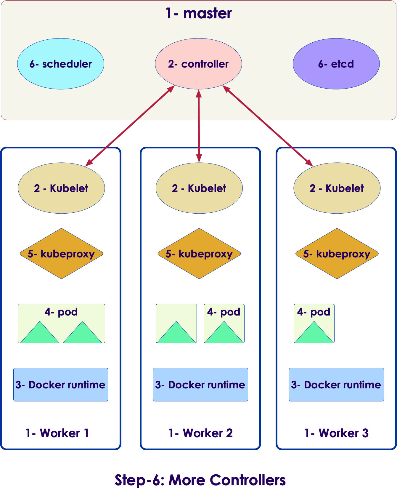
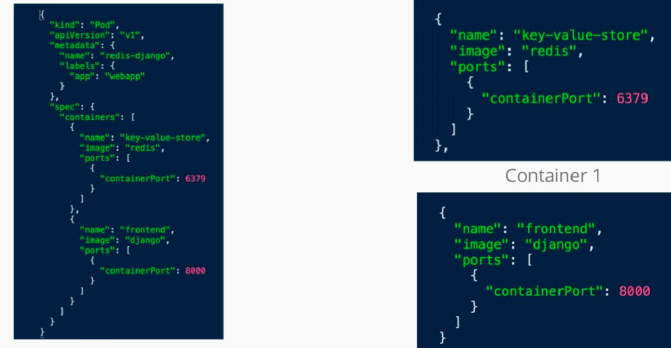
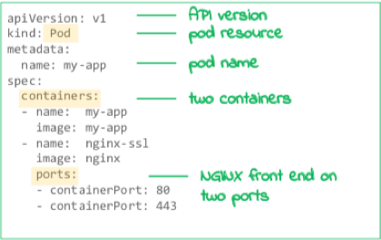
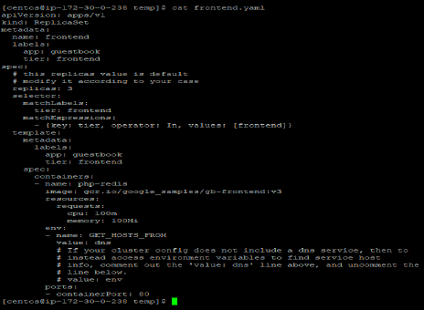
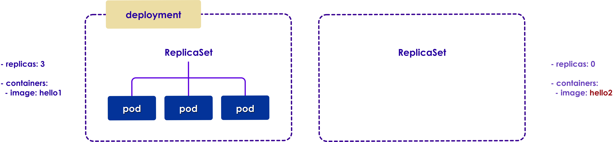
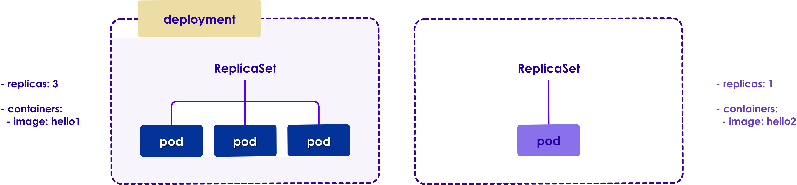
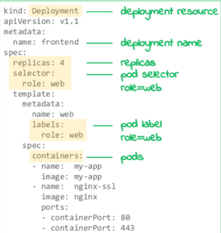
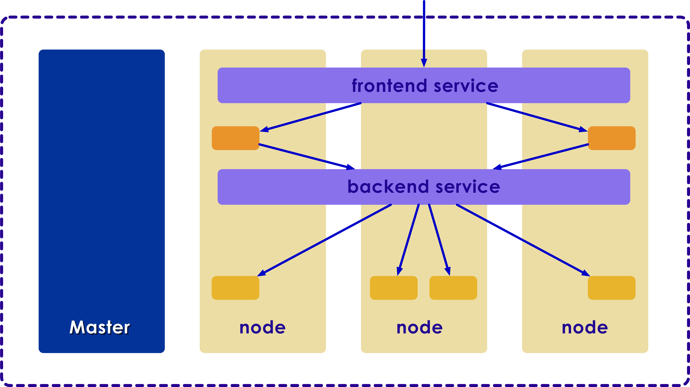
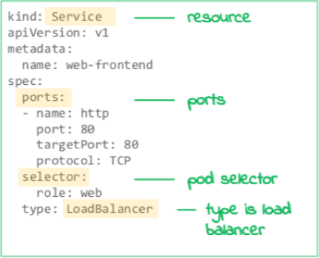
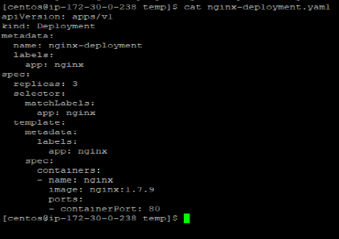

# Kubernetes Essentials

---

## Module Objectives

* Understand the Kubernetes concepts and architecture

* Work with pods configurations, deployments, and replica sets and replication controller

Notes:

Instructor Notes :

Please let students know that in addition to the objectives they identified for themselves in taking this module, these are the ones we expect to achieve based on the material provided.

Participant Notes :

In addition to the objectives you identified in taking this module, these are the ones we expect to achieve based on the material provided.

---

# Let's Design Kubernetes from Scratch

---

## Challenge:  Design K8s from Scratch

* We want to a design an orchestration system to help us manage our infrastructure

* Let's say we want to manage our massively scalable web application

* What do we need to achieve this?

---

## Step-1: We Need a Distributed System

* We need **multiple nodes (machines, hosts)**

* Let's assume they are all **Linux machines** (could be bare metal or virtualized)

* We will adopt a popular distributed design pattern:  **mater-workers**

---

## Step-2: Controllers for Master and Workers

* Each worker will have a 'supervisor/controller' that manages that node.  We will call it **kubelet**

* All kubelets will coordinate with **master controller**

---

## Step-3: Running Applications

* We need a portable, secure way of running applications

* We will use **containers**!

* Here you see docker runtime installed on all nodes, and we have containers running on all nodes

---

## Step-4: Grouping Containers Together

* For some applications, we want the related **containers grouped together**
    - For example, a web application and a logging agent
    - The logging agent monitors web application logs
    - So it makes sense for them to be 'run as a single unit'

* This is done via **pods**
    - Pods can run one or more containers as a unit

* Also pods are **schedulable work units**

---

## It is Getting a Bit Crowded :-) 

---

## Step-5: Networking

* We need a solid, flexible networking setup in the system

* Network traffic is handled by **kubeproxy**

* KubeProxy will tightly work with Linux network layer to manage networks and traffic

---

## Step-6: Finalize with Few More Controllers

* On the master node, we are adding 2 more controllers

* **Scheduler** will place pods on worker nodes

* **etcd** (a distributed datastore) will keep track of cluster status

---

## Here is Our Final Architecture

* Whew, we came up with a pretty complicated system!

---

# Kubernetes Architecture

---

## A Big Picture Overview of Kubernetes

 <!-- {"left" : 0.47, "top" : 1.56, "height" : 4.38, "width" : 9.31} -->

Notes:

---

## Kubernetes Architecture

<!-- {"left" : 0.33, "top" : 1.05, "height" : 5.91, "width" : 9.58} -->

Notes:

Instructor Notes :

Participant Notes :

Kubernetes engine is a cluster. It has at least one master and potentially multiple worker machines. Worker machines are called nodes. The master and the node machines together perform cluster orchestration.

Kubernetes master
The master's lifecycle is managed by Kubernetes Engine when you create or delete  a cluster. 

Kubernetes node 
A typical cluster has one or more nodes, that are called worker machines, which run the containerized application and other workloads. A Master manages all the nodes and hence receives updates on the status of each node.

---

## Kubernetes Master Architecture

* API server is crucial, as pretty much all interaction happens through it

<!-- {"left" : 0.43, "top" : 1.29, "height" : 4.92, "width" : 9.38} -->

Notes:

Instructor Notes :

Participant Notes :

**Etcd**
Configuration information is stored in Etcd and this information can be used by each of the nodes in the cluster.  
Etcd is an HA key value store and can be distributed among various nodes in the cluster. Being a distributed key value store, it is accessible to all.
Etcd contains sensitive information and hence is accessible only by the Kubernetes API server.  

**API Server**
Kubernetes, an API server provides for all the operation using the API, in the cluster. 
API server acts as an interface, whereby different tools and libraries can readily communicate with it. In this case, it is used to communicate with API, UI, and CLI clients.

**Scheduler** 
Scheduler, being one of the key components of Kubernetes master, is responsible for workload distribution.
It is also responsible for monitoring, tracking of utilization and redistribution of the workload on the nodes based on their resource availability.
Scheduler is also responsible for allocation of the pod to a new node.

**Controller** 
Kubernetes Controller is a daemon that embeds the core control loops shipped with Kubernetes. 
Controller continuously monitors the state of the cluster through the API Server watch feature. Upon notification, it initiates necessary changes to move to the desired state.

---

## Kubernetes Architecture: Node

 <!-- {"left" : 0.46, "top" : 1.81, "height" : 3.88, "width" : 9.33} -->

Notes:

Instructor Notes :

Participant Notes :

Key components of the Node server that are necessary to communicate with Kubernetes master: 
**Docker**
Docker is a basic requirement for each node. Dockers help in running the encapsulated app containers in an isolated, self-contained, lightweight environment.
Kubelet 
Kubelet, the primary “node agent”, runs on each node and works in line with PodSpec.
Kubelet communicates with the master component for receiving the commands and for working. It is responsible for maintaining the status quo of the work process and node server. 

**Kube-Proxy** 
This proxy service runs on each of the nodes and helps in ensuring that services are available to the external host. It also helps in forwarding the service requests to the right containers and performs basic level of load balancing.
Kube-Proxy ensures the predictability of the networking environment in terms of accessibility without compromising on the isolation.
It also manages pods on node, volumes, secrets, creating new containers’ health checkup, etc.

Subsequent section covers pod component in detail. 

---

# Kubernetes Pod

## Pod

  * The Pod is the core component of Kubernetes
  * The Pod is co-located, co-scheduled, and run in a shared context
  * Containers in the same pod share the same hostname
  * Each pod is isolated by:

    - Process ID (PID) namespace
    - Network namespace
    - Inter Process Communication (IPC) namespace
    - Unix Time Sharing (UTS) namespace

  * Pods are scaled up and down

Notes:

Instructor Notes :

Participant Notes :

The pod serves as Kubernetes’ core unit of management. 
A pod is a group of one or more co-located and co-scheduled containers with shared storage/network and run in a shared context.
It hosts all the specifications that are required run the containers.

A pod models an application-specific “logical host” containing one or more application containers which are relatively tightly coupled.

---

## What is a Pod?

  * A Pod is a group of containers which shares networking and storage which are separate from the node

 <!-- {"left" : 2.37, "top" : 2.11, "height" : 4.88, "width" : 5.52} -->

Notes:

---

## Pod vs. Container

 <!-- {"left" : 0.48, "top" : 1.33, "height" : 4.84, "width" : 9.3} -->

Notes:

Instructor Notes :

Participant Notes :

Typically, Containers are often used for solving narrowly defined problems. However, most of the time we end designing for multiple containers to solve a single problem. 

Thus the main purpose of a multi-container Pod is to support those helper process that are co-located, co-managed for a primary application. 

Few if those are listed below: 

**Sidecar ** “help” the main container – examples are log or data change watchers, monitoring adopters, data loaders that generates data for the primary container etc. Basically, these sidecar containers can be repurposed or reused either within the same group or by different groups.
**Proxies, bridges, and adapters** creates a connect  between the main container and external world. These can also re-route the traffic to the external work. Thus proxies and bridges make it possible for the main container to access the localhost without any service discovery.

---

## Pod vs. Container

 <!-- {"left" : 0.45, "top" : 1.23, "height" : 4.83, "width" : 9.32} -->

Notes:

Instructor Notes :

Participant Notes :

Pod: In this Yaml file a group of one or more container is declared, so we call it a Pod. In containers in a Pod are deployed together, and are started, stopped, and replicated as a group.

Container: Docker and Kubernetes pods both are configuration files(Yaml) that define container instances from images. Docker by itself is just a file that has the capacity to contain services(containers) for communication, it is inherently non distributed.

---

## How Pods Manage Multiple Containers

  * A Pod might encapsulate an application composed of multiple co-located containers that are tightly coupled and need to share resources.
  * **Pod diagram:** Pods provide 2 types pf shared resources for containers constituent in them:
    - Networking
    - Storage
  * Each Pod is assigned a unique IP address and containers within them communicate with each another using localhost.
  * Pod can specify a set of shared storage volumes which can be shared by all the containers within.

Notes:

Instructor Notes :

Participant Notes :

Pods are designed to support cohesive multiple cooperating processes or containers. These containers, by default, are co-located and co-scheduled in the same machine in the cluster. The machine can be physical or virtual.
Each of these containers share resources and dependencies, and can communicate and coordinate with one another.

Networking
Each Pod is assigned a unique IP address, and every container in the pod shared the same namespace, IP address, and network ports. They communicate with one another using localhost.

Storage
Set of shared storage volumes can be specified in a Pod, which can be accessed by all containers to share the same set of data. 
Volumes allow persistent data in a Pod in case of container restart within the pod.

---

# Kubernetes Pod Config

## General Configuration

  * Configurations are defined with the latest stable API version.
  * Configuration files should be stored in version control before being pushed to the cluster.
  * Configuration files allow you to quickly roll back a configuration change if necessary.
  * It also aids cluster re-creation and restoration.
  * YAML is preferred over JSON as it is more user friendly and can be used inter-changeably.

Notes:

Instructor Notes :

Participant Notes :

Latest stable API versions are specified when defining configurations.

Version control stores all the Configuration files prior to pushing them to the cluster. This allows for quick roll-backs if necessary.

YAML is preferred for writing Config files.

---

## General Configuration Cont.

  * Group related objects into a single file wherever possible, which makes it easy to manage
  * Note  that many kubectl commands can be called on a directory.
  * Avoid specifying default values - simple, minimal configuration make it less error prone.
  * Put object descriptions in annotations, to allow better introspection.
  * Avoid naked Pods - Naked Pods will not be rescheduled when node fails.

Notes:

Instructor Notes :

Participant Notes :

Group related objects into a single file whenever it makes sense. One file is often easier to manage than several. 

Many kubectl commands can be called on a directory.

Default values should not be specified unnecessarily to minimize the errors during configuration.

Put object descriptions in annotations, to allow better introspection.

---

## Configuring a Pod  

  * Define a pod with a YAML file

 <!-- {"left" : 0.49, "top" : 1.78, "height" : 4.94, "width" : 5.17} -->

Notes:

---

## Uploading the Configuration

  * Upload the YAML file to the master

 <!-- {"left" : 0.99, "top" : 2.43, "height" : 3.15, "width" : 8.27} -->

Notes:

---
## Master Creates the Pod  

  * The master creates a pod on your set of nodes

 <!-- {"left" : 0.99, "top" : 2.18, "height" : 3.15, "width" : 8.27} -->

Notes:

---

## Composition of Pod YAML file -

  * A pod file is consists of several parts, for example

 <!-- {"left" : 0.26, "top" : 2.02, "height" : 3.99, "width" : 6.25} -->

Notes:

---

## Lab: Hello Node Kubernetes

  * **Overview:** In this lab we will create the first Node in Kubernetes. The goal of this hands-on lab is for you to turn code that you have developed into a replicated application running on Kubernetes

  * **What you'll do**
    - Create a Node.js server
    - Create a Docker container image
    - Create a container cluster
    - Create a Kubernetes pod
    - Scale up your services

Notes:

---

## Lab: Hello Node Kubernetes

  * **Approximate time:**

    - 20-30 minutes

* **Link to the lab**

    - https://www.qwiklabs.com/focuses/564?parent=catalog

Notes:

---

# Replica Sets

## What is Kubernetes Replication ?

  * Typically you would want to replicate your containers.
    Keep the replication simple.
  * Offer powerful, flexible deployment topologies for the development community.
    - **Reliability:** The impact of failure can be minimized with multiple versions of an application being stored.
    - **Load balancing:** Moreover, maintaining multiple versions of a container allows you to re-route the traffic to other instances with similar versions. This will prevent overloading of any particular node.
    - **Scaling:** If the load increase become unmanageable for the existing instances, then Kubernetes allows us to scale-up the instances with similar versions.

Notes:

Instructor Notes :

Participant Notes :
Before we go into how you would do replication, let’s talk about why.  

Typically one may prefer container replication for a variety of reasons.

Replication logic has to be simple by design but should offer powerful and flexible deployment topologies

Reliability: By having multiple versions of an application, you prevent problems if one or more fails.  This is particularly true if the system replaces any containers that fail.

Load balancing: Multiple versions allow for re-directing the traffic incase of a overload on single instance or node in Kubernetes.

Scaling: If the load increase become unmanageable for the existing instances, then Kubernetes allows us to scale-up the instances with similar versions.

---

## ReplicaSet

 <!-- {"left" : 0.58, "top" : 1.5, "height" : 5, "width" : 9.08} -->

Notes:

Instructor Notes :

Participant Notes :

We are running 4 copies of the application using ReplicaSet. Please note that name, selector, podTemplate and replica syntaxes used.

---

## ReplicaSet

 <!-- {"left" : 0.6, "top" : 0.99, "height" : 5.51, "width" : 9.06} -->

Notes:

Instructor Notes :

Participant Notes :

The replication Controller is 4 
Desired = 4 ( The Defined replication is up and running )
Current = 4 ( 4 pods are running )
Node    = 4

---

## ReplicaSet

 <!-- {"left" : 0.6, "top" : 0.99, "height" : 5.51, "width" : 9.06} -->

Notes:

Instructor Notes :

Participant Notes :

The replication Controller is 4 
Desired Pod = 4 ( The Defined replication is up and running )
Current Pod = 4 ( 4 pods are running )
Node    = 3

Then, one node is going to down. Let’s see how the replica set will replicate the pod. 

---

## ReplicaSet

 <!-- {"left" : 0.6, "top" : 0.99, "height" : 5.51, "width" : 9.06} -->

Notes:

Instructor Notes :

Participant Notes :

The replication Controller is 4 
Desired Pod = 4 ( The Defined replication is up and running )
Current Pod = 3 ( 3 pods are running )
Node    = 3

Then, one node is going to down. We now have 3 nodes.

---

## ReplicaSet

 <!-- {"left" : 0.6, "top" : 0.99, "height" : 5.51, "width" : 9.06} -->

Notes:

Instructor Notes :

Participant Notes :

The replication Controller is 4 
Desired Pod = 4 ( The Defined replication is up and running )
Current Pod = 4 ( 4 pod are running )
Node    = 3

The one pod is replicated into node 3. 

---

# Replication Controller

## Replication Controller

  * Replication Controller – the original form of replication in Kubernetes
  * Fast being replaced by Replica Sets.
  * Replication Controller structure enables easy creation of multiple pods and ensures   they are live
  * Replication Controllers allows pod scalability.
  * Replication Controller can be created with an imperative command, or declaratively

Notes:

Instructor Notes :

Participant Notes :

Despite being replaced by ReplicaSets, Replication Controller, the original form of replication is still widely in use.

A Replication Controller allows us to easily create multiple pods ensures that the pods are live and available. Replication Controller provides elasticity in managing the pods including the ability to autoscale or update the pods by a single command.

---

## Replication Controller Example

  * For example, create a new file called rc.yaml and add the following text:

 <!-- {"left" : 1.62, "top" : 1.95, "height" : 4.66, "width" : 7.02} -->

Notes:

Instructor Notes :

Participant Notes :

Creating replication using Replication controller. 

Name:        nginx
Namespace:   default
Selector:    app=nginx
Labels:      app=nginx
Annotations:    <none>
Replicas:    3 current 
Pod Template:
  Labels:       app=nginx

---

## Replica Sets

  * Replica Sets are in some ways comparable to Replication Controllers. They have a mix of advantage and disadvantages compared to Replication Controllers.
  * Replica Sets and Replication Controllers are declared almost in the same way except they have more options for the selector.
  * Replica Set makes sure that the specified number of pod replicas are always up and running.

Notes:

Instructor Notes :

Participant Notes :

Replica Sets are fast replacing RCs. 

Replica Sets though, are declared in the same way as Replication Controllers, but they possess more options for the selector. 
Replica Set makes sure that required number of pod replicas are running at all times.

---

## Replica Set Example

  * For example, we could create a Replica Set like this:

 <!-- {"left" : 1.91, "top" : 1.63, "height" : 4.73, "width" : 6.44} -->

Notes:

Instructor Notes :

Participant Notes :

Creating replication using Replica set controller. 

Name:	frontend
Namespace:	default
Selector:	tier=frontend,tier in (frontend)
Labels:	app=guestbook
tier=frontend
Replicas:	3 current / 3 desired
Pod Template:
  Labels:       app=guestbook
  tier=frontend
  Containers:
   php-redis:
    Image:      gcr.io/_samples/gb-frontend:v3
    Port:       80/TCP

---

# Deploying to Kubernetes

##  Deployments

  * Deployments are intended to replace Replication Controllers.
  * In addition to the functions of Replication Controllers, Deployments provide roll-out and roll-back options
  * Deployment ensures desired state of the deployment object is achieved and maintained through deployment controller
  * Pause the Deployment to apply multiple fixes to its PodTemplateSpec and then resume it to start a new rollout.

Notes:

Instructor Notes :

Participant Notes :
Deployments, intended to replace Replication Controllers, provide the same replication functions (through Replica Sets) but additionally provide the ability to roll out and roll back the changes if required.

When the desired state is specified in the Deployment object, and the Deployment controller ensures the movement to the desired state from the actual state at a controlled rate. 

Pause the Deployment to apply multiple fixes to its PodTemplateSpec and then resume it to start a new rollout.

---

## Deployment

  * Deployments depend on ReplicaSets to manage and run pods

 <!-- {"left" : 0.57, "top" : 1.82, "height" : 4.34, "width" : 9.14} -->

Notes:

---

## Deployment

  * Deployments monitor cluster and update changes when required

 <!-- {"left" : 0.55, "top" : 2.33, "height" : 3.65, "width" : 9.18} -->

Notes:

---

## Deployment

  * Deployments monitor pods and make correction when then stop working

 <!-- {"left" : 0.9, "top" : 2.42, "height" : 4.02, "width" : 8.46} -->

Notes:

---

## Deployment

  * Deployments constantly monitor cluster to observe changes

 <!-- {"left" : 0.79, "top" : 2.27, "height" : 3.45, "width" : 8.68} -->

Notes:

---

## Rolling updates

  * Rolling updates permit you to update from one image version to another

 <!-- {"left" : 0.99, "top" : 1.89, "height" : 4.93, "width" : 8.28} -->

Notes:

---

## Rolling updates

  * This deployment allows you to create a second ReplicaSet

 <!-- {"left" : 0.47, "top" : 2.91, "height" : 2.17, "width" : 9.31} -->

Notes:

---

## Rolling updates

  * It gradually increases the number of replicas in the second ReplicaSet

 <!-- {"left" : 0.51, "top" : 2.92, "height" : 2.15, "width" : 9.23} -->

Notes:

---

## Rolling updates

  * This decreases replicas in the first ReplicaSet

 <!-- {"left" : 0.69, "top" : 2.72, "height" : 2.07, "width" : 8.88} -->

Notes:

---

## Rolling updates

  * Hence at any given point of time there are at most 4 pods

 <!-- {"left" : 0.74, "top" : 2.73, "height" : 2.04, "width" : 8.76} -->

Notes:

---

## Rolling updates

  * Minimum of 3 pods

 <!-- {"left" : 0.74, "top" : 2.73, "height" : 2.04, "width" : 8.76} -->

Notes:

---

## Rolling updates

  * The same state continues

 <!-- {"left" : 0.74, "top" : 2.73, "height" : 2.04, "width" : 8.76} -->

Notes:

---

## Rolling updates

  * The previous state continues until new image version is rolled out

 <!-- {"left" : 0.74, "top" : 2.73, "height" : 2.04, "width" : 8.76} -->

Notes:

---

## Canary deployment

  * A Canary deployment depends on a service to balance the load during traffic to primary pods based on label selectors

 <!-- {"left" : 1.03, "top" : 2.35, "height" : 3.71, "width" : 8.2} -->

Notes:

---

## Canary deployment

  * Canary deployment tests a second deployment by load balancing a subset of traffic to new pods with the same label

 <!-- {"left" : 0.4, "top" : 2.21, "height" : 3.09, "width" : 9.45} -->

Notes:

---

## Blue green deployment

  * A blue-Green deployment make use the service label selector to change all traffic from one deployment to another

 <!-- {"left" : 0.97, "top" : 2.35, "height" : 3.87, "width" : 8.3} -->

Notes:

---

## Blue green deployment

  * Initially bring up and test new deployment without live traffic

 <!-- {"left" : 0.62, "top" : 2.25, "height" : 3, "width" : 9.01} -->

Notes:

---

## Blue green deployment

  * To make the version go live, change the service label selector which switches all traffic

 <!-- {"left" : 0.49, "top" : 2.73, "height" : 3, "width" : 9.27} -->

Notes:

---

# Deployment definition

## What is a Deployment object?  

 * A deployment object ensures that _N_ pods are running in a cluster at any given point of time

 <!-- {"left" : 0.99, "top" : 2.18, "height" : 3.15, "width" : 8.27} -->

Notes:

---

## Defining a Deployment Object  

  * A deployment is defined with a YAML file

 <!-- {"left" : 0.77, "top" : 1.47, "height" : 5.49, "width" : 5.21} -->

Notes:

---

## Communication with the Pod  

  * A service assigns a fixed IP to your pod replicas

  * A service allows other pods or services to communicate with the pod replicas

 <!-- {"left" : 1.19, "top" : 2.41, "height" : 4.33, "width" : 7.87} -->

Notes:

---

## Multiple Services

  * You can have multiple services with varying configurations and features at any given time

 <!-- {"left" : 0.87, "top" : 1.92, "height" : 4.77, "width" : 8.5} -->

Notes:

---

## Service YAML Definition

  * Define a service with a YAML file

 <!-- {"left" : 0.77, "top" : 1.78, "height" : 4.62, "width" : 5.66} -->

Notes:

---

## Deployment Example

  * Let’s create a simple Deployment.

 <!-- {"left" : 0.77, "top" : 1.78, "height" : 4.62, "width" : 5.66} -->

Notes:

Instructor Notes :

Participant Notes :

Deployment, nginx-deployment is created and is indicated by the .metadata.name field.
Three replicated pods are created by the deployment as mentioned in the replicas field
Deployment manages the pods based on the selector field definition.
Sophisticated selection rules can be created subject to pod template satisfying the rule.
.template.spec field or Pod template’s specification indicates that the Pods run one container, nginx, which runs the nginx Docker Hub image at version 1.7.9.
The Deployment opens port 80 for use by the Pods.

The template field contains the following instructions:
- Pods are labeled app: nginx
- Create one container with name nginx.
- Run the nginx image at version 1.7.9.
- Open port 80 for the container to send and accept traffic.

---

## Uploading YAML File  

  * Upload the YAML file to master, and the scheduler decides where to run the pods

simple Deployment.

 <!-- {"left" : 0.99, "top" : 2.67, "height" : 3.15, "width" : 8.27} -->

Notes:

---

## Lab 2: Managing deployments with Kubernetes

  * **Overview:**
    - This lab will provide practice in scaling and managing containers so you can accomplish these common scenarios where multiple heterogeneous deployments are being used.

  * **What you'll do**
    - Practice with kubectl tool
    - Create deployment yaml files
    - Launch, update, and scale deployments
    - Practice with updating deployments and deployment styles

Notes:

---

## Lab 2: Managing deployments with Kubernetes

  * **Approximate time:**
    - 20-30 minutes

  * **Link to the lab**
    - https://www.qwiklabs.com/focuses/639?parent=catalog
