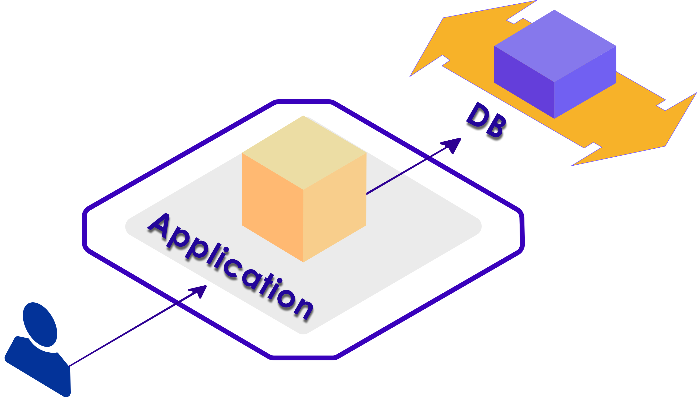
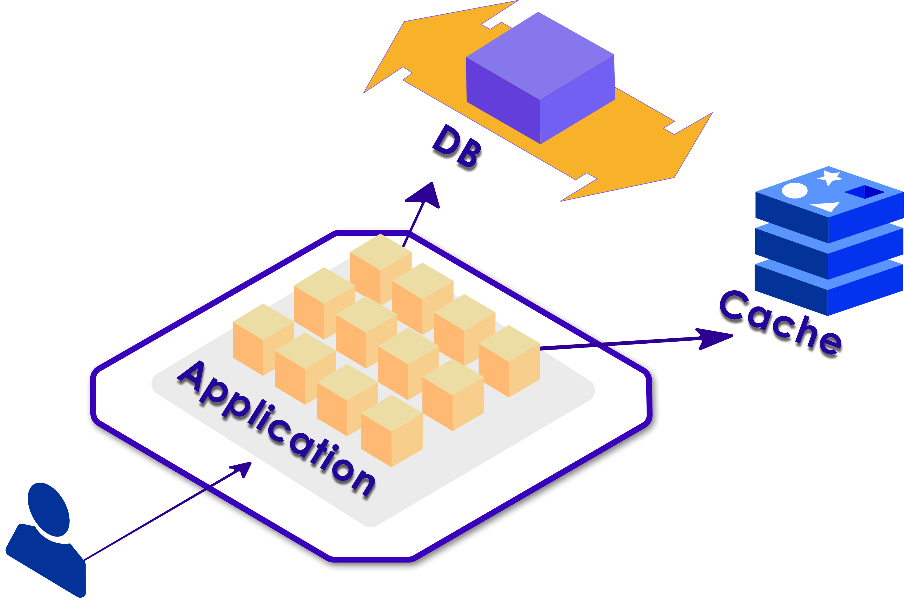
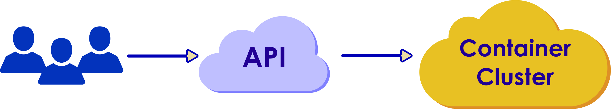

# Kubernetes: Intro

## Module Objectives

After this module, participants will be able to:

 * Understand Kuberentes
 * Describe the purpose of cloud orchestration.

Notes:

Instructor Notes:

Please let students know that in addition to the objectives they identified for themselves in taking this module, these are the ones we expect to achieve based on the material provided.

Participant Notes:

In addition to the objectives you identified in taking this module, these are the ones we expect to achieve based on the material provided.

---

# Container Orchestration

---

## What is Container Orchestration?

  * Container orchestration is how we manage multi-container applications in the datat center 
  * By definition, container orchestration is that portion of the management software that brings all of the containers together.
  * A single container cannot work without the others.
  * In the data center, containers service to automate the complete operation
  * Container orchestration is not easy.

Notes:

Instructor Notes:

Participant Notes:

As we mentioned above, it is easy to explain what the container orchestration does, and there are tools for that. But it is the same as project management. Although the tools for project management are not lacking, a good project manager is the person who brings the project together. The same goes for a container-based application.

---

## Container Orchestration Options

 * Kubernetes (naturally)
 * Amazon Elastic Container Service (ECS)
 * Microsoft Azure Service Fabric
 * Docker Swarm
 * Apache Mesos
 * Hadoop / YARN
 * Nomad

---

## Simple Webapp 
 * Here is a simple webapp that you probably currently have
 * Nginx/Apache + PHP + DB (LAMP)
 * Probably don't need orchestration **UNLESS** you plant to scale.

 <!-- {"left" : 0.65, "top" : 2.00, "height" : 5.12, "width" : 8.94} -->

Notes:

Instructor Notes:

Participant Notes:

If your current software infrastructure looks something like this — maybe Nginx/Apache + PHP/Python/Ruby/Node.js app running on a few containers that talk to a replicated DB — then you might not require container orchestration, you can probably manage everything yourself.

---

## Decoupling
  * Scalability Requires Decoupling
  * Caches and Queues Help Decouple

 <!-- {"left" : 0.44, "top" : 2.0, "height" : 5.29, "width" : 9.36} -->

Notes:

Instructor Notes:

Participant Notes:

The standard challenges of container orchestration and application growth are Service Discovery, Load Balancing, Secrets/configuration/storage management, Health checks, and auto deployment.

These are solved with the following architectural principle: decoupling. Decoupling can be implemented with queues or caches, as illustrated on this diagram.

---

## What is Kubernetes?

  * Open source project originally conceived by Google.
  * Google’s 15+ years of experience with containerized apps.
  * Currently maintained by Cloud Native Computing Foundation.
  * Red Hat has been a member since day one.
  * Red Hat is the second largest contributing member.
  * Greek: Kubernetes  = Helmsman
  * Also called K8s
     - Abbreviation derived by replacing 8 letters of “ubernete” with ‘8’ and subsequent ‘s’.

 <!-- {"left" : 3.65, "top" : 4.84, "height" : 2.42, "width" : 2.95} -->

Notes:

Instructor Notes:

Participant Notes:
Kubernetes is a powerful open-source system, initially developed by Google, for managing containerized applications in a clustered environment. It aims to provide better ways of managing related, distributed components and services across varied infrastructure.

Its basic level, is a system for running and coordinating containerized applications across a cluster of machines. It is a platform designed to completely manage the life cycle of containerized applications and services using methods that provide predictability, scalability, and high availability.

Kubernetes originates from Greek, meaning helmsman or pilot, and is the root of governor and cybernetic. K8s is an abbreviation derived by replacing the 8 letters “ubernete” with “8”.

---

## What is Kubernetes? (Cont.)

  * Particularly suited for horizontally scalable, stateless, or 'microservices' application architectures.
  * Start, stop, update, and manage a cluster of machines running containers in a consistent and maintainable way.
  * Additional functionality to make containers easier to use in a cluster.
  * Provides container-centric management environment.
  * Provides the simplicity of PaaS with the flexibility of IaaS.
  * Enables portability across infrastructure providers.

 <!-- {"left" : 3.74, "top" : 5, "height" : 2.26, "width" : 2.77} -->

Notes:

Instructor Notes:

Participant Notes:
With Horizontal Pod Autoscaling, Kubernetes automatically scales the number of pods in a replication controller, deployment or replica set based on observed CPU utilization.

Creating a new replication controller with the updated configuration.
Increasing/decreasing the replica count on the new and old controllers until the correct number of replicas is reached.
Deleting the original replication controller.

---

## What Does Kubernetes Do?

* Improves Reliability

* Better Use of Infrastructure Resources

* Easy Co-ordination of Deployments

 <!-- {"left" : 3.66, "top" : 3.81, "height" : 2.66, "width" : 2.92} -->

Notes:

Instructor Notes:

Participant Notes:

Kubernetes is an open source container-orchestration system.
It was originally developed by Google and open sourced under Apache 2 License.
Kubernetes supports multiple containers, including the very popular Docker containers.

Reference :
https://kubernetes.io/

---

## What Does Kubernetes Do? (Cont.)

  * **Improves Reliability**

    - Handles the work of deploying, scaling and managing the containerized applications.

    - Brings software development and operations together by design.

* **Better use of Infrastructure Resources**

    - Eliminates infrastructure lock-in by providing core capabilities for containers without imposing restrictions through Pods and Services.

    - Containers allow modularizing for application components thereby enabling faster development and dependency isolation.

    - Allows for elasticity of entire platform – easy to scale up and down.

* **Easily Coordinates Deployments on your System**

    - Which containers need to be deployed and where?

Notes:

Instructor Notes:

Participant Notes:

Kubernetes manages containers across a cluster.
It has been proven at large scale infrastructure – remember Google uses Kubernetes at a massive scale.

When scheduling containers, Kubernetes considers the load across the cluster.
Kubernetes tries to evenly balance the load on the cluster machines.  So there are not 'hot spots' and 'idle machines'.

---

## User Perspective

  * User view

 <!-- {"left" : 0.28, "top" : 3.13, "height" : 1.75, "width" : 9.73} -->

Notes:

---

## Why Kubernetes over other orchestrators
 * Open-Source / Free
 * By far most popular orchestrator!
 * Very platform agnostic: i.e. Kubernetes can be used with bare-metal, virtual machines, cloud, Open stack, etc.
 * Not only for container-based orchestration. You can also use it with normal clustering, compute workloads
 * Not tied with any other specific company or platform like Docker. 
 * Many companies support Kubernetes based clustering, including Google, Amazon Web Services, etc.

---

## Other Orchestrators

 * **Mesos**
    - Another Orchestrator designed at UC Berkley AMPLab
    - Open Source
    - Popular for Apache Spark at Databricks
    - Niche
 * **Hadoop / YARN**
    - Popular for Big Data workloads
    - Integrated with Hadoop ecosystem
 * **Docker Swarm**
    - Integrated with Docker
    - Easy to Use
    - Minimal Configuration Required
 * **Nomad**
    - 

---

## Managed Kuberentes

 * Kuberentes is fairly complex:
   - Lots of complex configuration required even for the simplest applications
   - Very simple applications using standard configs "feel" quite complex.
 * Kubernetes-as-a-Service (KAAS) is a **thing**! 
 * **KAAS** is mainly going to be about cluster management:
    - start/stop cluster VMs
    - Install/configure update daemons like `fluentd` and `etcd`
    - Install/configure plugins like flannel and weave.
 * Vendors also allow things like:
    - dashboards
    - GUI tools
    - monitoring

---

## Managed Kubernetes Services
 * PKS: Pivotal Container Service
 * EKS: Amazon AWS Elastic Kubernetes Service
 * GCE: Google Container Engine
 * AKS: Microsoft Azure Kubernetes Service

---

## Installing Kubernetes

 * There are two types of "install" for kubernetes:
   - Developer Install (test / learning / dev)
   - Cluster Install (prod / dev / test) 
 * Developer: There are two basic Developer Concigurations:
    - Minikube
    - microk8s

## Minikube (for Developers)

  * Minikube works very similarly to Docker Toolbox.
  * Minikube can run on any platform that supports VirtualBox (Linux, Mac, Windows)
  * Users install Oracle VirtualBox on their systems.
    - User CPU must support virtualization (VT-x, AMD-V)
    - Virtualization *must* be enabled in the BIOS. (Usually *not* by default)
  * Minikube will install a VM in virtualbox and run it
  * A CLI called `minikube` will allow users to interact with the VM

## Installing Microk8s (for Developers)
  * MicroK8s works on Linux machines **only**.
    - **NOT** BSD or other Unix-like OSs including Mac
  * No need of a VM or virtualization
  * It is installed as a snap for any machine that supports snaps
    - installs in seconds!
  * Ubuntu Web Store / etc
  * It runs the kubernetes daemons locally on the users' system

