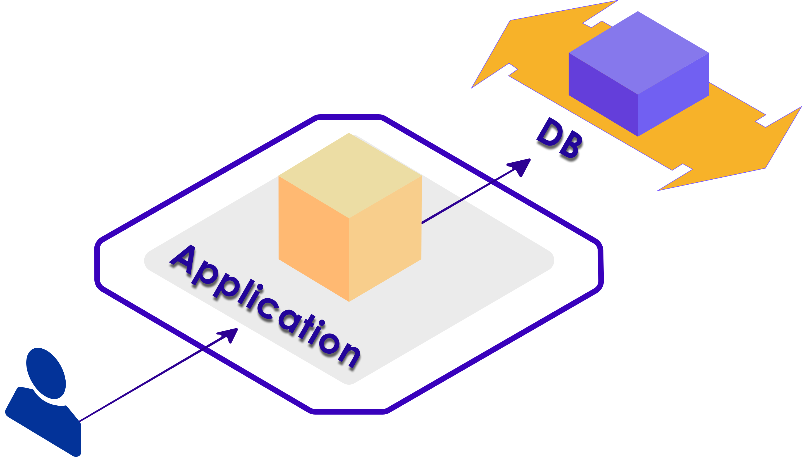
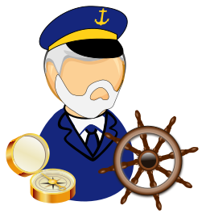
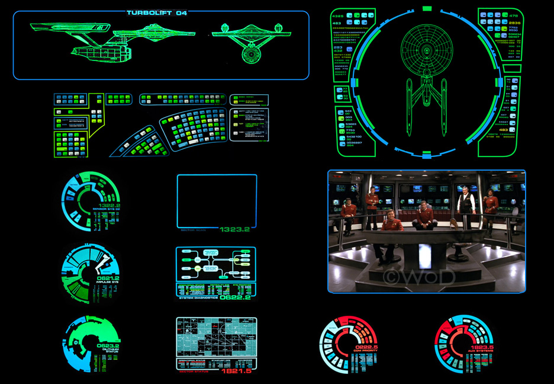

# Kubernetes: Intro

 

---

## Objectives

* Understand container orchestration
* Get to know Kubernetes

Notes:

Instructor Notes :

Please let students know that in addition to the objectives they identified for themselves in taking this module, these are the ones we expect to achieve based on the material provided.

Participant Notes :

In addition to the objectives you identified in taking this module, these are the ones we expect to achieve based on the material provided.

---

# Container Orchestration

---

## Evolution of an Web Application

* Let's start with a simple web application
    - Nginx/Apache + PHP + DB (LAMP)

* We have one web-server and one database.  We could even run them on the same machine

* Most applications start out this way.

Notes:

Instructor Notes :

Participant Notes :

If your current software infrastructure looks something like this — maybe Nginx/Apache + PHP/Python/Ruby/Node.js app running on a few containers that talk to a replicated DB — then you might not require container orchestration, you can probably manage everything yourself.

---

## Evolution of a Web Application

* Our simple app is getting popular and we need to scale it up

* We need to make sure our database and caching server are up and running before web servers start

* And we need to be sure a web server is ready before load balancer can send traffic to it

* And what happens one one of the components crashes?  We need to restart it

Notes:

Instructor Notes :

Participant Notes :

The standard challenges of container orchestration and application growth are Service Discovery, Load Balancing, Secrets/configuration/storage management, Health checks, and auto deployment.

These are solved with the following architectural principle: decoupling. Decoupling can be implemented with queues or caches, as illustrated on this diagram.

---

## Container Orchestration?

* Container orchestration is how we manage multi-container applications in the data center

* By definition, container orchestration is that portion of the management software that brings all of the containers together.

* A single container cannot work without the others.

* Container orchestration is not easy.

Notes:

Instructor Notes :

Participant Notes :

As we mentioned above, it is easy to explain what the container orchestration does, and there are tools for that. But it is the same as project management. Although the tools for project management are not lacking, a good project manager is the person who brings the project together. The same goes for a container-based application.

---

## Container Orchestration Options

* Docker
    - **Docker Swarm**: Easy to use sytem for small to medium scale
    - **Docker compose**: Very easy to use for small scale

* **Kubernetes**

* Cloud vendors
    - **Amazon Elastic Container Service (ECS)**
    - **Microsoft Azure Service Fabric**

* Big Data stacks
    - **Apache Mesos**: From Berkeley AMP lab, 
    - **Hadoop YARN**: Popular for Big Data workloads

* **Nomad** from Hashicorp

---

## Kubernetes

<!-- {"left" : 3.65, "top" : 4.84, "height" : 2.42, "width" : 2.95} -->

<!-- {"left" : 3.65, "top" : 4.84, "height" : 2.42, "width" : 2.95} -->

* Open source project originally conceived by Google.
    - Culminated from Google’s 15+ years of experience with containerized apps.

* Currently maintained by [Cloud Native Computing Foundation (CNCF)](https://www.cncf.io/)

* Trivia
    - Kubernetes in Greek means **pilot Helmsman** of a ship
    - Also called **K8s**; Abbreviation derived by replacing 8 letters of "ubernete" with ‘8’ and subsequent ‘s’.

Notes:

Instructor Notes :

Participant Notes :
Kubernetes is a powerful open-source system, initially developed by Google, for managing containerized applications in a clustered environment. It aims to provide better ways of managing related, distributed components and services across varied infrastructure.

Its basic level, is a system for running and coordinating containerized applications across a cluster of machines. It is a platform designed to completely manage the life cycle of containerized applications and services using methods that provide predictability, scalability, and high availability.

Kubernetes originates from Greek, meaning helmsman or pilot, and is the root of governor and cybernetic. K8s is an abbreviation derived by replacing the 8 letters “ubernete” with “8”.

---

## Kubernetes (Cont.)

<!-- {"left" : 3.65, "top" : 4.84, "height" : 2.42, "width" : 2.95} -->

* Particularly suited for horizontally scalable, stateless, or 'microservices' application architectures.

* Start, stop, update, and manage a cluster of machines running containers in a consistent and maintainable way.

* Additional functionality to make containers easier to use in a cluster.

* Provides container-centric management environment.

* Provides the simplicity of PaaS with the flexibility of IaaS.

* Enables portability across infrastructure providers.

Notes:

Instructor Notes :

Participant Notes :
With Horizontal Pod Autoscaling, Kubernetes automatically scales the number of pods in a replication controller, deployment or replica set based on observed CPU utilization.

Creating a new replication controller with the updated configuration.
Increasing/decreasing the replica count on the new and old controllers until the correct number of replicas is reached.
Deleting the original replication controller.

---

## Kuberetes Features

* **Improves Reliability**
    - Handles the work of deploying, scaling and managing the containerized applications.
    - Brings software development and operations together by design.

* **Better use of Infrastructure Resources**

    - Eliminates infrastructure lock-in by providing core capabilities for containers without imposing restrictions through Pods and Services.

    - Containers allow modularizing for application components thereby enabling faster development and dependency isolation.

    - Allows for elasticity of entire platform – easy to scale up and down.

* **Easily Coordinates Deployments on your System**

    - Which containers need to be deployed and where?

Notes:

Instructor Notes :

Participant Notes :

Kubernetes manages containers across a cluster.
It has been proven at large scale infrastructure – remember Google uses Kubernetes at a massive scale.

When scheduling containers, Kubernetes considers the load across the cluster.
Kubernetes tries to evenly balance the load on the cluster machines.  So there are not 'hot spots' and 'idle machines'.

---

## Why Kubernetes Over Other Orchestrators?

* Open-Source / Free

* By far most popular orchestrator!

* Very platform agnostic: i.e. Kubernetes can be used with bare-metal, virtual machines, cloud, Open stack, etc.

* Not only for container-based orchestration. You can also use it with normal clustering, compute workloads

* Not tied with any other specific company or platform like Docker.

* Many companies support Kubernetes based clustering, including Google, Amazon Web Services, etc.

---

## Managed Kubernetes

* Kubernetes is fairly complex:
   - Lots of complex configuration required even for the simplest applications

* **Kubernetes-as-a-Service (KAAS)** is a very popular offering in the cloud

* **KAAS** provides a fully managed K8s cluster

* Some KAAS offerings: 
    - EKS (Amazon Elastic Kubernetes Service), GCE (Google Container Engine), AKS (Azure Kubernetes Services), PKS (Pivotal Container Service)

* **Quiz** : What is the minimum crew compliment for Startrek Enterprise? :-)

---

# Kubernetes Use Cases

---

## Use Cases

* [kubernetes.io/case-studies/](https://kubernetes.io/case-studies/) has very interesting use cases

* We will look at a couple
    - Nokia
    - Pinterest

* Case studies / use cases are very good way to see how people are using K8s

---

## Kubernetes @ Nokia

* **The Challenge**
    - Nokia and Telecom operators were running services on  diverse environments (bare metal and virtualized machines, public cloud, private cloud).  There was no uniform way to deploy applications
    - Telco applications demand high availability, ("five nines"  99.999% - only 10 minutes downtime a year)

* **Solution**
    - Kubernetes enabled Nokia to deploy applications consistently across many environments
    - Increased hardware utilizations (no wasted resources)
    - Reliable application uptimes (resilient to hardware failures)

* [Read more](https://kubernetes.io/case-studies/nokia/)

---

## Kubernetes @ Pinterest

* **The Challenge**
    - Pinterest has experienced huge popularity, and has grown to 1000+ microservices and home-grown infrastructure.
    - Even though Pinterest has been running in the cloud from inception, they were not utilizing cloud resources efficiently

* **Solution**
    - K8s allowed Pinterest to move infrastructure related tasks to a industry standard, proven technology
    - Containerizing services allowed teams to develop and deploy rapidly
    - Was able to reclaim 80% of resource usage during off-peak hours, due to dynamic scaling provided K8s

* [Read more](https://kubernetes.io/case-studies/pinterest/)

---

## Wrap up and Q&A

<!-- {"left" : 8.56, "top" : 1.21, "height" : 1.15, "width" : 1.55} -->
<!-- {"left" : 6.53, "top" : 2.66, "height" : 2.52, "width" : 3.79} -->

* What are some of your challenges that you can see Kubernetes can possibly address

* Any questions?
