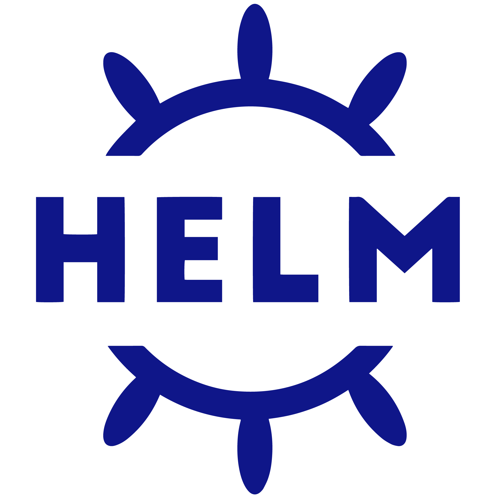
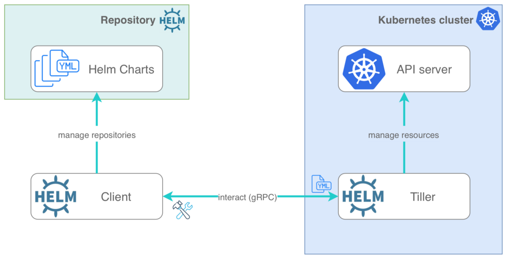

# Kubernetes: Misc


---

## Module Objectives

* Learn Kubernetes ecosystem

* Helm, Helm charts

* Misc topics

Notes:

Instructor Notes :

Please let students know that in addition to the objectives they identified for themselves in taking this module, these are the ones we expect to achieve based on the material provided.

Participant Notes :

In addition to the objectives you identified in taking this module, these are the ones we expect to achieve based on the material provided.

---

# Kubernetes Ecosystem

---

## Kubernetes Ecosystem

* Let's learn some nice tools for Kubernetes

* References
    - https://caylent.com/kubernetes/50-useful-kubernetes-tools-for-2020
    - https://collabnix.github.io/kubetools/
    - https://geekflare.com/kubernetes-tools/

---

## Developer Tools

* **kubectx + kubens** 
    - power tools for Kubernetes
    - Easy to manage namespaces ..etc
    - https://github.com/ahmetb/kubectx

* **Kube-shell**
    - An integrated shell for working with the Kubernetes CLI
    - https://github.com/cloudnativelabs/kube-shell

* **helm**
    - Package manager for Kubernetes
    - https://github.com/helm/helm

---

## Monitoring Tools

* **kube-ops-view**
    - Provides a nice operational dashboard for multiple kubernetes clusters
    - https://codeberg.org/hjacobs/kube-ops-view

* **kubetail**
    - Aggregate (tail/follow) logs from multiple pods into one stream. 
    - This is the same as running "kubectl logs -f " but for multiple pods
    - https://github.com/johanhaleby/kubetail

* **kail**
    - Streams logs from all containers of all matched pods
    - https://github.com/boz/kail

* **kubewatch**
    - Monitor Kubernetes cluster and publish events to Slack
    - https://github.com/bitnami-labs/kubewatch

---

## Monitoring Tools

* **Prometheus**
    - Go-to tool for Kubernetes monitoring tool
    - https://prometheus.io/

* **cAdvisor**
    - Container Advisor provides container users an understanding of the resource usage and performance characteristics of their running containers
    - https://github.com/google/cadvisor

---

## Testing Tools

* **Kube-monkey**
    - kube-monkey is an implementation of [Netflix's Chaos Monkey](https://github.com/Netflix/chaosmonkey) for Kubernetes clusters
    - It randomly deletes Kubernetes (k8s) pods in the cluster encouraging and validating the development of failure-resilient services
    - https://github.com/asobti/kube-monkey

* **K8s-testsuite**
    - This test suite consists of two Helm charts for network bandwith testing and load testing a Kuberntes cluster
    - https://github.com/mrahbar/k8s-testsuite

---

# Helm

---

## Helm

 <!-- {"left" : 1.73, "top" : 1.47, "height" : 4.71, "width" : 6.85} -->

* **Helm** is a tool that streamlines installing and managing Kubernetes applications.

* Helm has two parts: a client (helm) and a server (tiller)

* **Tiller** runs inside of your Kubernetes cluster, and manages releases (installations) of your charts.

* **Helm** runs on your laptop, CI/CD, or wherever you want it to run.

* **Charts** are Helm packages that contain at least two things:
    -  A description of the package (Chart.yaml)
    - One or more templates, which contain Kubernetes manifest files

* Charts can be stored on disk, or fetched from remote chart repositories (like Debian or RedHat packages)

Notes:

---

## Helm

* Helm helps you manage Kubernetes applications

* Helm Charts helps you define, install, and upgrade even the most complex Kubernetes application.

* Charts are easy to create, version, share, and publish

* The latest version of Helm is maintained by the CNCF - in collaboration with Microsoft, Google, Bitnami and the Helm contributor community.

* Helm is used to :
    - Find and use popular software packaged as Helm charts to run in Kubernetes
    - Share your own applications as Helm charts
    - Create reproducible builds of your Kubernetes applications
    - Intelligently manage your Kubernetes manifest files
    - Manage releases of Helm packages

Notes:

---

## Helm Architecture - Helm Client

* Helm has two major components: Helm Client and Tiller Server

* The **Helm Client** is a command-line client for end users.

* The client is responsible for the following domains:
    - Local chart development
    - Managing repositories
    - Interacting with the Tiller server

 <!-- {"left" : 1.73, "top" : 1.47, "height" : 4.71, "width" : 6.85} -->

Notes:

---

## Helm Architecture - Tiller Server

* **The Tiller Server** is an in-cluster server that interacts with the Helm client, and interfaces with the Kubernetes API server.

* The server is responsible for the following:
    - Listening for incoming requests from the Helm client
    - Combining a chart and configuration to build a release
    - Installing charts into Kubernetes, and then tracking the subsequent releases
    - Upgrading and uninstalling charts by interacting with Kubernetes

 <!-- {"left" : 1.73, "top" : 1.47, "height" : 4.71, "width" : 6.85} -->

Notes:

---

## Helm Implementation

  * The Helm client is written in the Go programming language, and uses the gRPC protocol suite to interact with the Tiller server.

  * The Tiller server is also written in Go. It provides a gRPC server to connect with the client, and it uses the Kubernetes client library to communicate with Kubernetes. Currently, that library uses REST+JSON.

  * The Tiller server stores information in ConfigMaps located inside of Kubernetes. It does not need its own database.

  * Configuration files are, when possible, written in YAML

Notes:

---

## Helm Charts

* Helm uses a packaging format called charts. A chart is a collection of files that describe a related set of Kubernetes resources.

* A single chart might be used to deploy something simple, like a memcached pod, or something complex, like a full web app stack with HTTP servers, databases, caches, and so on.

* Charts are created as files laid out in a particular directory tree, then are packaged into versioned archives to be deployed.

```text
wordpress/
  Chart.yaml          # A YAML file containing information about the chart
  LICENSE             # OPTIONAL: A plain text file containing the license for the chart
  README.md           # OPTIONAL: A human-readable README file
  values.yaml         # The default configuration values for this chart
  values.schema.json  # OPTIONAL: A JSON Schema for imposing a structure on the values.yaml file
  charts/             # A directory containing any charts upon which this chart depends.
  crds/               # Custom Resource Definitions
  templates/          # A directory of templates that, when combined with values,
                      # will generate valid Kubernetes manifest files.
  templates/NOTES.txt # OPTIONAL: A plain text file containing short usage notes
```

Notes:

---

## Helm Usage

* Initialize Helm repo

```bash
$   helm repo add bitnami https://charts.bitnami.com/bitnami
```
* List charts to install

```bash
$   helm search repo bitnami
```

* Install a package

```bash
# update
$   helm repo update  

# install mysql
$   helm install bitnami/mysql --generate-name
```

* See installed packages

```bash
$   helm list
```

Notes:

---

## Wrap up and Q&A

<!-- {"left" : 8.56, "top" : 1.21, "height" : 1.15, "width" : 1.55} -->
<!-- {"left" : 6.53, "top" : 2.66, "height" : 2.52, "width" : 3.79} -->

* Let's review what we have covered so far

* Any questions?
