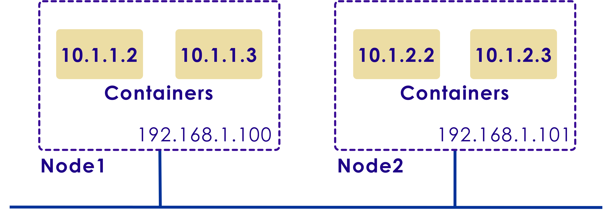
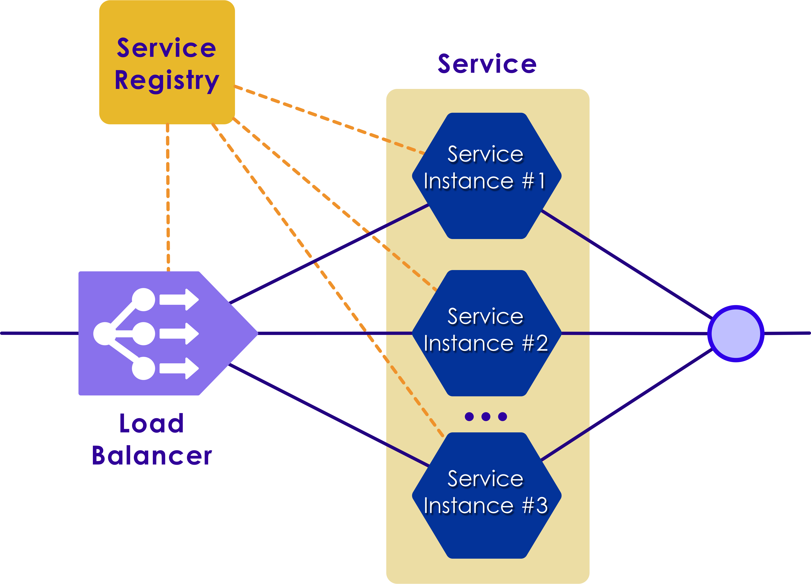
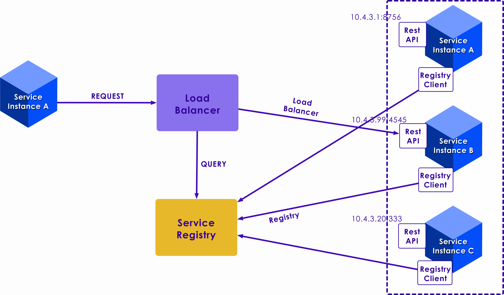
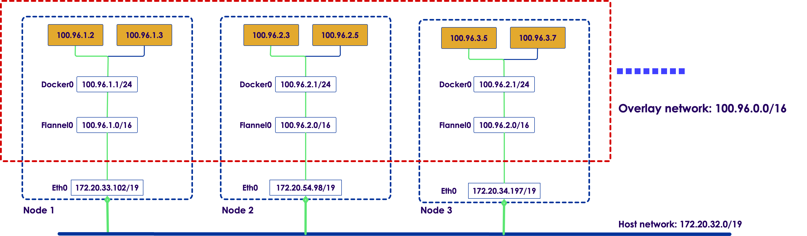
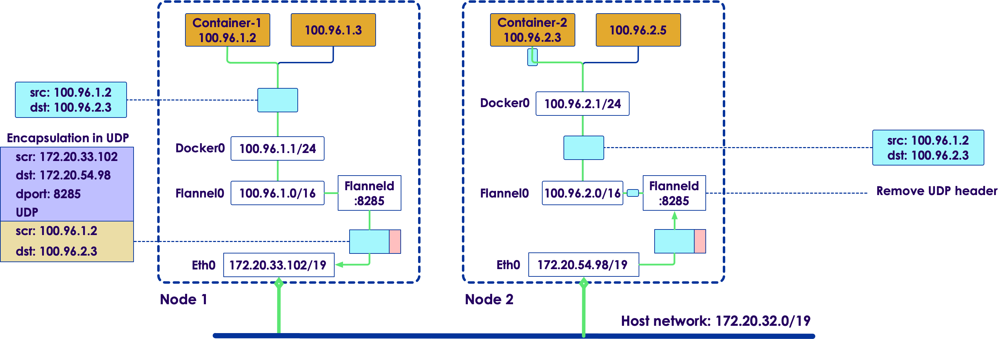
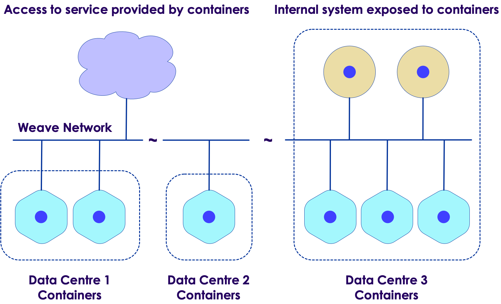
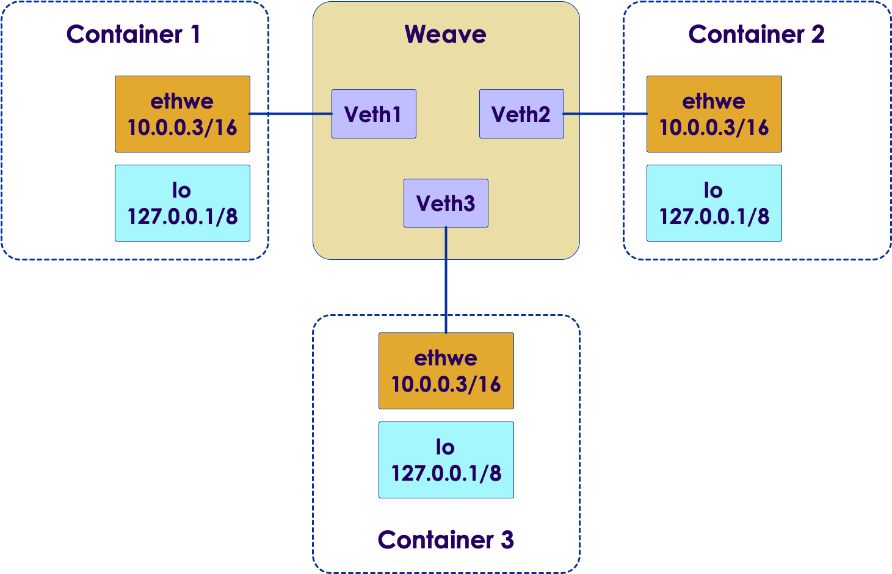

Kubernetes: Networking
===================

## Module Objectives

After this module, participants will be able to:

 * Explain Kubernetes Networking
 * Compare Kubernetes vs. Docker Networking Model
 * Kubernetes Networking Model Implementations
 * How Pods Communicate with Each Other
 * How Pods Communicate with Services
 * Incoming Traffic from the Outside World
 * DNS for Services and Pods
 * Network Policies
 * Network Extensions
 * CNI Plugins

---

# Networking Overview

## OSI Model

 * Layer 7: Application Layer 
 * Layer 6: Presentation Layer
 * Layer 5: Session Layer
 * Layer 4: Transport Layer
 * Layer 3: Network Layer 
 * Layer 2: Data Link Layer
 * Layer 1: Physical Layer

## OSI Model

| Layer | Name         | Example        |
|-------|--------------|----------------|
| 7     | Application  | HTTP           |
| 6     | Presentation | MIME, XDR, TLS |
| 5     | Session      | Sockets        |
| 4     | Transport    | TCP            |
| 3     | Network      | IP             |
| 2     | Data Link    | Ethernet       |
| 1     | Physical     | RJ45, 10BaseT  |

---

## VXLAN

 * VXLAN: “virtual extensible LAN”. 
 * Encapsulates Level 2 Ethernet with UDP Datagram
 * Similar to VLAN
   - more flexibliity and power (more than 4096 IDs)
 * Encapsulation / Overlay Protocol 
 * Runs on top of Existing Networks

---

## Overlay Network
 * Logical Network rather than Physical
 * Runs on top of existing networks
 * Provides an Abstraction on top
 * Encapsulation:
   - Wrap Network Packets with Additional Layer to Provide Additional Information
   - Translates from Virtual Network to Underlying Address Space
 * Purposes
   - Separation of Concerns
   - Security

## Encapsulation
 * Wrapping Network Packets in a Layer
 * Translates from virtual network to underlying address space
    - for routing
 * Usually packet de-encapsulated and then routed to destination
 

## Mesh Network

 * Mesh Nework
 * Each Additional Node connects to many other nodes
 * Cooperate on Routing
 * Advantages: 
   - Reliable Networking
   - Multiple Paths
 * Disadvantages
   - Additional Nodes Means Additional Overead

## Border Gateway Protocol (BGP)

 * Manage Packets routed between edge Routers
 * Figure out how to send packet from one network to another
 * For CNI  

Notes:

BGP: Stands for “border gateway protocol” and is used to manage how packets are routed between edge routers. BGP helps figure out how to send a packet from one network to another by taking into account available paths, routing rules, and specific network policies. BGP is sometimes used as the routing mechanism in CNI plugins instead of encapsulated overlay networks.

---

## Docker Networking

 * Default Options:
   - none: Adds the container to a container-specific network stack with no connectivity.
   - host: Adds the container to the host machine’s network stack, with no isolation.
   - default bridge: The default networking mode. Each container can connect with one another by IP address.
   - custom bridge: User-defined bridge networks with additional flexibility, isolation, and convenience features.

 * Advanced Networking
   - Multi-Host Overlay Networking
   - Additional Drivers and Plugins

# Kubernetes Networking

## Cluster Networking

  * Kubernetes requirements:

    - Pods are routable on a flat network.

    - Pods should see their own routable IP address.

    - Nodes can communicate with all containers.

    - In many cases, to meet above requirements SDN need to be used.

    - All SDNs accomplish the same three goals – however, they may have different implementations with often unique features.

Notes:

Instructor Notes:

Participant Notes:

In a Kubernetes cluster, it is recommended practice to have all nodes on a 'flat' network – meaning no hierarchical network layout.
Node to Node communication is essential, and nodes are free to communicate with each other.

An SDN – Software Defined Networking – can help to define various network layouts.
How ever, SDNs can get complicated to administer.

---

## Docker Model

  * Docker:

    - Uses host-private networking Pods.

    - Creates a virtual bridge called docker0.

    - For each container that Docker creates, it allocates a virtual Ethernet device (called veth) that is attached to the virtual bridge.

    - The veth is mapped to appear as eth0 in the container.

    - Containers can talk with each other if they are present in the same machine.

    - For Docker containers to communicate across machines port allocation needs to be done on the parent machine’s own IP address.

Notes:

Instructor Notes:

Participant Notes:

By default, Docker uses host-private networking..
So Docker containers can only talk to other Docker containers running on the same machine.
But in a Kubernetes cluster, all containers need to communicate with each other freely.
So we need to allocate ports on hosts carefully so there is no conflict among Docker containers.

---

## Kubernetes 3 Commandments

 * Kubernetes defines the networking model, but there are other implementations of it
 * Here are 3 Commandments (from Kubernetes Documentation) 
   - All containers can communicate with all other containers without NAT
   - All nodes can communicate with all containers (and vice-versa) without NAT
   - IP that a container sees itself as is the same IP that others see it as

---

## Kubernetes Networking Model

   * Highly-Coupled Container-to-Container Communication

   * Pod-to-Pod Communication

   * Pod-to-Service Communication

   * External-to-Internal Communication

Notes:

Instructor Notes:

Participant Notes:

Highly-Coupled Container-to-Container Communication
This happens within a pod and can be treated similarly to the localhost traffic. However, as it does not feature any networking, it is out of the scope of this article.

Pod-to-Pod Communication
A pod is the smallest deployable computing unit that can be created and managed in Kubernetes.
Each pod in a Kubernetes cluster is assigned an IP in a flat shared networking namespace.
This forms a networking model where each pod can communicate with the network just like in a virtual machine.

Pod-to-Service Communication
In the Pod-to-Service Communication model, services are assigned to client-accessible IPs.
They are then transparently proxied to the pods grouped by that service.
Requests to the service IPs are intercepted by a kube-proxy process running on all hosts, which then routes to the correct pod.

External-to-Internal Communication
Permitting external traffic into the cluster is finished mostly by mapping outside load balancers to explicitly uncovered services in the cluster.
This mapping permits the kube-intermediary procedure to course the external requests to the proper pods using the cluster’s pod-network.
Once traffic arrives at a node, it is routed to the correct service backends via the kube-proxy.

---

## Container-To-Container
 * Containers can communicate with each other within a POD
 * Able to Write traffic to localhost
   - e.g. localhost:PORT
 * This is an example of *highly-coupled* communication
 * Does not really require networking

---

## Pod to Pod

 * Each Pod in cluster has an IP address in flat networking namespace
 * Pod can communicate with the network (much like a VM)
 * Different Implementations of this:
   - Flannel: Uses an *overlay* network
   - Weave

---

## Pod to Service
 * In the Pod-to-Service Communication model, services are assigned to client-accessible IPs.
 * They are then transparently proxied to the pods grouped by that service.
 * Requests to the service IPs are intercepted by a kube-proxy process running on all hosts, which then routes to the correct pod.
 * As pods may go up and down, best to communicate via services
---

## External-to-Internal Communication
 * Permitting external traffic into the cluster is finished mostly by mapping outside load balancers to explicitly uncovered services in the cluster.
 * This allows

---

## Kubernetes Networking Model (Cont.)

  * Some of the plugins listed below were developed exclusively for Kubernetes, while others are more general purpose solutions.

  * **Kubenet**

    - Kubenet is typically useful for single-node environments.

  * **Flannel**

    - Flannel is a networking overlay fabric specifically designed for Kubernetes and created by CoreOS.

  * **Weave**

   - Weave is used to connect, monitor, visualize, and control Kubernetes.

## Kubernetes Networking Model (Cont.)

  * **OpenVSwitch**

   - OpenVSwitch is used to set up networking between pods across nodes.

  * **Calico**

   - Calico provides simple, scalable and secure virtual networking.

Notes:

Instructor Notes:

Participant Notes:

Kubenet
It is typically useful for single-node environments. It can be utilized for communication between nodes by using it together with a cloud provider that establishes the rules.
Kubenet is a very basic network plugin, so if you are looking for features such as cross-node networking or network policy, Kubenet will be of little help.

Flannel
Flannel is a networking overlay fabric specifically designed for Kubernetes and created by CoreOS.
Flannel’s main advantage is it is well-tested and incurs a low cost.
Flannel distributes the full workload across the entire cluster. Kubernetes, for proper communication and for locating services, performs port-mapping and assigns a unique IP address to each pod.

Weave
Developed by Weaveworks, Weave is used to connect, monitor, visualize, and control Kubernetes. With Weave, you can create networks, firewalls with faster deployments, and gain powerful insights with easy automation troubleshooting and networking.

OpenVSwitch using GRE/VXLAN
OpenVSwitch is used to set up networking between pods across nodes.
The tunnel type could be VxLAN or GRE (Generic Routing Encapsulation). GRE is used for tunneling of frames over an IP network.
VXLAN is preferable for big data centers when large-scale isolation needs to be performed within the network.

Calico
Introduced with Kubernetes 1.0, Calico provides L3 routed networking for Kubernetes Pods.
Calico provides simple, scalable and secure virtual networking.
 It uses Border Gateway Protocol (BGP) for root distribution for each pod allowing integration of Kubernetes clusters with existing IT infrastructure.

---

## Cross Node Pod-to-Pod Network Connectivity

 <!-- {"left" : 0.55, "top" : 1.77, "height" : 3.27, "width" : 9.17} -->

Notes:

Instructor Notes:

Participant Notes:

For the illustration of these requirements let us use a cluster with two cluster nodes.
Nodes are in subnet 192.168.1.0/24 and pods use 10.1.0.0/16 subnet, with 10.1.1.0/24 and 10.1.2.0/24 used by node1 and node2 respectively for the pod IP’s.

So from above Kubernetes requirements following communication paths must be established by the network.

1) Nodes should be able to talk to all pods. For e.g., 192.168.1.100 should be able to reach 10.1.1.2, 10.1.1.3, 10.1.2.2 and 10.1.2.3 directly (without NAT)
2) A pod should be able to communicate with all nodes. For e.g., pod 10.1.1.2 should be able to reach 192.168.1.100 and 192.168.1.101 without NAT
3) A pod should be able to communicate with all pods. For e.g., 10.1.1.2 should be able to communicate with 10.1.1.3, 10.1.2.2 and 10.1.2.3 directly (without NAT)
 
# DNS for Services and Pods

## Service Anatomy

 <!-- {"left" : 1.47, "top" : 1.12, "height" : 5.27, "width" : 7.31} -->

Notes:

Instructor Notes:

Participant Notes:

Here Load Balancer is used to send traffic evenly to running instances.
As instances are added or removed from the service pool, the Load Balancer will adjust.

Explained in slide 39: Service Discovery Components 

---

## Client vs. Server Side Service Discovery

**Client Discovery**

 <!-- {"left" : 3.65, "top" : 0.93, "height" : 3.09, "width" : 4.29} -->

**Server Discovery**

 <!-- {"left" : 1.97, "top" : 4.48, "height" : 2.82, "width" : 4.82} -->

Notes:

Instructor Notes:

Participant Notes:

Client Discovery: 
Client talks to the Service registry and does load balancing.
Client service needs to be Service registry aware.
Example: Netflix OSS

Server Discovery:
Client talks to the load balancer and the load balancer talks to the Service registry. 
Client service need not be Service registry aware.
Examples: Consul, AWS ELB, K8s, Docker

---

## Autoscaling During Rolling Update

  * **Discovery**

    - Services need to discover each other dynamically, to get IP addresses and port details to communicate with other services in the cluster
    - Service Registry maintains a database of services and provides an external API (HTTP/DNS) as a distributed key/value store
    - Registrator registers services dynamically to the Service registry by listening to the Service creation and deletion events

  * **Health Check**

     - Monitors Service instance health dynamically and updates the Service registry accordingly

  * **Load Balancing**

    - Dynamic load balancing of traffic to healthy instances that provide the target service

Notes:

Instructor Notes:

Participant Notes:

The registry serves as a place to publish available services – think like a 'yellow pages'.
For example a service that offers zipcode lookup can be advertised in the registry, that can be discovered by other services.

A health check is performed every few seconds on the containers.
This ensures the containers are alive and running.

Load balancing is explained in slide no. 42. 

---

## Health Check Options

  * **Script based check**

    - Running user provided script on a periodic basis

  * **HTTP based check**

    - Periodic HTTP based check to the service IP and endpoint address

  * **TCP based check**

    - TCP based check is done to service IP and specified port periodically

  * **Container based check**

    - Health check application is also available as a Container
    - Container is periodically invoked by Health Check Manager

Notes:

Instructor Notes:

Participant Notes:

There various ways of doing health checks.

For example to test a Web Service, we can perform a HTTP check.
We can query the Web Service and examine the return code.
If we get return code 200, then we know the Web Service is alive.
If we get a 404 code, we know the Web Service is down.

---

# CNI Plugins

## CNI Plugins List
 * Flannel
 * WeaveNet
 * Calico
 * Cilium
 * Romana
 * Canal

---

## Kubenet
 * It is typically useful for single-node environments. 
 * It can be utilized for communication between nodes by using it together with a cloud provider that establishes the rules.
 * Kubenet is a very basic network plugin, so if you are looking for features such as cross-node networking or network policy, Kubenet will be of little help.

---

## Flannel
 * Flannel is a networking overlay fabric specifically designed for Kubernetes and created by CoreOS.
 * Flannel’s main advantage is it is well-tested and incurs a low cost.
 * Flannel distributes the full workload across the entire cluster. 
 * Kubernetes, for proper communication and for locating services, performs port-mapping and assigns a unique IP address to each pod.

---

## Weave Net
 * Developed by Weaveworks
 * Weave is used to connect, monitor, visualize, and control Kubernetes. 
 * With Weave, you can create networks, firewalls with faster deployments, and gain powerful insights with easy automation troubleshooting and networking.

---

## OpenVSwitch using GRE/VXLAN
 * OpenVSwitch is used to set up networking between pods across nodes.
 * The tunnel type could be VxLAN or GRE (Generic Routing Encapsulation). GRE is used for tunneling of frames over an IP network.
 * VXLAN is preferable for big data centers when large-scale isolation needs to be performed within the network.

-- 

## Calico
 * Introduced with Kubernetes 1.0, Calico provides L3 routed networking for Kubernetes Pods.
 * Calico provides simple, scalable and secure virtual networking.
 * It uses Border Gateway Protocol (BGP) for root distribution for each pod allowing integration of Kubernetes clusters with existing IT infrastructure.

---

## Flannel Details

 <!-- {"left" : 0.55, "top" : 1.77, "height" : 3.27, "width" : 9.17} -->

## Flannel Networks

 * We show 3 Networks

   - VPC network: all instances are in one VPC subnet 172.20.32.0/19. They have been assigned ip addresses in this range, all hosts can connect to each other because they are in same LAN.

   - Flannel overlay network: flannel has created another network 100.96.0.0/16, it’s a bigger network which can hold 2¹⁶(65536) addresses, and it’s across all kubernetes nodes, each pod will be assigned one address in this range, 

   - In-Host docker network: inside each host, flannel assigned a 100.96.x.0/24 network to all pods in this host, it can hold 2⁸(256) addresses. The docker bridge interface docker0 will use this network to create new containers.

## Flannel Pod to Pod Communication

 <!-- {"left" : 0.55, "top" : 1.77, "height" : 3.27, "width" : 9.17} -->

---

## Flannel Security

 * No Network Policies
   - No Ingress Policies
   - No Egress Policies
 * No Encryption
   - 
 * Conclusion: Flannel Doesn not provide security features

---

## Flannel Advantages and Disadvantages
 * Flannel Advantages:
   - Very Well Tested
   - Simple
   - Easy to Set up
   - Relatively fast performance
   - Low Cost
 * Disadvantages
   - No security features

---

## Weave Net

 <!-- {"left" : 0.55, "top" : 1.77, "height" : 3.27, "width" : 9.17} -->

---

## Weave Net Overview

 <!-- {"left" : 0.55, "top" : 1.77, "height" : 3.27, "width" : 9.17} -->

## Weave Net Advantages and Disadvantages
 * Weave Net Advantages
   - Easy to Set Up
   - Encryption
   - Ingress and Egress Policies
   - Plugins for Docker, Kubernetes, CLoud and others 
 * Disadvantages
   - Encryption very slow

