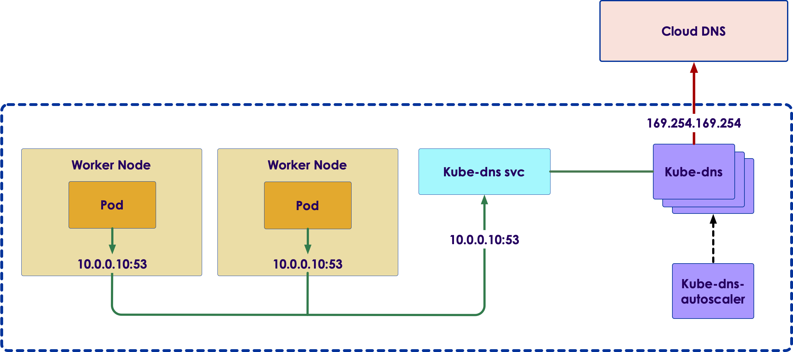

# Kubernetes Networking

---

## Module Objectives

* Explain Kubernetes Networking
* Compare Kubernetes vs. Docker Networking Model
* Kubernetes Networking Model Implementations
* How Pods Communicate with Each Other
* How Pods Communicate with Services
* Incoming Traffic from the Outside World
* DNS for Services and Pods
* Network Policies
* Network Extensions
* CNI Plugins

---

## OSI Model

* The OSI Model (Open Systems Interconnection Model) has seven different abstraction layers

| Layer | Name         | Example        |
|-------|--------------|----------------|
| 7     | Application  | HTTP           |
| 6     | Presentation | MIME, XDR, TLS |
| 5     | Session      | Sockets        |
| 4     | Transport    | TCP            |
| 3     | Network      | IP             |
| 2     | Data Link    | Ethernet       |
| 1     | Physical     | RJ45, 10BaseT  |

---

## Docker Networking

- **none**: Adds the container to a container-specific network stack with no connectivity.

* **host**: Adds the container to the host machine's network stack, with no isolation.

- **bridge (default)**: The default networking mode. Each container can connect with one another by IP address.

- **custom bridge**: User-defined bridge networks with additional flexibility, isolation, and convenience features.

---

## Docker Networking (Bridge)

<!-- {"left" : 6.76, "top" : 0.88, "height" : 4.37, "width" : 3.28} -->

- Creates a virtual bridge called **docker0**

- For each container that Docker creates, it allocates a virtual Ethernet device (called **veth**) that is attached to the virtual bridge.

- The **veth** is mapped to appear as **eth0** in the container.

- Containers can talk with each other if they are present in the same machine.

- For Docker containers to communicate across machines port allocation needs to be done on the parent machine's own IP address.

Notes:

Instructor Notes :

Participant Notes :

By default, Docker uses host-private networking..
So Docker containers can only talk to other Docker containers running on the same machine.
But in a Kubernetes cluster, all containers need to communicate with each other freely.
So we need to allocate ports on hosts carefully so there is no conflict among Docker containers.

---

## Kubernetes Networking Requirements

<!-- {"left" : 6.76, "top" : 0.88, "height" : 4.37, "width" : 3.28} -->

* All containers can communicate with all other containers without NAT
* All nodes can communicate with all containers (and vice-versa) without NAT
* Pods are routable on a flat network.
* Pods should see their own routable IP address.
* Nodes can communicate with all containers.
* In many cases, to meet above requirements SDN (Software Defined Networking) need to be used.
* All SDNs accomplish the same three goals – however, they may have different implementations with often unique features.

Notes:

Instructor Notes :

Participant Notes :

In a Kubernetes cluster, it is recommended practice to have all nodes on a 'flat' network – meaning no hierarchical network layout.
Node to Node communication is essential, and nodes are free to communicate with each other.

An SDN – Software Defined Networking – can help to define various network layouts.
How ever, SDNs can get complicated to administer.

---

## Kubernetes Networking Model

   * Highly-Coupled Container-to-Container Communication

   * Pod-to-Pod Communication

   * Pod-to-Service Communication

   * External-to-Internal Communication

Notes:

Instructor Notes :

Participant Notes :

Highly-Coupled Container-to-Container Communication
This happens within a pod and can be treated similarly to the localhost traffic. However, as it does not feature any networking, it is out of the scope of this article.

Pod-to-Pod Communication
A pod is the smallest deployable computing unit that can be created and managed in Kubernetes.
Each pod in a Kubernetes cluster is assigned an IP in a flat shared networking namespace.
This forms a networking model where each pod can communicate with the network just like in a virtual machine.

Pod-to-Service Communication
In the Pod-to-Service Communication model, services are assigned to client-accessible IPs.
They are then transparently proxied to the pods grouped by that service.
Requests to the service IPs are intercepted by a kube-proxy process running on all hosts, which then routes to the correct pod.

External-to-Internal Communication
Permitting external traffic into the cluster is finished mostly by mapping outside load balancers to explicitly uncovered services in the cluster.
This mapping permits the kube-intermediary procedure to course the external requests to the proper pods using the cluster's pod-network.
Once traffic arrives at a node, it is routed to the correct service backends via the kube-proxy.

---

## Container-To-Container

<!-- {"left" : 6.76, "top" : 0.88, "height" : 4.37, "width" : 3.28} -->

 * Containers can communicate with each other within a POD

 * Able to Write traffic to localhost
   - e.g. localhost:PORT

 * This is an example of *highly-coupled* communication

 * Does not really require networking

---

## Pod to Pod

<!-- {"left" : 6.76, "top" : 0.88, "height" : 4.37, "width" : 3.28} -->

* Each Pod in cluster has an IP address in flat networking namespace

* Pod can communicate with the network (much like a VM)

* Different implementations available:
   - [Flannel](https://github.com/flannel-io/flannel): Uses an *overlay* network
   - [Weave](https://www.weave.works/docs/net/latest/overview/)

---

## Pod to Service

<!-- {"left" : 6.76, "top" : 0.88, "height" : 4.37, "width" : 3.28} -->

* In the Pod-to-Service Communication model, services are assigned to client-accessible IPs.

* They are then transparently proxied to the pods grouped by that service.

* Requests to the service IPs are intercepted by a kube-proxy process running on all hosts, which then routes to the correct pod.

* As pods may go up and down, best to communicate via services

---

## External-to-Internal Communication

<!-- {"left" : 6.76, "top" : 0.88, "height" : 4.37, "width" : 3.28} -->
<!-- {"left" : 6.76, "top" : 0.88, "height" : 4.37, "width" : 3.28} -->

* Permitting external traffic into the cluster can be accomplished by
    - Load balancers
    - NodePort
    - Ingress

* Good reference: [Kubernetes NodePort vs LoadBalancer vs Ingress? When should I use what?](https://medium.com/google-cloud/kubernetes-nodeport-vs-loadbalancer-vs-ingress-when-should-i-use-what-922f010849e0)

<!-- {"left" : 6.76, "top" : 0.88, "height" : 4.37, "width" : 3.28} -->

---

## Kubernetes Networking Model

* Some of the plugins listed below were developed exclusively for Kubernetes, while others are more general purpose solutions.

* **Kubenet** : Kubenet is typically useful for single-node environments.

* **Flannel** : Flannel is a networking overlay fabric specifically designed for Kubernetes and created by CoreOS.

* **Weave** :  Weave is used to connect, monitor, visualize, and control Kubernetes.

* **OpenVSwitch** : OpenVSwitch is used to set up networking between pods across nodes.

* **Calico** : Calico provides simple, scalable and secure virtual networking.

Notes:

Instructor Notes :

Participant Notes :

Kubenet
It is typically useful for single-node environments. It can be utilized for communication between nodes by using it together with a cloud provider that establishes the rules.
Kubenet is a very basic network plugin, so if you are looking for features such as cross-node networking or network policy, Kubenet will be of little help.

Flannel
Flannel is a networking overlay fabric specifically designed for Kubernetes and created by CoreOS.
Flannel's main advantage is it is well-tested and incurs a low cost.
Flannel distributes the full workload across the entire cluster. Kubernetes, for proper communication and for locating services, performs port-mapping and assigns a unique IP address to each pod.

Weave
Developed by Weaveworks, Weave is used to connect, monitor, visualize, and control Kubernetes. With Weave, you can create networks, firewalls with faster deployments, and gain powerful insights with easy automation troubleshooting and networking.

OpenVSwitch using GRE/VXLAN
OpenVSwitch is used to set up networking between pods across nodes.
The tunnel type could be VxLAN or GRE (Generic Routing Encapsulation). GRE is used for tunneling of frames over an IP network.
VXLAN is preferable for big data centers when large-scale isolation needs to be performed within the network.

Calico
Introduced with Kubernetes 1.0, Calico provides L3 routed networking for Kubernetes Pods.
Calico provides simple, scalable and secure virtual networking.
 It uses Border Gateway Protocol (BGP) for root distribution for each pod allowing integration of Kubernetes clusters with existing IT infrastructure.

---

## Cross Node Pod-to-Pod Connectivity

<!-- {"left" : 6.76, "top" : 0.88, "height" : 4.37, "width" : 3.28} -->

* Here nodes are in subnet **192.168.1.0/24** and pods use **10.1.0.0/16** subnet, with **10.1.1.0/24** and **10.1.2.0/24** used by node1 and node2 respectively for the pod IP's.

* Nodes should be able to talk to all pods. For example, 192.168.1.100 should be able to reach 10.1.1.2, 10.1.1.3, 10.1.2.2 and 10.1.2.3 directly (without NAT)

* A pod should be able to communicate with all nodes. For example, pod 10.1.1.2 should be able to reach 192.168.1.100 and 192.168.1.101 without NAT

* A pod should be able to communicate with all pods. For example, 10.1.1.2 should be able to communicate with 10.1.1.3, 10.1.2.2 and 10.1.2.3 directly (without NAT)

Notes:

Instructor Notes :

Participant Notes :

For the illustration of these requirements let us use a cluster with two cluster nodes.

So from above Kubernetes requirements following communication paths must be established by the network.

---

## Kubernetes DNS

* Kubernetes run a **DNS service** on its own

* It creates DNS records for **Pods and services**

* Each Pod may use their `/etc/resolv.conf` (set by Kubelet) for resolving

* References:
    - [DNS for Services and Pods](https://kubernetes.io/docs/concepts/services-networking/dns-pod-service/)

<!-- {"left" : 6.76, "top" : 0.88, "height" : 4.37, "width" : 3.28} -->

---

## Lab: Networking - DNS Settings

<!-- {"left" : 6.76, "top" : 0.88, "height" : 4.37, "width" : 3.28} -->

* **Overview:**
  - Set custom DNS

* **Approximate run time:**
  - 20 mins

* **Instructions:**
  - Complete **NETWORK-1** lab

Notes:

---

## Review and Q&A

<!-- {"left" : 8.56, "top" : 1.21, "height" : 1.15, "width" : 1.55} -->
<!-- {"left" : 6.53, "top" : 2.66, "height" : 2.52, "width" : 3.79} -->

* Let's go over what we have covered so far

* Any questions?

---

# Appendix

---

# CNI Plugins

---

## CNI Plugins List

 * Flannel
 * WeaveNet
 * Calico
 * Cilium
 * Romana
 * Canal

---

## Kubenet

 * It is typically useful for single-node environments. 
 * It can be utilized for communication between nodes by using it together with a cloud provider that establishes the rules.
 * Kubenet is a very basic network plugin, so if you are looking for features such as cross-node networking or network policy, Kubenet will be of little help.

---

## Flannel

 * Flannel is a networking overlay fabric specifically designed for Kubernetes and created by CoreOS.
 * Flannel's main advantage is it is well-tested and incurs a low cost.
 * Flannel distributes the full workload across the entire cluster.
 * Kubernetes, for proper communication and for locating services, performs port-mapping and assigns a unique IP address to each pod.

---

## Weave Net

 * Developed by Weaveworks
 * Weave is used to connect, monitor, visualize, and control Kubernetes.
 * With Weave, you can create networks, firewalls with faster deployments, and gain powerful insights with easy automation troubleshooting and networking.

---

## OpenVSwitch using GRE/VXLAN

 * OpenVSwitch is used to set up networking between pods across nodes.
 * The tunnel type could be VxLAN or GRE (Generic Routing Encapsulation). GRE is used for tunneling of frames over an IP network.
 * VXLAN is preferable for big data centers when large-scale isolation needs to be performed within the network.

---

## Calico

 * Introduced with Kubernetes 1.0, Calico provides L3 routed networking for Kubernetes Pods.
 * Calico provides simple, scalable and secure virtual networking.
 * It uses Border Gateway Protocol (BGP) for root distribution for each pod allowing integration of Kubernetes clusters with existing IT infrastructure.

---

## Flannel Details

<!-- {"left" : 0.55, "top" : 1.77, "height" : 3.27, "width" : 9.17} -->

---

## Flannel Networks

* We show 3 Networks

   - VPC network: all instances are in one VPC subnet 172.20.32.0/19. They have been assigned ip addresses in this range, all hosts can connect to each other because they are in same LAN.

   - Flannel overlay network: flannel has created another network 100.96.0.0/16, it's a bigger network which can hold 2¹⁶(65536) addresses, and it's across all kubernetes nodes, each pod will be assigned one address in this range, 

   - In-Host docker network: inside each host, flannel assigned a 100.96.x.0/24 network to all pods in this host, it can hold 2⁸(256) addresses. The docker bridge interface docker0 will use this network to create new containers.

---

## Flannel Pod to Pod Communication

<!-- {"left" : 0.55, "top" : 1.77, "height" : 3.27, "width" : 9.17} -->

---

## Flannel Security

 * No Network Policies
   - No Ingress Policies
   - No Egress Policies
 * No Encryption
 * Conclusion: Flannel Doesn not provide security features

---

## Flannel Advantages and Disadvantages

 * Flannel Advantages:
   - Very Well Tested
   - Simple
   - Easy to Set up
   - Relatively fast performance
   - Low Cost
 * Disadvantages
   - No security features

---

## Weave Net

<!-- {"left" : 0.55, "top" : 1.77, "height" : 3.27, "width" : 9.17} -->

---

## Weave Net Overview

<!-- {"left" : 0.55, "top" : 1.77, "height" : 3.27, "width" : 9.17} -->

---

## Weave Net Advantages and Disadvantages

 * Weave Net Advantages
   - Easy to Set Up
   - Encryption
   - Ingress and Egress Policies
   - Plugins for Docker, Kubernetes, CLoud and others 
 * Disadvantages
   - Encryption very slow
