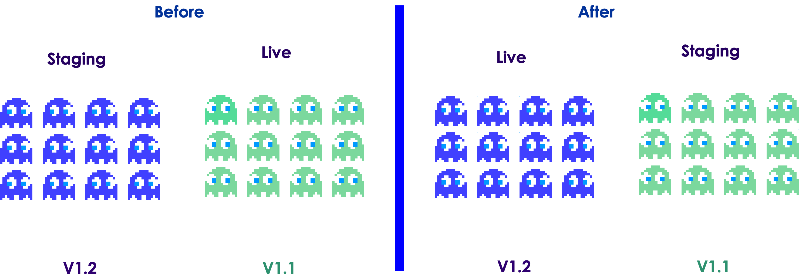

# Kubernetes Operations

---

# Health Checks

---

## Health Checks

* Kubernetes supports multiple health checks

* Health checks are performed by **kubelet**

* **Startup probe**:  Used to determine if a Pod is up and running.  Useful for slow starting Pods (e.g. database containers)

* **Readyness probe**: Used to determine when a Pod is ready to accept traffic.
    - A Pod is considered ready, when all its containers are ready

* **Liveness probe**: Used to determine if the application is responding.  
    - For example an app could be up and running, but may be caught up in a dead-lock.
    - Restarting can help bring the app back live

---

## Defining a Liveness Probe

* We are using `HTTP GET` request on **port 8080 and path `/healthz`**
    - Any code greater than or equal to 200 and less than 400 indicates success. Any other code indicates failure.
* **`periodSeconds`** field specifies that the kubelet should perform a liveness probe every 3 seconds
* **`initialDelaySeconds`** field tells the kubelet should wait 5 seconds before performing the first probe

```yaml
apiVersion: v1
kind: Pod
metadata:
  labels:
    test: liveness
  name: liveness-http
spec:
  containers:
  - name: liveness
    image: k8s.gcr.io/liveness
    args:
    - /server
    livenessProbe:
      httpGet:
        path: /healthz
        port: 8080
      initialDelaySeconds: 5
      periodSeconds: 3
```

---

## Liveness Probe Using TCP Connect

* The kubelet will attempt to open a socket to the container on the specified port (8080)

* If it can establish a connection, the container is considered healthy, if it can't it is considered a failure.

```yaml
apiVersion: v1
kind: Pod
metadata:
  name: goproxy
  labels:
    app: goproxy
spec:
  containers:
  - name: goproxy
    image: k8s.gcr.io/goproxy:0.1
    ports:
    - containerPort: 8080
    readinessProbe:
      tcpSocket:
        port: 8080
      initialDelaySeconds: 5
      periodSeconds: 10
    livenessProbe:
      tcpSocket:
        port: 8080
      initialDelaySeconds: 15
      periodSeconds: 20
```

---

## Health Check Process

* Kubelet will check for health of a Pod using liveness probe

* If the check fails, it restarts the Pod

<!-- {"left" : 5.9, "top" : 1.17, "height" : 2.23, "width" : 4.28} -->
<!-- {"left" : 5.9, "top" : 1.17, "height" : 2.23, "width" : 4.28} -->

---

# Deployment Strategies

---

## Deployment Strategies

* Basic
* Rolling
* Blue-Green
* Canary
* A/B Testing

* References
    - [Intro To Deployment Strategies: Blue-Green, Canary, And More](https://harness.io/blog/blue-green-canary-deployment-strategies/)
    - [Blue Green deployments explained](https://martinfowler.com/bliki/BlueGreenDeployment.html)

---

## Basic Deployment

* Nodes are updated with newer version of software

* Can be done with config management systems like Ansible / Chef ..etc

* Not foolproof, as it may be not be easy to rollback if things go wrong  (for example some libraries may have been updated and not compatible)

<!-- {"left" : 6.76, "top" : 0.88, "height" : 4.37, "width" : 3.28} -->

---

## Rolling Deployment

* New Pods are deployed in increments

* Easy to roll back if things go wrong

* Ths rollover will take some time, in the mean time, both versions are alive

<!-- {"left" : 6.76, "top" : 0.88, "height" : 4.37, "width" : 3.28} -->

---

## Blue/Green Deployment

* Both Blue and Green versions are deployed in exactly the same environment

* Green is currently live, Green is ready to go live

* Then Blue is made live very quickly

* Rollback is instant (flicking a switch)

<!-- {"left" : 6.76, "top" : 0.88, "height" : 4.37, "width" : 3.28} -->

---

## Canary Deployment

* Release new version incrementally

* To test out the features with a smaller group of users first and then increasing deployment base

<!-- {"left" : 6.76, "top" : 0.88, "height" : 4.37, "width" : 3.28} -->

---

## A/B Testing

* Used to experiment with features

<!-- {"left" : 6.76, "top" : 0.88, "height" : 4.37, "width" : 3.28} -->

---

# Rolling Upgrades

---

## Rolling Updates

* Rolling updates permit you to update from one image version to another

* Say we want to update from `hello1` to `hello2`

<!-- {"left" : 6.76, "top" : 0.88, "height" : 4.37, "width" : 3.28} -->


Notes:

---

## Rolling Updates - 1

  * This deployment allows you to create a second ReplicaSet

<!-- {"left" : 6.76, "top" : 0.88, "height" : 4.37, "width" : 3.28} -->

Notes:

---

## Rolling Updates - 2

* It gradually increases the number of replicas in the second ReplicaSet

<!-- {"left" : 6.76, "top" : 0.88, "height" : 4.37, "width" : 3.28} -->

<!-- {"left" : 6.76, "top" : 0.88, "height" : 4.37, "width" : 3.28} -->

Notes:

---

## Rolling Updates - 3

* This decreases replicas in the first ReplicaSet
* Hence at any given point of time there are at most 4 pods

<!-- {"left" : 6.76, "top" : 0.88, "height" : 4.37, "width" : 3.28} -->
<!-- {"left" : 6.76, "top" : 0.88, "height" : 4.37, "width" : 3.28} -->

Notes:

---

## Rolling Updates - 4

* Rolllout is complete when the new RS has the same Pods to replace the old RS

<!-- {"left" : 6.76, "top" : 0.88, "height" : 4.37, "width" : 3.28} -->
<!-- {"left" : 6.76, "top" : 0.88, "height" : 4.37, "width" : 3.28} -->

Notes:

---

## Lab: Rollout Deployments

<!-- {"left" : 6.76, "top" : 0.88, "height" : 4.37, "width" : 3.28} -->

* **Overview:**
    - Rollout an upgrade

* **Approximate run time:**
    - 20 mins

* **Instructions:**
    - Please complete **DEPLOY-2**

Notes:

---

## Blue Green Deployment-1

* A blue-Green deployment make use the service label selector to change all traffic from one deployment to another


<!-- {"left" : 6.76, "top" : 0.88, "height" : 4.37, "width" : 3.28} -->


Notes:

---

## Blue Green Deployment

  * Initially bring up and test new deployment without live traffic


<!-- {"left" : 6.76, "top" : 0.88, "height" : 4.37, "width" : 3.28} -->


Notes:

---

## Blue Green Deployment

  * To make the version go live, change the service label selector which switches all traffic

<!-- {"left" : 6.76, "top" : 0.88, "height" : 4.37, "width" : 3.28} -->


Notes:

---

## Lab: Blue/Green Deployment

<!-- {"left" : 6.76, "top" : 0.88, "height" : 4.37, "width" : 3.28} -->

* **Overview:**
    - Deploy a blue/green scenario

* **Approximate run time:**
    - 20 mins

* **Instructions:**
    - Please complete **DEPLOY-3**

Notes:

---

## Lab: Canary Deployment

<!-- {"left" : 6.76, "top" : 0.88, "height" : 4.37, "width" : 3.28} -->

* **Overview:**
    - Do a canaray deployment

* **Approximate run time:**
    - 30 mins

* **Instructions:**
    - Please complete **DEPLOY-4**

Notes:

---

# Autoscaling

---

## Autoscaling

<!-- {"left" : 6.76, "top" : 0.88, "height" : 4.37, "width" : 3.28} -->

* So far we looked at various deployment strategies;  We specified the number of `replicas` explicitly

* When running advanced applications, we want the application to scale up and down along with the load
    - For example, a stock trading application may be scaled up during trading hours, and scaled down during off hours
    - We can program this automatically, set repicas based on time
    - But it won't be flexible to handle unexpected spikes in traffic (e.g. sudden surges in volume)

* Wouldn't it be nice, if we can scale up/down automatically along with the load?

* **Horizontal Pod Autoscaler** is how we do it

---

## Horizontal Pod Autoscaler

<!-- {"left" : 6.76, "top" : 0.88, "height" : 4.37, "width" : 3.28} -->

* Autoscaling, one of the key features, allows the kubernetes cluster to automatically increase or decrease the number of nodes  based on the demand for service response.

* **Horizontal Pod Autoscaler** scales the number of pods automatically  in a replication controller, deployment or replica set.

* The controller manager queries the resource utilization against the metrics specified in each HorizontalPodAutoscaler definition (e.g. CPU, Memory, Disk)

* The controller periodically adjusts the number of replicas in a replication controller or deployment.

Notes:

Implemented as a control loop, Horizontal Pod Autoscaler with a period controlled by the controller manager’s `horizontal-pod-autoscaler-sync-period` flag (with a default value of 30 seconds)

---

## Using Horizontal Pod Autoscaler

* Here we are deploying [php-apache](https://console.cloud.google.com/gcr/images/google-containers/GLOBAL/hpa-example) image

```yaml
apiVersion: apps/v1
kind: Deployment
metadata:
  name: php-apache-deployment
spec:
  selector:
    matchLabels:
      app: php-apache
  template:
    metadata:
      labels:
        app: php-apache
    spec:
      containers:
        - image: gcr.io/google_containers/hpa-example
          name: php-apache
          ports:
            - containerPort: 80
              protocol: TCP
          resources:
            requests:
              cpu: 500m # 0.5 of a core
              memory: 100M
```

---

## Using Horizontal Pod Autoscaler

* Then we define auto scaler
    - **`name: php-apache-deployment`** - points to the deployment
    - **`minReplicas: 1`** - minimum Pods to keep running
    - **`maxReplicas: 10`** - scale up to this many Pods max
    - **`targetCPUUtilizationPercentage: 50`** - If average CPU utilization across Pods exceed this number, trigger scaling up

```yaml
apiVersion: autoscaling/v1
kind: HorizontalPodAutoscaler
metadata:
  name: php-apache-scaler
spec:
  scaleTargetRef:
    apiVersion: apps/v1
    kind: Deployment
    name: php-apache-deployment
  minReplicas: 1
  maxReplicas: 10
  targetCPUUtilizationPercentage: 50
```

---

## Lab: Autoscaling

<!-- {"left" : 6.76, "top" : 0.88, "height" : 4.37, "width" : 3.28} -->

* **Overview:**
    - Autoscale a deployment

* **Approximate run time:**
    - 30 mins

* **Instructions:**
    - Please complete **AUTOSCALE-1**

Notes:

---

---

## Review and Q&A

<!-- {"left" : 8.56, "top" : 1.21, "height" : 1.15, "width" : 1.55} -->
<!-- {"left" : 6.53, "top" : 2.66, "height" : 2.52, "width" : 3.79} -->

* Let's go over what we have covered so far

* Any questions?
