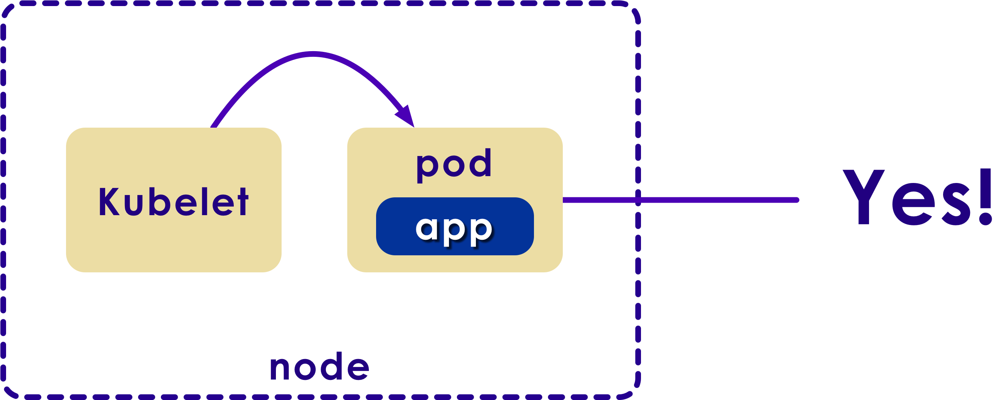

# Kubernetes Operations

---

# Health Checks

---

## Health Checks

<!-- {"left" : 3.65, "top" : 4.84, "height" : 2.42, "width" : 2.95} -->
<!-- {"left" : 3.65, "top" : 4.84, "height" : 2.42, "width" : 2.95} -->

* Health checks are performed by **kubelet**

* **Startup probe**:  Used to determine if a Pod is up and running.  Useful for slow starting Pods (e.g. database containers)

* **Readyness probe**: Used to determine when a Pod is ready to accept traffic.
    - A Pod is considered ready, when all its containers are ready

* **Liveness probe**: Used to determine if the application is responding.  
    - For example an app could be up and running, but may be caught up in a dead-lock.
    - Restarting can help bring the app back live

---

## Health Check Options

* **Script based check**
    - Running user provided script on a periodic basis

* **HTTP based check**
    - Periodic HTTP based check to the service IP and endpoint address

* **TCP based check**
    - TCP based check is done to service IP and specified port periodically

* **Container based check**

    - Health check application is also available as a Container
    - Container is periodically invoked by Health Check Manager

Notes:

Instructor Notes :

Participant Notes :

There various ways of doing health checks.

For example to test a Web Service, we can perform a HTTP check.
We can query the Web Service and examine the return code.
If we get return code 200, then we know the Web Service is alive.
If we get a 404 code, we know the Web Service is down.


---


## Defining a Liveness Probe

* We are using `HTTP GET` request on **port 8080 and path `/healthz`**
    - Any code greater than or equal to 200 and less than 400 indicates success. Any other code indicates failure.
* **`periodSeconds`** field specifies that the kubelet should perform a liveness probe every 3 seconds
* **`initialDelaySeconds`** field tells the kubelet should wait 5 seconds before performing the first probe

```yaml
apiVersion: v1
kind: Pod
metadata:
  labels:
    test: liveness
  name: liveness-http
spec:
  containers:
  - name: liveness
    image: k8s.gcr.io/liveness
    args:
    - /server
    livenessProbe:
      httpGet:
        path: /healthz
        port: 8080
      initialDelaySeconds: 5
      periodSeconds: 3
```

---

## Liveness Probe Using TCP Connect

* The kubelet will attempt to open a socket to the container on the specified port (8080)

* If it can establish a connection, the container is considered healthy, if it can't it is considered a failure.

```yaml
apiVersion: v1
kind: Pod
metadata:
  name: goproxy
  labels:
    app: goproxy
spec:
  containers:
  - name: goproxy
    image: k8s.gcr.io/goproxy:0.1
    ports:
    - containerPort: 8080
    readinessProbe:
      tcpSocket:
        port: 8080
      initialDelaySeconds: 5
      periodSeconds: 10
    livenessProbe:
      tcpSocket:
        port: 8080
      initialDelaySeconds: 15
      periodSeconds: 20
```

---

## Health Check Process

* Kubelet will check for health of a Pod using liveness probe

* If the check fails, it restarts the Pod

<!-- {"left" : 5.9, "top" : 1.17, "height" : 2.23, "width" : 4.28} -->
<!-- {"left" : 5.9, "top" : 1.17, "height" : 2.23, "width" : 4.28} -->

---

# Logging

---

## Review and Q&A

<!-- {"left" : 8.56, "top" : 1.21, "height" : 1.15, "width" : 1.55} -->
<!-- {"left" : 6.53, "top" : 2.66, "height" : 2.52, "width" : 3.79} -->

* Let's go over what we have covered so far

* Any questions?
