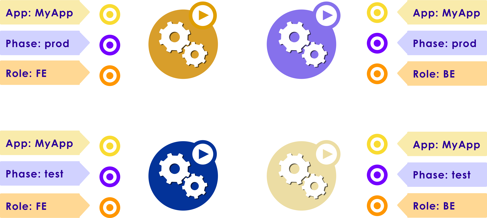
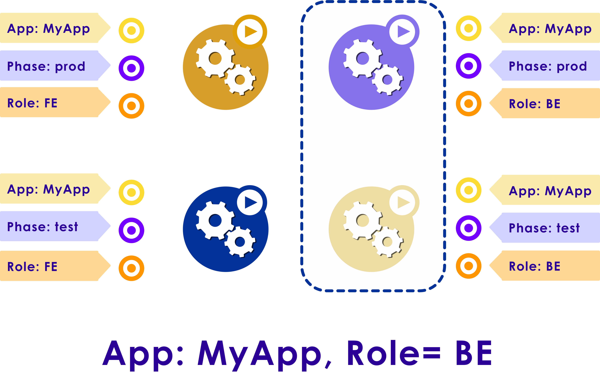
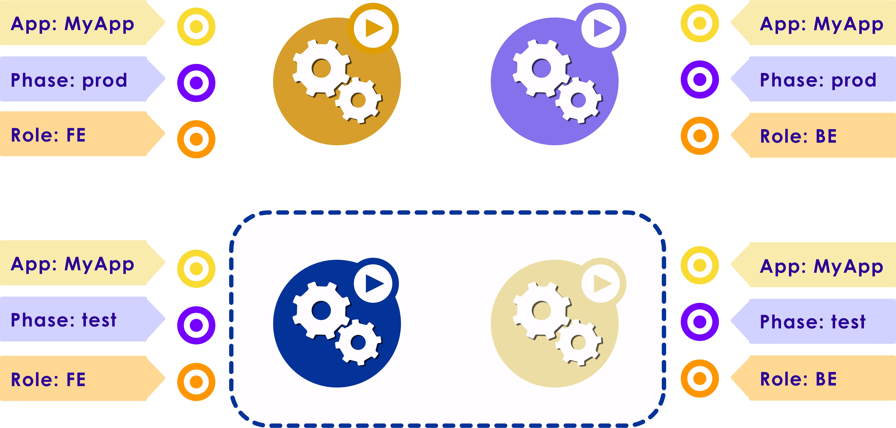

# Kubernetes Resources

---

# Labels and Selectors

---

## Labels

* Labels are Key/Value pairs associated with K8s objects

* As the name suggests, Labels are used to meaningfully specify identifying attributes of objects

* Used to organize and select subsets of objects

* Attached to objects at the time of creation but can be modified at any point in time

* Here are some label examples:
    - for nodes:
        - "disk" : "ssd", "regular", "hybrid"
    - for Pods
        - "tier" : "fronend", "backend"
        - "env" : "dev", "test", "release"


---

## Labels

* Though each object can have a set of Key/Value labels, each key must be unique for each object

* Objects can be queried from the API server by the label

* **Labels are the essential glue to associate one API object with another and are used to select a set of objects**
    - Pods -> Replication Controller
    - Pods -> Service
    - Node -> Pods

Notes:

Instructor Notes :

Participant Notes :

---

## Defining Labels

```yaml
apiVersion: apps/v1
kind: Deployment
metadata:
  name: nginx-v1
spec:
  selector:
    matchLabels:
      app: nginx
      version: "v1"
  replicas: 4
  template:
    metadata:
      labels:
        app: nginx
        version: "v1"
    spec:
      containers:
      - name: nginx
        image: sujee/nginx:1
        ports:
        - containerPort: 80
```

```bash
$   kubectl get deployments  -o wide 
```

```console
NAME       READY   UP-TO-DATE   AVAILABLE   AGE    CONTAINERS   IMAGES          SELECTOR
nginx-v1   4/4     4            4           160m   nginx        sujee/nginx:1   app=nginx,version=v1
```

---

## Defining Labels

```yaml
apiVersion: apps/v1
kind: Deployment
metadata:
  name: nginx-v1
spec:
  selector:
    matchLabels:
      app: nginx
      version: "v1"
  replicas: 4
  template:
    metadata:
      labels:
        app: nginx
        version: "v1"
    spec:
      containers:
      - name: nginx
        image: sujee/nginx:1
        ports:
        - containerPort: 80
```

```bash
$  kubectl get pods  --show-labels
```

```console
NAME                        READY   STATUS    RESTARTS   AGE    LABELS
nginx-v1-67dfdcf8b8-4q8n9   1/1     Running   0          162m   app=nginx,version=v1
nginx-v1-67dfdcf8b8-7vw5x   1/1     Running   0          162m   app=nginx,version=v1
nginx-v1-67dfdcf8b8-gm2pw   1/1     Running   0          162m   app=nginx,version=v1
nginx-v1-67dfdcf8b8-hbjm9   1/1     Running   0          162m   app=nginx,version=v1
```

---

## Assigning Pods to Nodes

* We can use labels to assign Pods to certain nodes

* Say we want to run our database Pods on nodes with SSD drives (for performance)

* First attach labels to nodes

```bash
# 'worker1' node has SSDs
$   kubectl  label nodes worker1  disk=ssd


# 'worker2' has regular disks
$   kubectl  label nodes worker2  disk=regular

$   kubectl get nodes --show-labels
```

```console
NAME      STATUS   ROLES    AGE   VERSION   LABELS
worker1   Ready    <none>   9h    v1.22.1   disk=ssd ...
worker2   Ready    <none>   9h    v1.22.1   disk=regular ...
```

---

## Assigning Pods to Nodes

* Now specify a **NodeSelector** to pod.yaml

```yaml
apiVersion: v1
kind: Pod
metadata:
  name: redis1
spec:
  containers:
  - name: redis
    image: redis
    imagePullPolicy: IfNotPresent
  nodeSelector:
    disk: ssd
```

* And create pods.  The pods will only be placed on **`worker1`** that is labeled as **`disk=ssd`**

```bash
# launch 2 redis instances
$   kubectl apply -f pod.yaml
$   kubectl apply -f pod.yaml

$   kubectol get pods -o wide
```

```console
NAME                        READY   STATUS    RESTARTS   AGE    IP                NODE      
redis1                      1/1     Running   0          77s    192.168.235.149   worker1   
redis2                      1/1     Running   0          52s    192.168.235.150   worker1  
```

---

## Labels Example

  * The example below has four pods and three labels

<!-- {"left" : 6.76, "top" : 0.88, "height" : 4.37, "width" : 3.28} -->


Notes:

---

## Query for Labels  

* You can query for labels that map to value of the entire app

<!-- {"left" : 6.76, "top" : 0.88, "height" : 4.37, "width" : 3.28} -->


Notes:

---

## Narrow Search

* You can either narrow your search with multiple labels - your app’s fronted


<!-- {"left" : 6.76, "top" : 0.88, "height" : 4.37, "width" : 3.28} -->


Notes:

---

## Query for only backend

* You can either narrow your search with multiple labels - your app’s backend


<!-- {"left" : 6.76, "top" : 0.88, "height" : 4.37, "width" : 3.28} -->


Notes:

---

## Query for Test Phase

* You can either narrow your search with multiple labels - your app’s test phase

<!-- {"left" : 6.76, "top" : 0.88, "height" : 4.37, "width" : 3.28} -->


Notes:

---

## Query for Production  

  * You can either narrow your search with multiple labels - your
app’s production release


<!-- {"left" : 6.76, "top" : 0.88, "height" : 4.37, "width" : 3.28} -->


Notes:

---

## Lab: Labels

<!-- {"left" : 6.76, "top" : 0.88, "height" : 4.37, "width" : 3.28} -->

* **Overview:**
  - Work with labels

* **Approximate run time:**
  - 20

* **Instructions:**
  - Please complete **LABELS-1** lab

Notes:

---

## Lab: Pod Placement

<!-- {"left" : 6.76, "top" : 0.88, "height" : 4.37, "width" : 3.28} -->

* **Overview:**
  - Place Pods on certain nodes using lables

* **Approximate run time:**
  - 20

* **Instructions:**
  - Please complete **LABELS-2** lab

Notes:

---

# Resource Limits

---

## Resource Requests and Limits

* **Requests** specify the minimum resource needed to run a Container
    - Here our Container is requesting 128Mi of memory
    - So K8s will schedule this Container only on nodes that can supply the requested amount of memory

* **Limits** put a ceiling on how much resource a Container can use
    - Here, our nginx Container is not allowed to use more than 256Mi of memory

* A Container may use more than it's request, but no more than the limit

```yaml
apiVersion: v1
kind: Pod
metadata:
  name: frontend
spec:
  containers:
  - name: webapp
    image: nginx
    resources:
      requests:
        memory: "128Mi"
      limits:
        memory: "256Mi"
```

---

## Resource Limits

* Resources can be CPU, memory or storage

* **CPU** spec
    - One cpu, in Kubernetes, is equivalent to 1 vCPU/Core for cloud providers and 1 hyperthread on bare-metal Intel processors.
    - CPUs are specified in **milli-cores**  (1 CPU = 1000 m)

* **Memory** spec
    - Specified in bytes
    - 100Mi - 100 Mebi bytes,  100MB - 100 Mega bytes
    - [See memory units](https://en.wikipedia.org/wiki/Units_of_information#Byte) 

---

## Specifying Resource Limits

* Here we are requesting a quarter of CPU (250 milli cores) and the limit it to half CPU (500 milli cores)

```yaml
apiVersion: v1
kind: Pod
metadata:
  name: frontend
spec:
  containers:
  - name: webapp
    image: nginx
    resources:
      requests:
        memory: "64Mi"
        cpu: "250m"
      limits:
        memory: "128Mi"
        cpu: "500m"
```

---

## Monitoring Resource Usage

* We can monitor Pods usage using metrics API

* We would need to install a [metrics-server](https://github.com/kubernetes-sigs/metrics-server)

* Use **`kubectl top`** command

```bash
# to monitor node utilzation
$   kubectl  top   node
```

```console
NAME       CPU(cores)   CPU%   MEMORY(bytes)   MEMORY%   
minikube   782m         4%     1009Mi          3%        
```

```bash
# monitor pod utilization
$   kubectl   top pod
```

```console
NAME                                CPU(cores)   MEMORY(bytes)   
nginx-deployment-7848d4b86f-2z84z   10m           12Mi            
nginx-deployment-7848d4b86f-4h85n   13m           12Mi            
nginx-deployment-7848d4b86f-798rn   14m           12Mi            
nginx-deployment-7848d4b86f-94zbm   11m           12Mi            

```

---

## Scheduling and Resource Allocation

* When we create a Pod, Kubernetes scheduler will select a Node to run the Pod on

* The Scheduler will ensure that sum of all resource requests from Containers is less than what the Node can provide

* If a Container exceeds its memory limit, it might be terminated. If it is restartable, the kubelet will restart it

* A Container might or might not be allowed to exceed its CPU limit for extended periods of time. However, it will not be killed for excessive CPU usage

---

## Lab: Resource Limits

<!-- {"left" : 6.76, "top" : 0.88, "height" : 4.37, "width" : 3.28} -->

* **Overview:**
  - Specify resource limits

* **Approximate run time:**
  - 20

* **Instructions:**
  - Please complete **RESOURCE-LIMIT-1** lab

Notes:

---

# Storage

---

## Volumes

* Kubernetes supports an extensive array of volume types

* **Ephemeral volumes** (temporary space)
    - They follow the Pod lifecycle, created and destroyed along with the Pod
    - **EmptyDir**,  **ConfigMap**

* **Persistent Volumes**
    - Durable volumes, that outlast Pod's life
    - Used for long term storage (i.e. database files ..etc)
    - Many provider:  AWS, AzureDisk, GCEDisk, CephFS, NFS

* [See full list here](https://kubernetes.io/docs/concepts/storage/volumes)

---

## Ephemeral Storage

* Pods can request a certain 'local storage'amount

* When Kubernetes is trying find a Node to place the Pod, it will only consider Nodes that can supply that storage

* Here we are requesting **2Gi** storage with a cap of **4Gi**

* [Storage Units reference](https://en.wikipedia.org/wiki/Byte#Multiple-byte_units)

```yaml
apiVersion: v1
kind: Pod
metadata:
  name: frontend
spec:
  containers:
  - name: app
    image: images.my-company.example/app:v4
    resources:
      requests:
        ephemeral-storage: "2Gi"
      limits:
        ephemeral-storage: "4Gi"
    volumeMounts:
    - name: ephemeral
      mountPath: "/tmp"
  volumes:
    - name: ephemeral
      emptyDir: {}
```

---

## Persistent Volumes (PV)

* **PVs** represent durable storage

* They can be created manually or created dynamically based on request (typical in the Cloud environments)

* Many storage providers are supported.  i.e.  AWS, AzureDisk, GCEDisk, CephFS, NFS

* After a Pod done using a volume, it can be either
    - Retain: Keep the data available for the next run
    - Delete: delete the volume
    - Recycle: Delete contents of the volume, and use it with another Pod

---

## Creating a PV

* Here is an example of creating a NFS volume

```yaml
apiVersion: v1
kind: PersistentVolume
metadata:
  name: nfs-vol1
spec:
  capacity:
    storage: 1Mi
  accessModes:
    - ReadWriteMany
  nfs:
    server: nfs-server.default.svc.cluster.local
    path: "/exports"
```

---

## Creating a PV in Google Cloud

* And here is how to create a persistent disk on Google Cloud

* Create a disk before using it

```bash
$   gcloud compute disks create --size=500GB --zone=us-central1-a my-data-disk
```

```yaml
apiVersion: v1
kind: Pod
metadata:
  name: test-pd
spec:
  containers:
  - image: k8s.gcr.io/test-webserver
    name: test-container
    volumeMounts:
    - mountPath: /test-pd
      name: test-volume
  volumes:
  - name: test-volume
    # This GCE PD must already exist.
    gcePersistentDisk:
      pdName: my-data-disk
      fsType: ext4
```

---

## Persistent Volume Claims (PVC)

* Think of PVs are resources in the cluster
    - "I have a 10G volume available"

* PVCs are requests for the resources
    - "I need a 2G disk space"

* Kubernetes will match the requests (PVCs) and resources (PVs)

* PVCs can also specify qualifiers
    - "I need 2GB of SSD storage"

---

## Example of  Creating and Using Persistent Volumes

* Step-1: Create a PV

* Step-2: Create a PVC

* Step-3: Use it

---

## Step-1&2: Creating a PV and PVC

```yaml
apiVersion: v1
kind: PersistentVolume
metadata:
  name: nginx-pv
  labels:
    type: local
spec:
  #storageClassName: manual
  #storageClassName: local-storage
  storageClassName: standard
  capacity:
    storage: 10Gi
  accessModes:
    - ReadWriteOnce
  hostPath:
    path: "/tmp/nginx-volume"
```

```yaml
apiVersion: v1
kind: PersistentVolumeClaim
metadata:
  name: nginx-pv-claim
spec:
  storageClassName: standard
  accessModes:
    - ReadWriteOnce
  resources:
    requests:
      storage: 3Gi
```

---

## Step-3: Using It

```yaml
apiVersion: v1
kind: Pod
metadata:
  name: nginx
spec:
  volumes:
    - name: nginx-pv-storage
      persistentVolumeClaim:
        claimName: nginx-pv-claim
  containers:
    - name: web1
      image: nginx
      ports:
        - containerPort: 80
          hostPort: 8080
          name: "http-server"
      volumeMounts:
        - mountPath: "/usr/share/nginx/html"
          name: nginx-pv-storage

  #nodeSelector:
  # - kubernetes.io/hostname: "ip-172-31-35-116"

```

---

## Lab: Volumes - EmptyDir

<!-- {"left" : 6.76, "top" : 0.88, "height" : 4.37, "width" : 3.28} -->

* **Overview:**
  - Use scratch space with pods

* **Approximate run time:**
  - 15 mins

* **Instructions:**
  - Please complete **VOLUME-1** lab

Notes:

---

## Lab: Volumes - Share a Persistent Volume

<!-- {"left" : 6.76, "top" : 0.88, "height" : 4.37, "width" : 3.28} -->

* **Overview:**
  - Use Persistent Volumes

* **Approximate run time:**
  - 20 mins

* **Instructions:**
  - Please complete **VOLUME-2** lab

Notes:

---

## Lab: Volumes - Use a Persistent Volume with Nginx

<!-- {"left" : 6.76, "top" : 0.88, "height" : 4.37, "width" : 3.28} -->

* **Overview:**
  - Use Persistent Volumes with nginx

* **Approximate run time:**
  - 20 mins

* **Instructions:**
  - Please complete **VOLUME-3** lab

Notes:

---

## Review and Q&A

<!-- {"left" : 8.56, "top" : 1.21, "height" : 1.15, "width" : 1.55} -->
<!-- {"left" : 6.53, "top" : 2.66, "height" : 2.52, "width" : 3.79} -->

* Let's go over what we have covered so far

* Any questions?
