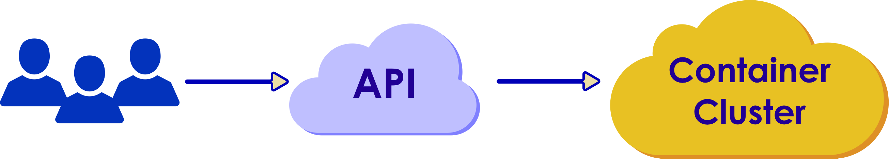

## User Perspective

  * User view

 <!-- {"left" : 0.28, "top" : 3.13, "height" : 1.75, "width" : 9.73} -->

Notes:

---

## Installing Kubernetes

* There are two types of "install" for kubernetes:
   - Developer Install (test / learning / dev)
   - Cluster Install (prod / dev / test)

* Developer install
    - Minikube
    - microk8s

---

## Minikube (for Developers)

* Minikube works very similarly to Docker Toolbox.

* Minikube can run on any platform that supports VirtualBox (Linux, Mac, Windows)

* Users install Oracle VirtualBox on their systems.
    - User CPU must support virtualization (VT-x, AMD-V)
    - Virtualization *must* be enabled in the BIOS. (Usually *not* by default)

* Minikube will install a VM in virtualbox and run it

* A CLI called `minikube` will allow users to interact with the VM

* References:
    - [https://minikube.sigs.k8s.io/docs/start/](https://minikube.sigs.k8s.io/docs/start/)

---

## Microk8s (for Developers)

* MicroK8s works on Linux machines **only**.
    - **NOT** BSD or other Unix-like OSs including Mac

* No need of a VM or virtualization

* It is installed as a snap for any machine that supports snaps

* Available Ubuntu repos,  installs in seconds!

* It runs the kubernetes daemons locally on the users' system

* References
    - [https://microk8s.io/](https://microk8s.io/)

Notes:

Instructor Notes :

Participant Notes :

The basic properties of containers is that they deliver of promises made above. 

They can run on top of any Linux – because they re-use the Linux kernel functionality.
And, because they build their own environment, they can be moved to another OS.
Finally, built into the container architecture is their ability to work well together.

---

## Container Based Architecture

  * Container-based architecture is characterized by the following:

    - Containers are organized on the networking level
    - Container image is a package of software that is stand alone and lightweight
    - Container image is a package of software that is stand alone and lightweight
    - For each application, containers provide their functionality the over design
    - As a result, container-based solutions can be easily moved between different environments

Notes:

Instructor Notes :

Participant Notes :

Applications are typically made up of individually containerized components (often called microservices) that must be organized at the networking level in order for the application to run as intended. 

A container image is a lightweight, stand-alone, executable package of a piece of software that includes everything needed to run it: code, runtime, system tools, system libraries, settings. 

Containers are a solution to the problem of how to get software to run reliably when moved from one computing environment to another. 
This could be from a developer's laptop to a test environment, from a staging environment into production, and perhaps from a physical machine in a data center to a virtual machine in a private or public cloud.

---

## What is Docker?

  * Docker is a management tool that allows you to wrap all the necessary parts of an application into containers.
  * **Increased Portability:** Deploy across multiple platforms allows Docker to be run almost anywhere.
  * **Faster Startup Speeds:** Docker allows us to easily start and stop the correct containers for each client in seconds.
  * **Higher Security:** All Docker containers are run as isolated environments, each with its own process space and network space.
  * **Smart & Efficient Debugging:** Docker lets developers troubleshoot production environment bugs locally.

Notes:

Instructor Notes :

Participant Notes :

Increased Portability:  
The ability to add to the container and then deploy across multiple platforms allows Docker to be run almost anywhere. This is important because it lets developers write code on a local development environment, test it locally and then push to production without having to worry about things not working. All environments are exactly the same; you won’t hear the phrase "It worked on my local environment!" ever again.

Faster Startup Speeds:  
We try to have all our clients running on the same environment, but with so many hosting solutions and CMS systems being used, this just isn’t a feasible or scalable solution. For our developers, switching between client production environments used to mean wasting time waiting for virtual machines to get up and running. Not anymore. Docker allows us to easily start and stop the correct containers for each client in seconds. Getting our local environments up and running quickly means we can get to work fixing issues right away.

Higher Security  
All Docker containers are run as isolated environments, each with its own process space and network space. This allows the Docker container to run only the applications you really need, cutting down on security patches and updates while eliminating unnecessary risk. Additionally, because the software is open source, many developers have contributed wonderful security tools for scanning and securing containers. Docker lowers your maintenance needs, raises site security, and puts a ton of tools at your fingertips.

Smart & Efficient Debugging  
Another great development feature: Docker lets developers troubleshoot production environment bugs locally. When things aren’t working correctly on a client’s site, we often have to enable many different debugging features to pinpoint the problem. These features, while effective, can slow down the site, which of course directly impacts conversions. With Docker, we can easily fire up our local environment, replicate the issue and debug locally before pushing a fix to the live site. Keeping diagnostic processes off the live production environment lets your site stay lean, light, and lightning fast.

---

## Virtual Machine vs. Docker

  * Virtual Machine
    - Contains App (Megabytes)
    - On a guest OS (Gigabytes)
    - Heavyweight
    - Hard to Maintain

  * Docker
    - Just app
    - Plus Dependencies
    - Shared Kernel
    - Portable
    - Efficient

 <!-- {"left" : 6.00, "top" : 1.00, "height" : 5.55, "width" : 2.98} -->

Notes:

Instructor Notes :

Each virtualized application includes not only the application-which may be only 10s of MB – and the necessary binaries and libraries, but also an entire guest operating system- which may weigh 10s of GB.

The Docker Engine container comprises just the application and its dependencies. It runs as an isolated process in userspace on the host operating system, sharing the kernel with other containers. Thus, it enjoys the resource isolation and allocation benefits of VMs but is much more portable and efficient

Participant Notes :

How do Docker container compare to virtual machines? Docker is lightweight. It allows isolation from the surrounding environment but not the total isolation. Since it re-uses some of the underlying Linux implementations, it does not have to re-implement them. This makes it fast.

---

## How Does Docker Work?

 <!-- {"left" : 0.59, "top" : 1.57, "height" : 4.88, "width" : 9.16} -->

Notes:

Instructor Notes :

Participant Notes :

This diagram explains the basic Docker architecture. Images are stored in repositories and are used for building container. Every time you change something in a container, you are adding on top of the container.

This is implemented with Docker Daemon. It is a server responsible for all actions related to containers. This Daemon gets its commands from the Docker client, either with CLI or REST API.

---

## Advantages of Docker

  * An easy and lightweight way to create dedicated containers.
  * Docker containers are lightweight by design and ideal for enabling microservices application development.
  * Continuous integration and development.
  * Cloud migration, multi-cloud or hybrid cloud infrastructure require frictionless portability of applications.
  * The first step with Docker is to modernize the existing application portfolio.

Notes:

Instructor Notes :

Participant Notes :

Docker containers are lightweight by design and ideal for enabling microservices application development. 
Accelerate development, deployment and rollback of tens or hundreds of containers composed as a single application. 

Integrate modern methodologies and automate development pipelines with the integration of Docker and DevOps.

Cloud migration, multi-cloud or hybrid cloud infrastructure require frictionless portability of applications. Docker packages applications and their dependencies together into an isolated container making them portable to any infrastructure. Eliminate the "works on my machine" problem once and for all. Docker certified infrastructure ensures the containerized applications work consistently.

The first step with Docker is to modernize the existing application portfolio. Packaging existing apps into containers immediately improves security, reduce costs, and gain cloud portability.

---

## What Has Docker Done For Us?

* Continuous delivery

* Improved Security

* Run anything, anywhere

* Reproducibility

 <!-- {"left" : 6.32, "top" : 1.89, "height" : 4.74, "width" : 3.76} -->

Notes:

Instructor Notes :

Participant Notes :

Before Docker, Virtual Machines were used to provide reliable environment for applications.
VMWare is a vendor for virtualized containers.

How ever Virtual Machines (VM) were heavy weight and clunky.
They had lot of overhead in running and creating them was usually a manual process that is error prone.

Docker provides a light weight container that provides a reliable environment to run application.

---

# Container Orchestration

## Container Orchestration

  * Container orchestration as doing the same job for the data center.
  * Container orchestration is the big fight of the moment.
  * By definition, container orchestration is that portion of the management software that brings all of the containers together.
  * A single container cannot work without the others.
  * In the data center, containers service to automate the complete operation
  * Container orchestration is not easy.

Notes:

Instructor Notes :

Participant Notes :

As we mentioned above, it is easy to explain what the container orchestration does, and there are tools for that. But it is the same as project management. Although the tools for project management are not lacking, a good project manager is the person who brings the project together. The same goes for a container-based application.

---

## User Perspective of Kubernetes Cluster

* Users interact with K8s cluster via APIs

<!-- {"left" : 0.28, "top" : 3.13, "height" : 1.75, "width" : 9.73} -->

Notes:

---

## Pod vs. Container

 <!-- {"left" : 0.45, "top" : 1.23, "height" : 4.83, "width" : 9.32} -->

Notes:

Instructor Notes :

Participant Notes :

Pod: In this Yaml file a group of one or more container is declared, so we call it a Pod. In containers in a Pod are deployed together, and are started, stopped, and replicated as a group.

Container: Docker and Kubernetes pods both are configuration files(Yaml) that define container instances from images. Docker by itself is just a file that has the capacity to contain services(containers) for communication, it is inherently non distributed.

---

## General Configuration Cont.

  * Group related objects into a single file wherever possible, which makes it easy to manage
  * Note  that many kubectl commands can be called on a directory.
  * Avoid specifying default values - simple, minimal configuration make it less error prone.
  * Put object descriptions in annotations, to allow better introspection.
  * Avoid naked Pods - Naked Pods will not be rescheduled when node fails.

Notes:

Instructor Notes :

Participant Notes :

Group related objects into a single file whenever it makes sense. One file is often easier to manage than several. 

Many kubectl commands can be called on a directory.

Default values should not be specified unnecessarily to minimize the errors during configuration.

Put object descriptions in annotations, to allow better introspection.

---

## Lab: Hello Node Kubernetes

  * **Overview:** In this lab we will create the first Node in Kubernetes. The goal of this hands-on lab is for you to turn code that you have developed into a replicated application running on Kubernetes

  * **What you'll do**
    - Create a Node.js server
    - Create a Docker container image
    - Create a container cluster
    - Create a Kubernetes pod
    - Scale up your services

Notes:

---

## Lab: Hello Node Kubernetes

  * **Approximate time:**

    - 20-30 minutes

* **Link to the lab**

    - https://www.qwiklabs.com/focuses/564?parent=catalog

Notes:

---
## Services

<!-- {"left" : 6.76, "top" : 0.88, "height" : 4.37, "width" : 3.28} -->

  * An abstraction to define a logical set of Pods that are bound by policy to access them.
  * Internal and external endpoints are used to expose the services.
  * Services manipulate iptables by interfacing with the kube-proxy.
  * Services Support TCP and UDP.
  * Services can be exposed internally through ClusterIP (default) or outside through NodePort by specifying a type in ServiceSpec.
  * Services are exposed through virtual-IP-based bridge, which redirects to the backend Pods.

---

## Deployment Example

  * Let’s create a simple Deployment.

 <!-- {"left" : 0.77, "top" : 1.78, "height" : 4.62, "width" : 5.66} -->

Notes:

Instructor Notes :

Participant Notes :

Deployment, nginx-deployment is created and is indicated by the .metadata.name field.
Three replicated pods are created by the deployment as mentioned in the replicas field
Deployment manages the pods based on the selector field definition.
Sophisticated selection rules can be created subject to pod template satisfying the rule.
.template.spec field or Pod template’s specification indicates that the Pods run one container, nginx, which runs the nginx Docker Hub image at version 1.7.9.
The Deployment opens port 80 for use by the Pods.

The template field contains the following instructions:
- Pods are labeled app: nginx
- Create one container with name nginx.
- Run the nginx image at version 1.7.9.
- Open port 80 for the container to send and accept traffic.

---

## Uploading YAML File  

  * Upload the YAML file to master, and the scheduler decides where to run the pods

simple Deployment.

 <!-- {"left" : 0.99, "top" : 2.67, "height" : 3.15, "width" : 8.27} -->

Notes:

---

## Lab 2: Managing deployments with Kubernetes

  * **Overview:**
    - This lab will provide practice in scaling and managing containers so you can accomplish these common scenarios where multiple heterogeneous deployments are being used.

  * **What you'll do**
    - Practice with kubectl tool
    - Create deployment yaml files
    - Launch, update, and scale deployments
    - Practice with updating deployments and deployment styles

Notes:

---

## Lab 2: Managing deployments with Kubernetes

  * **Approximate time:**
    - 20-30 minutes

  * **Link to the lab**
    - https://www.qwiklabs.com/focuses/639?parent=catalog