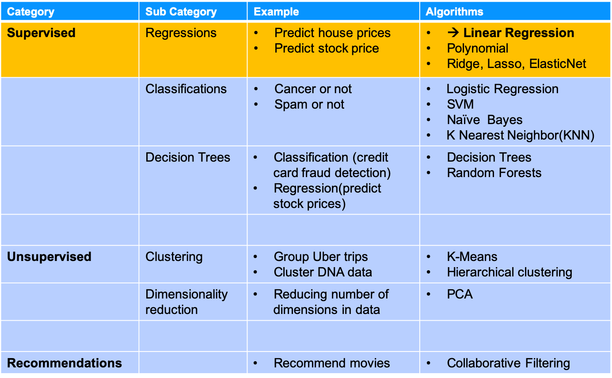
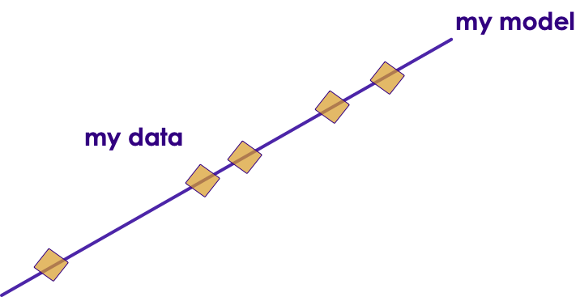
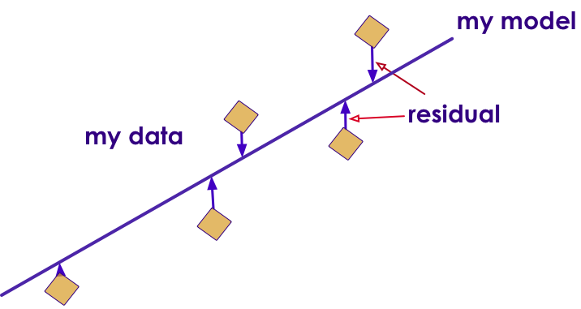
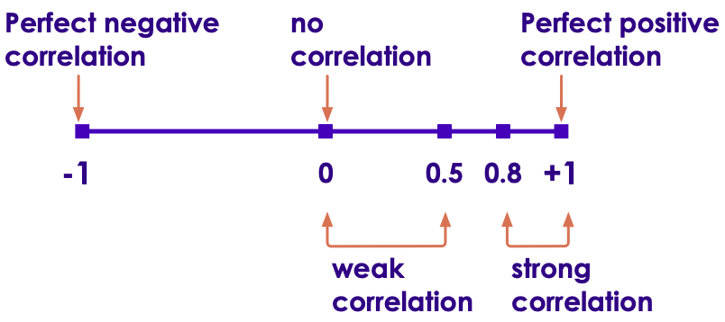

# Linear Regression

---

## Algorithm Summary

<!-- {"left" : 1.92, "top" : 2.3, "height" : 9.12, "width" : 13.66} -->

Notes:

http://machinelearningmastery.com/supervised-and-unsupervised-machine-learning-algorithms/--

---

## Task: Tip Calculation

 * Now our tip data include total bill amount too!

 * Do you see any correlation?

<!-- {"left" : 2.35, "top" : 4, "height" : 6.59, "width" : 12.79} -->

Notes:

---

## Tips vs Bill

 * There is clearly a correlation between bill amount and tip

 * We can fit a line to predict tip

 * This is **linear regression!**

<!-- {"left" : 4.67, "top" : 4.54, "height" : 6.16, "width" : 8.16} -->

Notes:

---

## Graph Review!

<!-- {"left" : 10.57, "top" : 1.89, "height" : 6.13, "width" : 6.41} -->

*  **Y = aX + b**

 * Y = 2X + 4

 * 2 - slope of line

 * 4 - intercept

|   |                                   |
|---|-----------------------------------|
| Y | Dependent variable (depends on X) |
| X | Independent variable              |
| a | Slope of line                     |
| b | Intercept (line meets y-axis)     |

<!-- {"left" : 0.82, "top" : 5.43, "height" : 2.56, "width" : 9.37} -->

Notes:

---

## Linear Regression Vocabulary

* **Y = aX + b   &nbsp;&nbsp;&nbsp;&nbsp;&nbsp;&nbsp; Y = b0 + b1X**

| Term                   | Description                                                                   | Synonyms                                         |
|------------------------|-------------------------------------------------------------------------------|--------------------------------------------------|
| **Independent Variable**   | The variable used to predict the response.                                    | -X-variable  - Feature  - attribute                  |
| **Response**               | The variable we are trying to predict.                                        | -Y-variable  - Dependent variable  - Target  - Outcome |
| **Intercept**              | The intercept of the regression line - that is, the predicted value when X= 0 | - b , b0 , β0                                     |
| **Regression coefficient** | The slope of the regression line.                                             | - Slope  - parameter estimates  - Weights  - a , b1     |

<!-- {"left" : 0.45, "top" : 2.6, "height" : 1, "width" : 16.61} -->

Notes:

---

## Using Linear Regression for Tips

<!-- {"left" : 9.85, "top" : 2.45, "height" : 5.56, "width" : 7.34} -->

 * Linear regression model closely resembles algebra model

 __`Y = a X + b`__

 __`Tip = a * bill + b`__

 * If we figure out 'a' and 'b', then we can estimate tip for any amount

Notes:

---

## Calculating Linear Regression Model

<!-- {"left" : 9.7, "top" : 2.16, "height" : 5.13, "width" : 7.43} -->

 * Here is the linear regression model coefficients for billing data

    **`Tip = a * bill + b`**

	a = 0.242

	b = -1.40000

    **`Tip = 0.2428571 * bill - 1.40`**

 Seems like a reasonably good fit

Notes:

---

## Predicting Tips with Linear Model

<!-- {"left" : 12.7, "top" : 1.89, "height" : 6.7, "width" : 4.47} -->

* __`Tip = 0.2428571 * bill - 1.40`__  
    (`Tip = a * bill + b`)

* We can use this formula to predict tips.

* Tip for $100 bill   
    = `0.2428571` * 100 - `1.40`  
    = `$ 22.88`

* In table to the right, observe 2 columns
    - __Actual Tip:__ This column is the actual tip we recorded
    - __Estimated Tip:__ This the amount our model (formula) is predicting

* __Question for the Class:__ Are the amounts identical?

Notes:

---

## Evaluating Our Model Accuracy

<!-- {"left" : 12.49, "top" : 2.14, "height" : 7.03, "width" : 4.69} -->

- As we can see our model is not predicting the tips 100% accurately

- There is an error for each prediction

- We need to calculate the errors, so we can tune our model to be as close to the real value as is.

Notes:

---

# Errors and Residuals

[ML-Concepts-Errors-and-Loss-Functions.md#Error/Loss Functions for Regressions](ML-Concepts-Errors-and-Loss-Functions.md#Error/Loss Functions for Regressions)

---

## Understanding Residuals

* On left, the linear model line passes through all data points.  
This is called **perfect fit**  

* How ever, in reality,  data doesn't fall exactly on line

* There is usually a 'delta' or 'error' between actual value and predicted value  
This is called **residual**

<!-- {"left" : 1.75, "top" : 5.97, "height" : 3.26, "width" : 6.36} -->
&nbsp; <!-- {"left" : 5.48, "top" : 5.97, "height" : 3.26, "width" : 6.27} -->
&nbsp; <!-- {"left" : 9.63, "top" : 5.97, "height" : 3.26, "width" : 6.12} -->

---

## Calculating Linear Regression Model

<!-- {"left" : 10.63, "top" : 1.89, "height" : 5.9, "width" : 6.56} -->

 * Here is the linear regression model equation

    **`Tip = a * bill + b`**

* We need to find optimal values of **a** and **b** that gives the lowest **SSE** possible

* We can randomly test values for `a` and `b`
    - but infinite combinations
    - we need something more efficient
    - **Gradient Descent** to rescue

---

## Gradient Descent

 * Gradient Descent is a popular optimization algorithm

 * It tweaks the values of parameters ( **coefficients** ) of  **target function** (f) that  **minimizes cost function**

 * Basic idea:
     - Start with initial values of coefficients (zero or random value)
     -  **cost = evaluate (f(coefficients)**
     - Calculate 'derivative' (think calculus) to determinethe 'slope' or 'direction'
     - Update coefficients in the right'direction' and calculate cost again
        *  **'learning rate parameter' (alpha)** determines how much coefficients can change
     - Iterate  until you find minimum

 * Algorithm will converge after multiple iterations

---

# Gradient Descent

[Gradient-Descent.md](Gradient-Descent.md)

---

## Evaluating Regression Models

<!-- {"left" : 11.36, "top" : 2.14, "height" : 1.79, "width" : 5.13} -->

<!-- {"left" : 11.36, "top" : 5.15, "height" : 1.11, "width" : 5.13} -->

* Simple measures
     - Residual Sum of Squares( **RSS** ) / Sum of the Squared Errors ( **SSE** ) / Sum of Squared Residuals ( **SSR** )
     -  **RMSE**  - Root Mean Square Error
     - correlation coefficient  ( r )
     - coefficient of determination  (r2)

* More advanced
     - t-statistic
     - p-value

Notes:

---

## Evaluating Linear Regression: Correlation Coefficient ( r )

 * r value is between -1 and +1

 * A correlation |r| >= 0.8 is considered  **`strong`**

 * A correlation |r| < 0.5  is considered  **`weak`**

 *  **r =**  **0.9522154 -** pretty strong correlation

<!-- {"left" : 3.15, "top" : 5.63, "height" : 4.99, "width" : 11.19} -->

Notes:

---

## Evaluating Linear Regression Model: Coefficient of Determination

 *  **'Coefficient of Determination** ' tells us how well our model 'fits' the data

 * Coefficient of Determination = (Correlation Coefficient)2

 * 0 <= r2 <= 1

* r2 = 1: perfet fit  
Regression line passes through all data points

---

## Evaluating Linear Regression Model: Coefficient of Determination

 * In our model  
    **r2 = 0.9067141 = 90.67%**   
    That is a pretty good fit !

 * Represents the percent of the data that is the closest to the line of best fit

     - So in our case: 90.67% of total variation in Y (tips) can be explained by linear relation between Y (tip) and X (bill)

     - The rest is 'unexplained' by the model

Notes:

https://en.wikipedia.org/wiki/Coefficient_of_determination

---

## Preparing Data for Linear Regression

<!-- {"left" : 2.17, "top" : 2.73, "height" : 8.24, "width" : 13.16} -->

Notes:

---

## Preparing Data For Linear Regressions

 *  **Linear Assumption:**

    Linear Regression assumes linear relationship between input and output.May be need to transform data (e.g. log transform) to make the relationship linear

 *  **Remove Noise:**

    Remove outlier data

---
## Preparing Data For Linear Regressions

 *  **Remove Collinearity:**

    - Linear regression will over-fit your data when you have highly correlated input variables

 *  **Gaussian Distributions:**

    - Linear regression will make more reliable predictions if your input and output variables have a Gaussian distribution. Transform data (e.g. logarithmic) make their distribGution more Gaussian looking for better results

Notes:

---

## Doing Linear Regression

* Next section will show an example on how to do linear regression
