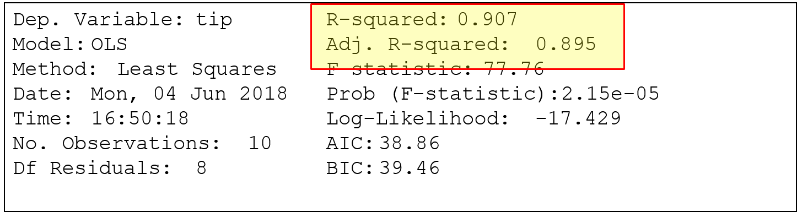
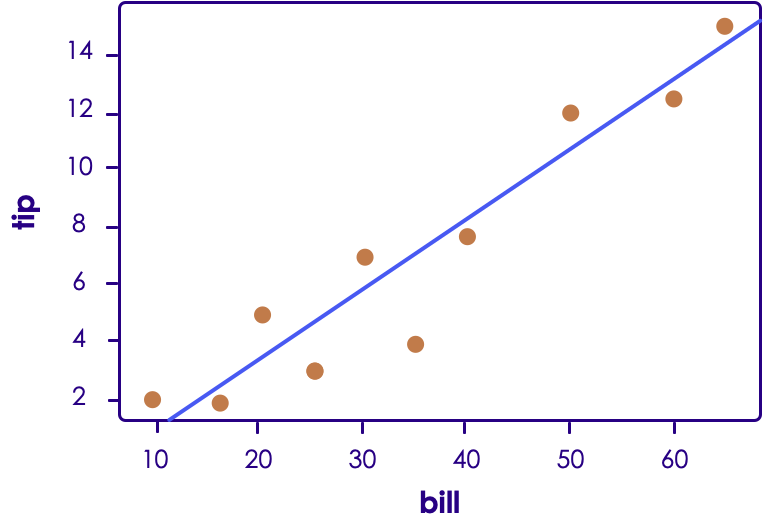

# Supervised Learning in Python

---

## Lesson Objectives


Notes:


---

# Linear Regression

---

## Linear Regression Background


 * Reference: ML-03__Supervised.pptx

Notes:


---

## Tip Calculation Using Linear Regression


 * We will use Linear Regression to predict tips

<!-- {"left" : 2.44, "top" : 3.69, "height" : 6.32, "width" : 12.63} -->


Notes:


---

## Linear Regression in SciPy


 * SciPy has a simple linear regression

```text
gradient,intercept,r_value,p_value,std_err = stats.linregress**  **(X array, Y array)

X array: numpy array with X variable

Y array: numpy array with Y Varibale
```
<!-- {"left" : 0.85, "top" : 3.01, "height" : 1.84, "width" : 15.72} -->

```text
# sample usage:
tip_data = pd.DataFrame({
            'bill' : [50.00, 30.00, 60.00, 40.00, 65.00, 20.00, 10.00, 15.00, 25.00, 35.00],
            'tip' : [12.00, 7.00, 13.00, 8.00, 15.00, 5.00, 2.00, 2.00, 3.00, 4.00]
         })

# calculate linear model
from scipy import stats
gradient,intercept,r_value,p_value,std_err=stats.linregress(X array, Y array)
```
<!-- {"left" : 0.85, "top" : 5.31, "height" : 2.84, "width" : 15.72} -->

Notes:


---

## Understanding stats.linregress Output


 * Scipy passes a tuple of the following:

     - Gradient (slope/coefficient)

     - Intercept (Y Intercept)

     - R<sup>2</sup> value (r-squared)

        * determines how well the model fits data

        * 0 <= r<sup>2</sup> <= 1  ,  close to 1 meaning strong fit

        * Here 0.9067 or  **90.67** % of 'tip' can be explained by 'bill amount'

     - P-value (p-value)

        *  **Pr(>|t|)** should be very small, in our case it is very close to zero

Notes:


---

## Understanding stats.linregress output


```text
Gradient and intercept 0.242857142857 -1.4
R-squared 0.906714076553
p-value 2.15282168529e-05
```
<!-- {"left" : 0.85, "top" : 2.56, "height" : 1.76, "width" : 11.89} -->

Notes:

http://feliperego.github.io/blog/2015/10/23/Interpreting-Model-Output-In-R


---

## Linear Regression in statsmodels.ols


 * Statsmodels package has linear regression

 * Use statsmodels.ols

```text
result = sm.ols(formula="tip ~ bill", data=tip_data).fit()
result.summary()

Formula : usually in   'Y  ~ X'  format
X array: numpy array with X variable
Y array: numpy array with Y Varibale

```
<!-- {"left" : 0.85, "top" : 3.66, "height" : 2.6, "width" : 14.54} -->

```text
# sample usage:
tip_data = pd.DataFrame({'bill' : [50.00, 30.00, 60.00, 40.00, 65.00, 20.00, 10.00, 15.00, 25.00, 35.00],
                        'tip' : [12.00, 7.00, 13.00, 8.00, 15.00, 5.00, 2.00, 2.00, 3.00, 4.00]})
# calculate linear model
from scipy import stats
gradient,intercept,r_value,p_value,std_err=stats.linregress(X array, Y array)

```
<!-- {"left" : 0.85, "top" : 6.62, "height" : 1.62, "width" : 14.54} -->

Notes:


---

## Understanding the Summary

```text
> result.summary()
OLS Regression Results
Dep. Variable:	tip				R-squared:	0.907
Model:	OLS								Adj. R-squared:	0.895
Method:	Least Squares		F-statistic:	77.76
Date:	Mon, 04 Jun 2018		Prob (F-statistic):	2.15e-05
Time:	16:50:18						Log-Likelihood:	-17.429
No. Observations:	10			AIC:	38.86
Df Residuals:	8					BIC:	39.46
Df Model:	1		
Covariance Type:	nonrobust		
						Coef			std err		t			P>|t|	[0.025		0.975]
Intercept		-1.4000	1.081		-1.295		0.231	-3.892	1.092
Bill					0.2429		0.028		8.818		0.000	0.179	0.306

Omnibus:	3.785	Durbin-Watson:	0.487
Prob(Omnibus):	0.151			Jarque-Bera (JB):	1.654
Skew:	-0.996							Prob(JB):	0.437
Kurtosis:	3.036					Cond. No.	86.8

```
<!-- {"left" : 0.85, "top" : 2.46, "height" : 5.99, "width" : 16.25} -->


Notes:

http://feliperego.github.io/blog/2015/10/23/Interpreting-Model-Output-In-R


---

## Understanding Summary


<!-- {"left" : 2.9, "top" : 2.42, "height" : 7.54, "width" : 11.7} -->


Notes:


---

## Understanding Statsmodel output

<!-- {"left" : 2.91, "top" : 2.2, "height" : 4.65, "width" : 11.68} -->

 * Residuals: Difference between 'actual' and 'predicted'

 * Ideally should fit 'standard distribution'-> mean value is zero.

    Not the case here (close enough)


Notes:


---

## Understanding Statsmodel output


<!-- {"left" : 3.18, "top" : 2.15, "height" : 3.04, "width" : 11.15} -->


 * Coefficients

     - Slope of line: bill: **0.2429**

     - Intercept: where line meets Y-axis: **-1.4** (below zero line (X axis))


Notes:


---

## Understanding Statsmodel Output

<!-- {"left" : 2.76, "top" : 2.33, "height" : 3.2, "width" : 11.98} -->


 *  **Pr**  **(>|t|)** should be very small, in our case it is very close to zero


Notes:

http://feliperego.github.io/blog/2015/10/23/Interpreting-Model-Output-In-R


---

## Understanding Statsmodel output

 *  **Coefficient of Determination (r**  **2**  **)** determines how well the model fits data

 * 0 <= r<sup>2</sup> <= 1  ,  close to 1 meaning strong fit

 * Here 0.9067 or  **90.67** % of 'tip' can be explained by 'bill amount'

     - Very strong predictor!

 * (**Adjusted r<sup>2</sup>**   corrects  **r<sup>2</sup>**  for number of variables considered)

<!-- {"left" : 1.82, "top" : 6.6, "height" : 3.69, "width" : 13.85} -->


Notes:

http://feliperego.github.io/blog/2015/10/23/Interpreting-Model-Output-In-R


---

## Plotting Regression


```text
tip_data = pd.DataFrame({'bill' : [50.00, 30.00, 60.00, 40.00, 65.00, 20.00, 10.00, 15.00, 25.00, 35.00],
                        'tip' : [12.00, 7.00, 13.00, 8.00, 15.00, 5.00, 2.00, 2.00, 3.00, 4.00]})
ax = plt.scatter(tip_data.bill, tip_data.tip)
result = sm.ols(formula="tip ~ bill", data=tip_data).fit()
abline_plot(model_results=result, ax=ax)

```
<!-- {"left" : 0.85, "top" : 2.4, "height" : 1.42, "width" : 16.17} -->

<!-- {"left" : 4.37, "top" : 5.15, "height" : 6.04, "width" : 8.75} -->


Notes:


---

## Calculating Coefficients


<br/>
<br/>

```text
# formula : tip = a * bill + b
tip_data = pd.DataFrame({'bill' : [50.00, 30.00, 60.00, 40.00, 65.00, 20.00, 10.00, 15.00, 25.00, 35.00],
                        'tip' : [12.00, 7.00, 13.00, 8.00, 15.00, 5.00, 2.00, 2.00, 3.00, 4.00]})
result = sm.ols(formula="tip ~ bill", data=tip_data).fit()

a = result.params[1]  # 0.2428571
b = result.params[0] #  -1.4

# for a $100 bill what is the tip?
tip.for.100 = a * 100 + b   
# 22.88571
```
<!-- {"left" : 0.85, "top" : 2.11, "height" : 3.08, "width" : 16.17} -->


  * Once we figure the  **coefficients a & b** , we can predict tip amount for any bill amount


Notes:


---

## Predicting Tips


 * predict ( regression_model,   new_data)

```text
# formula : tip = a * bill + b
tip_data = pd.DataFrame({'bill' : [50.00, 30.00, 60.00, 40.00, 65.00, 20.00, 10.00, 15.00, 25.00, 35.00],
                        'tip' : [12.00, 7.00, 13.00, 8.00, 15.00, 5.00, 2.00, 2.00, 3.00, 4.00]})
result = sm.ols(formula="tip ~ bill", data=tip_data).fit()
test_data_pd = pd.DataFrame({'bill' : [45., 55., 65.,]
             })
test_data_pd['predicted_tip'] = result.predict(test_data_pd)


# results

	bill		predicted_tip
0	45.0		9.528571
1	55.0		11.957143
2	65.0		14.385714

```
<!-- {"left" : 0.85, "top" : 2.86, "height" : 4.06, "width" : 15.95} -->

Notes:


---

## Linear Regression Sample Code in Python


```text
# tip = a * amount + b
tip_data = pd.DataFrame({'bill' : [50.00, 30.00, 60.00, 40.00, 65.00, 20.00, 10.00, 15.00, 25.00, 35.00],
                        'tip' : [12.00, 7.00, 13.00, 8.00, 15.00, 5.00, 2.00, 2.00, 3.00, 4.00]})

result = sm.ols(formula="tip ~ bill", data=tip_data).fit()

# plot
ax = plt.scatter(tip_data.bill, tip_data.tip)
abline_plot(model_results=result, ax=ax)


# determine coefficients
result.summary()
a = coefficients(tip.lm)[[2]]  # 0.2428571
b = coefficients(tip.lm)[[1]]  #  -1.4

# correlation.coefficient (r)
from scipy.stats.stats import pearsonr   
print(pearsonr(tip_data.bill, tip_data.tip)[0])  # 0.952

# coefficient.of.determination (r^2)
rsquared = summary(tip.lm)$r.squared   # 0.9067141

# for a $100 bill what is the tip?
Tip_for_100 = a * 100 + b   # 22.88571

# calculate estimated tip using regression
tip_data['est_tip'] = tip_data.bill * a + b
test_data_pd = pd.DataFrame({'bill' : [45., 55., 65.,] })
test_data_pd['predicted_tip'] = result.predict(test_data_pd)
```
<!-- {"left" : 0.85, "top" : 2.44, "height" : 7.85, "width" : 15.96} -->

Notes:


---

## Linear Regression in Scikit-learn


 * Scikit-learn allows us to integrate with other ML models

```text
From sklearn.linear_model import LinearRegression

tip_data = pd.DataFrame({'bill' : [50.00, 30.00, 60.00, 40.00, 65.00, 20.00, 10.00, 15.00, 25.00, 35.00],
                        'tip' : [12.00, 7.00, 13.00, 8.00, 15.00, 5.00, 2.00, 2.00, 3.00, 4.00]})
model = LinearRegression(tip_data.bill, tip_data.tip).fit()
test_data_pd['predicted_tip'] = model.predict(test_data_pd)


# results

	bill		predicted_tip
0	45.0		9.528571
1	55.0		11.957143
2	65.0		14.385714

```
<!-- {"left" : 0.85, "top" : 2.88, "height" : 3.79, "width" : 15.84} -->

Notes:


---

## Lab: LIR-1: Demo


  *  **Overview:**
     - Predicting tips using Linear Regression.

  *  **Instructor will demo this lab**

  *  **Run time:**
     - 10-15 mins


Notes:


---

## Lab: LIR-2: Pollution Estimate


  *  **Overview:**
      - Predicting pollution level using Linear Regression.

  *  **Run time:**
     - 10-15 mins

Notes:


---

## [Optional] Lab: LIR-3: Building Height


  *  **Overview:**
     - Predicting building height using Linear Regression.

  *  **Run time:**
     - 10-15 mins


Notes:


---

## [Optional  /Bonus] Lab: LIR-4: Tips


 *  **Overview:**
     - Predicting using some real world tips data (reshape2 package)

 *  **Run time:**
     - 10-15 mins

 *  **Answer these questions:**

      - Estimate relationship between  *'bill amount'* and *'tip'*

      - How about *'party-size'*  and *'tip'*

      - Which attribute (*'bill-amount'*  or *'party-size'* ) is a better indicator of tip  (Use  *'coefficient of determination'*)

Notes:


---

## Linear Regression in Python - Wrap Up


 * Linear Regression is very well supported in Python

 * Very easy to use (one liner) !

 * Basic coefficients are easy to calculate

     - Slope

     - Intercept

     - r / r<sup>2</sup>

 * Use 'predict' to estimate new tips

Notes:


---

# Logistic Regression

---

## Logistic Regression in Statsmodel


 * Statsmodel has a Logit function for calculating logistic regression

 * Logit API is    

    sm.Logit(X, Y)

| Family           | Variance         | Link                   |
|------------------|------------------|------------------------|
| binomial         | binomia          | Logit, probit, cloglog |
| gaussian         | gaussian         | indentity              |
| gamma            | gamma            | inverse, identity, log |
| possion          | possion          | log, identity, sqrt    |
| inverse.gaussian | inverse.gaussian | 1/mu^2                 |
| quasi            | user-defined     | user-defined           |

<!-- {"left" : 0.69, "top" : 4.44, "height" : 1, "width" : 16.11} -->

Notes:

* http://www.statmethods.net/advstats/glm.html
* http://data.princeton.edu/R/glms.html


---

## Logisitic Regression in Scikit-learn


 * Statsmodel gives us a good idea about variable fit

 * We may want to use scikit-learn to have a deployable model.

Notes:


---

## Lab: LOG-1: Credit Approval (DEMO)


 *  **Overview:**
    - Estimating credit approval using Logistic Regression.

 * ‌ **Instructor to demo this lab**

 *  **Run time:**
    - 10-15 mins

 *  **Solution (Instructor):**
    - /data-science/solutions/R/logistic-regression/1-credit-approval-solution.R


Notes:


---

## Multiple Logistic Regression


```text
import statsmodels.formula.api as sm

mortgage = pd.read_csv("mortgage-data.csv")

mylogit = sm.Logit(mortgage['approved'], mortgage[0:3])

Mylogit.summary()

```
<!-- {"left" : 1.02, "top" : 2.08, "height" : 2.38, "width" : 11.16} -->

| fico | salary | debt | approved |
|------|--------|------|----------|
| 500  | 32000  | 0    | 0        |
| 760  | 50000  | 5000 | 1        |
| 700  | 80000  | 5000 | 1        |

<!-- {"left" : 2.27, "top" : 4.92, "height" : 1, "width" : 12.95} -->

<!-- {"left" : 4.07, "top" : 7.35, "height" : 3.9, "width" : 9.37} -->


Notes:


---

## Understanding Multiple Logistic Regression


<!-- {"left" : 3.31, "top" : 2.2, "height" : 4.07, "width" : 10.88} -->


* ln(y/(1-y)) = β0 + β1 * fico +  β2 * salary + β3 * debt

	β1 (fico) = - 0.269

	β2 (salary) = 0.0005

	β3 (debt) = - 0.0004


Notes:


---

## Understanding Multiple Logistic Regression

<!-- {"left" : 0.83, "top" : 2.21, "height" : 2.86, "width" : 15.84} -->


 * When fico score goes up by ONE unit, it increases the odd by 0.45

     - Pretty significant

 * When debt goes up ONE unit, it decreases the odd by 0.0057

     - Negative

     - Weak correlation


Notes:


---

## Multiple Logistic Regression With Factor Data


 * Let's look at admission data

 * Here **'gre'** and  **'gpa'** and numeric (behave like numbers)

 * How ever  **'rank'** can only be 1,2,3,4

     - Can not be 1.5 (does not behave like a number)

     - So we need to turn it into a  **'category'**  , so statsmodel treats it properly


<!-- {"left" : 3.42, "top" : 5.93, "height" : 4.43, "width" : 10.67} -->


Notes:


---

## Multiple Logistic Regression With Category

<!-- {"left" : 2.59, "top" : 2.71, "height" : 6.96, "width" : 12.32} -->


Notes:


---

## Multiple Logistic Regression With Factors

```text
# formula : tip = a * bill + b
tip_data = pd.DataFrame({'bill' : [50.00, 30.00, 60.00, 40.00, 65.00, 20.00, 10.00, 15.00, 25.00, 35.00],
                        'tip' : [12.00, 7.00, 13.00, 8.00, 15.00, 5.00, 2.00, 2.00, 3.00, 4.00]})
result = sm.ols(formula="tip ~ bill", data=tip_data).fit()
test_data_pd = pd.DataFrame({'bill' : [45., 55., 65.,]
             })
test_data_pd['predicted_tip'] = result.predict(test_data_pd)


# results

	bill		predicted_tip
0	45.0		9.528571
1	55.0		11.957143
2	65.0		14.385714

```
<!-- {"left" : 0.85, "top" : 2.4, "height" : 4.06, "width" : 15.95} -->

Notes:


---

## Lab: LOG-2: Mortgage Approval


  *  **Overview:**
      - Estimating mortgage approval using Multiple Logistic Regression.

  *  **Run time:**
      - 10-15 mins

  *  **Solution (Instructor):**
      - /data-science/solutions/R/logistic-regression/2-mortgage-approval-solution.R


Notes:


---

## Lab: LOG-3: College Admission


  *  **Overview:**
     - Using Multiple Logistic Regression with factored data.

  *  **Run time:**
     - 10-15 mins

  *  **Solution (Instructor):**
     - /data-science/solutions/R/logistic-regression/3-college-admission-solution.R


Notes:


---


  * Regular text
  * Pay  **special attention** to this

Notes:


---

## Review Questions


Notes:


---

## Lesson Summary


 * S

Notes:
