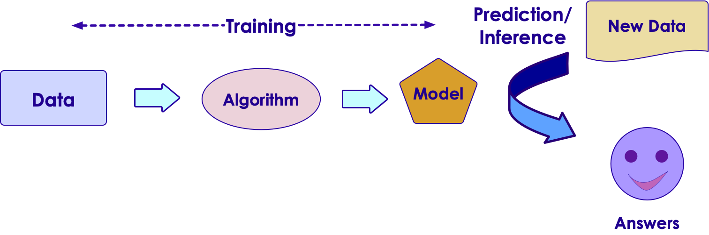

# AI and Data

---

## AI Starts with Data

- Lot of AI algorithms learn from data

- Generally, more data usually makes smarter algorithms
    - There are exceptions to this


<!-- TODO shiva -->
<!-- {"left" : 1.21, "top" : 5.86, "height" : 2.6, "width" : 7.84} -->
<!-- {"left" : 1.21, "top" : 5.86, "height" : 2.6, "width" : 7.84} -->

* [Source: Anand Rajaraman](https://anand.typepad.com/datawocky/2008/03/more-data-usual.html)

---

## Learning From Data

- Let's start with simple housing sales data

<br />

| Bedrooms (input 1) | Bathrooms (input 2) | Size (input 3) | Sale Price (in thousands) (we are trying to predict) |
|--------------------|---------------------|----------------|------------------------------------------------------|
| 3                  | 1                   | 1500           | 230                                                  |
| 3                  | 2                   | 1800           | 320                                                  |
| 5                  | 3                   | 2400           | 600                                                  |
| 4                  | 2                   | 2000           | 500                                                  |
| 4                  | 3.5                 | 2200           | 550                                                  |

<!-- {"left" : 0.25, "top" : 2.31, "height" : 3.19, "width" : 9.75, "columnwidth" : [1.61, 1.81, 1.33, 5]} -->

<br/>

* So our formula for predicting `SalePrice` is something like this:

* **`Saleprice = f (Bedrooms, Bathrooms, Size)`**

* We need to figure out what `f` is

---

## Let's Play a Guessing Game!

<!-- {"left" : 6.53, "top" : 2.66, "height" : 2.52, "width" : 3.79} -->

* Look at the data below.  Come up with a formula linking X and Y

<br/>

| X | Y |
|---|---|
| 1 | 2 |
| 2 | 5 |

* So what is the formula?

* `Y = ???`

* Answer next slide

---

## Guessing Game

<!-- {"left" : 6.53, "top" : 2.66, "height" : 2.52, "width" : 3.79} -->

| X | Y |
|---|---|
| 1 | 2 |
| 2 | 5 |

* I have 2 possible formulas (there may be more)

* **`Y = 3X - 1`**

* **`Y = X^2 + 1`**

---

## Guessing Game

<!-- {"left" : 6.53, "top" : 2.66, "height" : 2.52, "width" : 3.79} -->

* Let me provide more data

| X | Y  |
|---|----|
| 1 | 2  |
| 2 | 5  |
| 3 | 10 |
| 4 | 17 |

* Now, what would be the formula?

* Answer next slide

---
## Guessing Game

<!-- {"left" : 6.53, "top" : 2.66, "height" : 2.52, "width" : 3.79} -->


| X | Y  |
|---|----|
| 1 | 2  |
| 2 | 5  |
| 3 | 10 |
| 4 | 17 |

* With more data, we can finalize on a formula

* **`Y = X^2 + 1`**

* Lesson:  More (quality) data we have, we can come up with a more precise formula

* **This is the essense of machine learning!**

---

## Learning From Data


- An machine learning algorithm learns from the above data, and then tries to predict house prices on new data

<br />

| Bedrooms (input 1) | Bathrooms (input 2) | Size (input 3) | Predicted Sale Price (in thousands) |
|--------------------|---------------------|----------------|-------------------------------------|
| 3                  | 2                   | 1900           | ???                                 |
| 4                  | 3                   | 2300           | ???                                 |

<!-- {"left" : 0.25, "top" : 3.16, "height" : 1.69, "width" : 9.75, "columnwidth" : [1.61, 1.86, 1.92, 4.36]} -->

---

## Learning Process

 *  **Phase 1: Training**
     - Algorithm learns from the data to create a model
     - This step can get computationally expensive.  
     Hours / days / weeks (this is why we use GPU / TPUs  and clusters of computers)
 *  **Phase 2: Prediction / Inference**
     - Once a model is created it can answer questions
        - "what would be the sale price for this house"
        - "is this transaction fraud / not-fraud"
    - Prediction is very fast (milli seconds)


<!-- {"left" : 1.21, "top" : 5.86, "height" : 2.6, "width" : 7.84} -->


Notes:


---
## Structured Data vs. Unstructured Data

| Structured Data                                          | Unstructured Data                             |
|----------------------------------------------------------|-----------------------------------------------|
| Data has well defined structure.                         | Structure is not well defined or non existing |
| Data in a database tables are well defined.  10 columns, first column is integer, second column is timestamp ..etc | videos, images                                             |

<!-- {"left" : 0.21, "top" : 1.26, "height" : 2.65, "width" : 9.82, "columnwidth" : [6.33, 3.49]} -->

<!-- {"left" : 1.46, "top" : 4.26, "height" : 3.91, "width" : 7.33} -->


---

## Structured Data Examples

- Pretty much any data stored in a schema database

<br />

| Bedrooms | Bathrooms | Size | Sale Price (in thousands) |
|--------------------|---------------------|----------------|------------------------------------------------------|
| 3                  | 1                   | 1500           | 230                                                  |
| 3                  | 2                   | 1800           | 320                                                  |
| 5                  | 3                   | 2400           | 600                                                  |
| 4                  | 2                   | 2000           | 500                                                  |
| 4                  | 3.5                 | 2200           | 550                                                  |

<!-- {"left" : 2.1, "top" : 2.31, "height" : 2.68, "width" : 6.04, "columnwidth" : [1.36, 1.44, 1.22, 2.02]} -->


---

## Structured Data Examples

 * Text data (CSV, JSON) can have structure too

JSON data

```json
{   "name" : "Joe",
    "email" : "joe@gmail.com" }
```
<!-- {"left" : 0, "top" : 2.07, "height" : 0.46, "width" : 3.35} -->

CSV data (Comma Seperated Values)

```
joe,joe@gmail.com
jane,jane@gmail.com
```
<!-- {"left" : 0, "top" : 3.11, "height" : 0.67, "width" : 3.27} -->


---

## Unstructured Data Examples


- Text
    - Documents : email, word documents
    - Survey results (customer feedback)
    - customer support ticket notes

- Binary data
    - Audio (phone call recordings)
    - Images
    - Video (YouTube videos)

&nbsp;<!-- {"left" : 0.99, "top" : 5.93, "height" : 1.58, "width" : 1.26} -->&nbsp;<!-- {"left" : 2.7, "top" : 6.09, "height" : 1.26, "width" : 1.26} -->&nbsp;<!-- {"left" : 4.41, "top" : 5.7, "height" : 1.96, "width" : 1.26} -->&nbsp;<!-- {"left" : 6.08, "top" : 6.05, "height" : 1.35, "width" : 1.26} --><!-- {"left" : 7.75, "top" : 6.09, "height" : 1.26, "width" : 1.52} -->


---

## Semi-Structured Data

 * This is 'between' structured and and unstructured

 * Data has some structure, but it may not be well defined

 * Example, tweet data

```json
{   "user_id" : "user123",
    "timestamp" : "2018-09-20 12:00:05 EST",
    "device" : "iPhone X",
    "location" : "34.893, 120.979",
    "tweet" : "Enjoying my first Pumpkin Spice Latte at Starbucks in Seattle downtown  #PSL, @Starbucks",
    "image_url" : "https://imgurl.com/1234"
}
```
<!-- {"left" : 0, "top" : 3, "height" : 1.41, "width" : 10.25} -->
**Question to the class: What data points you can extract from above tweet?      Which is structured / unstructured?**


---

## Data

<!-- {"left" : 6.37, "top" : 1.34, "height" : 5.98, "width" : 3.5} -->


- Humanity is producing data at a rapid clip
    - 90% of data is generated in last 2 years!
    - 2.5 quintillion bytes of data per day

- References:  
    - [domo.com](https://www.domo.com/learn/data-never-sleeps-5?aid=ogsm072517_1&sf100871281=1)
    - [Forbes](https://www.forbes.com/sites/bernardmarr/2018/05/21/how-much-data-do-we-create-every-day-the-mind-blowing-stats-everyone-should-read/#61df751760ba)

Notes:


---

## Data Growth Trends

- As you can see, unstructured data is growing rapidly

- [Source](https://www.dubber.net/unlocking-unstructured-data-voice-processing-power-zoe/)

<!-- {"left" : 0.71, "top" : 2.56, "height" : 4.53, "width" : 8.83} -->


Notes:


---

## Question For The Class

<!-- {"left" : 5.2, "top" : 1.39, "height" : 3.33, "width" : 4.99} -->

**Q: Can you name some examples of structured/unstructured data is generated at your organization?**

<br />


| Structured Data | Unstructured Data |
|-----------------|-------------------|
| ???             | ???               |

<!-- {"left" : 0.25, "top" : 2.62, "height" : 1, "width" : 9.75} -->

---

## Data And AI

- Majority of the machine learning projects use 'structured data'
    - predicting house prices, identifying credit card transactions ..etc.

- This will continue to grow as we get more and more data, and enterprises adopt more AI

- We are only able to make significant headways in processing unstructured data
    - images , videos

- This is largely due to the advances of neural nets


---

## Scaling with Data


 * Deep Learning Algorithms scale better with data

<!-- {"left" : 1.18, "top" : 2.24, "height" : 5.98, "width" : 7.88} -->

Notes:


---

## 1980's and 1990's

<!-- {"left" : 0.71, "top" : 2.28, "height" : 5.08, "width" : 8.83} -->


Notes:

Source: Jeff Dean


---

## 1990+

<!-- {"left" : 0.65, "top" : 1.96, "height" : 5.15, "width" : 8.95} -->


Notes:

Source: Jeff Dean


---

## Now

<!-- {"left" : 0.31, "top" : 1.76, "height" : 5.55, "width" : 9.64} -->


Notes:


---

## Dos and Don'ts For Collecting Data for AI

AI starts with data, in this section we are going to look at some best practices

- How to acquire data

- How to curate/clean data

- How to deal with 'big data'

---

## Acquiring Data

- Best data is the one you already have or  can collect on your own
    - Data you already have in your database (e.g. customer data)
    - Website logs

- Data can be acquired from 'data brokers'
    - e.g. Stock market data

- Some data is free
    - e.g. Census data


---

## Data Responsibilities

- Usually IT team is responsible building the data infrastructure

- AI team 'uses' data  (they are IT team's clients)

- Mistake:  Spend a lot of time gathering data and then involve AI team
    - Not all data may be useful.  
    - Involve AI team early on, so they can give feedback on data


<!-- {"left" : 1.33, "top" : 4.46, "height" : 3.56, "width" : 7.6} -->


---

## Dealing With Big Data

- Most machine learning doesn't necessarily need 'Big Data'
    - Even modest data can yield surprisingly decent results

- However, more data can significantly produce better results

<!-- TODO shiva -->
<!-- {"left" : 1.21, "top" : 5.86, "height" : 2.6, "width" : 7.84} -->
<!-- {"left" : 1.21, "top" : 5.86, "height" : 2.6, "width" : 7.84} -->

* [Source: Anand Rajaraman](https://anand.typepad.com/datawocky/2008/03/more-data-usual.html)

---

## Comprehending Data Sizes

| Unit      | Acronym | Size       | Example                                                                                                                                                                                                                            |
|-----------|---------|------------|------------------------------------------------------------------------------------------------------------------------------------------------------------------------------------------------------------------------------------|
| byte      | b       | 1 b        | storing an integer in computer memory                                                                                                                                                                                              |
| Kilo byte | KB      | 1000 bytes | - a small text file <br/> - a typical tweet is about 200 bytes                                                                                                                                                                     |
| Mega byte | MB      | 1000 KB    | - a digital photo ~  2-5 MB <br/> - a song ~  1-5 MB                                                                                                                                                         |
| Giga byte | GB      | 1000 MB    | - a DVD ~ 4.7 GB <br/> - 1hr HD movie stream ~ 3 GB,  1hr 4K movie ~ 7 GB <br/> - typical laptops have 2-16 GB memory <br/> - typical phones have 32 - 256 GB storage <br/> - typical servers have 256 - 512 GB memory |
| Tera byte | TB      | 1000 GB    | - typical laptop hard drive ~ 1 TB <br/> - Now we are entering 'big data' territory                                                                                                                                                |
| Peta byte | PB      | 1000 TB    | - This is truly big data territory <br/> - Facebook generates 4 PB of data every day <br/> - Uber has 100+ PB data                                                                                                         |
| Exa Byte  | EB      | 1000 PB    |                                                                                                                                                                                                                                    |
| Zeta Byte | ZB      | 1000 EB    | &nbsp;                                                                                                                                                                                                                                   |

<!-- {"left" : 0.26, "top" : 1.3, "height" : 6.42, "width" : 9.75, "columnwidth" : [1.5, 1.34, 1.57, 5.34]} -->

---

## Big Data

<!-- {"left" : 5.88, "top" : 2.03, "height" : 3.65, "width" : 4.1} -->

- Traditionally structured data has been stored in databases

- How ever databases have their limitations:
    - they don't scale to huge data sizes
    - or they can be incredibly expensive to store large amount of data
    - they don't handle unstructured data well


---

## Big Data Systems

- Storing big data requires large 'cluster' systems

- Choices
    - On premise:  Hadoop
    - Cloud storage: Amazon S3, Google Cloud Storage, Azure storage

---

## Hadoop

- Hadoop was developed at Yahoo and open sourced around 2006

- Became 'the' platform for Big Data -- namely on premise

- Hadoop provides **distributed storage** and **distributed computing**

- Can scale upto 1000s of nodes

<!-- {"left" : 1.02, "top" : 4.53, "height" : 3.74, "width" : 8.21} -->


---

## Hadoop Storage Cost

<!-- {"left" : 0.65, "top" : 2.02, "height" : 5.6, "width" : 8.96} -->


---

## Cloud Storage Cost

* Cloud storage costs vary depending lot of factors
    - Like volume, usage ..etc

* Plus the costs seem to go down each year

* For accurate pricing, see the provided links

<br />

|                     | Amazon S3                                       | Google Cloud Storage                                  | Azure Storage                                                     |
|---------------------|-------------------------------------------------|-------------------------------------------------------|-------------------------------------------------------------------|
| Cost per TB / month | $23                                             |   $26                                                   | $20                                                               |
|                     | [More info](https://aws.amazon.com/s3/pricing/) | [More Info](https://cloud.google.com/storage/pricing) | [More info](https://azure.microsoft.com/en-us/pricing/calculator) |

<!-- {"left" : 0.25, "top" : 3.14, "height" : 1.69, "width" : 9.75, "columnwidth" : [2.44, 2.44, 2.44, 2.44]} -->

---

## End: AI & Data
