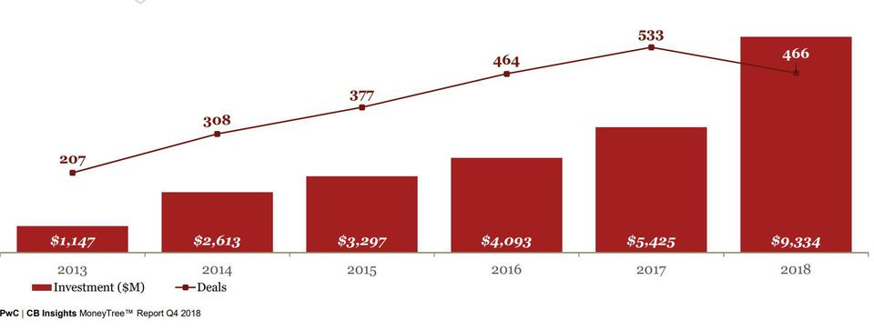

# A Brief (Modern) History of AI

---

## 2010+ : The Great AI Revival

 * AI is going through a resurgence now because of the following

 *  **'Big Data** ' - now we have so much data to train our models

 *  **'Big Data ecosystem** ' - excellent big data platforms (Hadoop, Spark, NoSQL) are available as open source

 *  **'Cloud Compute** '  platforms significantly lowered the barrier to massive compute power
     - $1 rents you 16 core + 128 G + 10 Gigabit machine for 1 hr on AWS!
     - So running a 100 node cluster for 5 hrs --> $500

 *  **Advances in hardware** - CPU / GPUs / TPUs

 * **Advances in Algorithms**

 * **Availability of pre-trained models**

 * Reference: [The great AI awakening](https://www.nytimes.com/2016/12/14/magazine/the-great-ai-awakening.html)

Notes:

---

## Hardware Advances: CPU & GPU

 * Recently GPUs - Graphics Processing Units - have become popular (especially in Deep Learning)

 * GPU cores are good at compute intensive calculations (math, matrix operations)

 * Each GPU core is capable of executing small set instructions, but there are 1000s of core per GPU
Running in parallel

<!-- {"left" : 4.79, "top" : 6.25, "height" : 5.43, "width" : 7.92} -->

Notes:

---

## Video: Audi Autonomous Driving

* Instructor: Show as time permits

* Audi's self driving car program explained.  

* Good comparison of brain vs. CPU vs. GPU around 50 second mark.

* [Link](https://www.youtube.com/watch?v=DjAJnQoNdMA)

<!-- {"left" : 1.69, "top" : 6, "height" : 5.16, "width" : 14.12} -->

Notes:

---

## Hardware Advances - CPU

 * Modern Intel Xeon CPUs (E5 or later) have vectorized linear algebra
    - Properly optimized, approaches speed of GPUs
    - And offers faster I/O performance for Big Data.

 * [Intel Math Kernel Library](https://software.intel.com/en-us/mkl) : highly optimized, threaded, and vectorized math functions that maximize performance on each processor family

<!-- {"left" : 2.69, "top" : 6.15, "height" : 4.92, "width" : 12.12} -->

Notes:
- https://software.intel.com/en-us/mkl

---

## Hardware Advances - TPU

<!-- {"left" : 12.73, "top" : 1.66, "height" : 2.99, "width" : 4.38} -->
<!-- {"left" : 10.15, "top" : 6.2, "height" : 3.31, "width" : 6.96} -->

 * TPU is Google's custom chip built for AI workloads
    - 3rd generation as of March 2018

 * More capable the CPUs / GPUs in certain tasks

 * TPU Use cases:
    - Processing Google Streetview photos (extract street numbers / text)
    - Image processing Google Photos (A single TPU can process 100 millions photos / day)
    - AlphaGo game

 * Designed for [Tensorflow](https://github.com/tensorflow/tensorflow)

 * Available in Google Cloud platform

Notes:

* https://en.wikipedia.org/wiki/Tensor_processing_unit
* https://github.com/tensorflow/tensorflow

---

## Video - TPU

 * Instructor: Show as time permits

 * Google CEO Sundar Pichai announces TPU @ Google I/O 2017
    - Training vs Inference performance @ 1:30
    - AutoML @ 4:25

 * [Link](https://www.youtube.com/watch?v=UsDhVx6cOrw)

<!-- {"left" : 4.9, "top" : 5.42, "height" : 5.73, "width" : 7.69} -->

---

## Recent Advances in AI Research

 * In recent years, lot of money is being invested in AI
 * Companies like Google / Facebook / Amazon are in an 'arms race' to hire the best talent in AI
 * Lot of research going on in public / private sectors
 * Organizations like OpenAI are fostering research in public domain
 * References
    - [Venture Capital Funding For Artificial Intelligence Startups Hit Record High In 2018  Forbes](https://www.forbes.com/sites/jeanbaptiste/2019/02/12/venture-capital-funding-for-artificial-intelligence-startups-hit-record-high-in-2018/)

<!-- {"left" : 3.36, "top" : 7.49, "height" : 4.07, "width" : 10.77} -->

---

## Tools and Libraries Have Improved Tremendously

 * Historically, machine learning models had to be coded from scratch
    - Converting math into code, testing and debugging
    - This could take weeks or months

 * **Now tooling and libraries have gotten so much better**
    - And lot of high quality libraries are open source

---

## Availability of Pre-Trained Models

* **"If I have seen further it is by standing on the shoulders of giants" -- Isaac Newton**

<!-- {"left" : 13.78, "top" : 2.19, "height" : 5.28, "width" : 3.32} -->

 * Creating complex models takes lot of data and lot of training
    - this can take huge amount of compute power (days or weeks of training)

 * Now, we don't have to start from scratch

 * There are lot of high quality models that are open source.  We can start with them and tweak them to fit our needs

 * _This is probably the biggest reason for AI research advancing rapidly_

---

## AI History Recap

* Reference only

* [Video](https://www.youtube.com/watch?v=056v4OxKwlI)

<!-- {"left" : 1.93, "top" : 3.78, "height" : 6.84, "width" : 13.65} -->

Notes:
