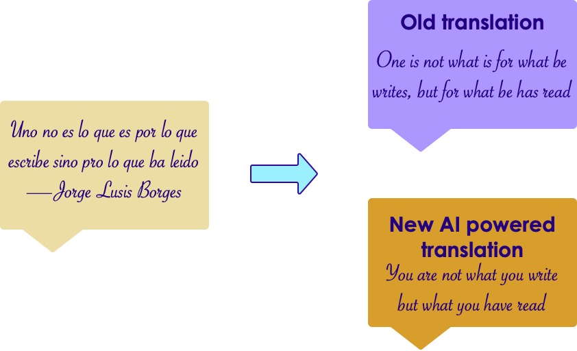

# A Brief (Modern) History of AI

---

## AI Evolution

 * Initial AI thinking was TOP DOWN (or symbolic logic)

 * Write a  **big, comprehensive**  program

     - Program  **all the rules**  (expert systems)

 * Problem:

     - Too many rules

     - Works only for specific domain, e.g. math theorems or chess

 * Success stories: playing chess at the grand master level

     - Domains with limited, clear rules

 * Not so successful: image recognition

Notes:

---

## Another AI Approach - Bottom Up

 * E.g. how babies learn to talk:

     - They don't start by learning the 'rules of the language'

     - Learn by example

 * Train computers the similar way

 * The focus shifts from  **logic to data**

 * More data --> smarter systems

 * Success stories

     - Image recognition

     - Language translation

     - Self-driving cars

Notes:

---

## AI Success Story : Translation - Early Approach

 * Creating a translation system (English <--> Japanese) involves the following

     - English dictionary + grammar rules

     - Japanese dictionary + grammar rules

     - Translation rules

 * Now the system is ready to translate

 * But this approach really doesn't work well:

     - Rules have too many exceptions

     - Context and subtle meanings are lost

 * Example : **"Minister of agriculture" --> "Priest of farming"**

Notes:

---

##  Translation - 'Bottom Up' Approach (Google Translate)

<!-- {"left" : 5.18, "top" : 2.52, "height" : 2.94, "width" : 4.83} -->

 * Google Translate has been ported to 'Google Brain' on Sept 2016
 * System learned from 'data'
 * AI based system improved the accuracy many times over
 * [Link to case study](https://www.nytimes.com/2016/12/14/magazine/the-great-ai-awakening.html)

Notes:

* https://en.wikiquote.org/wiki/Jorge_Luis_Borges
* https://www.nytimes.com/2016/12/14/magazine/the-great-ai-awakening.html

---

## Image Recognition: Cats & Dogs

<!-- {"left" : 2.92, "top" : 1.92, "height" : 5.81, "width" : 4.4} -->

Notes:

---

## Kaggle Competition

 * Recognize dogs & cats

 * Given 25,000 sample images to train

 * Then tested on 15,000 test images

 * Winning algorithm correctly classified 98.9% time !

 * [https://www.kaggle.com/c/dogs-vs-cats](https://www.kaggle.com/c/dogs-vs-cats )

<!-- {"left" : 1.02, "top" : 4.58, "height" : 2.55, "width" : 8.21} -->

Notes:

---

## A Glimpse of AI History

 * Sixties

     - Commercial computers & mainframes

     - Computers play chess

 * Eighties

     - Artificial intelligence (AI) get  **'oversold** ', doesn't live up to the promise and gets a bad rap

 * 21st century

     - Big Data changes it all

Notes:

---
## 1980s-1990s : AI (Neural Net) Winter

* In 1990s, Neural networks fell out of favor.
     - AI in general was perceived as pie-in-the-sky/academic
     - "Expert Systems" and "Rules Engines" found only niche applications.

* Neural Networks Received Criticism
     - Too hard to train
     - Resulting Model not transparent enough.
     - Not suitable for large datasets
     - "Toy Problems"
* Reasons
     - Not enough data
     - Not enough compute power

Notes:
- https://en.wikipedia.org/wiki/AI_winter

---
## 80s -90s : Surge of Statistical Machine Learning

 * Statistical Machine Learning became the method of choice

 * Well Understood (Applied Statistics)

 * Achieved impressive results compared to previous rule-based approaches

 * Ensemble Methods (Random Forests, Gradient Boosted Trees) gave impressive results.

 * Resultant Models often fairly transparent

     - Example: Credit scoring algorithms: Have to unambiguously show WHY the model gives the result it does.

Notes:

---
## 2012 - Neural Networks' Comeback

<!-- {"left" : 5.84, "top" : 1.87, "height" : 5.33, "width" : 4.13} -->

- In [ImageNet competition](http://image-net.org/challenges/LSVRC/) of 2012...

- A __deep convolutional neural network architecture called AlexNet__ beats the field by a whopping 10.8 percentage point margin
    - Developed by Geoffrey Hinton, Ilya Sutskever, and Alex Krizhevsky from the University of Toronto

- __AlexNet__ is still used in research to this day

- The race is on!

---
## 2012 - AI Recognizes Cats in YouTube Videos

<!-- {"left" : 6.51, "top" : 1.3, "height" : 2.98, "width" : 3.45} -->

- 2012 Google created a neural network that can 'identify' cats from YouTube videos

- Up until now, traditional machine learning algorithms are trained on labeled data.  
    - So to train an algorithm to distinguish between cats and dogs, we need thousands of images labeled as 'cat' and thousands of images labeled as 'dog'
    - labeling takes a lot of work, and not a lot of labeled data is available

---
## 2012 - AI Recognizes Cats in YouTube Videos

<!-- {"left" : 6.51, "top" : 1.3, "height" : 2.98, "width" : 3.45} -->

- They built a huge neural network with **1 Billion+** connections and trained it on **16,000 CPU cores (distributed)**

- The network watched a lot of stills from YouTube videos and 'intuitively learned' to recognize cats
    - no one told the network what a cat looks like, it is 'self-taught'

- References:
    - [1](https://googleblog.blogspot.com/2012/06/using-large-scale-brain-simulations-for.html), [2](https://www.wired.com/2012/06/google-x-neural-network/)

Notes:

- References
    - ['Using large-scale brain simulations for machine learning and A.I.' - Google Blog](https://googleblog.blogspot.com/2012/06/using-large-scale-brain-simulations-for.html)
    - [Google AI learns to find cat videos -- Wired magazine](https://www.wired.com/2012/06/google-x-neural-network/)

---
## The Great AI Revival (2010 on)

 * AI is going through a resurgence now because of the following

 *  **'Big Data** ' - now we have so much data to train our models

 *  **'Big Data ecosystem** ' - excellent big data platforms (Hadoop, Spark, NoSQL) are available as open source

 *  **'Big Compute** ' - **cloud**  platforms significantly lowered the barrier to massive compute power
     - $1 rents you 16 core + 128 G + 10 Gigabit machine for 1 hr on AWS!
     - So running a 100 node cluster for 5 hrs --> $500

 *  **Advances in hardware** - CPU / GPUs / TPUs

 * **Advances in Algorithms**

 * **Availability of pre-trained models**

Notes:

https://www.nytimes.com/2016/12/14/magazine/the-great-ai-awakening.html

---

## Hardware Advances: CPU & GPU

 * Recently GPUs - Graphics Processing Units - have become popular (especially in Deep Learning)

 * GPU cores are good at compute intensive calculations (math, matrix operations)

 * Each GPU core is capable of executing small set instructions, but there are 1000s of core per GPU
Running in parallel

<!-- {"left" : 2.52, "top" : 4.35, "height" : 3.58, "width" : 5.22} -->

Notes:

---

## Hardware Advances - CPU

 * Modern Intel Xeon CPUs (E5 or later) have vectorized linear algebra
    - Properly optimized, approaches speed of GPUs
    - And offers faster I/O performance for Big Data.

 * [Intel Math Kernel Library](https://software.intel.com/en-us/mkl) : highly optimized, threaded, and vectorized math functions that maximize performance on each processor family

<!-- {"left" : 1.48, "top" : 5.14, "height" : 2.96, "width" : 7.29} -->

Notes:
- https://software.intel.com/en-us/mkl

---

## Hardware Advances - TPU

<!-- {"left" : 5.34, "top" : 1.24, "height" : 2.19, "width" : 4.6} -->

 * TPU is Google's custom chip built for AI workloads
    - 3rd generation as of March 2018

 * More capable the CPUs / GPUs in certain tasks

 * Designed for [Tensorflow](https://github.com/tensorflow/tensorflow)

 * Available in Google Cloud platform

Notes:

* https://en.wikipedia.org/wiki/Tensor_processing_unit
* https://github.com/tensorflow/tensorflow

---

## TPU Features

<!-- {"left" : 9.27, "top" : 0.92, "height" : 0.67, "width" : 0.98} -->

 * TPU Use cases:
    - Processing Google Streetview photos (extract street numbers / text)
    - Image processing Google Photos (A single TPU can process 100 millions photos / day)
    - AlphaGo game
 * TPUs are have two very distinct use cases: Training and Inference
 * Training TPUs only available in Google Cloud Platform for now
   - High power chip
   - *Free* evaluation with Google Colaboratory
 * Edge TPUs
   - Much smaller and consumes far less power compared to 'data center TPUs'
   - Google Sells physical devices
   - Designed to be used in IOT type devices, robotics, etc

Notes:
- https://en.wikipedia.org/wiki/Tensor_processing_unit

---

## Incredible Growth of AI Power

<!-- {"left" : 5.38, "top" : 1.21, "height" : 5.73, "width" : 4.77} -->

 * Since 2012, the amount of compute used in the largest AI training runs has been increasing exponentially with a 3.5 month-doubling time

 * by comparison, Moore's Law had an 18-month doubling period

 * Source: https://blog.openai.com/ai-and-compute/

Notes:

---

## Advances in AI Research

 * In recent years, lot of money is being invested in AI
 * Companies like Google / Facebook / Amazon are in an 'arms race' to hire the best talent in AI
 * Lot of research going on in public / private sectors
 * Organizations like OpenAI are fostering research in public domain
 * References
    - [Venture Capital Funding For Artificial Intelligence Startups Hit Record High In 2018  Forbes](https://www.forbes.com/sites/jeanbaptiste/2019/02/12/venture-capital-funding-for-artificial-intelligence-startups-hit-record-high-in-2018/)

<!-- {"left" : 1.7, "top" : 5.97, "height" : 2.59, "width" : 6.85} -->

---
## Creating Complex Models Have Become Easier

 * Historically, neural network models had to be coded from scratch
    - Converting math into code, testing and debugging
    - This could take weeks or months

 * **Now tooling and libraries have gotten so much better**
    - High level tools like Keras and efficient libraries like Tensorflow, allow us to code complex models very quickly

---
## Availability of Pre-Trained Models

* **"If I have seen further it is by standing on the shoulders of giants" -- Isaac Newton**

<!-- {"left" : 7.45, "top" : 1.51, "height" : 3.71, "width" : 2.33} -->

 * Creating complex models takes lot of data and lot of training
    - this can take huge amount of compute power (days or weeks of training)

 * Now, we don't have to start from scratch

 * There are lot of high quality models that are open source.  We can start with them and tweak them to fit our needs

 * _This is probably the biggest reason DL has become mainstream_

 * See example on next slide

---

## Building on Other Models

- Say we want to develop a model that can classify people into male / female

- Rather than starting from scratch, we can start with a model that can recognize people

- And then train it more to classify them into male/female

<!-- {"left" : 0.85, "top" : 4.46, "height" : 3.34, "width" : 8.54} -->

---

## Model Zoos

<!-- TODO shiva -->
<!-- {"left" : 5.49, "top" : 1.14, "height" : 4.61, "width" : 4.61} -->

 * Building and training complex models from scratch takes a lot of effort and compute

 * A model zoo is a place wheres open-source models are shared so others can use them

 * Luckily, there are lot models available publicly  
    - Computer vision models : LeNet, AlexNet, ZFNet, GoogLeNet, VGGNet, Inception

 * Model zoos
    - [Tensorflow model zoo](https://github.com/tensorflow/models)
    - [Caffe model zoo](https://github.com/BVLC/caffe/wiki/Model-Zoo)
    - https://modelzoo.co/
    - https://github.com/albertomontesg/keras-model-zoo

---

## Neural Networks Timeline

<!-- {"left" : 0.66, "top" : 2.72, "height" : 4.2, "width" : 8.93} -->

Notes:
ref : https://beamandrew.github.io/deeplearning/2017/02/23/deep_learning_101_part1.html

---
## Godfathers of Neural Networks

 * [Geoffrey Hinton](https://en.wikipedia.org/wiki/Geoffrey_Hinton) @ Google, University of Toronto.  
Kept NN research going during 'AI Winter'

 * [Yann LeCun](http://yann.lecun.com/) - Chief AI researcher @ Facebook, Professor @ University of New York

 * [Yoshua Bengio](https://en.wikipedia.org/wiki/Yoshua_Bengio) - Professor @ University of Montreal

 * **These 3 won ACM Turing Award (Nobel prize of computing) in 2019**

&nbsp;<!-- {"left" : 1.1, "top" : 5.52, "height" : 2.77, "width" : 2.07} -->
&nbsp;<!-- {"left" : 3.58, "top" : 5.52, "height" : 2.77, "width" : 2.71} -->
<!-- {"left" : 6.77, "top" : 5.52, "height" : 2.77, "width" : 2.37} -->

Notes:
- https://www.deeplearningitalia.com/godfather-2/
- https://torontolife.com/tech/ai-superstars-google-facebook-apple-studied-guy/
- https://www.nytimes.com/2016/12/14/magazine/the-great-ai-awakening.html
- https://www.wired.com/story/godfathers-ai-boom-win-computings-highest-honor/
- https://www.theverge.com/2019/3/27/18280665/ai-godfathers-turing-award-2018-yoshua-bengio-geoffrey-hinton-yann-lecun

---

## Video Demos

- In the following sections, we have some really cool videos illustrating the hardware advances

- Instructor: show as time permits

---

## Video: CPU vs. GPU

<!-- {"left" : 1.65, "top" : 1.29, "height" : 4.23, "width" : 6.95} -->

[Link](https://www.youtube.com/watch?v=-P28LKWTzrI)

From Myth Busters hosts!

Notes:

https://www.youtube.com/watch?v=-P28LKWTzrI

---

## Video: Nvidia Self Driving Car

<!-- {"left" : 1.56, "top" : 1.35, "height" : 4.32, "width" : 7.12} -->

[Link](https://www.youtube.com/watch?v=0rc4RqYLtEU)

Nice video showing Deep Learning perceptions during self driving.

Notes:

https://www.youtube.com/watch?v=0rc4RqYLtEU

---

## Video: Audi Autonomous Driving

<!-- {"left" : 0.86, "top" : 1.54, "height" : 3.12, "width" : 8.53} -->

[Link](https://www.youtube.com/watch?v=DjAJnQoNdMA)

Audi's self driving car program explained.  
Good comparison of brain vs. CPU vs. GPU around 50 second mark.

Notes:

https://www.youtube.com/watch?v=DjAJnQoNdMA

---

## Video - TPU

<!-- {"left" : 2.74, "top" : 1.29, "height" : 3.55, "width" : 4.77} -->

[Link](https://www.youtube.com/watch?v=UsDhVx6cOrw)

 * Google CEO Sundar Pichai announces TPU @ Google I/O 2017
    - Training vs Inference performance @ 1:30
    - AutoML @ 4:25

Notes:

https://www.youtube.com/watch?v=UsDhVx6cOrw

---

## AI History Recap

<!-- {"left" : 0.87, "top" : 1.64, "height" : 4.26, "width" : 8.5} -->

 * [Video](https://www.youtube.com/watch?v=056v4OxKwlI)

Notes:

https://www.youtube.com/watch?v=056v4OxKwlI
