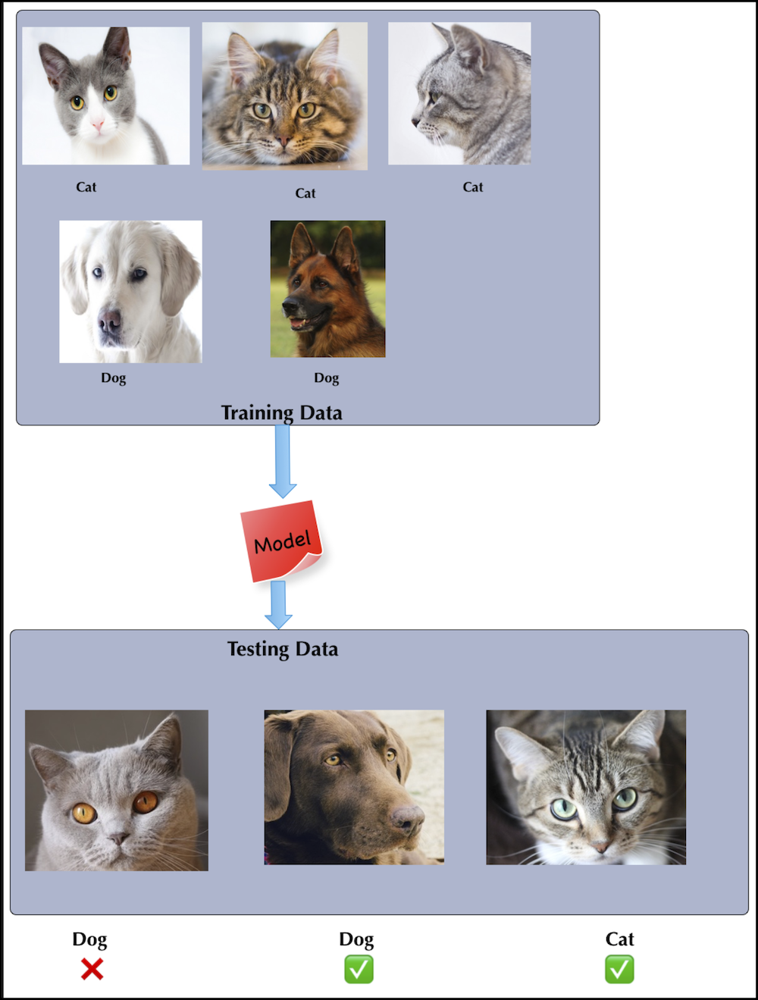
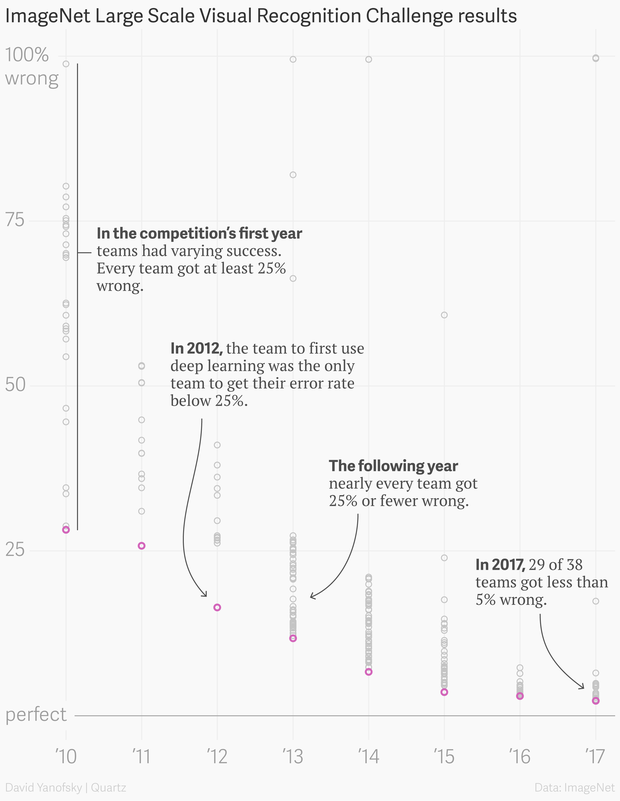

# A Brief (Modern) History of AI

---

## AI Evolution: Top-Down

 * Initial AI thinking was TOP DOWN (or symbolic logic)

 * Write a  **big, comprehensive**  program

     - Program  **all the rules**  (expert systems)

 * Problem:

     - Too many rules

     - Works only for specific domain, e.g. math theorems or chess

 * Success stories: playing chess at the grand master level

     - Domains with limited, clear rules

 * Not so successful: image recognition

Notes:

---

## AI Evolution - Bottom Up

 * E.g. how babies learn to talk:
     - They don't start by learning the 'rules of the language'
     - Learn by example
 * Train computers the similar way
 * The focus shifts from  **logic to data**
 * More data --> smarter systems
 * Success stories
     - Image recognition
     - Language translation
     - Self-driving cars

<!-- todo shiva -->
<!-- {"left" : 1.21, "top" : 5.86, "height" : 2.6, "width" : 7.84} -->

Notes:

---

## AI Success Stories

* We will look at two domains that have seen great success with AI

* 1 - Computer Vision: Image recognition / analysis

* 2 - Text analysis: Natural Language Processing (NLP)

<!-- TODO shiva -->
<!-- {"left" : 5.18, "top" : 2.52, "height" : 2.94, "width" : 4.83} -->
<!-- {"left" : 5.18, "top" : 2.52, "height" : 2.94, "width" : 4.83} -->

---

## Translation: Early Approach

* Creating a translation system (English <--> Japanese) involves the following
  - English dictionary + grammar rules

  - Japanese dictionary + grammar rules

  - Translation rules

* Now the system is ready to translate

* But this approach really doesn't work well:

  - Rules have too many exceptions

  - Context and subtle meanings are lost

* Example : **"Minister of agriculture" --> "Priest of farming"**

Notes:

---

## Translation With AI (Google Translate)

<!-- {"left" : 5.18, "top" : 2.52, "height" : 2.94, "width" : 4.83} -->

* Google Translate has been ported to 'Google Brain' on Sept 2016

* System learned from 'data'

* AI based system improved the accuracy remarkably

* [Case study](https://www.nytimes.com/2016/12/14/magazine/the-great-ai-awakening.html)

Notes:

---

## Image Recognition: AI Approach

<!-- TODO shiva -->
<!-- {"left" : 2.92, "top" : 1.92, "height" : 5.81, "width" : 4.4} -->

* Image recognition has been a hard for computers for a long time
    - Images are complex (pixels, colors, shapes)
* Since 2010, AI has made tremendous progress in image analysis
* Algorithms are trained with large amount of **labelled image data**
    - They learn to pick up patterns from images
    - And they have become super accurate!
* Recent [Kaggle competition](https://www.kaggle.com/c/dogs-vs-cats) for recognizing cats and dogs
    * Gave 25,000 sample images to train
    * Winning algorithm accuracy of 98.9% !
* This is leading to modern applications like **self driving car**

Notes:

---

## Video: Nvidia Self Driving Car

* Instructor: Show as time permits

* Nice video showing Deep Learning perceptions during self driving.

* [Link](https://www.youtube.com/watch?v=0rc4RqYLtEU)

<!-- {"left" : 1.56, "top" : 1.35, "height" : 4.32, "width" : 7.12} -->

Notes:

---
## AI History: 1980s-1990s

 * **Machine Learning** thrived
    - Statistical Machine Learning became the method of choice
    - Well Understood (Applied Statistics)
    - Achieved impressive results compared to previous rule-based approaches

<!-- TODO shiva -->
<!-- {"left" : 5.84, "top" : 1.87, "height" : 5.33, "width" : 4.13} -->

* **Neural Networks** floundered
    - Neural Networks research stalled
    - Didn't deliver good results
    - Reasons
        - Not enough data
        - Not enough compute power
* **AI Winter** : https://en.wikipedia.org/wiki/AI_winter

Notes:

[Image source: Quora](https://www.quora.com/What-caused-the-AI-winter-and-what-were-the-early-warning-signs-Given-the-state-of-AI-today-is-there-likely-to-be-another-period-of-low-interest-in-the-field-What-bottlenecks-would-be-the-cause-of-that)

---

## 2012 - Neural Networks' Comeback

<!-- {"left" : 5.84, "top" : 1.87, "height" : 5.33, "width" : 4.13} -->

- In [ImageNet competition](http://image-net.org/challenges/LSVRC/) of 2012...

- A __deep convolutional neural network architecture called AlexNet__ beats the field by a whopping 10.8 percentage point margin
    - Developed by Geoffrey Hinton, Ilya Sutskever, and Alex Krizhevsky from the University of Toronto

- __AlexNet__ is still used in research to this day

- The race is on!

---

## 2010+ : The Great AI Revival

 * AI is going through a resurgence now because of the following

 *  **'Big Data** ' - now we have so much data to train our models

 *  **'Big Data ecosystem** ' - excellent big data platforms (Hadoop, Spark, NoSQL) are available as open source

 *  **'Cloud Compute** '  platforms significantly lowered the barrier to massive compute power
     - $1 rents you 16 core + 128 G + 10 Gigabit machine for 1 hr on AWS!
     - So running a 100 node cluster for 5 hrs --> $500

 *  **Advances in hardware** - CPU / GPUs / TPUs

 * **Advances in Algorithms**

 * **Availability of pre-trained models**

Notes:

https://www.nytimes.com/2016/12/14/magazine/the-great-ai-awakening.html

---

## Hardware Advances: CPU & GPU

 * Recently GPUs - Graphics Processing Units - have become popular (especially in Deep Learning)

 * GPU cores are good at compute intensive calculations (math, matrix operations)

 * Each GPU core is capable of executing small set instructions, but there are 1000s of core per GPU
Running in parallel

<!-- {"left" : 2.52, "top" : 4.35, "height" : 3.58, "width" : 5.22} -->

Notes:

---

## Video: Audi Autonomous Driving

* Instructor: Show as time permits

* Audi's self driving car program explained.  

* Good comparison of brain vs. CPU vs. GPU around 50 second mark.

* [Link](https://www.youtube.com/watch?v=DjAJnQoNdMA)

<!-- {"left" : 0.86, "top" : 1.54, "height" : 3.12, "width" : 8.53} -->

Notes:

---

## Video: CPU vs. GPU

* Instructor: Show as time permits

* Myth Busters hosts demonstrating the power of GPU :-)

* [Link](https://www.youtube.com/watch?v=-P28LKWTzrI)

<!-- {"left" : 1.65, "top" : 1.29, "height" : 4.23, "width" : 6.95} -->

---

## Hardware Advances - CPU

 * Modern Intel Xeon CPUs (E5 or later) have vectorized linear algebra
    - Properly optimized, approaches speed of GPUs
    - And offers faster I/O performance for Big Data.

 * [Intel Math Kernel Library](https://software.intel.com/en-us/mkl) : highly optimized, threaded, and vectorized math functions that maximize performance on each processor family

<!-- {"left" : 1.48, "top" : 5.14, "height" : 2.96, "width" : 7.29} -->

Notes:
- https://software.intel.com/en-us/mkl

---

## Hardware Advances - TPU

<!-- {"left" : 9.27, "top" : 0.92, "height" : 0.67, "width" : 0.98} -->
<!-- {"left" : 5.34, "top" : 1.24, "height" : 2.19, "width" : 4.6} -->

 * TPU is Google's custom chip built for AI workloads
    - 3rd generation as of March 2018

 * More capable the CPUs / GPUs in certain tasks

 * TPU Use cases:
    - Processing Google Streetview photos (extract street numbers / text)
    - Image processing Google Photos (A single TPU can process 100 millions photos / day)
    - AlphaGo game

 * Designed for [Tensorflow](https://github.com/tensorflow/tensorflow)

 * Available in Google Cloud platform

Notes:

* https://en.wikipedia.org/wiki/Tensor_processing_unit
* https://github.com/tensorflow/tensorflow

---

## Video - TPU

 * Instructor: Show as time permits

 * Google CEO Sundar Pichai announces TPU @ Google I/O 2017
    - Training vs Inference performance @ 1:30
    - AutoML @ 4:25

 * [Link](https://www.youtube.com/watch?v=UsDhVx6cOrw)

<!-- {"left" : 2.74, "top" : 1.29, "height" : 3.55, "width" : 4.77} -->

---

## Recent Advances in AI Research

 * In recent years, lot of money is being invested in AI
 * Companies like Google / Facebook / Amazon are in an 'arms race' to hire the best talent in AI
 * Lot of research going on in public / private sectors
 * Organizations like OpenAI are fostering research in public domain
 * References
    - [Venture Capital Funding For Artificial Intelligence Startups Hit Record High In 2018  Forbes](https://www.forbes.com/sites/jeanbaptiste/2019/02/12/venture-capital-funding-for-artificial-intelligence-startups-hit-record-high-in-2018/)

<!-- {"left" : 1.7, "top" : 5.97, "height" : 2.59, "width" : 6.85} -->

---
## Tools and Libraries Have Improved Tremendously

 * Historically, machile learning models had to be coded from scratch
    - Converting math into code, testing and debugging
    - This could take weeks or months

 * **Now tooling and libraries have gotten so much better**
    - And lot of high quality libraries are open source

---
## Availability of Pre-Trained Models

* **"If I have seen further it is by standing on the shoulders of giants" -- Isaac Newton**

<!-- {"left" : 7.45, "top" : 1.51, "height" : 3.71, "width" : 2.33} -->

 * Creating complex models takes lot of data and lot of training
    - this can take huge amount of compute power (days or weeks of training)

 * Now, we don't have to start from scratch

 * There are lot of high quality models that are open source.  We can start with them and tweak them to fit our needs

 * _This is probably the biggest reason for AI research advancing rapidly_

 * See example on next slide

---

## Building on Other Models

- Say we want to develop a model that can classify people into male / female

- Rather than starting from scratch, we can start with a model that can recognize people

- And then train it more to classify them into male/female

<!-- {"left" : 0.85, "top" : 4.46, "height" : 3.34, "width" : 8.54} -->

---

## Model Zoos

<!-- TODO shiva -->
<!-- {"left" : 5.49, "top" : 1.14, "height" : 4.61, "width" : 4.61} -->

 * Building and training complex models from scratch takes a lot of effort and compute

 * A model zoo is a place wheres open-source models are shared so others can use them

 * Luckily, there are lot models available publicly  
    - Computer vision models : LeNet, AlexNet, ZFNet, GoogLeNet, VGGNet, Inception

 * Model zoos
    - [Tensorflow model zoo](https://github.com/tensorflow/models)
    - [Caffe model zoo](https://github.com/BVLC/caffe/wiki/Model-Zoo)
    - https://modelzoo.co/
    - https://github.com/albertomontesg/keras-model-zoo

---
## Godfathers of Neural Networks

 * [Geoffrey Hinton](https://en.wikipedia.org/wiki/Geoffrey_Hinton) @ Google, University of Toronto.  
Kept NN research going during 'AI Winter'

 * [Yann LeCun](http://yann.lecun.com/) - Chief AI researcher @ Facebook, Professor @ University of New York

 * [Yoshua Bengio](https://en.wikipedia.org/wiki/Yoshua_Bengio) - Professor @ University of Montreal

 * **These 3 won ACM Turing Award (Nobel prize of computing) in 2019**

&nbsp;<!-- {"left" : 1.1, "top" : 5.52, "height" : 2.77, "width" : 2.07} -->
&nbsp;<!-- {"left" : 3.58, "top" : 5.52, "height" : 2.77, "width" : 2.71} -->
<!-- {"left" : 6.77, "top" : 5.52, "height" : 2.77, "width" : 2.37} -->

Notes:
- https://www.deeplearningitalia.com/godfather-2/
- https://torontolife.com/tech/ai-superstars-google-facebook-apple-studied-guy/
- https://www.nytimes.com/2016/12/14/magazine/the-great-ai-awakening.html
- https://www.wired.com/story/godfathers-ai-boom-win-computings-highest-honor/
- https://www.theverge.com/2019/3/27/18280665/ai-godfathers-turing-award-2018-yoshua-bengio-geoffrey-hinton-yann-lecun

---

## AI History Recap

* Reference only

* [Video](https://www.youtube.com/watch?v=056v4OxKwlI)

<!-- {"left" : 0.87, "top" : 1.64, "height" : 4.26, "width" : 8.5} -->

Notes:
