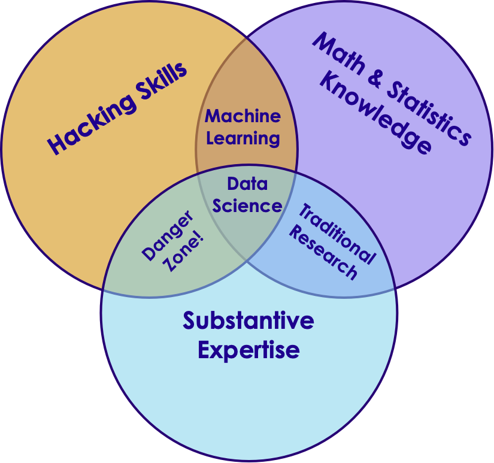
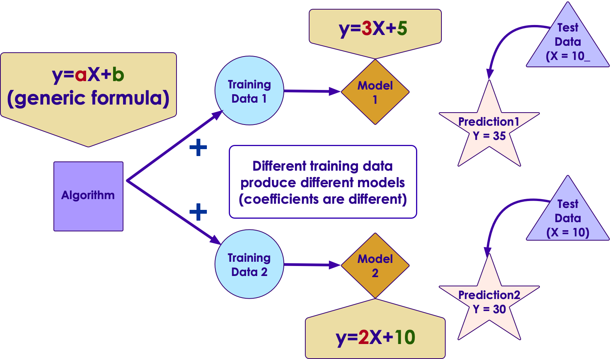

# AI Vocabulary

---

## Generic / Narrow AI

<!-- {"left" : 6.3, "top" : 1.26, "height" : 2.43, "width" : 3.65} -->

 * **Artificial Narrow Intelligence (ANI)**
   - Focused on a specific tasks
   - Self driving, smart speaker, image recognition
   - Tremendous progress in the last few years

&nbsp;
&nbsp;

<!-- {"left" : 6.29, "top" : 5.37, "height" : 2.7, "width" : 3.65} -->

 * **Artificial General Intelligence (AGI)**
    - AI can do anything a human can do
    - We are decades or hundreds of years away from this
    - So no need to worry about killer robots yet :-)

Notes:

---

## AI vs. Machine Learning :-)

<!-- {"left" : 5.42, "top" : 2.38, "height" : 4.3, "width" : 4.3} -->

[Source](https://www.reddit.com/r/ProgrammerHumor/comments/a07d0u/ai_in_nutshell/)

---

## AI / Machine Learning / Deep Learning

<!-- {"left" : 5.42, "top" : 2.38, "height" : 4.3, "width" : 4.3} -->

 * **Artificial Intelligence (AI):** Broader concept of "making machines smart"

 * **Machine Learning:** Current application of AI that machines learn from data using mathematical, statistical models

 * **Deep Learning: (Hot!)** Using Neural Networks to solve some hard problems

Notes:

* http://www.teglor.com/b/deep-learning-libraries-language-cm569/

---

## AI / Machine Learning / Deep Learning

<!-- {"left" : 1.02, "top" : 2.69, "height" : 4.26, "width" : 8.21} -->

Notes:

---

## Data Science

<!-- {"left" : 7.37, "top" : 1.14, "height" : 2.44, "width" : 2.6} -->

 * **Data Science:** Deriving intelligence from data

 * For example, a real estate company can use data science to figure out which types of homes to build to maximize profits

 * A machine learning algorithm can learn from the past data and predict house prices for new houses coming on market

&nbsp;

| Bedrooms (input 0) | Bathrooms (input 1) | Size (input 2) | Sale Price (in thousands) (we are trying to predict) |
|--------------------|---------------------|----------------|------------------------------------------------------|
| 2                  | 0                   | 1499           | 229                                                  |
| 2                  | 1                   | 1799           | 319                                                  |
| 4                  | 2                   | 2399           | 599                                                  |
| 3                  | 1                   | 1999           | 499                                                  |
| 3                  | 2.4                 | 2199           | 549                                                  |

<!-- {"left" : 0.25, "top" : 5.6, "height" : 3.19, "width" : 9.75, "columnwidth" : [1.61, 1.81, 1.33, 5]} -->

Notes:

---

## Neural Networks

 * Layers of parallel processing elements, working together to solve very complex tasks
 * Inspired by neurons from human brain
 * Used in Deep Learning
 * **Animation** below: [link-S3](https://elephantscale-public.s3.amazonaws.com/media/machine-learning/neural-networks-animation-1.mp4), [link-youtube](https://youtu.be/F32n1edCsrk)

<!-- {"left" : 0.38, "top" : 4.99, "height" : 2.23, "width" : 9.48} -->

Notes:

---

## Training vs. Inference

*  **Training**
    - Feeding data to an algorithm to create a model
    - Computationally expensive (can take hours, days, weeks)
        - Google translate model trains on 2 billion+ words on 99+ GPUs for week+
*  **Prediction / Inference**
    - Created model answering questions (very fast)
    - "is this transaction fraud / not-fraud"
    - "What are the recommended movies for this user"

<!-- {"left" : 1.52, "top" : 5.81, "height" : 2.39, "width" : 7.19} -->

---

## Data Size Vs. Model Size

- An algorithm can train on small / large / huge amount of data (depending on problem complexity)
    - Since it can be computationally very intensive;  So we may use cluster of computers for training
    - Clusters can contain 99s (or 999s) of CPUs/GPUs/TPUs

- The resulting model is orders of magnitude smaller in size
    - it could fit in your phone!

<!-- {"left" : 1.29, "top" : 5.14, "height" : 3.14, "width" : 7.69} -->

---

## Algorithm vs. Model

* **Algorithm**
    - Algorithms are 'generic' mathematical formulas
* **Model**
    - algorithm + data ==> model
* Often Algorithm and Model are used interchangeably

<!-- {"left" : 1.82, "top" : 4.48, "height" : 3.69, "width" : 6.6} -->

---

## Algorithm and Model

  <!-- {"left" : 0.6, "top" : 2.17, "height" : 5.31, "width" : 9.04} -->
