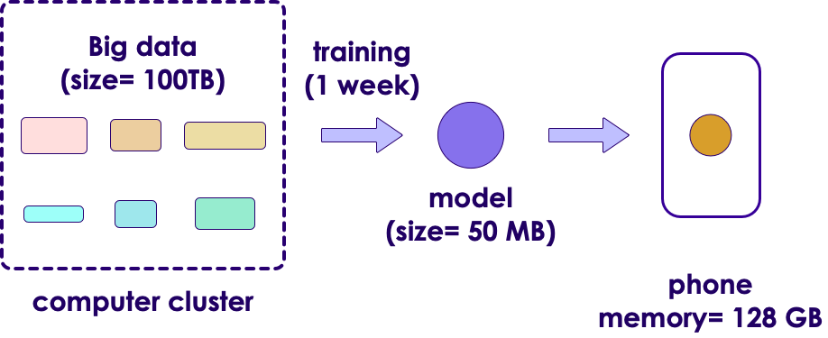

# AI Vocabulary

---

## Generic / Narrow AI

<!-- {"left" : 12.07, "top" : 1.89, "height" : 3.37, "width" : 5.06} -->

 * **Artificial Narrow Intelligence (ANI)**
   - Focused on a specific tasks
   - Self driving, smart speaker, image recognition
   - Tremendous progress in the last few years

&nbsp;
&nbsp;

 <!-- {"left" : 13.03, "top" : 5.69, "height" : 5.7, "width" : 4.12} -->

 * **Artificial General Intelligence (AGI)**
    - AI can do anything a human can do
    - We are decades or hundreds of years away from this
    - So we need to wait a while for the robot butler :-) 

Notes:

---

## AI vs. Machine Learning :-)

 <!-- {"left" : 3.54, "top" : 2.12, "height" : 5.85, "width" : 10.42} -->

[Source](https://www.reddit.com/r/ProgrammerHumor/comments/a07d0u/ai_in_nutshell/)

---

## AI / Machine Learning / Deep Learning

<!-- {"left" : 11.05, "top" : 2.34, "height" : 5.8, "width" : 5.8} -->

 * **Artificial Intelligence (AI):** Broader concept of "making machines smart"

 * **Machine Learning:** Current application of AI that machines learn from data using mathematical, statistical models

 * **Deep Learning: (Hot!)** Using Neural Networks to solve some hard problems

Notes:

* http://www.teglor.com/b/deep-learning-libraries-language-cm569/

---

## AI / Machine Learning / Deep Learning

<!-- {"left" : 1.93, "top" : 3.31, "height" : 7.08, "width" : 13.65} -->

Notes:

---

## Neural Networks

 * Layers of parallel processing elements, working together to solve very complex tasks
 * Inspired by neurons from human brain
 * Used in Deep Learning
 * **Animation** below: [link-S3](https://elephantscale-public.s3.amazonaws.com/media/machine-learning/neural-networks-animation-1.mp4), [link-youtube](https://youtu.be/sLsCN9ZL9RI)

 <!-- {"left" : 2.78, "top" : 5.52, "height" : 5.03, "width" : 11.94} -->

Notes:

---

## Training vs. Inference

*  **Training**
    - Feeding data to an algorithm to create a model
    - Computationally expensive (can take hours, days, weeks)
        - Google translate model trains on 2 billion+ words on 99+ GPUs for week+
*  **Prediction / Inference**
    - Created model answering questions (very fast)
    - "is this transaction fraud / not-fraud"
    - "What are the recommended movies for this user"

<!-- {"left" : 3, "top" : 7.56, "height" : 3.82, "width" : 11.5} -->

---

## Training Can Take a While

 <!-- {"left" : 7.1, "top" : 2.12, "height" : 7.89, "width" : 9.05} -->

* [Original xkcd comic](https://xkcd.com/303/)

---

## Data Size Vs. Model Size

- An algorithm can train on small / large / huge amount of data (depending on problem complexity)
    - Since it can be computationally very intensive;  So we may use cluster of computers for training
    - Clusters can contain 99s (or 999s) of CPUs/GPUs/TPUs

- The resulting model is orders of magnitude smaller in size
    - it could fit in your phone!

<!-- {"left" : 3.14, "top" : 6.69, "height" : 4.58, "width" : 11.21} -->

---

## Algorithm vs. Model

* **Algorithm**
    - Algorithms are 'generic' mathematical formulas
* **Model**
    - algorithm + data ==> model
* Often Algorithm and Model are used interchangeably

<!-- {"left" : 3.73, "top" : 6.12, "height" : 5.61, "width" : 10.04} -->

---

## Algorithm and Model

  <!-- {"left" : 2.05, "top" : 2.92, "height" : 7.87, "width" : 13.39} -->
