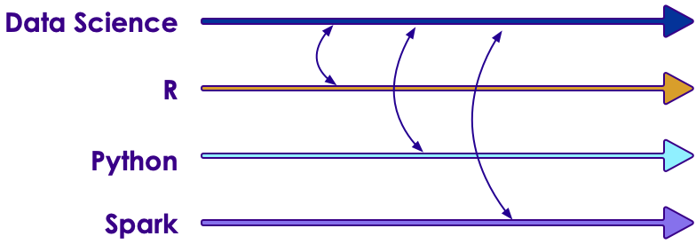

# Introduction to Machine Learning

<!-- {"left" : 4.35, "top" : 7.65, "height" : 2.88, "width" : 2.88} -->
<!-- {"left" : 8.1, "top" : 8.49, "height" : 1.21, "width" : 5.06} -->

---

## About This Class

* A **practical approach to ML**

* Goals
    - **'Top-Down' learning**
    - **Learn** fundamentals of ML
    - And **implement** them in an ML environment

* Beyond the scope
    - Deep Math / Stats coverage
    - Advanced concepts

Notes:

---

## Prerequisites & Expectations

* Development background
    - Need to be comfortable programming - there are many labs
    - Our labs are in Python & Spark  (If you don't know these, don't worry, we will walk you through it)

* Basic knowledge of Linux

* We don't expect Math / Statistics background

Notes:

---

## What if I Don't Know Enough Math / Stats?

* Most often people are told to start Machine Learning with Linear Algebra / Calculus
    - These are hard subjects and lot of people loose interest pretty quickly
    - Or people spend too much time in Math / Stats

* Our approach:
    - We acknowledge Math / Stats are essential inner workings of Machine Learning
    - A practitioner can go far in ML with a little fundamentals and without too deep knowledge in Math / Stats

*  **Learn by practicing**
    - We do recommend you review the theories behind ML at your leisure

Notes:

---

## Data Science Totem pole

 <!-- {"left" : 1.96, "top" : 2.79, "height" : 8.13, "width" : 13.59} -->

Notes:

---

## Goal For This ML Class: 'ML Engineer'

|                                     |          API users         |                                               ML Engineer                                               |                    Data Scientists                    |
|:-----------------------------------:|:--------------------------:|:-------------------------------------------------------------------------------------------------------:|:-----------------------------------------------------:|
|          __In a nutshell__          |            What            |                                                What & Why                                               |                   What, Why and How                   |
|            __Background__           |         Developers         |                                     Developers, Analysts, Architects                                    |               Scientists (usually PhDs)               |
|               __API__               |   Knows the basic of API   |                                           Sound API knowledge                                           |                Excellent API knowledge                |
|              __Models__             | No understanding of models | Knows the fundamentals of model behind API (not necessarily the math/stats theories powering the model) | Has deep understanding of math/stats behind the model |
|         __Model Validation__        |    copy-paste and pray!    |                           Knows how to test and improve the model iteratively                           |        Knows how to test and improve the model        |
| __Can Come up with New Algorithms__ |             no             |                                        Can adopt a new algorithm                                        |            Can come up with new algorithms            |

 <!-- {"left" : 1.18, "top" : 2.57, "height" : 6.59, "width" : 15.14} -->

Notes:

---

## Our Teaching Philosophy

* Enable you to be a **'data practitioner'** by giving you
    - The essential knowledge of ML
    - Plenty of time and playground environment for learning the API
    - Show how to evaluate, test, and tweak the models
    - Expose you to useful tools

* Emphasis on concepts & fundamentals, not API

* Highly interactive (questions, discussions ..etc  are welcome)

* Hands-on - lots and lots of labs! (learn by doing)

Notes:

* All the labs are verified at 1.3 even though latest is 1.4

---

## Some Highlights of this Class

* Machine Learning is the focus of this course
* The concepts are generic you can implement them any ML platforms (R, Python, Spark)

 <!-- {"left" : 2.23, "top" : 5.19, "height" : 4.57, "width" : 13.03} -->

Notes:

---

## Real World Datasets

* We will work on real world datasets such as
    - Uber Trips data
    - Walmart Shopping data
    - Netflix recommendation
    - Credit card default data
    - Prosper loan data
    - NYSE Stock data

<!-- {"left" : 0.75, "top" : 7.2, "height" : 1.44, "width" : 3.13} --> <!-- {"left" : 4.21, "top" : 7.46, "height" : 0.94, "width" : 3.84} --> <!-- {"left" : 8.32, "top" : 6.79, "height" : 2.28, "width" : 3.13} --> &nbsp;  &nbsp;<!-- {"left" : 11.71, "top" : 7.2, "height" : 1.44, "width" : 5.04} -->

Notes:

---

## Workshop Overview

* **Day 1**
    - ML intro
    - ML Concepts
    - Statistics Primer
    - Data Exploration & Visualizing
    - Feature Engineering
    - Spark ML Library Overview

* **Day 2**
    - Linear Regression
    - Logistic Regression
    - SVM
    - Naïve Bayes

---

## Workshop Overview

* **Day 3**
    - Decision Trees
    - Random Forest
    - Clustering
    - K-Means
    - PCA
    - Recommendations

* **Workshops**
    - Final day, solve a problem end to end
    - Daily workshops (time permitting)

Notes:
---

## Lots of Labs: Learn By Doing

 <!-- {"left" : 3.23, "top" : 2.4, "height" : 8.91, "width" : 11.04} -->

---

## After The Class...

 <!-- {"left" : 4.13, "top" : 3.06, "height" : 7.59, "width" : 9.24} -->

Notes:

* By the end of the class...

---

## About You And Me

* About you
    - Your Name
    - Your background (developer, admin, manager, etc.)
    - Technologies you are familiar with
    - Familiarity with Machine Learning   
    (scale of 1 - 4 ;  1 - new, 2 - know some concepts,  3 - took a course, 4 -  using it at work)
    - Something non-technical about you!  
    (favorite ice cream flavor / hobby...etc)

  <!-- {"left" : 2.19, "top" : 6.87, "height" : 3.23, "width" : 3.65} --> <!-- {"left" : 5.88, "top" : 6.91, "height" : 3.12, "width" : 5.74} --> <!-- {"left" : 11.66, "top" : 6.87, "height" : 3.23, "width" : 3.65} -->

Notes:

---

## Recommended Resources

* Please see our handout

Notes:

---

## Class Logistics

* Instructor's contact

* Slides
    - For each session, slides will be emailed out or delivered via virtual classroom

* Labs
    - Lab files will be distributed

* Playground
    - Provided in the cloud

---

## Let's Get Started!
