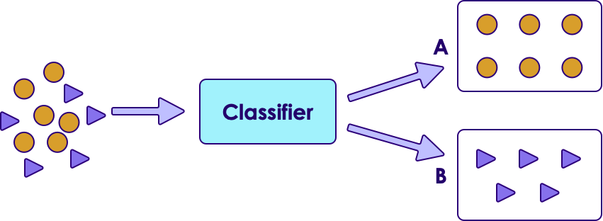
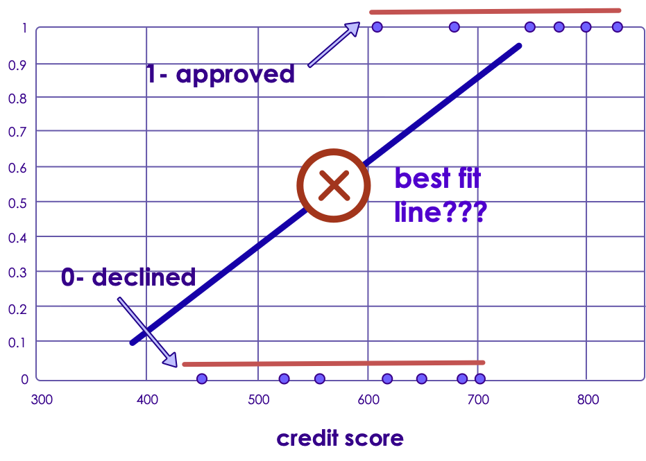

# Classifications Intro

---

## Algorithm Map

<!-- {"left" : 3.17, "top" : 3.13, "height" : 7.45, "width" : 11.17} -->

---

## Classifications

- __Classifications__ tend to be most popular kind of algorithms  in Machine Learning

- Classification algorithms are trained using 'labeled data' and they predict on new data

- Examples:
     - Email is **SPAM** or **HAM**  (not-SPAM)
     - A cell is **cancerous**  or  **healthy**
     - Hand-written numbers -> any digits -1, 0, 1,..., 8

<!-- {"left" : 3.01, "top" : 7.1, "height" : 4.22, "width" : 11.47} -->

---

## Classification Example: Credit Card Applications Approvals

 * In US most adults have a 'credit score' (a.k.a. FICO score)

 * Ranges from 300 (very poor) to 850 (excellent)

 * Credit score is a big determining factor when applying for loans / mortgages / credit cards

<!-- {"left" : 2.75, "top" : 5.78, "height" : 5.35, "width" : 11.99} -->

Notes:

Image credit : (CC) : https://www.flickr.com/photos/cafecredit/27321078025

---

### Credit Approval Data

* Here is historical data on credit score and if the credit application is approved

| Credit Score | Approved? |
|--------------|-----------|
| 560          | No        |
| 750          | Yes       |
| 680          | Yes       |
| 650          | No        |
| 450          | No        |
| 800          | Yes       |
| 775          | Yes       |
| 525          | No        |
| 620          | No        |
| 830          | Yes       |
| 610          | Yes       |

<!-- {"left" : 6.11, "top" : 5.15, "height" : 5.9, "width" : 5.29} -->

Notes:

---

## Plotting Credit Approval Data

<!-- {"left" : 3.19, "top" : 3.19, "height" : 7.34, "width" : 11.11} -->

Notes:

---

## Plotting Credit Approval Data

 * X axis = credit score

 * Y axis = 0 (declined), 1 (approved), nothing in between

 * There is no linear fit line!

<!-- {"left" : 4.47, "top" : 4.61, "height" : 6.54, "width" : 8.56} -->

Notes:

---

## Classification Example

* Here is college admission data

<!-- {"left" : 3.18, "top" : 3.69, "height" : 6.81, "width" : 11.14} -->

Notes:

---

## Measuring Classification Model Accuracy

* For Regression problems we can measure how far off our prediction is from actual
    - if actual tip is $13
    - and our model predicted $15
    - Error = actual - prediction = $13 - $15 = -2

* But here, our classifier is predicting either 0 or 1 (binary)
    - so the regression method (actual - predicted) won't be accurate

* We need a different approach

* Enter __confusion matrix__

---

# Confusion Matrix

[ML-Concepts-Confusion-Matrix.md](ML-Concepts-Confusion-Matrix.md)

---

## Measuring Accuracy of Classification Model

* Let's measure both metrics
    - Confusion Matrix
    - ROC and AUC (Area Under Curve)

<!-- {"left" : 7.54, "top" : 3.74, "height" : 3.89, "width" : 9.67} -->

* Confusion Matrix:
    - correct: 14 + 5 = 19
    - missed: 3 + 1 = 4
    - accuracy = 19/(19+4) = 82.6%

* ROC / AUC = 0.874

Notes:

---

## Review and Q&A

<!-- {"left" : 13.07, "top" : 1.89, "height" : 2.69, "width" : 3.63} -->

* Let's go over what we have covered so far

* Any questions?

<!-- {"left" : 4.62, "top" : 4.8, "height" : 5.53, "width" : 8.31} -->
